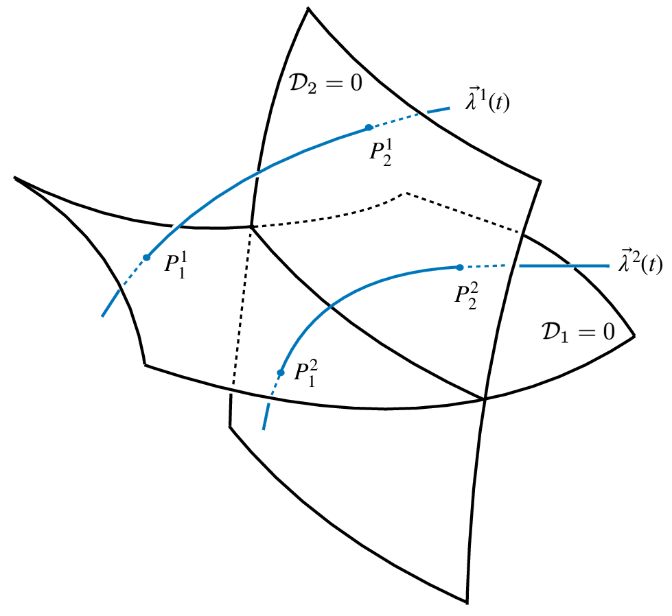
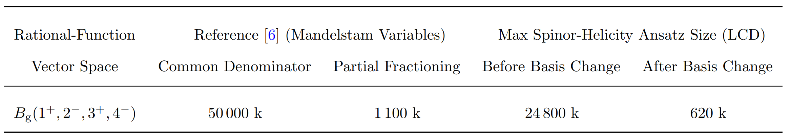
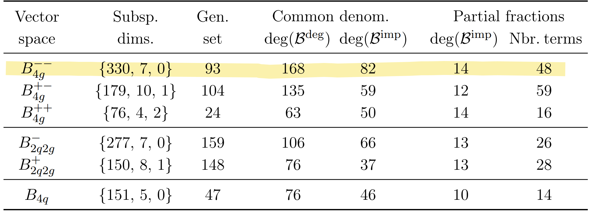
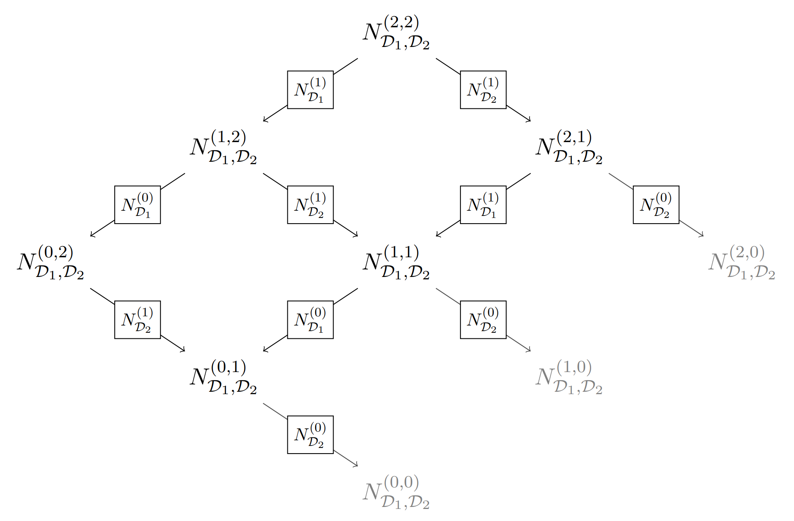
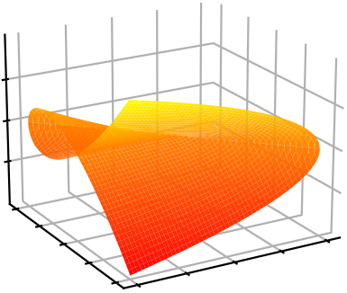
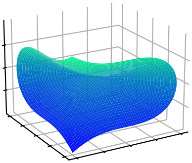
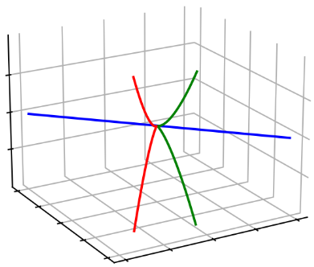
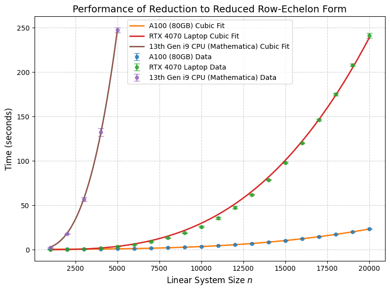
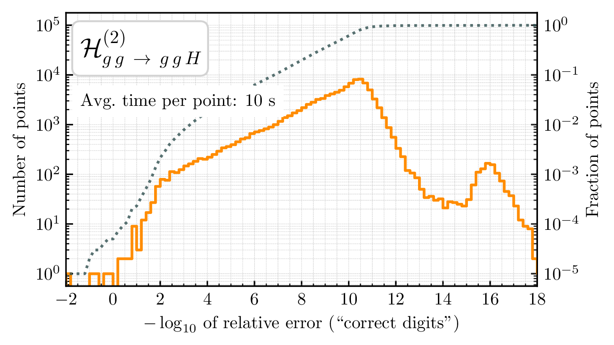
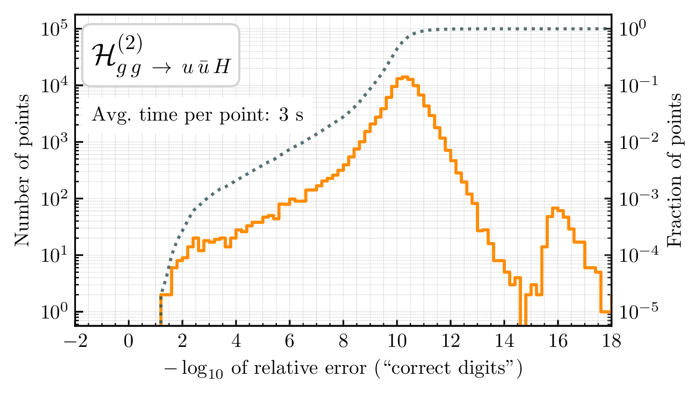

<!---

--->



<h3 style="margin-top:5mm; margin-left: -10mm; margin-right: -10mm;">
	<b style="margin-top:15mm; font-size: 30pt; text-transform: none;">
	   Reconstructing and simplifying rational coefficients   in multi-loop scattering amplitudes
	</b>
</h3>

Giuseppe De Laurentis
 

 University of Edinburgh 

 
$pp\rightarrow Hjj$: <a href="https://arxiv.org/abs/2605.04009 ">arXiv:2605.04009 </a> 

 with H. Ita, V. Kuschke, M. Ruf, and V. Sotnikov 

$pp\rightarrow Vjj$: <a href="https://arxiv.org/abs/2503.10595">arXiv:2503.10595</a> / <a href="https://doi.org/10.1007/JHEP06(2025)093">JHEP06(2025)093</a> 

 with H. Ita, B. Page and V. Sotnikov 

Massive spinor-helicity: <a href="https://arxiv.org/abs/2603.10269">arXiv:2603.10269</a> / Accepted in JHEP

with K. Melnikov, M. Tresoldi 

University of Bologna - Workshop Talk

  
   
Find these slides at  <a href="/slides//bolognamay2026/#/">gdelaurentis.github.io/slides/bolognamay2026</a> 

---

<section>



# Introduction

</section>

---

<section>



<h1 style="margin-top: -2mm;"> Numerical Computation </h1>

---

<b style="font-variant: small-caps; font-size: xxx-large"> Partial Amplitudes & Finite Remainders </b>
 

     $\circ$ Amplitude (integrands) can be written (for a suitable choice of master integrals) as 

 

$$
\displaystyle A(\lambda, \tilde\lambda, \ell) =
\sum_{\substack{\Gamma,\\ i \in M_\Gamma \cup S_\Gamma}} \, c_{\,\Gamma,i}(\lambda, \tilde\lambda, \epsilon) \,		\frac{m_{\Gamma,i}(\lambda\tilde\lambda, \ell)}{\textstyle \prod_{j} \rho_{\,\Gamma,j}(\lambda\tilde\lambda, \ell)} \;\; \xrightarrow[]{\int d^D\ell} \;\; \sum_{\substack{\Gamma,\\ i \in M_\Gamma}} \frac{ \sum_{k=0}^{\text{finite}} \, {\color{red}c^{(k)}_{\,\Gamma, i}}(\lambda, \tilde\lambda) \, \epsilon^k}{\prod_j (\epsilon - a_{ij})} \, {\color{orange}I_{\Gamma, i}}(\lambda\tilde\lambda, \epsilon)
$$  

     $\circ$  $\Gamma$: topologies $\quad\circ$ $M_\Gamma$: master integrands $\quad\circ$ $S_\Gamma$: surface terms 

<a style="font-size: 13pt; float:right; margin-top: -2mm; margin-bottom: -20mm;" href=https://arxiv.org/abs/2009.11957> 

 Abreu, Dormans, 

 Febres Cordero, Ita  

 Kraus, Page, Pascual, 

 Ruf, Sotnikov ('20) 

</a>

     $\circ$ <u>All physical information</u> is contained in the <i>finite remainders</i>, at two loops

<a style="font-size: large; text-align: right; float: right; margin-top: -3mm; margin-bottom: -3mm;" href=https://inspirehep.net/literature/920274>
Weinzierl ('11)
</a>

$$ 
\underbrace{\mathcal{R}^{(2)}}_{\text{finite remainder}} = \mathcal{A}^{(2)}_R \underbrace{- \quad I^{(1)}\mathcal{A}^{(1)}_R \quad - \quad I^{(2)}\mathcal{A}^{(0)}_R}_{\text{divergent + convention-dependent finite part}} + \mathcal{O}(\epsilon)
$$

<a style="font-size: 13pt; float:right; text-align:right; margin-top:-18mm;" href=https://www.sciencedirect.com/science/article/abs/pii/S0370269398003323?via%3Dihub>
Catani ('98)
</a>
<a style="font-size: 13pt; float:right; margin-top:-13mm;" href=https://journals.aps.org/prl/abstract/10.1103/PhysRevLett.102.162001>
Becher, Neubert ('09)
</a>
<a style="font-size: 13pt; float:right; text-align:right; margin-top:-8mm;" href=https://arxiv.org/abs/0901.1091>
Gardi, Magnea ('09)
</a>

     $\phantom{\circ}$ $\mathcal{A}^{(1)}_R$ to order $\epsilon^2$ is still needed to build $\mathcal{R}^{(2)}$, but there is no real physical reason to reconstruct it.

     $\circ$ Finite remainder as a weighted sum of <i>pentagon functions</i> 
     <a style="font-size: large; display: inline-block; text-align: right; float: right; margin-top: 0mm; margin-left: -7mm; " href=https://arxiv.org/abs/2110.10111> + Zoia ('21) </a>  <a style="font-size: large; display: inline-block; text-align: right; float: right; margin-top: 0mm; margin-right: 10mm; " href=https://arxiv.org/abs/2009.07803> Chicherin, Sotnikov ('20) </a> 
     <a style="font-size: large; display: inline-block; text-align: right; float: right; margin-top: -3mm; margin-left: 4mm; " href=https://arxiv.org/abs/2110.10111> + Abreu, Ita, Page, Tschernow ('23) </a>

$$ 
\textstyle \mathcal{R}(\lambda, \tilde\lambda) = \sum_i \color{red}{r_{i}(\lambda,\tilde\lambda)} \, \color{orange}{G_i(\lambda\tilde\lambda)}
$$

     $\circ$  Goal: reconstruct $\color{red}{r_{i}(\lambda,\tilde\lambda)}$ from numerical samples in a field $\mathbb{F}$

<a style="font-size: large; text-align: right; float: right; margin-top: -10mm; margin-bottom: -10mm; margin-right: 24mm;" href=https://arxiv.org/abs/1406.4513>
$\mathbb{F}_p$: von Manteuffel, Schabinger ('14); 
</a> <a style="font-size: large; text-align: right; float: right; margin-top: -10mm; margin-bottom: 0mm;" href=https://arxiv.org/abs/1608.01902>
$\phantom{\mathbb{F}_p}$ Peraro ('16)
</a> 
<a style="font-size: large; text-align: right; float: right; margin-top: -17mm; margin-bottom: -10mm; margin-right: 43mm;" href=https://arxiv.org/abs/1406.4513>
$\mathbb{C}$: GDL, Maitre ('19);
</a> <a style="font-size: large; text-align: right; float: right; margin-top: -16.7mm; margin-bottom: -10mm;" href=https://arxiv.org/abs/1406.4513>
$\mathbb{Q}_p$: GDL, Page ('22)
</a>

</section>

---

<section>



    

# Variable Rings

(not Elvish)

  

based on work with Ben Page in:  
[arXiv:2203.04269](https://arxiv.org/abs/2203.04269)
[(JHEP 12 (2022) 140)](https://link.springer.com/article/10.1007/JHEP12(2022)140)

see also Sturmfeld et al. "Spinor-Helicity Varieties":  
[arXiv:2406.17331](https://arxiv.org/abs/2406.17331)
[(SIAM 24M1671840)](https://epubs.siam.org/doi/10.1137/24M1671840)

---

<b style="font-variant: small-caps; font-size: 32pt; margin-bottom: 2mm;"> Polynomials Modulo Constraints </b>

     $\circ$ Manifesting amplitude's gauge and Lorentz invariance, and little-group and spin covariance requires
     

          <u>variables subject to constraints</u>.
     

     $\circ$ Consider polynomials $f, g, h$ in two variables $x, y$. They live in a <b>polynomial ring</b>:

$$ 
\displaystyle f(x,y), g(x, y), h(x, y) \in \mathbb{Q}[x, y] \, \quad (\text{or more generally} \; \mathbb{F}[x, y]).
$$

     $\circ$ Now, localize them, e.g. on the unit circle $(x^2+y^2-1)$

$$ 
\displaystyle f(x,y) \approx g(x, y) + h(x, y) (x^2+y^2-1) \, ,
$$

     $\phantom{\circ}$ we should consider $f(x,y)$ and $g(x, y)$ as equivalent, for any $h(x,y)$.

     $\circ$ The structure is that of a polynomial <b>quotient</b> ring

$$ 
\displaystyle \mathbb{Q}[x, y] \big/ \big\langle x^2+y^2-1 \big\rangle
$$

     $\phantom{\circ}$ its elements are <b>equivalence classes</b> of polynomials.

     $\circ$ $\big\langle q_1(\underline X), \dots, q_m(\underline X) \big\rangle \subseteq \mathbb{Q}[\underline X]$ is an <b>ideal</b>, the infinite set of polynomials $r_1(\underline X) q_1(\underline X) + \dots $   
     $\phantom{\circ}$ In this example, the set of polynomils $h(x, y) (x^2+y^2-1)$ that vanish on the unit circle.

---

<b style="font-variant: small-caps; font-size: 32pt; margin-bottom: 0mm;"> Massless Scattering </b>

     $\circ$ We have two sources of redundancies: kinematic constraints & Schouten/Gram identities.

     $\circ$ For $n$-point massless scattering, the quotient ring is

$$ 
\displaystyle \kern10mm R_{n} = \mathbb{F}\Big[|1⟩_{\alpha}, [1|_{\dot\alpha}, \dots, |n⟩_{\alpha}, [n|_{\dot\alpha} \Big] \Big/ \Big\langle {\textstyle \sum_{i=1}^n} |i\rangle[ i | \Big\rangle
$$

     $\circ$ The "unit circle" is now the codimension $4$ "momentum conservation" <b>variety</b> within a $4n$   $\phantom{\circ}$ dimensional space. On this variety we have equivalence relations such as 

     $$
     \displaystyle \langle 1|2+3|1]=\langle 1|-1-4-5|1]=-\langle 1|4+5|1] \quad \text{in} \quad R_5
     $$

     $\circ$ The rational functions $r_i$ belong to the field of fractions of $R_n$,

     $$
     \displaystyle r_i(|i\rangle,[i|) = \frac{\mathcal{N}(|i\rangle,[i|)}{\mathcal{D}(|i\rangle,[i|)} \, , \quad r_i(|i\rangle,[i|) \in \text{Frac}(R_n)
     $$

     $\circ$ Interesting mathematical observations and open questions:  
     $\quad\star$ $R_3$ is not an Integral Domain, i.e. it breaks $ab=0 \Rightarrow a = 0 \text{ or } b = 0$ (zero divisors)  
     $\quad\star$ $R_4$ is not an Unique Factorization Domain (which is why MHV = anti-MHV)  
     $\quad\star$ Conjecture: $R_{n\geq 5}$ is UFD. For instance, this would imply the  denominators $\mathcal{D}$ are unique  
     $\phantom{\circ}$ <u>Note</u>: all polynomial rings are UFD, so clearly $R_4$ is not equivalent to one, e.g. $\mathbb{F}[s,t]$

---

<b style="font-variant: small-caps; font-size: 32pt; margin-bottom: 2mm;"> Simple Massive Scattering </b>

     $\circ$ With a <b>single massive leg</b>, e.g. $pp \rightarrow V(\rightarrow \bar\ell\ell)jj$, we can refer back to massless scattering ($R_6$),  
     $\phantom{\circ}$ eliminate $p_{V\alpha\dot\alpha}=(5+6)_{\alpha\dot\alpha}$ by mom. conservation and take the decay current to be $[5|\gamma^\mu|6\rangle$ 

$$ 
\displaystyle \kern10mm R_{V(\rightarrow\ell\ell')jj} = \mathbb{F}\big[|1⟩_{\alpha}, [1|_{\dot\alpha}, |2⟩_{\alpha}, [2|_{\dot\alpha}, |3⟩_{\alpha}, [3|_{\dot\alpha},  |4⟩_{\alpha}, [4|_{\dot\alpha}, [5|_{\dot\alpha}, |6⟩_{\alpha} \big] \Big/ \big\langle {\textstyle \sum_{i=1}^4} [5|i]\langle i |6\rangle \big\rangle
$$

     $\phantom{\circ}$ Assuming we don't partial fraction $s_{1234} = s_{56}=\langle 56\rangle [65]$
     to manifest the physical pole $\sqrt{s_{56}}$.  
     $\phantom{\circ}$ This does <b>not</b> work for multiple massive legs, due to $p_{V_1} \cdot p_{V_2}$ d.o.f.

<a href="https://arxiv.org/abs/arXiv:2503.10595" style="font-size: 14pt; margin-bottom: -6mm; margin-top: -8mm; float: right; font-align: right;"> GDL, Ita, Page, Sotnikov </a>

     $\circ$ For $pp \rightarrow HHH$ we use the massive spinor-helicity (or spin-spinor) formalism,  
     $\phantom{\circ}$ albeit in a very simplified form since scalars have <b>no states</b>.

<a href="https://arxiv.org/abs/1809.09644" style="font-size: 14pt; margin-bottom: -6mm; margin-top: -2mm; float: right; font-align: right;"> Shadmi, Weiss </a> <a href="https://arxiv.org/abs/1802.06730" style="font-size: 14pt; margin-bottom: -6mm; margin-top: -2mm;  margin-right: 31mm; float: right; font-align: right;"> Ochirov; </a>
<a href="https://arxiv.org/abs/1709.04891" style="font-size: 14pt; margin-bottom: -10mm; margin-top: -8mm; margin-right: 0mm; float: right; font-align: right;"> Arkani-Hamed, Huang, Huang;</a>

$$ 
\displaystyle \kern10mm R_{HHH} = \frac{\mathbb{F}\big[|1⟩_{\alpha}, [1|_{\dot\alpha}, |2⟩_{\alpha}, [2|_{\dot\alpha}, \boldsymbol{3}_{\alpha,\dot\alpha}, \boldsymbol{4}_{\alpha,\dot\alpha}, \boldsymbol{5}_{\alpha,\dot\alpha} \big]}{\big\langle |1\rangle[1|+|2\rangle[2| + \boldsymbol{3}_{\alpha,\dot\alpha} + \boldsymbol{4}_{\alpha,\dot\alpha} + \boldsymbol{5}_{\alpha,\dot\alpha}, \;\, \boldsymbol{3}_{\alpha,\dot\alpha} \boldsymbol{3}^{\dot\alpha,\alpha} - \boldsymbol{4}_{\alpha,\dot\alpha} \boldsymbol{4}^{\dot\alpha,\alpha}, \;\, \boldsymbol{4}_{\alpha,\dot\alpha} \boldsymbol{4}^{\dot\alpha,\alpha}- \boldsymbol{5}_{\alpha,\dot\alpha} \boldsymbol{5}^{\dot\alpha,\alpha} \big\rangle}
$$

     $\phantom{\circ}$ where $\boldsymbol{3}_{\alpha,\dot\alpha} \boldsymbol{3}^{\dot\alpha,\alpha} = \boldsymbol{4}_{\alpha,\dot\alpha} \boldsymbol{4}^{\dot\alpha,\alpha} = \boldsymbol{5}_{\alpha,\dot\alpha} \boldsymbol{5}^{\dot\alpha,\alpha} = 2 M_h^2$; $\boldsymbol{3}_{\alpha,\dot\alpha},\boldsymbol{4}_{\alpha,\dot\alpha},\boldsymbol{5}_{\alpha,\dot\alpha}$ are full-rank (unfactorizable).

<a href="https://arxiv.org/abs/arXiv:2507.19313" style="font-size: 14pt; margin-bottom: -6mm; margin-top: -2mm; float: right; font-align: right;"> Campbell, GDL, Ellis </a>

---

<b style="font-variant: small-caps; font-size: 32pt; margin-bottom: 2mm;"> Covariant Q-Rings for Massive Processes </b>

     $\circ$ Let's revisit $pp \rightarrow Vjj$, <b>including states</b> in the massive (or spin-spinor) formalism

$$ 
\displaystyle \kern10mm R_{Vjj} = \mathbb{F}\big[|1⟩_{\alpha}, [1|_{\dot\alpha}, |2⟩_{\alpha}, [2|_{\dot\alpha}, |3⟩_{\alpha}, [3|_{\dot\alpha},  |4⟩_{\alpha}, [4|_{\dot\alpha}, |\boldsymbol 5⟩^J_{\alpha}, [\boldsymbol 5|^I_{\dot\alpha} \big] \Big/ \Big\langle {\textstyle \sum_{i=1}^4} |i]\langle i | + |\boldsymbol 5⟩^I_{\alpha}[\boldsymbol 5|_{I,\dot\alpha}  \Big\rangle
$$

<a href="https://arxiv.org/abs/arXiv:2603.10269" style="font-size: 14pt; margin-bottom: -6mm; margin-top: -2mm; float: right; font-align: right;"> GDL, Melnikov, Tresoldi </a>

$$ 
 \displaystyle \text{with} \qquad p_V = |\boldsymbol q^I\rangle [\boldsymbol q_I| =  |\boldsymbol q^1\rangle [\boldsymbol q_1| +  |\boldsymbol q^2\rangle [\boldsymbol q_2| =  |5\rangle [5| + |6\rangle [6|
$$

$$ 
\displaystyle \varepsilon^{\mu,IJ}_{\boldsymbol 5} = \frac{1}{\sqrt{2}m}[\boldsymbol 5^I|\gamma^\mu|\boldsymbol 5^J\rangle \quad \text{and} \quad \varepsilon^{-} \propto \varepsilon^{11}, \; \varepsilon^{L} \propto \varepsilon^{21} + \varepsilon^{12}, \; \varepsilon^{+} \propto \varepsilon^{22} \quad \text{physical}
$$

     <i><b>Discussion</b></i>: $\mathcal{A}(1_{\bar q}^{h_1},\,2_g^{h_2},\,3_g^{h_3}\,4_q^{h_4},{\boldsymbol 5}_V^{\pm,L}) = (T^{a_2}T^{a_3})_{i_4}^{\;\bar i_1} A^{IJ}(\dots)\,$ has 3 indep. d.o.f.: $(+++-, ++--, +-+-)$

     $\circ$ While $pp \rightarrow ttH$ exposes the <b>full complexity</b>, with multiple massive states

<a href="https://arxiv.org/abs/arXiv:2504.19909" style="font-size: 14pt; margin-bottom: -6mm; margin-top: -6mm; float: right; font-align: right;"> Campbell, GDL, Ellis </a>

$$ 
\displaystyle \kern10mm R_{ttH} = \frac{\mathbb{F}\big[|1⟩_{\alpha}, [1|_{\dot\alpha}, |2⟩_{\alpha}, [2|_{\dot\alpha}, |\boldsymbol{3}^I⟩_{\alpha}, [\boldsymbol{3}^I|_{\dot\alpha}, |\boldsymbol{4}_J⟩_{\alpha}, [\boldsymbol{4}_J|_{\dot\alpha}, \boldsymbol{5}_{\alpha\dot\alpha} \big]}{\big\langle \sum_{i,I,J} |i\rangle[i|, \langle \boldsymbol{3}|\boldsymbol{3}⟩ +[\boldsymbol{3}|\boldsymbol{3}], \langle \boldsymbol{3}|\boldsymbol{3}⟩-\langle \boldsymbol{4}|\boldsymbol{4}⟩, \langle \boldsymbol{4}|\boldsymbol{4}⟩ +[\boldsymbol{4}|\boldsymbol{4}]\big\rangle}
$$

     $\phantom{\circ}$ where $\langle \boldsymbol{3}^I|\boldsymbol{3}^J⟩=m\epsilon^{JI} \text{ and } [\boldsymbol{3}^I|\boldsymbol{3}^J]=\bar{m}\epsilon^{IJ}$; we are setting $m=\bar{m}$ and the tops on-shell.

     $\circ$ <b>!Overparametrisation Warning!</b> Remember the map to massless case,

<a href="https://arxiv.org/abs/1601.08113" style="font-size: 14pt; margin-top: -9mm; margin-right: 2mm; float: right; font-align: right;"> Conde, Marzolla;</a>
<a href="https://arxiv.org/abs/1605.07402" style="font-size: 14pt; margin-top: -4mm; margin-right: 2mm; float: right; font-align: right;"> Conde, Joung, Mkrtchyan</a>

$$ 
\displaystyle 1 \rightarrow 1, 2 \rightarrow 2, \boldsymbol{3} \rightarrow 3+4, \boldsymbol{4} \rightarrow 5+6, \boldsymbol{5} \rightarrow 7+8
$$

---

<b style="font-variant: small-caps; font-size: 32pt; margin-bottom: 0mm;"> Examples of Trees </b>

     $\circ$ To not make this too abstract, we are after expressions like these, but for the MI coefficients.

     $\circ$ For $Vjj$ there are 5 amplitudes (showing 3)

$$ 
{A}_g^{(0)}(1^{+}_\bar{q}, 2^{+}_g, 3^{+}_g, 4^{-}_q, 5^{+}_\bar{\ell}, 6^{-}_\ell) = \frac{⟨46⟩^2}{⟨12⟩⟨23⟩⟨34⟩⟨65⟩} \, \Rightarrow {A}_g^{(0),{IJ}}(1^{+}_\bar{q}, 2^{+}_g, 3^{+}_g, 4^{-}_q, {\boldsymbol 5}) = \frac{⟨4|\boldsymbol 5|\boldsymbol 5^I]⟨\boldsymbol 5^J 4⟩}{⟨12⟩⟨23⟩⟨34⟩s_{\boldsymbol 5}}  , \\[6mm]
{A}_g^{(0)}(1^{+}_\bar{q}, 2^{+}_g, 3^{-}_g, 4^{-}_q, 5^{+}_\bar{\ell}, 6^{-}_\ell) = \frac{⟨13⟩⟨3|1+2|5]^2}{⟨12⟩⟨23⟩[65]⟨1|2+3|4]s_{123}} \; + \; (123456\rightarrow \overline{432165}) \, , \\[6mm]
{A}_q^{(0)}(1^{+}_\bar{q}, 2^{+}_{q'}, 3^{+}_{\bar{q}'}, 4^{-}_q, 5^{+}_\bar{\ell}, 6^{-}_\ell) = -\frac{[12]⟨46⟩⟨3|1+2|5]}{⟨23⟩[23]⟨56⟩[56]s_{123}}+(123456\rightarrow 156423)\phantom{+}
$$

     $\circ$ For $q\bar{q}\rightarrow t\bar{t}H$ there is only a single amplitude

$$ 
{A}_{ttH}^{(0)}(1^{+}_q, 2^{-}_\bar{q}, 3_t, 4_\bar{t}, 5_H)^I_J = \frac{⟨2|𝟑|1]⟨𝟑^I𝟒_J⟩-[𝟑^I1][1𝟒_J]⟨12⟩}{s_{12}(s_{12𝟑}-m_t²)} + 
(12345\rightarrow\overline{21345},12435,\overline{21435})
$$

     $\phantom{\circ}$ where for clarity I have not suppressed the spin indices. Symmetries are made manifest.

     $\phantom{\circ}$ <u>Note</u>: The amplitude is <b>spin covariant</b>, just like it is little group covariant!  
     $\phantom{\circ} \kern7mm$ We need only obtain a single choice, say $I=J=1$, the other follows. 

---

<b style="font-variant: small-caps; font-size: 32pt; margin-bottom: 2mm;"> Spinor Alphabets </b>

     $\circ$ We can always factorize a polynomial into products of irreducible factors, to some powers

     $$
     \displaystyle r_i(|i\rangle,[i|) = \frac{\mathcal{N}(|i\rangle,[i|)}{\prod_j \mathcal{D}_j^{q_{ij}}(|i\rangle,[i|)} % \, , \quad r_i(|i\rangle,[i|) \in \text{Frac}(R_n)
     $$

     $\phantom{\circ}$ For the numerators this is generally not particularly useful (when in least common denominator form)  
     $\phantom{\circ}$ The denominator factors $\mathcal{D}_j$ are conjectured to be (mostly) related to the letters of the symbol alphabet

<a style="font-size: 13pt; text-align: right; float: right; margin-top: -3mm; margin-bottom: 0mm;" href=https://arxiv.org/abs/1812.04586>
Abreu, Dormans, Febres Cordero, Ita, Page ('18)
</a>

 

     $\circ$ Convert your alphabet from independent Mandelstam invariants to redudant spinors brackets

<a style="font-size: 13pt; text-align: right; float: right; margin-top: -3mm; margin-bottom: 2mm;" href="">
From work in progress with S. Abreu, X. Liu, P.F. Monni
</a>
 

  

    <b style="font-variant: small-caps;">Mandelstam letters</b> 
    $s_{12}$ 
    $s_{123}$ 
    $s_{12} - s_{123} - s_{345} + s_{45}$ 
    $-s_{12} + s_{123}$ 
    $s_{12}(s_{123} - s_{56}) - s_{123}(s_{123} + s_{34} - s_{56})$ 
    
      $\displaystyle\frac{
        s_{12}\left(s_{16}(s_{23} - s_{234})s_{34} + s_{23}^{2}(\cdots) + \cdots\right) + s_{123}(\cdots) + s_{23}(\cdots)
      }{
        \sqrt{(-s_{12} + s_{123} - s_{23})^2\cdots}
      }$
     
  

  

    <b style="font-size: 20pt;">$\Rightarrow$</b>
  

  

    <b style="font-variant: small-caps;">Spinor letters</b> 
    $\langle 1\,2\rangle[1\,2]$ 
    $s_{123}$ 
    $\langle 3\,|\,6\rangle[3\,|\,6]$ 
    $\langle 3\,|\,1{+}2\,|\,3]$ 
    $\langle 3\,|\,1{+}2\,|\,4]\langle 4\,|\,1{+}2\,|\,3]$ 
    

      $\operatorname{tr}_5(2,3,4,5)$
    

  

     $\circ$ Factorization and extra chiral cancellations are key for simplification in gauge amplitudes 

---

<b style="font-variant: small-caps; font-size: 32pt; margin-bottom: 2mm;"> What to do with square roots? </b>

     $\circ$ The transcendental basis is pure up to some square roots

$$ 
\displaystyle \mathcal{R}(\lambda, \tilde\lambda) = \sum_i \color{red}{r_{i}(\lambda,\tilde\lambda)} \, \color{orange}{G_i(\lambda\tilde\lambda)} \color{black} \; , \qquad G_i = h_i \quad \text{or} \quad G_i = \frac{h_i}{\sqrt{q}}
$$

     $\phantom{\circ}$ with $h_i$ pure and $q$ irreducible polynomials in Mandelstams

     $\circ$ Distinguish 3 cases for $\sqrt{q} = \sqrt{\Delta_5}, \sqrt{\Delta_3}, \sqrt{\Sigma_5}$

     $\quad 1.$ $\sqrt{q}$ is rational in spinors, e.g. $\sqrt{\Delta_5} = \pm \text{tr}(\gamma^5p_1p_2p_3p_4) = \pm ([1|2|3|4|1\rangle-\langle1|2|3|4|1])$,

$$ 
G_i \rightarrow \frac{\text{tr}_5}{\sqrt{\Delta_5}} h_i = \text{sign}\big(\text{Im}(\text{tr}_5)\big) h_i
$$

     $\quad 2.$ The rational coefficient vanishes linearly in $\lim_{q\rightarrow 0}$,

$$ 
G_i \rightarrow \sqrt{\Sigma_5} \, h_i
$$

     $\quad 3.$ Otherwise, leave it unchanged, here $\lim_{q\rightarrow 0} h_i = \sqrt{q}$,

$$ 
G_i \rightarrow \frac{h_i}{\sqrt{\Delta_3}}
$$

</section>

---

<section>



    

# Least Common Denominator

(Geometry at codimension one)

   

---

     <b style="font-variant: small-caps; font-size: xxx-large"> Least Common Denominator </b>

     

	     

                $\circ\,$ We can now determine the least common denominators (LCDs),
          

          

               $$
               \displaystyle \mathcal{D} = \prod_j \mathcal{D}_j^{q_{ij}}(|i\rangle,[i|) \, .
               $$
          

          

               $\phantom{\circ}\,$ Obtain the $q_{ij}$ from a univariate slice  $\vec\lambda(t)$, i.e. a 1D curve.
          

          

               $\circ$ The curve must intersect all varieties $V(\langle \mathcal{D}_j \rangle)$, e.g.
          

          

               $$
               \displaystyle |i\rangle \rightarrow |i\rangle + t a_i |\eta\rangle, \quad [i| \rightarrow [i| + t b_i [\eta|
               $$
          

          

               $\phantom{\circ}\,$ Solve for $a_i, b_i$ such that constraints are satisfied.
          

	

     

          
          

               Space has dimension $4n-4$,
          

          

               $\mathcal{D}_j = 0$ have dimension $4n-5$,
          

          

               $\vec\lambda(t)$'s have dimension 1.
          

     

    Poles & Zeros $\;\Leftrightarrow\;$ Irreducible Varieties $\;\Leftrightarrow\;$ Prime Ideals  
    <i style="font-size: 14pt; border-top: -8mm; border-bottom: -2mm;"> Physics $\kern18mm$ Geometry $\kern18mm$ Algebra </i>

---

     <b style="font-variant: small-caps; font-size: xxx-large">Open-Source Implementation</b>

     $\circ\,$ Implemented in 
     <a href="https://github.com/GDeLaurentis/antares/" style="font-size: 20pt; font-variant: small-caps;">antares</a>,
     <a href="https://github.com/GDeLaurentis/lips/" style="font-size: 20pt; font-variant: small-caps;">lips</a>, 
     <a href="https://github.com/GDeLaurentis/linac/" style="font-size: 20pt; font-variant: small-caps;">linac</a> (coming soon!), and
     <a href="https://github.com/GDeLaurentis/syngular/" style="font-size: 20pt; font-variant: small-caps;">syngular</a>.

     $\circ\,$ Example: determine the LCDs of a vector of finite-remainder coefficients.

<pre style="font-size: 12.5pt; line-height: 1.15; text-align: left; margin-top: 2mm; margin-bottom: 2mm; padding: 8px; width: 96%;"><code class="language-python">from antares.core.numerical_methods import tensor_function
from lips import Particles
</code></pre>

<pre style="font-size: 12.5pt; line-height: 1.15; text-align: left; margin-top: 2mm; margin-bottom: 2mm; padding: 8px; width: 96%;"><code class="language-python">oTF = tensor_function(lambda oPs: numpy.array(
    [coeff for coeff, monom in amps['qbpqmqbpqm_2L_Nc2_Nf0'].finite_remainder(oPs)] +
    [coeff for coeff, monom in amps['qbpqmqbpqm_2L_Nc1_Nf1'].finite_remainder(oPs)] +
    ....
))
oTF.multiplicity = 6
oTF.__name__ = '4q1h_mhv'  # qbar+ q- qbar+ q- H, through two loops

oSlice = Particles(6, field=Field("finite field", 2 ** 31 - 1, 1), seed=0)
oSlice.univariate_slice(algorithm='covariant', seed=0)

lTermsLCD = oTF.get_lcds(oSlice, verbose=True)
lTermsLCD[:5]</code></pre>

<pre style="font-size: 11.5pt; line-height: 1.15; text-align: left; margin-top: 1mm; padding: 8px; width: 96%;"><code class="language-python">[
  Terms("""+(1)/(⟨1|2⟩[1|2]⟨3|4⟩[3|4]⟨1|3+4|1]⟨2|3+4|2]⟨3|1+2|3]⟨4|1+2|4])"""),
  Terms("""+(1)/(⟨1|2⟩[1|2]⟨1|3⟩[2|4]⟨3|4⟩[3|4]⟨1|2+3|1]⟨4|2+3|4])"""),
  Terms("""+(1[1|3])/(⟨1|3⟩⟨1|2+3|1]⟨3|1+2|3]²)"""),
  Terms("""+(1⟨2|4⟩)/([2|4]⟨2|3+4|2]²⟨4|2+3|4])"""),
  ...
]</code></pre>

---

     <b style="font-variant: small-caps; font-size: 32pt">LCD Factors / Kinematic Poles / Letters   </b>

     $\circ\,$ The irreducible denominator factors $\mathcal{D}_j \text{ for } Vjj$ (modding out by permutation orbits) read

     $$
     \displaystyle \mathcal{D}_{Hjj} = \mathcal{D}_{Vjj} \subset \kern-3mm \bigcup_{\sigma \; \in \; \text{Aut}(R_6)} \sigma \circ \big\{ \langle 12 \rangle, \langle 1|2+3|1], \langle 1|2+3|4], s_{123}, \Delta_{12|34|56}, \underbrace{⟨3|2|5+6|4|3]-⟨2|1|5+6|4|2]}_{\normalsize\text{only new one at two loops!}} \big\}
     $$

     $\circ\,$ For $t\bar{t}H$ (at one-loop), they read

     $$
     \displaystyle \kern-10mm \mathcal{D}_{ttH} = \big\{ \langle 12 \rangle, [12], s_{123}, \dots, (s_{123}-m^2), \langle 1|\boldsymbol{3}|1], \dots, \\[2mm] 
     \kern30mm \langle 1|\boldsymbol{3}|\boldsymbol{4}| 2 \rangle, \dots, \langle 1|\boldsymbol{3}|1+2|\boldsymbol{4}| 2], \dots, \Delta_{12|34|5}, \dots \Delta_{12|3|4|5} \big\}
     $$

     $\phantom{\circ}\,$ note that there is no dependence on the top states (this looks like 3 massive scalars).

     $\circ\,$ For $HHH$ (at one-loop), they are

     $$
     \small
     \begin{gathered}
     \mathcal{D}_{HHH} = \big\{ 
          ⟨1|2⟩, [1|2], ⟨2|𝟓|1], ⟨2|𝟒|1], ⟨2|𝟑|1], ⟨1|𝟑|2], [1|𝟑|𝟓|1], ⟨1|𝟑|𝟓|1⟩, ⟨1|𝟓|𝟒|2⟩, [2|𝟒|𝟓|1], Δ_{12|𝟑|𝟒|𝟓}, \\
          ⟨2|𝟑|𝟒|𝟓|1], ⟨1|𝟓|𝟒|𝟑|2], ⟨1|2⟩[1|2]⟨1|𝟓|𝟒|𝟑|2]⟨2|𝟑|𝟒|𝟓|1]+m_t^2\text{tr}_5(1|2|𝟑|𝟒)^2, \\
          ⟨1|𝟑|2]⟨2|𝟒|𝟓|1⟩[1|𝟑|2⟩[2|𝟒|𝟓|1]+m_t^2\text{tr}_5(1|2|𝟑|𝟒)^2
     \big\}
     \end{gathered}
     $$

     $\circ\,$ <b>Challenge</b>: in LCD form the numerators are intractably complicated.  
     $\phantom{\circ}\,$ E.g. for $Vjj$ the most complicated function had a mass dim. ($\approx$ poly. degree) of 114 $\Rightarrow$ 25M parameters 
     $\phantom{\circ}\,\qquad$ (and non-trivial little group weights $\{3, -12, 12, -3, -1, 1\}$ due to chiral cancellations!)  
     $\phantom{\circ}\,$ For $Hjj$ the most complicated function had a mass dim. ($\approx$ poly. degree) of 168 $\Rightarrow$ 80M parameters 

---

<b style="font-variant: small-caps; font-size: xxx-large"> Effect of Basis Change on LCDs </b>

     $\circ\,$ Change basis from a subset of the pentagon coefficients $r_{i \in \mathcal{B}}$ to $\mathbb{Q}$-linear combinations $\tilde r$,

 

     $$
     R = r_j h_j = r_{i\in \mathcal{B}} M_{ij} h_j = \tilde{r}_{i} \, O_{ii'}M_{i'j} \, h_j \, , \qquad O_{ii'}, M_{i'j}\in \mathbb{Q}
     $$

     [<a href="https://arxiv.org/abs/hep-ph/9708239" style="font-size: 14pt">6</a>] Abreu, Febres Cordero, Ita, Klinkert, Page, Sotnikov '21

     $\circ\,$ For the recent Hjj computation

 

---

<b style="font-variant: small-caps; font-size: xxx-large"> Basis Change from Laurent Coefficients </b>

     $\circ\,$ By Gaussian elimination, partition the space (abusing notation for <i>residue</i>):

 

     $$
     \text{span}(r_{i \in \mathcal{B}}) = \underbrace{\text{column}(\text{Res}(r_{i \in \mathcal{B}}, \mathcal{D}_k^m))}_{\text{functions with the singularity}} \;\;\; \oplus \, \underbrace{\text{null}(\text{Res}(r_{i \in \mathcal{B}}, \mathcal{D}_k^m))}_{\text{functions without the singularity}}
     $$

     $\circ\,$ Search for linear combinations that remove as many singularities as possible (while not dropping rank)

  

     $\phantom{\circ}\,$ $N^{(\text{pole order})}_{\text{denominator factor}}$ denote null-spaces, and arrows denote intersections. Greated observed breadth $\mathcal{O}(100k)$.

---

<b style="font-variant: small-caps; font-size: 32pt; margin-bottom: 0mm;"> $p\kern0.5mm$-adic numbers </b>

     $\circ$ You may be familiar with finite field (integers modulo a prime)

 <a href="https://arxiv.org/abs/1406.4513"> von Manteuffel, Schabinger `14</a>;$\;$<a href="https://arxiv.org/abs/1608.01902"> Peraro `16</a>

$$ 
\displaystyle a \in \mathbb{F}_p : a \in \{0, \dots, p -1\} \; \text{ with } \; \{+, -, \times, \div\}
$$

     $\phantom{\circ}$ Limits (and calculus) are not well defined in $\mathbb{F}_p$. We can make things zero, but not small:

$$ 
\displaystyle |a|_0 = 0 \; \text{if} \; a = 0 \; \text{else} \; 1 \quad \text{a.k.a. the trivial absolute value.}
$$

     $\circ$ There exists just one more absolute value on the rationals, the $p$-adic absolute value.

<a style="font-size: large; text-align: right; float: right; margin-top: -4mm; margin-bottom: -10mm;" href=https://en.wikipedia.org/wiki/Ostrowski%27s_theorem>
   Ostrowski's theorem 1916
</a>

     $\circ$ Let's start from $p$-adic integers, instead of working modulo $p$, expand in powers of $p$

$$ 
\displaystyle a \in \mathbb{Z}_p : a_0 p^0 + a_1 p^1 + a_2 p^2 + \dots + \mathcal{O}(p^n)
$$

     $\phantom{\circ}$ In some sense we are correcting the finite field result with more (subleading) information.

     $\circ$ $p$-adic numbers $\mathbb{Q}_p$ allow for negative powers of $p$, (would be division by zero in $\mathbb{F}_p$!)

$$ 
\displaystyle a \in \mathbb{Q}_p : a_{-\nu} p^{-\nu} + \dots + a_0 + a_1 p^1 + \dots + \mathcal{O}(p^n)
$$

<a style="font-size: large; text-align: right; float: right; margin-top: -4mm; margin-bottom: -10mm;" href=https://arxiv.org/abs/2203.04269>
   GDL, Page `22
</a>

     $\circ$ The $p$-adic absolute value is defined as $|a|_p = p^\nu$.

     $\phantom{\circ}$ Think of $p$ as a small quantity, $\epsilon$, (by $|\,|_p$) even if it is a large prime (by the real abs. $|\,|_\infty$).

---

<b style="font-variant: small-caps; font-size: xxx-large"> Laurent Series or p(z)-adic expansion </b>

     $\circ\,$ With $p$-adic numbers this would be straight forward, set $\mathcal{D}_j\propto p$ and evaluate the function

     $$
     r_{i\in \mathcal{B}} = \sum_{m = 1}^{\text{max}_i(q_{ik})} \frac{e^k_{im}}{p^m} + \mathcal{O}(p^0) \text{ is a number in } \mathbb{Q}_p
     $$

     $\phantom{\circ}\,$ See <code style="font-size: 14pt;">Particles._singular_variety</code> or <code style="font-size: 14pt;">Ideal.point_on_variety</code> to generate the configuration

     $\circ\,$ We can't do this with only finite fields. Instead, build Laurent expansions around $t_{\mathcal{D}_k}$  (use more slices) 

     $$
     r_{i \in \mathcal{B}} = \sum_{m = 1}^{\text{max}_i(q_{ik})} \frac{e^k_{im}}{(t-t_{\mathcal{D}_k})^m} + \mathcal{O}((t-t_{\mathcal{D}_k})^0)
     $$

     $\phantom{\circ}\,$ strictly formal over $\mathbb{F}_p$, but convergent over $\mathbb{Q}_p$ for $(t-t_{\mathcal{D}_k}) \propto p$

     $\circ\,$ What if the letter does not have a factor linear in $t$? E.g.

     $$
     r_{i \in \mathcal{B}} = \sum_{m = 1}^{\text{max}_i(q_{ik})} \frac{c^k_{im} t + d^k_{im}}{(t^2+a_kt+b_k)^m} + \mathcal{O}((t^2+a_kt+b_k)^0)
     $$

<a style="font-size: 13pt; text-align: right; float: right; margin-top: -10mm; margin-bottom: 2mm;" href=https://arxiv.org/abs/2304.14336 >
see also Fontana, Peraro ('23)
</a>

     $\circ\,$ From these coefficients, build null spaces used in the search for simple functions

     $$
     \text{null}(\text{Res}(r_{i \in \mathcal{B}}, \mathcal{D}_k^m))_{ij} \text{ from } \text{ rref }  (d^k_{m})_{i,\text{slice}_j}
     $$

</section>

---

<section>



    

# Multivariate Partial Fraction Decomposition

(Geometry beyond codimension one)

   

---

     <b style="font-variant: small-caps; font-size: 32pt"> mPFD from Conjectured Properties </b>
     

     (for planar five-point one-mass amplitudes -- properties checked a posteriori)
     

     $\circ\,$ Denominator pairs $\{\mathcal{D}_i, \mathcal{D}_j\}$ can be <i>cleanly separated</i>:

     $$
     \frac{\mathcal{N}}{\mathcal{D}_i^{q_i}\mathcal{D}_j^{q_j}\mathcal{D}_{\text{rest}}} \rightarrow \frac{\mathcal{N}_i}{\mathcal{D}_i^{q_i}\mathcal{D}_{\text{rest}}} + \frac{\mathcal{N}_j}{\mathcal{D}_j^{q_j}\mathcal{D}_{\text{rest}}}
     $$

     $\phantom{\circ}\,$ Examples of $\{\mathcal{D}_i, \mathcal{D}_j\}$ are:

     $\qquad\star\,$ Any pairs of $s_{ijk}$ or $\Delta_{ij|kl|mn}$ or $\langle i|j|p_V|k|i]-\langle j|l|p_V|k|j]$  
     $\qquad\star\,$ Any conjugate pair $\{\langle i|j+k|l], \langle l|j+k|i]\}$ or cyclic $\{\langle i|j\rangle, [i|j]\}$  
     $\qquad\star\,$ Pairs of the form $\{\Delta_{ij|kl|mn}, \langle c|a+b|d] \text{ or } \langle ab \rangle \text{ or } [ab] \}$ unless $\{ab\}$ are $\{ij\}$ or $\{kl\}$ or $\{mn\}$

     $\circ\,$ Other denominator pairs $\{\mathcal{D}_i, \mathcal{D}_j\}$ can be <i>separated to order $\kappa$</i> 

     $$
     \frac{\mathcal{N}}{\mathcal{D}_i^{q_i}\mathcal{D}_j^{q_j}\mathcal{D}_{\text{rest}}} \rightarrow \sum_{\kappa - q_j\leq m \leq q_i}\frac{\mathcal{N}_i}{\mathcal{D}_i^{m}\mathcal{D}_j^{\kappa - m}\mathcal{D}_{\text{rest}}}
     $$

     $\qquad\star\,$ E.g. $\Delta_{ij|kl|mn}^4, \langle i|k+l|j]^5$ are separable to order 5.

<!---

     ${\color{greeN} ✓}$ Reconstruction only required 50k $\mathbb{F}_p$ samples $\;{\color{greeN} ✓}$Already simpler than original ones ($\sim$20MB)  
     $\;{\color{red} ✗}$ Results are unstable and sub-optimal, e.g. numbers like this appeared

127187555379407704220939486282289348327703498501718808908391691454242601886997968263623652083189652150273
--->

---

     <b style="font-variant: small-caps; font-size: 26pt"> $Vjj$ </b><b style="font-variant: small-caps; font-size: 32pt"> Example </b>

     $\circ\,$ Start from the function

$$ 
\displaystyle f^{\text{ex}} = \frac{\mathcal{N}^{\text{ex}}}{⟨14⟩^2[14]^2 s_{56} ⟨1|2+4|3]^2⟨2|1+4|3]^4⟨2|1+3|4]^2Δ_{14|23|56}^4}
$$

     $\phantom{\circ}\,$  The numerator Ansatz has size 104$\,$128

     $\circ\,$ Clean up the $Δ_{14|23|56}$ Gram residue

$$ 
\displaystyle f^{\text{ex}} = \frac{\mathcal{N}^{\text{ex}}_1}{⟨14⟩^2[14]^2s_{56}⟨2|1\!+\!4|3]^4Δ_{14|23|56}^4 \,} + \frac{\mathcal{N}^{\text{ex}}_2}{⟨14⟩^2[14]^2s_{56}⟨2|1+4|3]^4⟨1|2\!+\!4|3]^2⟨2|1\!+\!3|4]^2}
$$

     $\circ\,$ Split $s_{14}$ and impose symmetry

$$ 
\displaystyle f^{\text{ex}} =
  \frac{\mathcal{N}^{\text{ex}}_{3}}{⟨14⟩^2 s_{56} ⟨2|1+4|3]^4Δ_{14|23|56}^4}
  + \frac{\mathcal{N}^{\text{ex}}_{4}}{⟨14⟩^2 s_{56} ⟨1|2+4|3]^2⟨2|1+4|3]^4⟨2|1+3|4]^2} + (123456\rightarrow \overline{432165})
$$

     $\circ\,$ Impose degree bound on poles at codimension two

$$ 
\displaystyle f^{\text{ex}} = 
  \sum_{k=0}^3 \frac{\mathcal{N}^{\text{ex}}_{5,k}}{⟨14⟩^2 s_{56} ⟨2|1+4|3]^{1+k} Δ_{14|23|56}^{4-k}}
    + \frac{\mathcal{N}^{\text{ex}}_6}{⟨14⟩^2 s_{56}⟨1|2+4|3]^2⟨2|1+4|3]^4⟨2|1+3|4]^2} + (123456\rightarrow \overline{432165})
$$

     The Ansatz now has size 13$\,$532, almost a factor of 10 simpler.

---

     <b style="font-variant: small-caps; font-size: 32pt"> mPFD as Ideal Membership </b>

<a style="font-size: large; text-align: right; float: right; margin-top: -18mm; margin-bottom: -10mm;" href=https://arxiv.org/abs/1904.04067>
   GDL, Maître ('19)
</a>
<a style="font-size: large; text-align: right; float: right; margin-top: -13mm; margin-bottom: -10mm;" href=https://arxiv.org/abs/2203.04269>
   GDL, Page ('22)
</a>

     $\circ$ We want a mathematically rigorous answer to the question

$$ 
\frac{\mathcal{N}}{\mathcal{D}_1\mathcal{D}_2} \stackrel{?}{=}
 \frac{\mathcal{N}_2}{\mathcal{D}_1} + \frac{\mathcal{N}_1}{\mathcal{D}_2} 
$$

     $\phantom{\circ}$ without knowing $\mathcal{N}$ analytically. The complexity should not depend on $\mathcal{N}$ (besided numerical evaluations).  
     $\phantom{\circ}$ The complexity will depend on $\mathcal{D}_1, \mathcal{D}_2$

     $\circ$ Multivariate partial fraction decompositions follow from varieties where pairs of denominator factors vanish

$$ 
\frac{\mathcal{N}}{\mathcal{D}_1\mathcal{D}_2} \stackrel{?}{=}
 \frac{\mathcal{N}_2}{\mathcal{D}_1} + \frac{\mathcal{N}_1}{\mathcal{D}_2} \; \Longleftrightarrow \; \mathcal{N} \stackrel{?}{\in} \big\langle \mathcal{D}_1, \mathcal{D}_2 \big\rangle \, \text{ i.e. } \; \mathcal{N} \stackrel{?}{=} \mathcal{N}_1 \mathcal{D}_1 + \mathcal{N}_2 \mathcal{D}_2
$$

    

        
        <!--
        

          $\langle xy^2 + y^3 - z^2 \rangle$
        

        -->
    

    

        $\cap$
    

    

        
        <!--
        

          $\langle x^3 + y^3 - z^2 \rangle$
        

        -->
    

    

        $=$
    

    

        
        <!--
        

          $\begin{gather}\langle 2y^3-z^2, x-y \rangle \cap \langle y^3-z^2, x \rangle \cap \langle z^2, x+y \rangle\end{gather}$ 
        

        -->
    

$$ 
\langle xy^2 + y^3 - z^2 \rangle + \langle x^3 + y^3 - z^2 \rangle = \langle xy^2 + y^3 - z^2, x^3 + y^3 - z^2 \rangle = \langle 2y^3-z^2, x-y \rangle \cap \langle y^3-z^2, x \rangle \cap \langle z^2, x+y \rangle
$$

     $\phantom{\circ}$ This is a primary decomposition. If $\mathcal{N}$ vanishes on all branches, than the partial fraction decomposition exists.

---

     <b style="font-variant: small-caps; font-size: 32pt"> Challenges </b>

$\circ\,$ How to get ideal membership information? $\mathbb{Q}_p$ points?  $\mathbb{F}_p$ slice(s)?

$\circ\,$ Ideal intersection can be highly non-trivial (lcm product):

$$ 
\mathcal{N} \in \langle q_1, q_2 \rangle \cap \langle q_3, q_4 \rangle \stackrel{?}{=} \langle q_1q_3, q_1q_4, q_2q_3, q_2 q_4\rangle 
$$

$\phantom{\circ}\,$ Unfortunately not always. This is called a <i>complete intersection</i> when it holds.  
$\phantom{\circ}\,$ In general, there will be additional non-trivial generators that cannot be written in terms of $q_i$'s.

$\phantom{\circ}\,$ Therefore, either: 

$\quad\star\,$ we compute the intersection explicitly (can be prohibitively hard)

$\quad\star\,$ or give up on some of the information (lose some contraining power)

$\circ\,$ Computing primary decompositions with these many variables is hard, Singular can't do it on its own.

$\phantom{\circ}\,$ Article with a Edinburgh masters' student (D. Tai) to appear. Or avoid entirely?

$\circ\,$ Even constructing the ansatz requires a GBasis, which in some cases Singular doesn't easily give.

$\circ\,$ And of course IBP reduction to obtain the MI coefficients is not easy in the first place.

---

     <b style="font-variant: small-caps; font-size: 32pt"> Bivariate Slice mPFD Algorithm</b>

     $\circ$ Build a bivariate slice (curve) that intersects all varieties $V(\langle \mathcal{D}_i, \mathcal{D}_j \rangle)$, e.g.

     $$
     \displaystyle |i\rangle \rightarrow |i\rangle + t_1 a_i |\eta\rangle + t_2 b_i |\theta\rangle, \quad [i| \rightarrow [i| + t_1 c_i [\eta| + t_2 d_i [\theta|
     $$

     $\phantom{\circ}$ Such that for all $t_1, t_2$ momentum is conserved: gives 20 eqs. defining a codim.-10 variety in 24 dims  
     $\phantom{\circ}$ Pick sol. with <code style="font-size: 14pt;">syngular.Ideal.points_on_variety</code>, impl. see <code style="font-size: 14pt;">lips.Particles.bivariate_slice</code>

     $\circ$ Reconstruct (Newton-interpolate) the numerators $\mathcal{N}(t_1, t_2)$; this requires $\text{deg}(\mathcal{N}+1)^2$ points.

     $\circ$ For each $\mathcal{J}_{ij}^{a_i,a_j} = \big\langle \mathcal{D}_i(t_1, t_2)^{a_i}, \mathcal{D}_j(t_1, t_2)^{a_j} \big\rangle\;$ test $\;\mathcal{N}_i(t_1, t_2) \in \mathcal{J}_{ij}^{a_i,a_j}$

     $\circ$ If the test passes, construct the <b>simplified intersection</b> from least common multiples (lcm's)

$$
\begin{equation}
\begin{aligned}\label{eq:RS_merge_generalised}
 \mathcal{I}_{\rm s}'&=
	\mathcal{I}_{\rm s} \cap_{s} \mathcal{J}_{ij}^{a_ia_j}:=
  \big\langle
    \mathrm{lcm}(m_1,n_1), \mathrm{lcm}(m_1,n_2), \ldots,
    \mathrm{lcm}(m_r,n_1), \mathrm{lcm}(m_r,n_2)
  \big\rangle \\ 
& \kern45mm \mbox{with}\quad 
	n_1=\mathcal{D}_i(u,v)^{a_i}
	  \quad\mbox{and}\quad
	n_2=\mathcal{D}_j(u,v)^{a_j}\,,
\end{aligned}
\end{equation}
$$

     $\phantom{\circ}$ Where $\mathcal{I}_{\rm s}$ starts as the unit ideal.

     $\circ$ Test $\;\mathcal{N}_i(t_1, t_2) \in \mathcal{I}_{\rm s}'$, if it passes set $\; \mathcal{I}_{\rm s} = \mathcal{I}_{\rm s}'$

---

     <b style="font-variant: small-caps; font-size: 32pt"> Bivariate Slice mPFD Interpretation</b>

     $\circ$ In the end we are left with an ideal

$$
\begin{equation}
\mathcal{I}_{\rm s}=\langle m_1(\mathcal{D}),\ldots,m_r(\mathcal{D})\rangle \quad 
\mbox{with} \quad \mathcal{N} \in \mathcal{I}_{\rm s} \,.
\end{equation}
$$

     $\phantom{\circ}$ whose genreators $m_k$ are monomials in the denominator factors $\mathcal{D}_i$,

$$
\begin{align}
m_k(\mathcal{D}) = \prod_j \mathcal{D}_j^{\hat q_{jk}} \in \mathcal{I}_{\rm s}  \quad\mbox{with}\quad k=1,\ldots, r
\end{align}
$$

     $\phantom{\circ}$ with powers not exceeding those of the LCD, i.e. <b>no spurious singularities</b> by construction.

     $\circ$ We interpret this back in the full multivariate setting as

$$
\mathcal{N} = \sum_{k=1}^{k_{\rm max}} \mathcal{N}_k \,  m_k(\mathcal{D} ) \,
$$

     $\phantom{\circ}$ and thus the (<b>tentative</b>) multivariate decomposition

$$
\begin{equation}
  \tilde r = \frac{\mathcal{N}}{\prod_j \mathcal{D}_j^{q_j}} =
  \sum_{k=1}^{r} \frac{\mathcal{N}_k }{\prod_j \mathcal{D}_j^{q_{jk}}}
	\quad\mbox{with} \quad \prod_j \mathcal{D}_j^{q_{jk}} = \frac{\prod_j \mathcal{D}_j^{q_{j}}}{m_k(\mathcal{D})} \, .
\end{equation}
$$

     $\circ$ Verify by fitting the ansatz. If it fails, remove some ideals from the intersection.

</section>

---

<section>



      

# Analytic Reconstruction

       

---

<b style="font-variant: small-caps; font-size: 32pt; margin-bottom: 2mm;"> Invariant Quotient Rings </b>

     $\circ$ Helicity amplitudes are Lorentz invariant: minimal ansätze are build in the invariant sub-rings.

     $\circ$ General construction for Lorentz-Invariant sub-rings through elimination theory

     $\quad\star$ Build a ring with both covariant and invariant variables

$$ 
\mathbb{F}\big[ |i\rangle, [i|, \langle i j\rangle , [ij] \big]
$$

     $\quad\star$ Define relations among variables (on top of existing constraints)

$$ 
\big\{ \langle ij \rangle - \epsilon^{\beta\alpha} \lambda_{i\alpha}  \lambda_{j, \beta}, [ij] - \tilde\lambda_{i\dot\alpha} \epsilon^{\dot\alpha\dot\beta} \tilde\lambda_{j, \dot\beta} \big\}
$$

     $\quad\star$ Compute a lexicographical Groebner basis with invariants > covariants

     $\circ$ We obtain the following invariant rings

$$ 
\displaystyle \mathcal{R}_{Vjj} = \frac{\mathbb{F}\big[ \langle ij\rangle : \, 1\leq i< j\leq 6, i,j \neq 5, \; [ij] : 1\leq i< j\leq 5 \big]}{\big\langle {\textstyle \sum_{i=1}^4} [5|i]\langle i |6\rangle, 34 \text{ Schouten identities} \big\rangle}
$$

$$ 
\displaystyle \mathcal{R}_{ttH} = \mathbb{F}\big[ \underbrace{\langle 12\rangle, \langle \boldsymbol{3}1\rangle ... ⟨2|\boldsymbol{3}|2] ... ⟨2|\boldsymbol{3}|\boldsymbol{4}|2⟩}_{37\; \text{invariants}}
 \big]\Big/ \big\langle \underbrace{⟨2|\boldsymbol{3}|2]⟨2|\boldsymbol{4}|1]-⟨2|\boldsymbol{3}|1]⟨2|\boldsymbol{4}|2]-[1|2]⟨2|\boldsymbol{3}|\boldsymbol{4}|2⟩, ...}_{\text{more than} \; 90 \; \text{generators}} \big\rangle
$$

     $\phantom{\circ}$ while $R_{HHH}$ has 20 invariants, subject to 122 constraints.

---

<!---
<b style="font-variant: small-caps; font-size: 32pt; margin-bottom: 2mm;"> Invariant Rings in Mathematics Literature </b>

(taking some quotes from <a href=https://arxiv.org/abs/2509.14350>arXiv:2509.14350</a>, <i>“Some remarks on invariants”</i>)

$\circ\,$ The authors of <a href=https://arxiv.org/abs/2509.14350>arXiv:2509.14350</a> seem to tackle a very similar problem for

$\quad\small\rhd\,$ <i> “[...] finding possible terms in an action, or many other applications.” </i>  
$\quad\small\rhd\,$ They say <i> “[...] the awareness in the physics community of the possible structures of the rings
of invariants thus arising is rather low, to our knowledge. In particular, the possibility of having relations among invariants has received very little attention in physics.” </i>

$\phantom{\circ}\,$ The key concept is that the ring we consider are <b><i>not freely generated</i></b>.

$\circ\,$ With Ben in <a href=https://arxiv.org/abs/2203.04269>arXiv:2203.04269</a> we showed that these rings are “Cohen–Macaulay” (CM)

$\quad\small\rhd\,$ Follows from quotienting a polynomial ring by a maximal-codimension ideal  
$\quad\small\rhd\,$ Implies e.g. that symbolic powers of max-codim ideals match normal powers  
$\phantom{\quad\small\rhd\,}$ that all max-codim ideals are equi-dimensional  

$\circ\,$ The authors of <a href=https://arxiv.org/abs/2509.14350>arXiv:2509.14350</a> state that invariant rings are “Gorenstein”, which implies CM

$\quad\small\rhd\,$ <i> “all rings of the type we are discussing are Gorenstein” </i>  
$\quad\small\rhd\,$ <i> “Gorenstein is for rings what Calabi–Yau is for manifolds; 
the spaces of invariants are in fact (non-compact) Calabi-Yau varieties” </i> $-$ Connection to Feynman integral literature?

    <u> What futher practical information can we learn from the mathematics literature? </u>

---
--->

<b style="font-variant: small-caps; font-size: xxx-large"> The Numerator Ansatz </b>

$\circ\,$ The numerator Ansatz takes the form (massless case)

<a style="font-size: large; text-align: right; float: right; margin-top: -6mm; margin-bottom: 4mm;" href=https://arxiv.org/abs/1904.04067>
   GDL, Maître ('19)
</a>

$\displaystyle \text{Num. poly} = \sum_{\vec \alpha, \vec \beta} c_{(\vec\alpha,\vec\beta)} \prod_{j=1}^n\prod_{i=1}^{j-1} \langle ij\rangle^{\alpha_{ij}} [ij]^{\beta_{ij}}$

     $\phantom{\circ}$ subject to constraints on $\vec\alpha,\vec\beta$ due to: 1) mass dimension; 2) little group; 3) linear independence.

 

$\circ\,$ Construct the Ansatz via the algorithm from Section 2.2 of <a href=https://arxiv.org/abs/2203.04269>GDL, Page ('22)</a>

Linear independence = irreducibility by the Gröbner basis of a specific ideal.

$\circ\,$ Efficient implementation using open-source software only

	

	       
	     Gröbner bases $\rightarrow$ constrain $\vec\alpha,\vec\beta$  
	     <a style="font-size: large; text-align: center; float: center; margin-top: -10mm; margin-bottom: 5mm;"
	     href=https://www.singular.uni-kl.de/index.php.html>
		Decker, Greuel, Pfister, Schönemann
	     </a>	    
	

	

	       
	     Integer programming $\rightarrow$ enumerate sols. $\vec\alpha,\vec\beta$  
	     <a style="font-size: large; text-align: center; float: center; margin-top: -10mm; margin-bottom: 5mm;"
	     href=https://www.singular.uni-kl.de/index.php.html>
		Perron and Furnon (Google optimization team)
	     </a>
	

    

$\circ\,$ Linear systems solved w/ CUDA over $\mathbb{F}_{2^{31}-1}$ ($t_{\text{solving}} \ll t_{\text{sampling}}$) w/ <a href=https://github.com/GDeLaurentis/linac-dev> linac </a>  (coming soon) 

---

     <b style="font-variant: small-caps; font-size: 32pt"> Preview of Linac </b>
     

     work in collaboration with Jack Franklin, to appear
     

<pre><code class="language-python" style="font-size: 11pt">cuda_row_reduce(A, field_characteristic=primes[0], verbose=False)  # A is a 2D numpy.ndarray
</code></pre>

     $\circ\,$ Performance on a laptop GPU of approx. 60 CPU cores  
     $\circ\,$ Performance on a workstation GPU of approx. 600 CPU cores  
     $\circ\,$ Tested on systems up to 100k equations and unknowns (takes 45 minutes).

---

     <b style="font-variant: small-caps; font-size: 32pt"> Iterated Pole Subtraction </b>
     

     (i.e. geometry at codimension greater than one)
     

<a style="font-size: large; text-align: right; float: right; margin-top: -21mm; margin-bottom: -10mm;" href=https://arxiv.org/abs/1904.04067>
   GDL, Maître ('19)
</a>
<a style="font-size: large; text-align: right; float: right; margin-top: -16mm; margin-bottom: -10mm;" href=https://arxiv.org/abs/2203.04269>
   GDL, Page ('22)
</a>
<a style="font-size: large; text-align: right; float: right; margin-top: -11mm; margin-bottom: -10mm;" href=https://arxiv.org/abs/2312.03672>
   Chawdhry ('23)
</a>
<a style="font-size: large; text-align: right; float: right; margin-top: -6mm; margin-bottom: -10mm;" href=https://arxiv.org/abs/2506.08452>
   Xia, Yang ('25)
</a>

$\circ\,$ Iteratively reconstruct a residues at a time using $p$-adic numbers to get $\mathbb{F}_p$ samples for the residues

$$ 
\begin{alignedat}{2}
& r^{(139 \text{ of } 139)}_{\bar{u}^+g^+g^-d^-(V\rightarrow \ell^+ \ell^-)} = & \qquad\qquad & {\small \text{Variety (scheme?) to isolate term(s)}} \\[2mm]
& +\frac{7/4{\color{blue}(s_{24}-s_{13})}⟨6|1+4|5]s_{123}{\color{green}(s_{124}-s_{134})}}{⟨1|2+3|4]⟨2|1+4|3]^2 Δ_{14|23|56}} +  & \qquad\qquad & \Big\langle ⟨2|1+4|3]^2, Δ_{14|23|56} \Big\rangle \\[1mm]
& -\frac{49/64⟨3|1+4|2]⟨6|1+4|5]s_{123}(s_{123}-s_{234})(s_{124}-s_{134})}{⟨1|2+3|4]⟨2|1+4|3]Δ^2_{14|23|56}} + \dots & \qquad\qquad & \Big\langle Δ_{14|23|56} \Big\rangle
\end{alignedat}
$$

$\circ\,$ We get more than just partial fraction decomposition, we can identify numerator insertions from e.g.:

     $$
     \sqrt{\big\langle ⟨2|1+4|3], Δ_{14|23|56} \big\rangle} = \big\langle {\color{green}(s_{124}-s_{134})}, ⟨2|1+4|3] \big\rangle \, , \\[1mm] 
     \big\langle ⟨1|2+3|4], ⟨2|1+4|3] \big\rangle = \big\langle ⟨1|2+3|4], ⟨2|1+4|3], {\color{blue}(s_{13}-s_{24})}\big\rangle \cap \big\langle ⟨12⟩, [34] \big\rangle
     $$

$\circ\,$ Interesting and non-trivial bevhavior also at 5-point 3-mass

$$ 
\def\spa#1.#2{\left\langle#1\,#2\right\rangle}
\def\spb#1.#2{\left[#1\,#2\right]}
\def\spaa#1.#2.#3{\langle\mskip-1mu{#1} 
                  | #2 | {#3}\mskip-1mu\rangle}
\def\spbb#1.#2.#3{[\mskip-1mu{#1}
                  | #2 | {#3}\mskip-1mu]}
\def\spab#1.#2.#3{\langle\mskip-1mu{#1} 
                  | #2 | {#3}\mskip-1mu]}
\def\spba#1.#2.#3{[\mskip-1mu{#1} 
                  | #2 | {#3}\mskip-1mu\rangle}
\def\spaba#1.#2.#3.#4{\langle\mskip-1mu{#1} 
                  | #2 | #3 | {#4}\mskip-1mu\rangle}
\def\spbab#1.#2.#3.#4{[\mskip-1mu{#1} 
                  | #2 | #3 | {#4}\mskip-1mu]}
\def\spabab#1.#2.#3.#4.#5{\langle\mskip-1mu{#1}
                  | #2 | #3 | {#4}| {#5} \mskip-1mu]}
\def\spbaba#1.#2.#3.#4.#5{[\mskip-1mu{#1} 
                  | #2 | #3 | {#4}| {#5}\mskip-1mu\rangle}
\def\tr#1.#2{\text{tr}(#1|#2)}
\def\qb{\bar{q}}
\def\Qb{\bar{Q}}
\def\cA{{\cal A}}
\def\slsh{\rlap{$\;\!\!\not$}}     \def\three{{\bf 3}}
\def\four{{\bf 4}}
\def\five{{\bf 5}}
\begin{align}\label{eq:decomp_spaba1351_spbab2542}
\big\langle \spaba1.\three.\five.1,\, \spbab2.\five.\four.2 \big\rangle = \; &\big\langle \,  \spab1.\three.2,\, \spab1.\four.2,\, \spaba1.\three.\five.1,\, \spbab2.\five.\four.2
\, \big\rangle\; \cap \\
&\big\langle \, \spaba1.\three.\five.1,\, \spbab2.\five.\four.2, |\five|2]\langle1|\three| - |1+\three|2]\langle1|\five| \, \big\rangle \;, \nonumber
\end{align} \\
\text{because: } |\five|2]\spaba1.\three.\five.1[2| + |1\rangle\spbab2.\five.\four.2\langle1|\five| = \spab1.\five.2 \Big( |\five|2]\langle1|\three| - |1+\three|2]\langle1|\five| \Big) \, ,
$$

$\phantom{\circ}\,$ or between the triangle and box Grams

$$ 
\begin{gather}\label{eq:decomp_delta12_34_5_and_delta_12_3_4_5}
  \big\langle \Delta_{12|34|5},\,\Delta_{12|3|4|5} \big\rangle =
  \big\langle
  s_{34},\, \tr1+2.{\three+\four}^2
  \big\rangle \cap
  \big\langle
  \Delta_{12|34|5},\, \tr1+2.{\three-\four}^2 
  \big\rangle \, .
\end{gather}
$$

---

     <b style="font-variant: small-caps; font-size: 32pt"> Iterated Pole Subtraction (another example) </b>

     $\circ$ Example from triple-Higgs

$$ 
\hat d^{++}_{12\times 3 \times 4}= \frac{\mathcal{N} \leftarrow 2794 \text{ free parameters }}{⟨12⟩²⟨1|𝟓|𝟒|𝟑|2]⟨2|𝟑|𝟒|𝟓|1]Δ_{12|𝟑|𝟒|𝟓}}
$$

     $\circ$ We can prove $⟨1|𝟓|𝟒|𝟑|2], ⟨2|𝟑|𝟒|𝟓|1]$ can be separated, their primary decomposition reads

$$ 
\big\langle ⟨1|𝟓|𝟒|𝟑|2], ⟨2|𝟑|𝟒|𝟓|1] \big\rangle = \big\langle ⟨1|𝟓|𝟒|𝟑|2], ⟨2|𝟑|𝟒|𝟓|1], \text{tr}_5 \big\rangle \cap \big\langle ⟨1|𝟓|𝟒|𝟑|2], ⟨2|𝟑|𝟒|𝟓|1], s_{2𝟑}, s_{1𝟓} \big\rangle
$$

     $\phantom{\circ}$ Generate two phase space points, one for each branch, and verify the numerator vanishes.

     $\circ$ Similarly, with four evaluations we can prove $⟨1|𝟓|𝟒|𝟑|2], Δ_{12|𝟑|𝟒|𝟓}$ can be separated,

$$ 
\big\langle ⟨1|𝟓|𝟒|𝟑|2] , \, Δ_{12|𝟑|𝟒|𝟓} \big\rangle= \big\langle M_H, \; 𝟓_{\alpha\dot\alpha}𝟒^{\dot\alpha\beta} \big\rangle \cap \big\langle M_H, \; 𝟒^{\dot\alpha\alpha}𝟑_{\alpha\dot\beta} \big\rangle \cap \big\langle \langle 1 | 𝟑 | 2], \; \langle 1 | 𝟒 | 2], \; \langle 1 | 𝟑 | 𝟒 | 1 \rangle, [2 | 𝟑 | 𝟒 | 2] \big\rangle \cap \big\langle ??? \big\rangle
$$

     $\phantom{\circ}$ Although we don't have a complete set of generators for the last branch, we can still sample it.

     $\circ$ Fit $⟨1|𝟓|𝟒|𝟑|2]$ residue by sampling in limit $⟨1|𝟓|𝟒|𝟑|2] \rightarrow 0$

$$ 
\hat d^{++}_{12\times 3 \times 4} = \frac{\mathcal{N} \leftarrow 112 \text{ free parameters }}{⟨12⟩²⟨1|𝟓|𝟒|𝟑|2]} + \mathcal{O}(⟨1|𝟓|𝟒|𝟑|2]^0)
$$

---

     <b style="font-variant: small-caps; font-size: 32pt"> Core Tools - Fully Open Source </b>

     For fleshed out examples see e.g. <a href=https://inspirehep.net/literature/2661970> GDL (ACAT '22)</a> or <a href="https://arxiv.org/abs/2504.19909">Appendix B of 2504.19909</a>

     Install from github (<code style="font-size:14pt;">git clone</code>) or PyPI (<code style="font-size:14pt;">pip install</code>); use of Jupyter is recommended.

     $\circ$ <a href="https://github.com/GDeLaurentis/pyadic/" style="font-size: 20pt; font-variant: small-caps;">pyadic</a> 
     $\quad\rightarrow$ Finite field $\mathbb{F}_p$ and $p$-adic $\mathbb{Q}_p$ number types, including field extensions  
     $\quad\rightarrow$ rational number reconstruction (Wang's EEA, LGRR, MQRR)  
     $\quad\rightarrow$ univariate and multivariante Newthon & univariate Thiele interpolation algorithms in $\mathbb{F}_p$

     $\circ$ <a href="https://github.com/GDeLaurentis/syngular/" style="font-size: 20pt; font-variant: small-caps;">syngular</a> (in the backhand <a href="https://www.singular.uni-kl.de/index.php.html" style="font-size: 20pt; font-variant: small-caps;">Singular</a>  is used for many operations) 
     $\quad\rightarrow$ object-oriented algebraic geometry (Field, Ring, Quotient Ring, Ideal)  
     $\quad\rightarrow$ ring-agnostic monomials and polynomials (with support for unicode characters, e.g. spinor brackets) 
     $\quad\rightarrow$ multivariate solver (Ideal.point_on_variety), under- and over-constrained systems OK  
     $\quad\rightarrow$ a semi-numerical prime and primary ideal test (assumes equi-dimensionality of ideal)

     $\circ$ <a href="https://github.com/GDeLaurentis/lips/" style="font-size: 20pt; font-variant: small-caps;">lips</a> (Lorentz invariant phase space) 
     $\quad\rightarrow$ phase space points over any field ($\mathbb{Q}, \mathbb{Q}[i], \mathbb{R}, \mathbb{C}, \mathbb{Q}_p, \mathbb{F}_p$), including internal and external masses  
     $\quad\rightarrow$ evaluate any Mandelstam or spinor expression (custom ast/regex parser)  
     $\quad\rightarrow$ generation of any special kinematic configuration (wrapper around Ideal.point_on_variety)

</section>

---

<section>



#   Conclusions   &   Outlook

---

<b style="font-variant: small-caps; font-size: 36pt; margin-bottom: -6mm;"> Spinor-Helicity Hjj Remainders </b>
 

     $\circ$ The $pp\rightarrow Hjj$ coefficient functions are 1.5 MB of pain text LaTeX, fast and stable to evaluate.  
     $\phantom{\circ}$ Matrices $M_{ij}$ account for another 22 MB. Transcendental basis at <a href="https://gitlab.com/pentagon-functions/PentagonFunctions-cpp">PentagonFunctions++</a>.

    

        
    

    

        
    

     $\quad\small\rhd$ The size split is: 4gH ppmm 31%; pppm 22%, pppp 5%; 2q2gH pmpm 27%, pmpp 13%, 4qH pmpm 2%.

     $\quad\small\rhd$ The largest (rational number) numerator (denominator) in the functions has 8 digits (6 digits);

     $\quad\small\phantom{\rhd}$ while in the rational matrices they are 28 and 23 digits respectively.

     $\quad\small\rhd$ Pheno ready results for the hard functions are available at <a href="https://gitlab.com/five-point-amplitudes/FivePointAmplitudes-cpp">FivePointAmplitudes</a>.

---

     <b style="font-variant: small-caps; font-size: 32pt"> A Numerical CAS for Computations in Q-Rings </b>
     

     (partially work in progress)
     

     $\circ$ <a href="https://github.com/GDeLaurentis/antares/" style="font-size: 20pt; font-variant: small-caps;">antares</a> (automated numerical to analytical reconstruction software)  
     $\rightarrow$ Univariate slicing, LCD determination, basis change, multivariate partial fractioning strategies,  
     $\phantom{\rightarrow}$ constraining of numerators, Ansatz generation and fitting strategies  
     $\rightarrow$ Limit analytic manipulations as much as possible, mostly relies on numerical evaluations.

     $\circ$ <a href="https://github.com/GDeLaurentis/antares-results/" style="font-size: 20pt; font-variant: small-caps;">antares-results</a> (human readable exprs in <a href="https://gdelaurentis.github.io/antares-results/">docs</a>) with <a href="https://github.com/GDeLaurentis/antares-results/actions/">CI tests</a> for coefficients and/or full amplitudes

<pre style="font-size: 12.5pt; line-height: 1.15; text-align: left; margin-top: 2mm; margin-bottom: 2mm; padding: 8px; width: 96%;"><code class="language-python">In [1]: from antares_results.Hjj.remainders import remainder
In [2]: from antares_results.Hjj.momenta import oPs
In [3]: complex(remainder("ggggH", "pmpm_2L_Nc2_Nf0", oPs))
Out[3]: (-37.04012190864545-74.17026277643683j)
</code></pre>

<pre style="font-size: 12.5pt; line-height: 1.15; text-align: left; margin-top: 2mm; margin-bottom: 2mm; padding: 8px; width: 96%;"><code class="language-python">In [1]: import syngular
In [2]: from antares_results.Hjj.HTL.ggggH.ppmm import lTerms
In [3]: syngular.USE_ELLIPSIS_FOR_PRINT = True
In [4]: print(lTerms[:2], lTerms[-2:])
</code></pre>

<pre style="font-size: 12.5pt; line-height: 1.15; text-align: left; margin-top: 2mm; margin-bottom: 2mm; padding: 8px; width: 96%;"><code style="font-size: 8.5pt;", class="language-python">Out[4]: [Terms("""+(1⟨3|4⟩²)/(⟨1|2⟩²)"""), ('3412𝟓', True)] [Terms("""
+(-994/9⟨1|2⟩³⟨1|3⟩⟨2|4⟩[1|2]³+...⟪45 terms⟫...+45⟨1|2⟩⟨2|4⟩⟨3|4⟩³[2|4][3|4]²)/(⟨1|2⟩³⟨2|3⟩[2|3][3|4])
+(-45/2⟨1|2⟩⁴⟨1|3⟩²[1|2]⁶[1|3]+...⟪102 terms⟫...+45/2⟨1|2⟩⟨2|3⟩⟨3|4⟩⁴[1|3]²[2|3][2|4]³[3|4])/(⟨1|2⟩⟨1|3⟩[1|3]⟨2|3⟩[2|3][2|4][3|4]⟨2|1+3|2]²)
+(-172/3⟨1|2⟩³⟨1|4⟩[1|2]⁴[1|3][2|4]+...⟪37 terms⟫...+45/2⟨1|3⟩⟨3|4⟩³[1|2][1|3][2|3][3|4]³)/(⟨1|2⟩[1|3][2|4][3|4]⟨1|2+4|1]⟨1|2+4|3])
+(45/2⟨1|2⟩³⟨1|3⟩⟨1|4⟩²[1|2]³[1|3]+...⟪76 terms⟫...-1/3⟨1|2⟩⟨1|4⟩⟨3|4⟩⁴[2|3][3|4]³)/(⟨1|2⟩²⟨2|4⟩[3|4]⟨1|3+4|2]⟨1|2+4|3])
+⟨1|3⟩(-1/3⟨1|2⟩²⟨1|4⟩³[1|2]⁴+...⟪34 terms⟫...-1/3⟨1|4⟩⟨3|4⟩⁴[2|3]²[3|4]²)/(⟨1|2⟩⟨2|4⟩⟨1|3+4|2]²⟨1|2+4|3])
+(68/3⟨1|2⟩²⟨1|4⟩³[1|2]³[1|3]²[2|4]²+...⟪51 terms⟫...-2⟨1|4⟩⟨2|4⟩⟨3|4⟩³[1|2][2|3]²[2|4][3|4]³)/([1|3]⟨2|4⟩[2|4][3|4]⟨1|3+4|2]⟨1|2+4|3]²)
+(56/3⟨1|2⟩²⟨1|4⟩²[1|2]²[1|3][2|3][2|4]²+...⟪23 terms⟫...+8⟨1|3⟩⟨3|4⟩³[2|3]³[3|4]³)/([2|4][3|4]⟨1|2+4|3]³)
+(s_124-s_234)[1|2](2063/48⟨1|2⟩³⟨1|4⟩²[1|2]³[1|4]+...⟪84 terms⟫...-6293/72⟨1|3⟩⟨1|4⟩²⟨2|4⟩⟨3|4⟩[1|2][1|4][3|4]²)/(⟨1|2+4|3]²⟨2|1+3|4]Δ_13|24|𝟓)
+(s_124-s_234)(s_123-s_134)⟨1|3⟩²⟨2|4⟩[1|2][1|3](-23/16⟨1|2⟩⟨1|3⟩[1|2]²[1|3]+...⟪10 terms⟫...-69/16⟨2|4⟩⟨3|4⟩[1|2][2|4][3|4])/(⟨1|2+4|3]⟨2|1+3|4]Δ_13|24|𝟓²)
+[1|2](-253/2⟨1|2⟩³⟨1|3⟩⟨2|4⟩[1|2]⁴+...⟪16 terms⟫...-161/2⟨1|4⟩⁴⟨3|4⟩[1|4]⁴)/(⟨1|2+4|3]⟨2|1+3|4]Δ_13|24|𝟓)
+('2143𝟓', False, '+')
+('3412𝟓', True, '+')
+('4321𝟓', True, '+')
"""), ('1243𝟓', False)]
</code></pre>

</section>

---

<section>

<!---  --->

<b style="font-variant: small-caps; font-size: xxx-large;"> Thank you   for your attention! </b>
 
 
<!---
<b style="font-variant: small-caps; font-size: xx-large;"> Questions? </b>
--->

    These slides are powered by: 
    
        <a href="https://en.wikipedia.org/wiki/Markdown">markdown</a>, 
        <a href="https://en.wikipedia.org/wiki/HTML">html</a>, 
        <a href="https://revealjs.com/">revealjs</a>, 
        <a href="https://gohugo.io/">hugo</a>, 
        <a href="https://www.mathjax.org/">mathjax</a>, 
        <a href="https://github.com/">github</a>
    

<!---
 

     For open source packages: 
     <code>
          $   $ pip install [lips](https://github.com/GDeLaurentis/lips) [pyadic](https://github.com/GDeLaurentis/pyadic)
     </code>

--->

</section>

---

<section>

<b style="font-variant: small-caps; font-size: xxx-large;"> Backup slides. </b>

---

     <b style="font-variant: small-caps; font-size: 32pt"> Effective Pentagons (another non UFD example)</b>

     $\circ$ As mentioned, pentagons can be reduced to a combination of boxes,

$$
\def\mt{m}
\def\mh{M_H}
\def\spa#1.#2{\left\langle#1\,#2\right\rangle}
\def\spb#1.#2{\left[#1\,#2\right]}
\begin{eqnarray}
  &&E_0(p_1,p_2,p_3,p_4;\mt)=
  c^{(1)} D_0(p_2,p_3,p_4;\mt)
  +c^{(2)} D_0(p_{12},p_3,p_4;\mt) \\
  &+&c^{(3)} D_0(p_1,p_{23},p_4;\mt)
  +c^{(4)} D_0(p_1,p_2,p_{34};\mt)
  +c^{(5)} D_0(p_1,p_2,p_3;\mt)\, .
\end{eqnarray}
$$

     $\circ$ We find it useful to write the box coefficients in terms of effective pentagons $\hat e$ and boxes $\hat d$

$$
d^{h_1h_2}_{p_a\times p_b \times p_c } =  \sum_{i=\{i_1,i_2\}} c^{(i)} \hat e_{p_x \times p_y \times p_z \times p_w}+ \hat d^{h_1h_2}_{p_a\times p_b \times p_c }
$$

     $\phantom{\circ}$ where the sum involves the two pentagons that pinch to the given box.

     $\circ$ The coefficients $\hat e$ and $\hat d$ are not uniquely defined, but $\hat e$ has the property of capturing  
     $\phantom{\circ}$ the residue of the poles that mix top-mass and kinematic dependence.  
     $\phantom{\circ}$ The non-uniqueness comes from, e.g.

$$
⟨1|2⟩[1|2]⟨1|𝟓|𝟒|𝟑|2]⟨2|𝟑|𝟒|𝟓|1]+m_t^2\text{tr}_5(1|2|𝟑|𝟒)^2=0
$$

---

     <b style="font-variant: small-caps; font-size: 32pt"> Example of Code Syntax for Codim-2 Limit</b>

     $\circ$ This is just a couple of pip install's aways

<pre><code class="language-python" style="font-size: 11pt">field = Field("padic", 2 ** 31 - 1, 5)
oPs8pt = Particles(8, field=field, seed=0)
oPs8pt._singular_variety(("s_34-s_56", "s_56-s_78", '⟨1|7+8|5+6|3+4|2]', '⟨2|3+4|5+6|7+8|1]'),
                         (field.digits, field.digits, 1, 1), seed=0,
                         generators=('s_34-s_56', 's_56-s_78', '⟨1|7+8|5+6|3+4|2]', 
                                     '⟨2|3+4|5+6|7+8|1]', 'tr5(1|2|3+4|5+6)'))
oPs8pt.m_t = field.random()
oPs8pt.m_h = "sqrt(s_34)"
oPs5pt = oPs.cluster([[1, ], [2, ], [3, 4], [5, 6], [7, 8]])

from antares_results.HHH.ggHHH.pp import coeffs as coeffs_pp
coeffs_pp\['d_12x3x4'\](oPsC)
</code></pre>
<pre><code class="language-python" style="margin-top:-5mm; font-size: 10pt">130808068*2147483647^-1 + 687356881 + 792807618*2147483647 + 696603492*2147483647^2 + O(2147483647^3)
</code></pre>

     The denominator goes like $p^2$, but the coefficient goes like $p^{-1} \Rightarrow$ the numerator vanishes linearly.

     $\circ$ The output is a $p$-adic number, i.e. a Laurent series in powers of the prime.  
     $\phantom{\circ}$ With finite fields we cannot do this (with just one evaluation)! It would be dividing by zero.

</section>

<!-- REVEAL.JS CUSTOMIZATION -->

<!-- Include MathJax library -->

<!-- Include Reveal.js and the Math plugin -->

<!-- Initialize Reveal.js with the MathJax plugin -->

