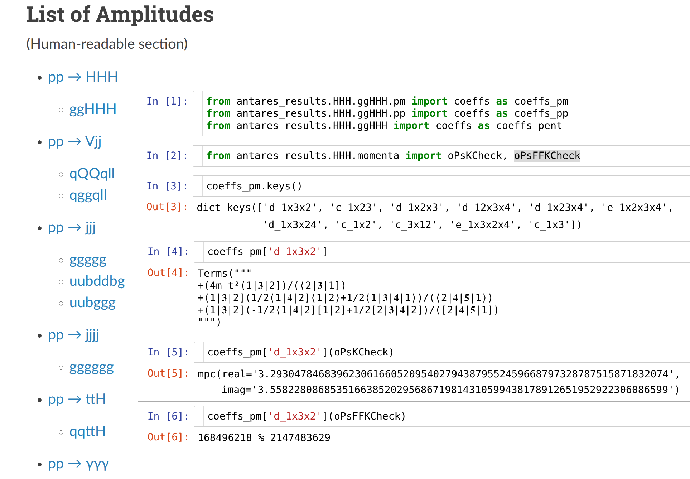



<h3 style="margin-top:5mm; margin-left: -10mm; margin-right: -10mm;">
	<b style="margin-top:15mm; font-size: 31pt; text-transform: none;">
	   Analytic One-Loop Amplitudes for $gg \rightarrow HHH$
	</b>
</h3>

Giuseppe De Laurentis
 

 University of Edinburgh 

 
<a href="https://arxiv.org/pdf/2507.19313">arXiv:2507.19313</a> 

 with J. M. Campbell and R. K. Ellis 

 See also:  
$q\bar{q}\rightarrow t\bar{t}H$ (<a href="https://arxiv.org/abs/2504.19909">arXiv:2504.19909</a>,
<a href="https://link.springer.com/article/10.1007/JHEP07(2025)147">JHEP07(2025)147</a>)  
$pp\rightarrow HHj$ (<a href="https://arxiv.org/abs/2408.12686">arXiv:2408.12686</a>, 
<a href="https://link.springer.com/article/10.1007/JHEP10(2024)230">JHEP10(2024)230</a>)  
$pp\rightarrow Hjj$ (<a href="https://arxiv.org/abs/2002.04018">arXiv:2002.04018</a>,
<a href="https://link.springer.com/article/10.1007/JHEP05(2020)079">JHEP05(2020)079</a>)

HHH Workshop

 Dubrovnik, HR 

  
   
Find these slides at  <a href="/slides/hhhsep2025/#/">gdelaurentis.github.io/slides/hhhsep2025</a> 

---

<section>



# Introduction

---

<b style="font-variant: small-caps; font-size: 32pt"> Theoretical Motivation </b>

     $\circ\,$ Direct probe of triple and quartic Higgs self-couplings at current and future colliders.  
     $\phantom{\circ}\,$ We write the potential in the kappa framwork (SM: $\kappa_3 = \kappa_4 = 1$)

$$ 
V(H) = \frac{1}{2} m_h^2 H^2 + \kappa_3 \lambda v H^3 + \kappa_4 \frac{\lambda}{4}  H^4
$$

     $\phantom{\circ}\,$ There are contributions proportional to $\kappa_4$, $\kappa_3^2$ ($A_3$), $\kappa_3$ ($A_4$), and no $\kappa$ ($A_5$).

$$ 
A_{\rm tot} = \delta^{AB} \frac{g_s^2}{16\pi^2} \, \frac{m_t^4}{v^3} \left(
A_3 + A_4 + A_5 \right)\, .
$$

     $\circ\,$ Facilitate phenomenological studies through faster and more stable evaluations:  
     $\phantom{\circ}\,$ we observe an order of magnitude speed up compared to Recola2 and OpenLoops2.

<a href="https://arxiv.org/abs/1907.13071" style="font-size: 14pt; margin-top: 0mm; margin-bottom: -10mm; float: right; font-align: right;"> Buccioni, Lang, Lindert, Maierhöfer, Pozzorini, Zhang, Zoller</a>
<a href="https://arxiv.org/abs/1711.07388" style="font-size: 14pt; margin-top: -6mm; margin-bottom: 0mm; float: right; font-align: right;"> Denner, Lang, Uccirati</a>

     $\circ\,$ Improve understanding of the analytical structure:
     

          $\qquad\star\,$ Stepping stone towards real-radiation processes and, eventually, multi-loop corrections.
     

     

          $\qquad\star\,$ Provide necessary input to understand cancellation of spurious kinematic singularities.
     

     $\phantom{\circ}\,$ In this context full control over the leading order result is an essential baseline.

---

<b style="font-variant: small-caps; font-size: 32pt"> Feynman Diagrams for $A_3$: $\kappa_4$ \& $\kappa_3^2$</b>

     $\circ\,$ The $\kappa_4$ and $\kappa_3^2$ diagrams are triangles (no contribution from pinch bubbles)

     $\phantom{\circ}\,$ This sub-amplitude is easily stated as (for the two indep. helicity configurations)

$$
\def\mt{m}
\def\mh{M_H}
\def\spa#1.#2{\left\langle#1\,#2\right\rangle}
\def\spb#1.#2{\left[#1\,#2\right]}
\begin{eqnarray}
A_3^{++} &=& 
\frac{\spb1.2}{\spa1.2} \, \frac{6\mh^2}{\mt^2(s_{12}-\mh^2)} 
 \Bigl[(4\mt^2-s_{12}) C_0(p_1,p_2; \mt)+2\Bigr]\times
 \left(\kappa_4+ \frac{3\kappa_3^2 \mh^2}{s_{34}-\mh^2} + \text{perms.} \right) \, ,
\\
A_3^{-+} &=& 0 \, .
\end{eqnarray}
$$

     $\phantom{\circ}\,$ Where $C_0(p_1,p_2; \mt)$ is the scalar triangle Feynman integral: $\frac{1}{i \pi^{2}} \int \,  \frac{d^4 l}{d_0 \; d_1 \; d_2} $

---

<b style="font-variant: small-caps; font-size: 32pt"> Feynman Diagrams for $A_4$ and $A_5$: $\kappa_3$ \& no $\kappa$ </b>

     $\circ\,$ The $\kappa_3$ diagrams are boxes (and triangle pinches, but no bubble contribution)

     $\phantom{\circ}\,$ Their contribution is also fairly simple, it can be written in 4 or 5 lines.

     $\circ\,$ The background diagrams are by far the most complicated,

     $\phantom{\circ}\,$ We require a different approach to tackle them analytically.

</section>

---

<section>



<h1 style="margin-top: -2mm;"> Computation Setup </h1>

---

<b style="font-variant: small-caps; font-size: 34pt; magin-bottom: -10mm;"> Setting up the Calculation </b>  

$\circ$ We perform a first analytic computation in two ways
     

	     1. A standard computation directly from Feynman diagrams  
	     2. A generalized-unitarity computation from cut-diagrams (i.e. products of trees)  
          $\kern2mm$ In this approach the amplitude is constructed as (schematically)
	

     

	     $$
	     \require{color}
	     \displaystyle \sum_{\text{states}} \, \prod_{\text{trees}} A^{\text{tree}}(\lambda, \tilde\lambda, \ell)\big|_{\text{cut}_{\Gamma}} = \sum_{\Gamma' \ge \Gamma} \kern0mm {\color{black}{c_{\,\Gamma',i}(\lambda, \tilde\lambda)}} \, \frac{m_{\Gamma',i}(\lambda\tilde\lambda, \ell)}{\displaystyle \prod_{j\in P_{\Gamma'} / P_{\Gamma}} \rho_{j}(\lambda\tilde\lambda, \ell)}\Bigg|_{\text{cut}_\Gamma}
	     $$
	

     

          $\kern2mm$ The sum in the RHS is over all topologies $\Gamma'$ that have at least the cut propagators $\Gamma$,  
          $\kern2mm$ and the product is over propagators that have not been cut.
	

     $\circ$ Pentagons are reducible to linear combination of boxes, and we observe all bubbles vanish, leaving:

     

	     $$
	     A_5^{h_1h_2} = \sum_{a,b,c} d^{h_1h_2}_{p_a\times p_b \times p_c } D_0(p_a, p_b, p_c; m_t) + \sum_{a,b} c^{h_1h_2}_{p_a\times p_b} C_0(p_a, p_b; m_t)
	     $$
	

     $\circ$ This yields a few MBs of optimized FORM routines for the integral coefficients, which we simplify.

     $\circ$ In principle, a numerical program for $d^{h_1h_2}_{p_a\times p_b \times p_c }$ and $c^{h_1h_2}_{p_a\times p_b}$ would suffice for what follows.

---

<b style="font-variant: small-caps; font-size: 32pt; margin-bottom: 0mm;"> Overview of the Approach </b>

     $\circ$ Goal is to obtain simple forms for $d^{h_1h_2}_{p_a\times p_b \times p_c }$ and $c^{h_1h_2}_{p_a\times p_b}$

     $\star$ We will use only numerical evaluations to study their analytic     structure  
     $\star$ We will parametrize the possible functional form (Ansatz) and solve for free coefficients

     Think of this as a bootstrap approach, helped by additional numerical information.

     $\circ$ The analytic structure should be clear with $p^\mu \in \mathbb{C}^{4}$ (good $\mathbb{R}^{4}$ behaviour will follow)

     $\phantom{\star}$ In practice, take $p^{\mu=y}\in i\mathbb{Q} \; \Rightarrow \; E\pm p^z \text{ and } p^x\pm ip^y \in \mathbb{R} \; \Rightarrow \; \lambda_{\alpha} \in \mathbb{R} \text{ or } \mathbb{Q}$  
     $\phantom{\star}$ This allows us to generate phase space points in a finite field (modular arithmetics)

<pre><code class="language-python">from syngular import Field
from lips import Particles
Particles(5, field=Field("finite field", 2 ** 31 - 1, 1), seed=0)  # Fp
Particles(5, field=Field("padic", 2 ** 31 - 1, 5), seed=0)  # Qp
Particles(5, field=Field("mpc", 0, 300), seed=0)  # C (examples for massless PSPs)
</code></pre>

     $\circ$  Analytic manipulations are too complex, we bypass this complexity by letting cancellations  
     $\phantom{\circ}$ happen numerically. Modular arithmetic will ensure we do not lose precision.

</section>

---

<section >



    

# Analytic & Geometric Structure

   

algebro-geometric formulation for physicists in:  
[GDL, Page (JHEP 12 (2022) 140)](https://arxiv.org/abs/2203.04269)

see also Sturmfeld et al. "Spinor-Helicity Varieties":  
[arXiv:2406.17331](https://arxiv.org/abs/2406.17331)

---

<b style="font-variant: small-caps; font-size: 32pt; margin-bottom: 2mm;"> Variables Subject to Constraints </b>

     $\circ$ Consider polynomials $f, g, h$ in two variables $x, y$. They live in a <b>polynomial ring</b>:

$$ 
\displaystyle f(x,y), g(x, y), h(x, y) \in \mathbb{Q}[x, y] \, .
$$

     $\circ$ We may want to consider e.g. funcitons on the unit circle, $(x^2+y^2-1)$. If we have

$$ 
\displaystyle f(x,y) \approx g(x, y) + h(x, y) (x^2+y^2-1) \, ,
$$

     $\phantom{\circ}$ then we should consider $f(x,y)$ and $g(x, y)$ as equivalent, for any $h(x,y)$.

     $\circ$ This structure is that of a polynomial <b>quotient</b> ring

$$ 
\displaystyle \mathbb{Q}[x, y] \big/ \big\langle x^2+y^2-1 \big\rangle \\[2mm]
$$

     $\phantom{\circ}$ its elements are <b>equivalence classes</b> of polynomials.

     $\circ$ $\big\langle x^2+y^2-1 \big\rangle \subset \mathbb{Q}[x, y]$ is an example of an <b>ideal</b>, that is the infinite set of polynomials   
     $\phantom{\circ}$ $h(x, y) (x^2+y^2-1)$, for any $h(x,y)$, that vanishes on the unit circle.

---

<b style="font-variant: small-caps; font-size: 32pt; margin-bottom: 0mm;"> Massless Scattering </b>

     $\circ$ For $n$-point massless scattering, the quotient ring is

<a style="font-size: large; text-align: right; float: right; margin-top: -4mm; margin-bottom: -10mm;" href=https://arxiv.org/abs/2203.04269>
   GDL, Page ('22)
</a>

$$ 
\displaystyle \kern10mm R_{n} = \mathbb{F}\Big[|1⟩_{\alpha}, [1|_{\dot\alpha}, \dots, |n⟩_{\alpha}, [n|_{\dot\alpha} \Big] \Big/ \Big\langle {\textstyle \sum_{i=1}^n} |i\rangle[ i | \Big\rangle
$$

     $\phantom{\circ}$ Recall the simple relation $p_i^\mu \sigma^\mu_{\alpha\dot\alpha} = |i\rangle_\alpha [i|_{\dot\alpha}$.

     $\circ$ The "unit circle" is now the codimension $4$ "momentum conservation" <b>variety</b> within a $4n$   $\phantom{\circ}$ dimensional space. On this variety we have equivalence relations such as 

     $$
     \displaystyle \langle 1|2+3|1]=\langle 1|-1-4-5|1]=-\langle 1|4+5|1] \quad \text{in} \quad R_5
     $$

     $\circ$ Integral coefficients are rational functions $r_i$ in the field of fractions of $R_n$,

     $$
     \displaystyle r_i(|i\rangle,[i|) = \frac{\mathcal{N}(|i\rangle,[i|)}{\mathcal{D}(|i\rangle,[i|)} \, , \quad r_i(|i\rangle,[i|) \in \text{Frac}(R_n)
     $$

---

<b style="font-variant: small-caps; font-size: 32pt; margin-bottom: 2mm;"> Covariant Q-Ring for $\text{ggHHH}$ </b>

     $\circ$ For $pp \rightarrow HHH$ we use the massive spinor-helicity (or spin-spinor) formalism,  
     $\phantom{\circ}$ albeit in a very simplified form since scalars have no states.

<a href="https://arxiv.org/abs/1809.09644" style="font-size: 14pt; margin-bottom: -6mm; margin-top: -5mm; float: right; font-align: right;"> Shadmi, Weiss </a> <a href="https://arxiv.org/abs/1802.06730" style="font-size: 14pt; margin-bottom: -6mm; margin-top: -5mm;  margin-right: 31mm; float: right; font-align: right;"> Ochirov; </a>
<a href="https://arxiv.org/abs/1709.04891" style="font-size: 14pt; margin-bottom: -10mm; margin-top: -11mm; margin-right: 0mm; float: right; font-align: right;"> Arkani-Hamed, Huang, Huang;</a>

$$ 
\displaystyle \kern10mm R_{HHH} = \frac{\mathbb{F}\big[|1⟩_{\alpha}, [1|_{\dot\alpha}, |2⟩_{\alpha}, [2|_{\dot\alpha}, \boldsymbol{3}_{\alpha,\dot\alpha}, \boldsymbol{4}_{\alpha,\dot\alpha}, \boldsymbol{5}_{\alpha,\dot\alpha} \big]}{\big\langle |1\rangle[1|+|2\rangle[2| + \boldsymbol{3}_{\alpha,\dot\alpha} + \boldsymbol{4}_{\alpha,\dot\alpha} + \boldsymbol{5}_{\alpha,\dot\alpha}, \;\, \boldsymbol{3}_{\alpha,\dot\alpha} \boldsymbol{3}^{\dot\alpha,\alpha} - \boldsymbol{4}_{\alpha,\dot\alpha} \boldsymbol{4}^{\dot\alpha,\alpha}, \;\, \boldsymbol{4}_{\alpha,\dot\alpha} \boldsymbol{4}^{\dot\alpha,\alpha}- \boldsymbol{5}_{\alpha,\dot\alpha} \boldsymbol{5}^{\dot\alpha,\alpha} \big\rangle}
$$

     $\phantom{\circ}$ where $\boldsymbol{3}_{\alpha,\dot\alpha} \boldsymbol{3}^{\dot\alpha,\alpha} = \boldsymbol{4}_{\alpha,\dot\alpha} \boldsymbol{4}^{\dot\alpha,\alpha} = \boldsymbol{5}_{\alpha,\dot\alpha} \boldsymbol{5}^{\dot\alpha,\alpha} = 2 M_h^2$, $\boldsymbol{3}_{\alpha,\dot\alpha},\boldsymbol{4}_{\alpha,\dot\alpha},\boldsymbol{5}_{\alpha,\dot\alpha}$ are full-rank (unfactorizable).

     $\circ$ It is sometimes useful to map to a set of all massless momenta / spinors,

<a href="https://arxiv.org/abs/1601.08113" style="font-size: 14pt; margin-top: -3mm; margin-right: 2mm; float: right; font-align: right;"> Conde, Marzolla</a>
<a href="https://arxiv.org/abs/1605.07402" style="font-size: 14pt; margin-top: -3mm; margin-right: 2mm; float: right; font-align: right;"> Conde, Joung, Mkrtchyan;</a>

$$ 
\displaystyle 1 \rightarrow 1, 2 \rightarrow 2, \boldsymbol{3} \rightarrow 3+4, \boldsymbol{4} \rightarrow 5+6, \boldsymbol{5} \rightarrow 7+8
$$

     $\phantom{\circ}$ but if we want neat expressions we must be careful not to overparametrise the space!

     $\circ$ Our coefficients $d^{h_1h_2}_{p_a\times p_b \times p_c }$ and $c^{h_1h_2}_{p_a\times p_b}$ belong to the field of fractions over $R_{HHH}$.

---

     <b style="font-variant: small-caps; font-size: xxx-large"> Least Common Denominator </b>
     

     (i.e. geometry at codimension one)
     

     

          <!---
          

               $\circ$ Polynomials belong to the the covariant quotient ring of spinors,
          

          

               $$\displaystyle \kern10mm R_n = \mathbb{F}\big[|1⟩, [1|, \dots, |n⟩, [n|\big] \big/ \big\langle \sum_i |i⟩[i| \big\rangle$$
          

          --->
	     

                $\circ\,$ We can now determine the least common denominators (LCDs),
          

          

               $$
               \displaystyle \mathcal{D} = \prod_j \mathcal{D}_j^{q_{ij}} \in R_{HHH} \; , \; \mathcal{D}_j \text{ irreducible} \, ,
               $$
          

          

               $\phantom{\circ}\,$ from a univariate slice $\vec\lambda(t)$ giving us $\mathcal{D}(t)$,   
               $\phantom{\circ}\,$ if we know the possible $\mathcal{D}_j$.
          

          

               $\circ$ The curve must intersect all varieties $V(\langle \mathcal{D}_j \rangle)$, e.g.
          

          

               $$
               \displaystyle |i\rangle \rightarrow |i\rangle + t a_i |\eta\rangle, [i| \rightarrow [i| + t b_i [\eta|
               $$
          

          

               $\phantom{\circ}\,$ Solve for $a_i, b_i$ such that constraints are satisfied. For $HHH$,  
               $\phantom{\circ}\,$ we can use the massless algorithm at 8 point (or shift the $p_{\alpha,\dot\alpha}$).
          

	

     

          
          

               The space has dimension $20-6=14$,
          

          

               $\mathcal{D}_j = 0$ have dimension $14-1=13$,
          

          

               $\vec\lambda(t)$'s have dimension 1.
          

     

    Poles & Zeros $\;\Leftrightarrow\;$ Irreducible Varieties $\;\Leftrightarrow\;$ Prime Ideals  
    <i style="font-size: 14pt; border-top: -8mm; border-bottom: -2mm;"> Physics $\kern18mm$ Geometry $\kern18mm$ Algebra </i>

---

<b style="font-variant: small-caps; font-size: 32pt; margin-bottom: 2mm;"> $HHH$ LCD Factors </b>

     $\circ\,$ The irreducible denominator factors $\mathcal{D}_j$ for $HHH$ are

     $$
     \begin{gathered}
     \mathcal{D}_{HHH} = \big\{ 
          ⟨1|2⟩, [1|2], ⟨2|𝟓|1], ⟨2|𝟒|1], ⟨2|𝟑|1], ⟨1|𝟑|2], [1|𝟑|𝟓|1], ⟨1|𝟑|𝟓|1⟩, ⟨1|𝟓|𝟒|2⟩, [2|𝟒|𝟓|1], Δ_{12|𝟑|𝟒|𝟓}, \\
          ⟨2|𝟑|𝟒|𝟓|1], ⟨1|𝟓|𝟒|𝟑|2], ⟨1|2⟩[1|2]⟨1|𝟓|𝟒|𝟑|2]⟨2|𝟑|𝟒|𝟓|1]+m_t^2\text{tr}_5(1|2|𝟑|𝟒)^2, \\
          ⟨1|𝟑|2]⟨2|𝟒|𝟓|1⟩[1|𝟑|2⟩[2|𝟒|𝟓|1]+m_t^2\text{tr}_5(1|2|𝟑|𝟒)^2
     \big\}
     \end{gathered}
     $$

     $\phantom{\circ}$ plus closure under permutations, where 

     $$
     \Delta_{12|3|4|5} \;=\;
\det\begin{pmatrix}
p_{12}\!\cdot\! p_{12} & p_{12}\!\cdot\! p_{3} & p_{12}\!\cdot\! p_{4} \\
p_{3}\!\cdot\! p_{12} & p_{3}\!\cdot\! p_{3}   & p_{3}\!\cdot\! p_{4} \\
p_{4}\!\cdot\! p_{12} & p_{4}\!\cdot\! p_{3}   & p_{4}\!\cdot\! p_{4}
\end{pmatrix} \quad \text{ and } \quad\quad
   \begin{aligned}
       \text{tr}_5(1|2|3|4) &= \text{tr}(\gamma^5 p_1 p_2 p_3 p_4) \\
       &= [1|2|𝟑|𝟒|1⟩ - ⟨1|2|𝟑|𝟒|1]
     \end{aligned}
     $$

     $\phantom{\circ}$ The two poles mixing kinematics with the top mass are what is left overs of the pentagons.

     $\circ$ For example, for an integral coefficient at this stage we see

$$ 
\hat d^{++}_{12\times 3 \times 4}= \frac{\mathcal{N}}{⟨12⟩²⟨1|𝟓|𝟒|𝟑|2]⟨2|𝟑|𝟒|𝟓|1]Δ_{12|𝟑|𝟒|𝟓}}
$$

     $\phantom{\circ}$ For some unknown $\mathcal{N}$ which would be fairly complicated in this LCD form.

---

<b style="font-variant: small-caps; font-size: 32pt; margin-bottom: 0mm;"> A Concrete Example </b>

     $\circ$ For instance, we aim to find a form like

$$ 
\begin{gathered}
\hat d^{++}_{12\times 3 \times 4}=\Bigg\{\frac{[2|𝟒|𝟑-𝟓|2]\text{tr}(𝟓|𝟒|𝟑|1-2)}{4⟨12⟩⟨1|𝟓|𝟒|𝟑|2]} -
\frac{(s_{𝟑𝟒}-2m_h²)(s_{𝟑𝟓}+m_h²-2s_{2𝟒})}{2⟨12⟩²} -
\frac{(\text{tr}(1-2|𝟑)m_h²+⟨1|𝟑|𝟒|2⟩[12])}{⟨12⟩²} +\\
-\frac{(s_{𝟒𝟓}-s_{𝟑𝟒})²(s_{1𝟑}-s_{2𝟑})(s_{1𝟑}+s_{2𝟑})(\text{tr}(1+2|𝟒)+4s_{𝟑𝟒}-8m_t²)}{32⟨12⟩²Δ_{12|𝟑|𝟒|𝟓}} +\\
-\frac{(s_{𝟒𝟓}-s_{𝟑𝟒})(s_{1𝟑}-s_{2𝟑})(s_{𝟑𝟒}-m_h²)((s_{𝟒𝟓}-s_{𝟑𝟒})\text{tr}(1+2|𝟒)+s_{𝟑4}(s_{1𝟑}+s_{2𝟑})-s_{𝟑4}(s_{𝟑𝟒}-2m_h²)-8s_{123}m_t²)}{8⟨12⟩²Δ_{12|𝟑|𝟒|𝟓}} +\\
\frac{Δ_{12|𝟒|𝟑5}(s_{1𝟑}-s_{2𝟑})(s_{1𝟑}+s_{2𝟑})(\text{tr}(1+2|𝟒)-8m_t²)}{8⟨12⟩²Δ_{12|𝟑|𝟒|𝟓}} \Bigg\} + \Bigg\{12𝟑𝟒𝟓\rightarrow21𝟓𝟒𝟑\Bigg\}
\end{gathered}
$$

     $\circ\,$ Challenge 1: how do we parametrize the numerators?

     $\circ\,$ Challenge 2: in LCD form the numerators are often too complicated.  
     $\kern18mm$ How do we identify allowed partial fraction decompositions?

</section>

---

<section>



      

# Analytic Reconstruction

       

---

<b style="font-variant: small-caps; font-size: 32pt; margin-bottom: 2mm;"> Invariant Quotient Sub-Rings </b>

(see also <a href=https://arxiv.org/abs/2509.14350>2509.14350</a>, <i>Some remarks on invariants</i>)

     $\circ$ Helicity amplitudes are Lorentz invariant: minimal ansätze are build in the <b>invariant sub-ring</b>.

     $\circ$ General construction for Lorentz-invariant sub-rings through elimination theory

     $\quad\star$ Build a ring with both covariant and invariant variables (here showing massless case)

$$ 
\mathbb{F}\big[ |i\rangle, [i|, \langle i j\rangle , [ij] \big]
$$

     $\quad\star$ Define relations among variables (on top of existing constraints, e.g. $p_3^2=p_4^2$)

$$ 
\big\{ \langle ij \rangle - \epsilon^{\beta\alpha} \lambda_{i\alpha}  \lambda_{j, \beta}, [ij] - \tilde\lambda_{i\dot\alpha} \epsilon^{\dot\alpha\dot\beta} \tilde\lambda_{j, \dot\beta} \big\}
$$

     $\quad\star$ Compute a lexicographical Groebner basis with invariants > covariants

     $\circ$ For  $HHH$, this yields the following quotient ring for the invariants

$$ 
\displaystyle \mathcal{R}_{HHH} = \frac{\underbrace{\substack{\normalsize\kern-30mm\mathbb{F}\big[ ⟨1|2⟩, [1|2], ⟨1|𝟑|1], ⟨1|𝟑|2], ⟨2|𝟑|1], ⟨2|𝟑|2], ⟨1|𝟒|1], ⟨1|𝟒|2], ⟨2|𝟒|1], ⟨2|𝟒|2],\\[2mm] \normalsize \kern10mm ⟨1|𝟑|𝟒|1⟩, ⟨1|𝟑|𝟒|2⟩, ⟨2|𝟑|𝟒|2⟩, [1|𝟑|𝟒|1], [1|𝟑|𝟒|2], [2|𝟑|𝟒|2], \text{tr}(𝟑|𝟑), \text{tr}(𝟑|𝟒), \text{tr}(𝟒|𝟒), m_h^2
 \big]}}_{20 \text{ variables}}}{\big\langle \underbrace{\text{tr}(𝟒|𝟒)-2m_h^2, \text{tr}(𝟑|𝟑)-2m_h^2, ⟨2|\boldsymbol{3}|2]⟨2|\boldsymbol{4}|1]-⟨2|\boldsymbol{3}|1]⟨2|\boldsymbol{4}|2]-[1|2]⟨2|\boldsymbol{3}|\boldsymbol{4}|2⟩, ...}_{\text{subject to } 122 \; \text{redundancy relations / Schouten identities (only first 2 are trivial rewritings)}} \big\rangle}
$$

---

<b style="font-variant: small-caps; font-size: xxx-large"> The Numerator Ansatz </b>

$\circ\,$ The numerator Ansatz takes the form (for the massless case)

<a style="font-size: large; text-align: right; float: right; margin-top: -6mm; margin-bottom: 4mm;" href=https://arxiv.org/abs/1904.04067>
   GDL, Maître ('19)
</a>

$\displaystyle \text{Num. poly}(\lambda, \tilde\lambda) = \sum_{\vec \alpha, \vec \beta} c_{(\vec\alpha,\vec\beta)} \prod_{j=1}^n\prod_{i=1}^{j-1} \langle ij\rangle^{\alpha_{ij}} [ij]^{\beta_{ij}}$

     $\phantom{\circ}$ subject to constraints on $\vec\alpha,\vec\beta$ due to: 1) mass dimension; 2) little group; 3) linear independence.  
     $\phantom{\circ}$ For HHH we have polynomials in the 20 invariants from the previous slide.

 

$\circ\,$ Construct the Ansatz via the algorithm from Section 2.2 of <a href=https://arxiv.org/abs/2203.04269>GDL, Page ('22)</a>

Linear independence = irreducibility by the Gröbner basis of the ideal of the redundancies.

$\circ\,$ Efficient implementation using open-source software only

	

	       
	     Gröbner bases $\rightarrow$ constrain $\vec\alpha,\vec\beta$  
	     <a style="font-size: large; text-align: center; float: center; margin-top: -10mm; margin-bottom: 5mm;"
	     href=https://www.singular.uni-kl.de/index.php.html>
		Decker, Greuel, Pfister, Schönemann
	     </a>	    
	

	

	       
	     Integer programming $\rightarrow$ enumerate sols. $\vec\alpha,\vec\beta$  
	     <a style="font-size: large; text-align: center; float: center; margin-top: -10mm; margin-bottom: 5mm;"
	     href=https://www.singular.uni-kl.de/index.php.html>
		Perron and Furnon (Google optimization team)
	     </a>
	

    

$\circ\,$ Linear systems solved w/ CUDA over $\mathbb{F}_{2^{31}-1}$ ($t_{\text{solving}} \ll t_{\text{sampling}}$) w/ <a href=https://github.com/GDeLaurentis/linac-dev> linac </a>  (coming soon) 

---

     <b style="font-variant: small-caps; font-size: 32pt"> Multivariate Partial Fractions </b>

<a style="font-size: large; text-align: right; float: right; margin-top: -18mm; margin-bottom: -10mm;" href=https://arxiv.org/abs/1904.04067>
   GDL, Maître ('19)
</a>
<a style="font-size: large; text-align: right; float: right; margin-top: -13mm; margin-bottom: -10mm;" href=https://arxiv.org/abs/2203.04269>
   GDL, Page ('22)
</a>

     $\circ$ We want a mathematically rigorous answer to the question

$$ 
\frac{\mathcal{N}}{\mathcal{D}_1\mathcal{D}_2} \stackrel{?}{=}
 \frac{\mathcal{N}_2}{\mathcal{D}_1} + \frac{\mathcal{N}_1}{\mathcal{D}_2} 
$$

     $\phantom{\circ}$ without knowing $\mathcal{N}$ analytically. The complexity should not depend on $\mathcal{N}$ (besided numerical evaluations).  
     $\phantom{\circ}$ The complexity will depend on the irreducible polynomials $\mathcal{D}_1, \mathcal{D}_2$.

     $\circ$ Multivariate partial fraction decompositions follow from varieties where pairs of denominator factors vanish

$$ 
\frac{\mathcal{N}}{\mathcal{D}_1\mathcal{D}_2} \stackrel{?}{=}
 \frac{\mathcal{N}_2}{\mathcal{D}_1} + \frac{\mathcal{N}_1}{\mathcal{D}_2} \; \Longleftrightarrow \; \mathcal{N} \stackrel{?}{\in} \big\langle \mathcal{D}_1, \mathcal{D}_2 \big\rangle \, \text{ i.e. } \; \mathcal{N} \stackrel{?}{=} \mathcal{N}_1 \mathcal{D}_1 + \mathcal{N}_2 \mathcal{D}_2
$$

    

        
        <!--
        

          $\langle xy^2 + y^3 - z^2 \rangle$
        

        -->
    

    

        $\cap$
    

    

        
        <!--
        

          $\langle x^3 + y^3 - z^2 \rangle$
        

        -->
    

    

        $=$
    

    

        
        <!--
        

          $\begin{gather}\langle 2y^3-z^2, x-y \rangle \cap \langle y^3-z^2, x \rangle \cap \langle z^2, x+y \rangle\end{gather}$ 
        

        -->
    

$$ 
\langle {\color{orange}xy^2 + y^3 - z^2} \rangle + \langle {\color{blue}x^3 + y^3 - z^2} \rangle = \langle xy^2 + y^3 - z^2, x^3 + y^3 - z^2 \rangle = \langle {\color{red}2y^3-z^2, x-y} \rangle \cap \langle {\color{green}y^3-z^2, x} \rangle \cap \langle {\color{blue}z^2, x+y} \rangle
$$

     $\phantom{\circ}$ This is a primary decomposition, it is the equivalent for polynomials of say: $12 = 2^2 \times 3$   
     $\phantom{\circ}$ If $\mathcal{N}$ vanishes on all branches, than the partial fraction decomposition exists.

---

     <b style="font-variant: small-caps; font-size: 32pt"> Iterated Pole Subtraction </b>
     

     (i.e. geometry at codimension greater than one)
     

<a style="font-size: large; text-align: right; float: right; margin-top: -21mm; margin-bottom: -10mm;" href=https://arxiv.org/abs/1904.04067>
   GDL, Maître ('19)
</a>
<a style="font-size: large; text-align: right; float: right; margin-top: -16mm; margin-bottom: -10mm;" href=https://arxiv.org/abs/2203.04269>
   GDL, Page ('22)
</a>
<a style="font-size: large; text-align: right; float: right; margin-top: -11mm; margin-bottom: -10mm;" href=https://arxiv.org/abs/2312.03672>
   Chawdhry ('23)
</a>
<a style="font-size: large; text-align: right; float: right; margin-top: -6mm; margin-bottom: -10mm;" href=https://arxiv.org/abs/2506.08452>
   Xia, Yang ('25)
</a>

     $\circ$ Let's go back to our example

$$ 
\hat d^{++}_{12\times 3 \times 4}= \frac{\mathcal{N} \leftarrow 2794 \text{ free parameters }}{⟨12⟩²⟨1|𝟓|𝟒|𝟑|2]⟨2|𝟑|𝟒|𝟓|1]Δ_{12|𝟑|𝟒|𝟓}}
$$

     $\circ$ We can prove $⟨1|𝟓|𝟒|𝟑|2], ⟨2|𝟑|𝟒|𝟓|1]$ can be separated, their primary decomposition reads

$$ 
\big\langle ⟨1|𝟓|𝟒|𝟑|2], ⟨2|𝟑|𝟒|𝟓|1] \big\rangle = \big\langle ⟨1|𝟓|𝟒|𝟑|2], ⟨2|𝟑|𝟒|𝟓|1], \text{tr}_5 \big\rangle \cap \big\langle ⟨1|𝟓|𝟒|𝟑|2], ⟨2|𝟑|𝟒|𝟓|1], s_{2𝟑}, s_{1𝟓} \big\rangle
$$

     $\phantom{\circ}$ Generate two phase space points, one for each branch, and verify the numerator vanishes.

     $\circ$ Similarly, with four evaluations we can prove $⟨1|𝟓|𝟒|𝟑|2], Δ_{12|𝟑|𝟒|𝟓}$ can be separated,

$$ 
\big\langle ⟨1|𝟓|𝟒|𝟑|2] , \, Δ_{12|𝟑|𝟒|𝟓} \big\rangle= \big\langle M_H, \; 𝟓_{\alpha\dot\alpha}𝟒^{\dot\alpha\beta} \big\rangle \cap \big\langle M_H, \; 𝟒^{\dot\alpha\alpha}𝟑_{\alpha\dot\beta} \big\rangle \cap \big\langle \langle 1 | 𝟑 | 2], \; \langle 1 | 𝟒 | 2], \; \langle 1 | 𝟑 | 𝟒 | 1 \rangle, [2 | 𝟑 | 𝟒 | 2] \big\rangle \cap \big\langle ??? \big\rangle
$$

     $\phantom{\circ}$ Although we don't have a complete set of generators for the last branch, we can still sample it.

     $\circ$ Fit $⟨1|𝟓|𝟒|𝟑|2]$ residue by sampling in limit $⟨1|𝟓|𝟒|𝟑|2] \rightarrow 0$

$$ 
\hat d^{++}_{12\times 3 \times 4} = \frac{\mathcal{N} \leftarrow 112 \text{ free parameters }}{⟨12⟩²⟨1|𝟓|𝟒|𝟑|2]} + \mathcal{O}(⟨1|𝟓|𝟒|𝟑|2]^0)
$$

</section>

---

<section>



#   Conclusions   &   Outlook

---

     <b style="font-variant: small-caps; font-size: 32pt"> Analytic Results for Theory and Phenomenology </b>

     $\circ$ Analytic expressions implemented in <a href="https://mcfm.fnal.gov/">MCFM</a>, for phenomenology use this efficient Fortran implementation

<a href="https://arxiv.org/abs/1909.09117" style="font-size: 14pt; margin-top: -3mm; margin-right: 2mm; float: right; font-align: right;"> Campbell, Neumann</a>
<a href="https://arxiv.org/abs/1503.06182" style="font-size: 14pt; margin-top: -3mm; margin-right: 2mm; float: right; font-align: right;"> Campbell, Ellis, Giele;</a>
<a href="https://arxiv.org/abs/1105.0020" style="font-size: 14pt; margin-top: -3mm; margin-right: 2mm; float: right; font-align: right;"> Campbell, Ellis, Williams;</a>

     $\circ$ <a href="https://github.com/GDeLaurentis/antares-results/" style="font-size: 20pt; font-variant: small-caps;">antares-results</a> (human readable exprs in <a href="https://gdelaurentis.github.io/antares-results/">docs</a>) with <a href="https://github.com/GDeLaurentis/antares-results/actions/">CI tests</a> for coefficients and/or full amplitudes

     

---

     <b style="font-variant: small-caps; font-size: 32pt"> Challenges </b>

$\circ\,$ Can we always verify constraints numericaly? Alternatively, can we predict/guess them?  
$\phantom{\circ}\,$ $p$-adic evaluations can be costly (especially with multi-loop amplitudes).

$\circ\,$ Imposing multiple constraints at ones means computing ideal intersections, which can be highly non-trivial:

$$ 
\mathcal{N} \in \langle q_1, q_2 \rangle \cap \langle q_3, q_4 \rangle \stackrel{?}{=} \langle q_1q_3, q_1q_4, q_2q_3, q_2 q_4\rangle 
$$

$\phantom{\circ}\,$ Unfortunately not always. This is called a <i>complete intersection</i> when it holds.

$\phantom{\circ}\,$ Therefore, either: 

$\quad\star\,$ we compute the intersection explicitly (can be prohibitively hard),

$\quad\star\,$ or we have to make a choice of which constrain we manifest (trial and error).

$\circ\,$ Computing primary decompositions with these many variables is hard, Singular can't do it on its own.

$\circ\,$ Even constructing the ansatz requires a Groebner Basis, which in some cases Singular doesn't easily give.  
$\phantom{\circ}\,$ For $pp\rightarrow HHHj$ we don't have the full GB, we need to remove redundancies through linear algebra.

$\circ\,$ The reduction to master integrals of the amplitude is often not easy in the first place.

</section>

---

<section>



<b style="font-variant: small-caps; font-size: xxx-large;"> Thank you   for your attention! </b>
 
 
<!---
<b style="font-variant: small-caps; font-size: xx-large;"> Questions? </b>
--->

    These slides are powered by: 
    
        <a href="https://en.wikipedia.org/wiki/Markdown">markdown</a>, 
        <a href="https://en.wikipedia.org/wiki/HTML">html</a>, 
        <a href="https://revealjs.com/">revealjs</a>, 
        <a href="https://gohugo.io/">hugo</a>, 
        <a href="https://www.mathjax.org/">mathjax</a>, 
        <a href="https://github.com/">github</a>
    

<!---
 

     For open source packages: 
     <code>
          $   $ pip install [lips](https://github.com/GDeLaurentis/lips) [pyadic](https://github.com/GDeLaurentis/pyadic)
     </code>

--->

</section>

---

<section>

<b style="font-variant: small-caps; font-size: xxx-large;"> Backup slides. </b>

---

     <b style="font-variant: small-caps; font-size: 32pt"> Effective Pentagons </b>

     $\circ$ As mentioned, pentagons can be reduced to a combination of boxes,

$$
\begin{eqnarray}
  &&E_0(p_1,p_2,p_3,p_4;\mt)=
  c^{(1)} D_0(p_2,p_3,p_4;\mt)
  +c^{(2)} D_0(p_{12},p_3,p_4;\mt) \\
  &+&c^{(3)} D_0(p_1,p_{23},p_4;\mt)
  +c^{(4)} D_0(p_1,p_2,p_{34};\mt)
  +c^{(5)} D_0(p_1,p_2,p_3;\mt)\, .
\end{eqnarray}
$$

     $\circ$ We find it useful to write the box coefficients in terms of effective pentagons $\hat e$ and boxes $\hat d$

$$
d^{h_1h_2}_{p_a\times p_b \times p_c } =  \sum_{i=\{i_1,i_2\}} c^{(i)} \hat e_{p_x \times p_y \times p_z \times p_w}+ \hat d^{h_1h_2}_{p_a\times p_b \times p_c }
$$

     $\phantom{\circ}$ where the sum involves the two pentagons that pinch to the given box.

     $\circ$ The coefficients $\hat e$ and $\hat d$ are not uniquely defined, but $\hat e$ has the property of capturing  
     $\phantom{\circ}$ the residue of the poles that mix top-mass and kinematic dependence.  
     $\phantom{\circ}$ The non-uniqueness comes from, e.g.

$$
⟨1|2⟩[1|2]⟨1|𝟓|𝟒|𝟑|2]⟨2|𝟑|𝟒|𝟓|1]+m_t^2\text{tr}_5(1|2|𝟑|𝟒)^2=0
$$

---

     <b style="font-variant: small-caps; font-size: 32pt"> Example of Code Syntax </b>

     $\circ$ This is just a couple of pip install's aways

<pre><code class="language-python" style="font-size: 11pt">field = Field("padic", 2 ** 31 - 1, 5)
oPs8pt = Particles(8, field=field, seed=0)
oPs8pt._singular_variety(("s_34-s_56", "s_56-s_78", '⟨1|7+8|5+6|3+4|2]', '⟨2|3+4|5+6|7+8|1]'),
                         (field.digits, field.digits, 1, 1), seed=0,
                         generators=('s_34-s_56', 's_56-s_78', '⟨1|7+8|5+6|3+4|2]', 
                                     '⟨2|3+4|5+6|7+8|1]', 'tr5(1|2|3+4|5+6)'))
oPs8pt.m_t = field.random()
oPs8pt.m_h = "sqrt(s_34)"
oPs5pt = oPs.cluster([[1, ], [2, ], [3, 4], [5, 6], [7, 8]])

from antares_results.HHH.ggHHH.pp import coeffs as coeffs_pp
coeffs_pp\['d_12x3x4'\](oPsC)
</code></pre>
<pre><code class="language-python" style="margin-top:-5mm; font-size: 10pt">130808068*2147483647^-1 + 687356881 + 792807618*2147483647 + 696603492*2147483647^2 + O(2147483647^3)
</code></pre>

     The denominator goes like $p^2$, but the coefficient goes like $p^{-1} \Rightarrow$ the numerator vanishes linearly.

     $\circ$ The output is a $p$-adic number, i.e. a Laurent series in powers of the prime.  
     $\phantom{\circ}$ With finite fields we cannot do this (with just one evaluation)! It would be dividing by zero.

---

     <b style="font-variant: small-caps; font-size: 32pt"> Core Tools - Fully Open Source </b>

     For fleshed out examples see e.g. <a href=https://inspirehep.net/literature/2661970> GDL (ACAT '22)</a> or <a href="https://arxiv.org/abs/2504.19909">Appendix B of 2504.19909</a>

     Install from github (<code style="font-size:14pt;">git clone</code>) or PyPI (<code style="font-size:14pt;">pip install</code>); use of Jupyter is recommended.

     $\circ$ <a href="https://github.com/GDeLaurentis/pyadic/" style="font-size: 20pt; font-variant: small-caps;">pyadic</a> 
     $\quad\rightarrow$ Finite field $\mathbb{F}_p$ and $p$-adic $\mathbb{Q}_p$ number types, including field extensions  
     $\quad\rightarrow$ rational number reconstruction (Wang's EEA, LGRR, MQRR)  
     $\quad\rightarrow$ univariate and multivariante Newthon & univariate Thiele interpolation algorithms in $\mathbb{F}_p$

     $\circ$ <a href="https://github.com/GDeLaurentis/syngular/" style="font-size: 20pt; font-variant: small-caps;">syngular</a> (in the backhand <a href="https://www.singular.uni-kl.de/index.php.html" style="font-size: 20pt; font-variant: small-caps;">Singular</a>  is used for many operations) 
     $\quad\rightarrow$ object-oriented algebraic geometry (Field, Ring, Quotient Ring, Ideal)  
     $\quad\rightarrow$ ring-agnostic monomials and polynomials (with support for unicode characters, e.g. spinor brackets) 
     $\quad\rightarrow$ multivariate solver (Ideal.point_on_variety), under- and over-constrained systems OK  
     $\quad\rightarrow$ a semi-numerical prime and primary ideal test (assumes equi-dimensionality of ideal)

     $\circ$ <a href="https://github.com/GDeLaurentis/lips/" style="font-size: 20pt; font-variant: small-caps;">lips</a> (Lorentz invariant phase space) 
     $\quad\rightarrow$ phase space points over any field ($\mathbb{Q}, \mathbb{Q}[i], \mathbb{R}, \mathbb{C}, \mathbb{Q}_p, \mathbb{F}_p$), including internal and external masses  
     $\quad\rightarrow$ evaluate any Mandelstam or spinor expression (custom ast/regex parser)  
     $\quad\rightarrow$ generation of any special kinematic configuration (wrapper around Ideal.point_on_variety)

     $\circ$ <a href="https://github.com/GDeLaurentis/antares/" style="font-size: 20pt; font-variant: small-caps;">antares</a> (automated numerical to analytical reconstruction software) - still under development  
     $\quad\rightarrow$ Univariate slicing, LCD determination, basis change, multivariate partial fractioning strategies,  
     $\phantom{\rightarrow}$ constraining of numerators, Ansatz generation and fitting strategies, etc.

</section>

<!-- REVEAL.JS CUSTOMIZATION -->

<!-- Include MathJax library -->

<!-- Include Reveal.js and the Math plugin -->

<!-- Initialize Reveal.js with the MathJax plugin -->

