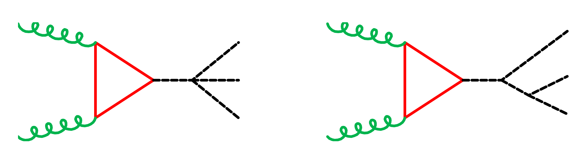
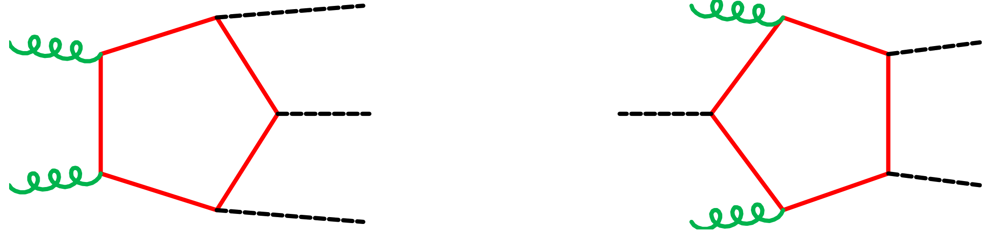
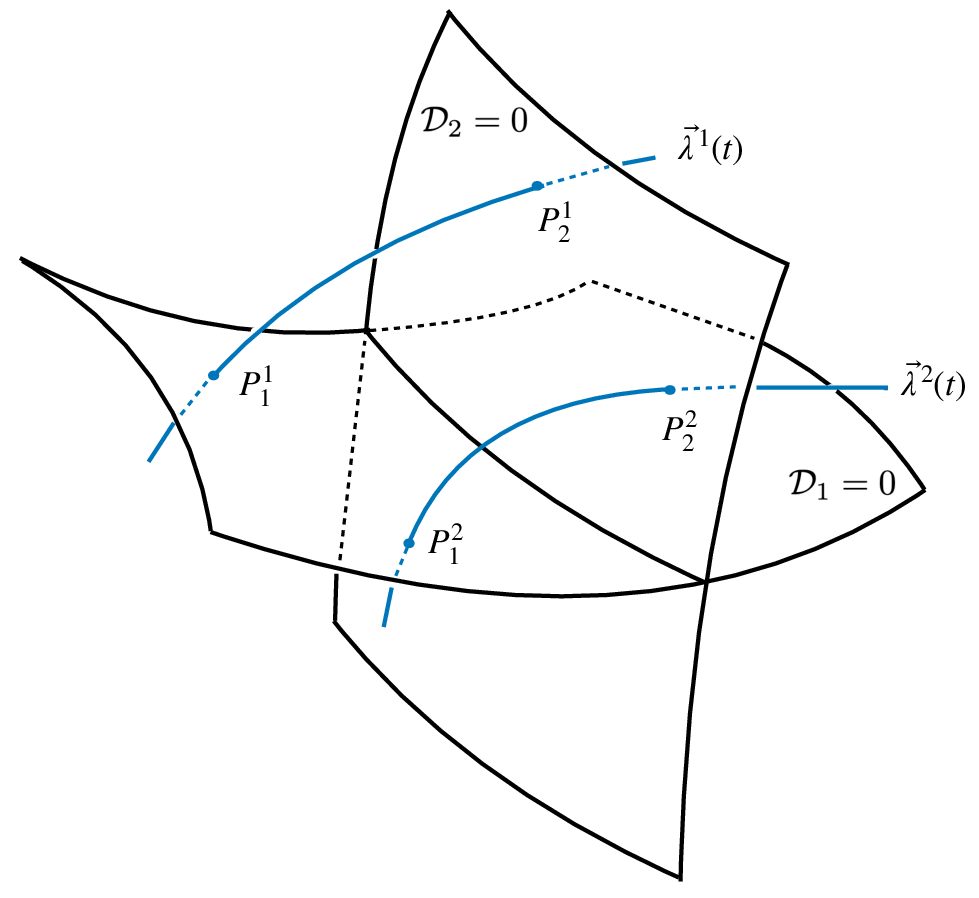



<h3 style="margin-top:5mm; margin-left: -10mm; margin-right: -10mm;">
	<b style="margin-top:15mm; font-size: 31pt; text-transform: none;">
	   Analytic One-Loop Amplitude for $gg \rightarrow HHH$
	</b>
</h3>

Giuseppe De Laurentis
 

 University of Edinburgh 

 
<a href="https://arxiv.org/pdf/2507.19313">arXiv:2507.19313</a> 

 with J. Campbell and K. Ellis 

 See also:  
$q\bar{q}\rightarrow t\bar{t}H$ (<a href="https://arxiv.org/abs/2504.19909">arXiv:2504.19909</a>)  
$pp\rightarrow HHj$ (<a href="https://arxiv.org/abs/2408.12686">arXiv:2408.12686</a>)  
$pp\rightarrow Hjj$ (<a href="https://arxiv.org/abs/2002.04018">arXiv:2002.04018</a>)

HHH Workshop

 Dubrovnik, HR 

  
   
Find these slides at  <a href="/slides/hhhsep2025/#/">gdelaurentis.github.io/slides/hhhsep2025</a> 

---

<section>



# Introduction

---

<b style="font-variant: small-caps; font-size: 32pt"> Theoretical Motivation </b>

     $\circ\,$ Direct probe of triple and quartic Higgs self-couplings at current and future colliders.  
     $\phantom{\circ}\,$ We write the potential in the kappa framwork (SM: $\kappa_3 = \kappa_4 = 1$)

$$ 
V(H) = \frac{1}{2} m_h^2 H^2 + \kappa_3 \lambda v H^3 + \kappa_4 \frac{\lambda}{4}  H^4
$$

     $\phantom{\circ}\,$ There are contributions proportional to $\kappa_4$, $\kappa_3^2$ ($A_3$), $\kappa_3$ ($A_4$), and no $\kappa$ ($A_5$).

$$ 
A_{\rm tot} = \delta^{AB} \frac{g_s^2}{16\pi^2} \, \frac{m_t^4}{v^3} \left(
A_3 + A_4 + A_5 \right)\, .
$$

     $\circ\,$ Facilitate phenomenological studies through faster and more stable evaluations:  
     $\phantom{\circ}\,$ we observe an order of magnitude speed up compared to Recola2 and OpenLoops2.

<a href="https://arxiv.org/abs/1907.13071" style="font-size: 14pt; margin-top: 0mm; margin-bottom: -10mm; float: right; font-align: right;"> Buccioni, Lang, Lindert, Maierhöfer, Pozzorini, Zhang, Zoller</a>
<a href="https://arxiv.org/abs/1711.07388" style="font-size: 14pt; margin-top: -6mm; margin-bottom: 0mm; float: right; font-align: right;"> Denner, Lang, Uccirati</a>

     $\circ\,$ Improve understanding of the analytical structure:
     

          $\qquad\star\,$ Stepping stone towards real-radiation processes and, eventually, multi-loop corrections.
     

     

          $\qquad\star\,$ Provide necessary input to understand cancellation of spurious kinematic singularities.
     

     $\phantom{\circ}\,$ In this context full control over the leading order result is an essential baseline.

---

<b style="font-variant: small-caps; font-size: 32pt"> Subprocesses \& Feynman Diagrams: $\kappa_4$ \& $\kappa_3^2$</b>

     $\circ\,$ The $\kappa_4$ and $\kappa_3^2$ diagrams are triangles (no contribution from pinch bubbles)

     $\phantom{\circ}\,$ This sub-amplitude is easily stated as (for the two indep. helicity configurations)

$$
\def\mt{m}
\def\mh{M_H}
\def\spa#1.#2{\left\langle#1\,#2\right\rangle}
\def\spb#1.#2{\left[#1\,#2\right]}
\begin{eqnarray}
A_3^{++} &=& 
\frac{\spb1.2}{\spa1.2} \, \frac{6\mh^2}{\mt^2(s_{12}-\mh^2)} 
 \Bigl[(4\mt^2-s_{12}) C_0(p_1,p_2; \mt)+2\Bigr]\times
 \left(\kappa_4+ \frac{3\kappa_3^2 \mh^2}{s_{34}-\mh^2} + \text{perms.} \right) \, ,
\\
A_3^{-+} &=& 0 \, .
\end{eqnarray}
$$

     $\phantom{\circ}\,$ Where $C_0(p_1,p_2; \mt)$ is the scalar triangle Feynman integral: $\frac{1}{i \pi^{2}} \int \,  \frac{d^4 l}{d_0 \; d_1 \; d_2} $

---

<b style="font-variant: small-caps; font-size: 32pt"> Subprocesses \& Feynman Diagrams: $\kappa_3$ \& no $\kappa$ </b>

     $\circ\,$ The $\kappa_3$ diagrams are boxes (and triangle pinches, but no bubble contribution)

     $\phantom{\circ}\,$ Their contribution is also fairly simple, it can be written in 4 or 5 lines.

     $\circ\,$ The background diagrams are by far the most complicated, for reasons we'll see shortly

     $\phantom{\circ}\,$ We require a new approach to tackle them analytically.

</section>

---

<section>



<h1 style="margin-top: -2mm;"> Computation Setup </h1>

---

<b style="font-variant: small-caps; font-size: 34pt; magin-bottom: -5mm;"> Setting up the Calculation </b>  

$\circ$ We perform a first analytic computation in two ways
     

	     1. A standard computation directly from Feynman diagrams  
	     2. A generalized-unitarity computation from cut-diagrams (i.e. products of trees)  
          $\kern2mm$ In this approach the amplitude is constructed as (schematically)
	

     

	     $$
	     \require{color}
	     \displaystyle \sum_{\text{states}} \, \prod_{\text{trees}} A^{\text{tree}}(\lambda, \tilde\lambda, \ell)\big|_{\text{cut}_{\Gamma}} = \sum_{\Gamma' \ge \Gamma} \kern0mm {\color{black}{c_{\,\Gamma',i}(\lambda, \tilde\lambda)}} \, \frac{m_{\Gamma',i}(\lambda\tilde\lambda, \ell)}{\displaystyle \prod_{j\in P_{\Gamma'} / P_{\Gamma}} \rho_{j}(\lambda\tilde\lambda, \ell)}\Bigg|_{\text{cut}_\Gamma}
	     $$
	

     

          $\kern2mm$ The sum in the RHS is over all topologies $\Gamma'$ that have at least the cut propagators $\Gamma$,  
          $\kern2mm$ and the product is over not cut propagators.
	

     $\circ$ Pentagons are reducible to linear combination of boxes, and we observe all bubbles vanish, leaving:

     

	     $$
	     A_5^{h_1h_2} = \sum_{a,b,c} d^{h_1h_2}_{p_a\times p_b \times p_c } D_0(p_a, p_b, p_c; m_t) + \sum_{a,b} c^{h_1h_2}_{p_a\times p_b} C_0(p_a, p_b; m_t)
	     $$
	

     $\circ$ This results in a few MBs of optimized FORM routines for the box and triangle coefficients.

     $\circ$ In principle, we do not require such an starting analytic representation:  
     $\phantom{\circ}$ we just need a program that gives us numbers for the master integral coefficients.

</section>

---

<section >



    

# Analytic & Geometric Structure

   

algebro-geometric formulation for physicists in:  
[GDL, Page (JHEP 12 (2022) 140)](https://arxiv.org/abs/2203.04269)

see also Sturmfeld et al. "Spinor-Helicity Varieties":  
[arXiv:2406.17331](https://arxiv.org/abs/2406.17331)

---

<b style="font-variant: small-caps; font-size: 32pt; margin-bottom: 0mm;"> Guiding Principles </b>

     $\circ$ Amplitude should be gauge and Lorentz invariant, and spin and little-group covariant

     ${\color{red} ✗}$ gauge dependence, e.g. through reference vectors  

     ${\color{red} ✗}$ tensor decompositions $\epsilon_\mu T^\mu$, polarizations are needed for simplifications

     ${\color{greeN} ✓}$ $\epsilon_\mu \rightarrow \epsilon_{\alpha\dot\alpha}$, $P^\mu \rightarrow  \lambda_\alpha \tilde\lambda_{\dot\alpha}$; all $\alpha, \dot\alpha$ indices contracted; all $\lambda, \tilde\lambda$ random (subject to mom cons)

     $\circ$ The singularity structure should be manifest in $\mathbb{C}$ (exprs will then be better behaved in $\mathbb{R}$ too)

     ${\color{red} ✗}$ Rational reparametrisations of the kinematics change the denominator structure

     ${\color{red} ✗}$ Forcing unphysical splits misses cancellations (e.g. even nor odd separation)

     ${\color{greeN} ✓}$ Chiral cancellations are required to obtain the true Least Common Denominator

     ${\color{greeN} ✓}$ Work off the real slice: $P^\mu \in \mathbb{C}^4$, $\lambda_\alpha \neq \tilde\lambda_{\dot\alpha}^\dagger$. In practice, $P^{\mu=y}\in i\mathbb{Q}\Rightarrow \lambda_{\alpha} \in \mathbb{F}_p \text{ or } \mathbb{Q}_p$

     $\circ$ Focus only on final physical expressions

     ${\color{red} ✗}$ Unphysical intermediate steps may be unnecessarily complicated

     ${\color{red} ✗}$ Analytic manipulations at this complexity are unfeasible, even on "physical" results

     ${\color{greeN} ✓}$ Bypass all intermediate steps with numerical evaluations (cancellations happen numerically)

---

<b style="font-variant: small-caps; font-size: 32pt; margin-bottom: 2mm;"> Trade-offs and Challenges </b>

     $\circ$ We must work with <u>variables subject to constrains</u>. The language is that of algebraic geometry.

     $\circ$ For example, consider polynomials in two variables $x, y$. They live in a <b>polynomial ring</b>:

$$ 
\displaystyle f(x,y), g(x, y), h(x, y) \in \mathbb{Q}[x, y] \, .
$$

     $\circ$ Now, localize them, e.g. on the unit circle $(x^2+y^2-1)$

$$ 
\displaystyle f(x,y) \approx g(x, y) + h(x, y) (x^2+y^2-1) \, ,
$$

     $\phantom{\circ}$ we should consider $f(x,y)$ and $g(x, y)$ as equivalent, for any $h(x,y)$.

     $\circ$ The structure is that of a polynomial <b>quotient</b> ring

$$ 
\displaystyle \mathbb{Q}[x, y] \big/ \big\langle x^2+y^2-1 \big\rangle \\[2mm]
$$

     $\phantom{\circ}$ its elements are <b>equivalence classes</b> of polynomials.

     $\circ$ $\big\langle x^2+y^2-1 \big\rangle \subset \mathbb{Q}[x, y]$ is an example of an <b>ideal</b>, the infinite set of polynomials   
     $\phantom{\circ}$ $h(x, y) (x^2+y^2-1)$ that vanishes on the unit circle.

---

<b style="font-variant: small-caps; font-size: 32pt; margin-bottom: 0mm;"> Massless Scattering </b>

     $\circ$ For $n$-point massless scattering, the quotient ring is

$$ 
\displaystyle \kern10mm R_{n} = \mathbb{F}\Big[|1⟩_{\alpha}, [1|_{\dot\alpha}, \dots, |n⟩_{\alpha}, [n|_{\dot\alpha} \Big] \Big/ \Big\langle {\textstyle \sum_{i=1}^n} |i\rangle[ i | \Big\rangle
$$

     $\circ$ The "unit circle" is now the codimension $4$ "momentum conservation" <b>variety</b> within a $4n$   $\phantom{\circ}$ dimensional space. On this variety we have equivalence relations such as 

     $$
     \displaystyle \langle 1|2+3|1]=\langle 1|-1-4-5|1]=-\langle 1|4+5|1] \quad \text{in} \quad R_5
     $$

     $\circ$ The rational functions $r_i$ belong to the field of fractions of $R_n$,

     $$
     \displaystyle r_i(|i\rangle,[i|) = \frac{\mathcal{N}(|i\rangle,[i|)}{\mathcal{D}(|i\rangle,[i|)} \, , \quad r_i(|i\rangle,[i|) \in \text{Frac}(R_n)
     $$

---

<b style="font-variant: small-caps; font-size: 32pt; margin-bottom: 2mm;"> Covariant Q-Ring for HHH </b>

     $\circ$ For $pp \rightarrow ttH$ we use the massive spinor-helicity (or spin-spinor) formalism

<a href="https://arxiv.org/abs/1809.09644" style="font-size: 14pt; margin-top: -3mm; float: right; font-align: right;"> Shadmi, Weiss </a>
<a href="https://arxiv.org/abs/1802.06730" style="font-size: 14pt; margin-top: -3mm;  margin-right: 2mm; float: right; font-align: right;"> Ochirov; </a>
<a href="https://arxiv.org/abs/1709.04891" style="font-size: 14pt; margin-top: -3mm; margin-right: 2mm; float: right; font-align: right;"> Arkani-Hamed, Huang, Huang;</a>

$$ 
\displaystyle \kern10mm R_{HHH} = \frac{\mathbb{F}\big[|1⟩_{\alpha}, [1|_{\dot\alpha}, |2⟩_{\alpha}, [2|_{\dot\alpha}, \boldsymbol{3}_{\alpha,\dot\alpha}, \boldsymbol{4}_{\alpha,\dot\alpha}, \boldsymbol{5}_{\alpha,\dot\alpha} \big]}{\big\langle \sum_{i,I,J} |i\rangle[i|, \langle \boldsymbol{3}|\boldsymbol{3}⟩ +[\boldsymbol{3}|\boldsymbol{3}], \langle \boldsymbol{3}|\boldsymbol{3}⟩-\langle \boldsymbol{4}|\boldsymbol{4}⟩, \langle \boldsymbol{4}|\boldsymbol{4}⟩ +[\boldsymbol{4}|\boldsymbol{4}]\big\rangle}
$$

     $\phantom{\circ}$ where $\langle \boldsymbol{3}^I|\boldsymbol{3}^J⟩=m\epsilon^{JI} \text{ and } [\boldsymbol{3}^I|\boldsymbol{3}^J]=\bar{m}\epsilon^{IJ}$; we are setting $m=\bar{m}$ and the tops on-shell.

     $\circ$ $|\boldsymbol{3}^I⟩_{\alpha}$ is basically two copies of a massless spinor, we can think of this through the map

<a href="https://arxiv.org/abs/1601.08113" style="font-size: 14pt; margin-top: -3mm; margin-right: 2mm; float: right; font-align: right;"> Conde, Marzolla</a>
<a href="https://arxiv.org/abs/1605.07402" style="font-size: 14pt; margin-top: -3mm; margin-right: 2mm; float: right; font-align: right;"> Conde, Joung, Mkrtchyan;</a>

$$ 
\displaystyle 1 \rightarrow 1, 2 \rightarrow 2, \boldsymbol{3} \rightarrow 3+4, \boldsymbol{4} \rightarrow 5+6, \boldsymbol{5} \rightarrow 7+8
$$

     $\phantom{\circ}$ but if we want neat expressions we must be careful not to overparametrise the space!

---

<b style="font-variant: small-caps; font-size: 32pt; margin-bottom: 0mm;"> Examples of Trees </b>

     $\circ$ To not make this too abstract, we are after expressions like these, but for the MI coefficients.

     $\circ$ For $Vjj$ there are 5 amplitudes (showing 3)

$$ 
{A}_g^{(0)}(1^{+}_\bar{q}, 2^{+}_g, 3^{+}_g, 4^{-}_q, 5^{+}_\bar{\ell}, 6^{-}_\ell) = \frac{⟨46⟩^2}{⟨12⟩⟨23⟩⟨34⟩⟨65⟩} \, , \\[6mm]
{A}_g^{(0)}(1^{+}_\bar{q}, 2^{+}_g, 3^{-}_g, 4^{-}_q, 5^{+}_\bar{\ell}, 6^{-}_\ell) = \frac{⟨13⟩⟨3|1+2|5]^2}{⟨12⟩⟨23⟩[65]⟨1|2+3|4]s_{123}} \; + \; (123456\rightarrow \overline{432165}) \, , \\[6mm]
{A}_q^{(0)}(1^{+}_\bar{q}, 2^{+}_{q'}, 3^{+}_{\bar{q}'}, 4^{-}_q, 5^{+}_\bar{\ell}, 6^{-}_\ell) = -\frac{[12]⟨46⟩⟨3|1+2|5]}{⟨23⟩[23]⟨56⟩[56]s_{123}}+(123456\rightarrow 156423)\phantom{+}
$$

     $\circ$ For $q\bar{q}\rightarrow t\bar{t}H$ there is only a single amplitude

$$ 
{A}_{ttH}^{(0)}(1^{+}_q, 2^{-}_\bar{q}, 3_t, 4_\bar{t}, 5_H)^I_J = \frac{⟨2|𝟑|1]⟨𝟑^I𝟒_J⟩-[𝟑^I1][1𝟒_J]⟨12⟩}{s_{12}(s_{12𝟑}-m_t²)} + 
(12345\rightarrow\overline{21345},12435,\overline{21435})
$$

     $\phantom{\circ}$ where for clarity I have not suppressed the spin indices. Symmetries are made manifest.

     $\phantom{\circ}$ <u>Note</u>: The amplitude is <b>spin covariant</b>, just like it is little group covariant!  
     $\phantom{\circ} \kern7.2mm$ We need only obtain a single choice, say $I=J=1$, the other follows. 

---

<b style="font-variant: small-caps; font-size: 32pt; margin-bottom: 2mm;"> Spinor Alphabets </b>

     $\circ$ We can always factorize a polynomial into products of irreducible factors, to some powers

     $$
     \displaystyle r_i(|i\rangle,[i|) = \frac{\mathcal{N}(|i\rangle,[i|)}{\prod_j \mathcal{D}_j^{q_{ij}}(|i\rangle,[i|)} % \, , \quad r_i(|i\rangle,[i|) \in \text{Frac}(R_n)
     $$

     $\phantom{\circ}$ For the numerators this is generally not particularly useful (when in least common denominator form)  
     $\phantom{\circ}$ The denominator factors $\mathcal{D}_j$ are conjectured to be (mostly) related to the letters of the symbol alphabet

<a style="font-size: 13pt; text-align: right; float: right; margin-top: -3mm; margin-bottom: 0mm;" href=https://arxiv.org/abs/1812.04586>
Abreu, Dormans, Febres Cordero, Ita, Page ('18)
</a>

 

     $\circ$ Convert your alphabet from independent Mandelstam invariants to redudant spinors brackets

<a style="font-size: 13pt; text-align: right; float: right; margin-top: -3mm; margin-bottom: 2mm;" href="">
From work in progress with S. Abreu, X. Liu, P.F. Monni
</a>
 

  

    <b style="font-variant: small-caps;">Mandelstam letters</b> 
    $s_{12}$ 
    $s_{123}$ 
    $s_{12} - s_{123} - s_{345} + s_{45}$ 
    $-s_{12} + s_{123}$ 
    $s_{12}(s_{123} - s_{56}) - s_{123}(s_{123} + s_{34} - s_{56})$ 
    
      $\displaystyle\frac{
        s_{12}\left(s_{16}(s_{23} - s_{234})s_{34} + s_{23}^{2}(\cdots) + \cdots\right) + s_{123}(\cdots) + s_{23}(\cdots)
      }{
        \sqrt{(-s_{12} + s_{123} - s_{23})^2\cdots}
      }$
     
  

  

    <b style="font-size: 20pt;">$\Rightarrow$</b>
  

  

    <b style="font-variant: small-caps;">Spinor letters</b> 
    $\langle 1\,2\rangle[1\,2]$ 
    $s_{123}$ 
    $\langle 3\,|\,6\rangle[3\,|\,6]$ 
    $\langle 3\,|\,1{+}2\,|\,3]$ 
    $\langle 3\,|\,1{+}2\,|\,4]\langle 4\,|\,1{+}2\,|\,3]$ 
    

      $\operatorname{tr}_5(2,3,4,5)$
    

  

     $\circ$ Factorization and extra chiral cancellations are key for simplification in gauge amplitudes 

---

     <b style="font-variant: small-caps; font-size: xxx-large"> Least Common Denominator </b>
     

     (i.e. geometry at codimension one)
     

     

          <!---
          

               $\circ$ Polynomials belong to the the covariant quotient ring of spinors,
          

          

               $$\displaystyle \kern10mm R_n = \mathbb{F}\big[|1⟩, [1|, \dots, |n⟩, [n|\big] \big/ \big\langle \sum_i |i⟩[i| \big\rangle$$
          

          --->
	     

                $\circ\,$ We can now determine the least common denominators (LCDs),
          

          

               $$
               \displaystyle \mathcal{D} = \prod_j \mathcal{D}_j^{q_{ij}}(|i\rangle,[i|) \, .
               $$
          

          

               $\phantom{\circ}\,$ Obtain the $q_{ij}$ from a univariate slice  $\vec\lambda(t)$, i.e. a 1D curve.
          

          

               $\circ$ The curve must intersect all varieties $V(\langle \mathcal{D}_j \rangle)$, e.g.
          

          

               $$
               \displaystyle |i\rangle \rightarrow |i\rangle + t a_i |\eta\rangle, [i| \rightarrow [i| + t b_i [\eta|
               $$
          

          

               $\phantom{\circ}\,$ Solve for $a_i, b_i$ such that constraints are satisfied.
          

	     

               $\circ\,$ Publicly impelemented, see <a href="https://github.com/GDeLaurentis/antares/" style="font-size: 20pt; font-variant: small-caps;">antares</a>, <a href="https://github.com/GDeLaurentis/lips/" style="font-size: 20pt; font-variant: small-caps;">lips</a>, <a href="https://github.com/GDeLaurentis/syngular/" style="font-size: 20pt; font-variant: small-caps;">syngular</a> 
          

          

               $\phantom{\circ}\,$ <code style="font-size: 15pt;">do_codimension_one_study(func, slice, denoms)</code>  
               $\phantom{\circ}\,$ <code style="font-size: 15pt;">Particles.univariate_slice</code> or 
               <code style="font-size: 15pt;">Ring.univariate_slice</code>
          

	

     

          
          

               Space has dimension $4n-4$,
          

          

               $\mathcal{D}_j = 0$ have dimension $4n-5$,
          

          

               $\vec\lambda(t)$'s have dimension 1.
          

     

    Poles & Zeros $\;\Leftrightarrow\;$ Irreducible Varieties $\;\Leftrightarrow\;$ Prime Ideals  
    <i style="font-size: 14pt; border-top: -8mm; border-bottom: -2mm;"> Physics $\kern18mm$ Geometry $\kern18mm$ Algebra </i>

---

     <b style="font-variant: small-caps; font-size: xx-large">$\boldsymbol{Vjj}$</b> 
     <b style="font-variant: small-caps; font-size: xxx-large">and</b>
     <b style="font-variant: small-caps; font-size: xx-large">$\boldsymbol{t\bar{t}H}$</b>
     <b style="font-variant: small-caps; font-size: xxx-large">LCDs</b>

     $\circ\,$ The irreducible denominator factors $\mathcal{D}_j \text{ for } Vjj$ (modding out by permutation orbits) read

     $$
     \displaystyle \mathcal{D}_{Vjj} \subset \kern-3mm \bigcup_{\sigma \; \in \; \text{Aut}(R_6)} \sigma \circ \big\{ \langle 12 \rangle, \langle 1|2+3|1], \langle 1|2+3|4], s_{123}, \Delta_{12|34|56}, ⟨3|2|5+6|4|3]-⟨2|1|5+6|4|2] \big\}
     $$

     $\phantom{\circ}\,$ where only the last one is new at two loops.

     $\circ\,$ The $\mathcal{D}_j \text{ for } t\bar{t}H$ read

     $$
     \displaystyle \kern-10mm \mathcal{D}_{ttH} = \big\{ \langle 12 \rangle, [12], s_{123}, \dots, (s_{123}-m^2), \langle 1|\boldsymbol{3}|1], \dots, \\[2mm] 
     \kern30mm \langle 1|\boldsymbol{3}|\boldsymbol{4}| 2 \rangle, \dots, \langle 1|\boldsymbol{3}|1+2|\boldsymbol{4}| 2], \dots, \Delta_{12|34|5}, \dots \Delta_{12|3|4|5} \big\}
     $$

     $\phantom{\circ}\,$ note that there is no dependence on the top states (this looks like 3 massive scalars).

     $\circ\,$ Challenge: in LCD form the numerators are intractably complicated.  
     $\phantom{\circ}\,$ For $Vjj$ the most complicated $\bar{q}^+g^-g^+q^-$ function had a mass dimension ($\approx$ poly. degree) of 114,  
     $\phantom{\circ}\,$ and little group weights $\{3, -12, 12, -3, -1, 1\}$.  The ansatz size is approx. 25M.  
     $\phantom{\circ}\,$ Note how different from zero the little group weights are, chiral invariants are important!

</section>

---

<section>



      

# Analytic Reconstruction

       

---

<b style="font-variant: small-caps; font-size: 32pt; margin-bottom: 2mm;"> Invariant Quotient Rings </b>

     $\circ$ Helicity amplitudes are Lorentz invariant: minimal ansätze are build in the invariant sub-rings.

     $\circ$ General construction for Lorentz-Invariant sub-rings through elimination theory

     $\quad\star$ Build a ring with both covariant and invariant variables

$$ 
\mathbb{F}\big[ |i\rangle, [i|, \langle i j\rangle , [ij] \big]
$$

     $\quad\star$ Define relations among variables (on top of existing constraints)

$$ 
\big\{ \langle ij \rangle - \epsilon^{\beta\alpha} \lambda_{i\alpha}  \lambda_{j, \beta}, [ij] - \tilde\lambda_{i\dot\alpha} \epsilon^{\dot\alpha\dot\beta} \tilde\lambda_{j, \dot\beta} \big\}
$$

     $\quad\star$ Compute a lexicographical Groebner basis with invariants > covariants

     $\circ$ We obtain the following invariant rings

$$ 
\displaystyle \mathcal{R}_{Vjj} = \frac{\mathbb{F}\big[ \langle ij\rangle : \, 1\leq i< j\leq 6, i,j \neq 5, \; [ij] : 1\leq i< j\leq 5 \big]}{\big\langle {\textstyle \sum_{i=1}^4} [5|i]\langle i |6\rangle, 34 \text{ Schouten identities} \big\rangle}
$$

$$ 
\displaystyle \mathcal{R}_{ttH} = \mathbb{F}\big[ \underbrace{\langle 12\rangle, \langle \boldsymbol{3}1\rangle ... ⟨2|\boldsymbol{3}|2] ... ⟨2|\boldsymbol{3}|\boldsymbol{4}|2⟩}_{37\; \text{invariants}}
 \big]\Big/ \big\langle \underbrace{⟨2|\boldsymbol{3}|2]⟨2|\boldsymbol{4}|1]-⟨2|\boldsymbol{3}|1]⟨2|\boldsymbol{4}|2]-[1|2]⟨2|\boldsymbol{3}|\boldsymbol{4}|2⟩, ...}_{\text{more than} \; 90 \; \text{generators}} \big\rangle
$$

---

<b style="font-variant: small-caps; font-size: xxx-large"> The Numerator Ansatz </b>

$\circ\,$ The numerator Ansatz takes the form

<a style="font-size: large; text-align: right; float: right; margin-top: -6mm; margin-bottom: 4mm;" href=https://arxiv.org/abs/1904.04067>
   GDL, Maître ('19)
</a>

$\displaystyle \text{Num. poly}(\lambda, \tilde\lambda) = \sum_{\vec \alpha, \vec \beta} c_{(\vec\alpha,\vec\beta)} \prod_{j=1}^n\prod_{i=1}^{j-1} \langle ij\rangle^{\alpha_{ij}} [ij]^{\beta_{ij}}$

     $\phantom{\circ}$ subject to constraints on $\vec\alpha,\vec\beta$ due to: 1) mass dimension; 2) little group; 3) linear independence.

 

$\circ\,$ Construct the Ansatz via the algorithm from Section 2.2 of <a href=https://arxiv.org/abs/2203.04269>GDL, Page ('22)</a>

Linear independence = irreducibility by the Gröbner basis of a specific ideal.

$\circ\,$ Efficient implementation using open-source software only

	

	       
	     Gröbner bases $\rightarrow$ constrain $\vec\alpha,\vec\beta$  
	     <a style="font-size: large; text-align: center; float: center; margin-top: -10mm; margin-bottom: 5mm;"
	     href=https://www.singular.uni-kl.de/index.php.html>
		Decker, Greuel, Pfister, Schönemann
	     </a>	    
	

	

	       
	     Integer programming $\rightarrow$ enumerate sols. $\vec\alpha,\vec\beta$  
	     <a style="font-size: large; text-align: center; float: center; margin-top: -10mm; margin-bottom: 5mm;"
	     href=https://www.singular.uni-kl.de/index.php.html>
		Perron and Furnon (Google optimization team)
	     </a>
	

    

$\circ\,$ Linear systems solved w/ CUDA over $\mathbb{F}_{2^{31}-1}$ ($t_{\text{solving}} \ll t_{\text{sampling}}$) w/ <a href=https://github.com/GDeLaurentis/linac-dev> linac </a>  (coming soon-ish) 

---

     <b style="font-variant: small-caps; font-size: 32pt"> Reconstruction from Conjectured Properties </b>
     

     (for planar five-point one-mass amplitudes - all properties checked a posteriori)
     

     $\circ\,$ Denominator pairs $\{\mathcal{D}_i, \mathcal{D}_j\}$ can be <i>cleanly separated</i>:

     $$
     \frac{\mathcal{N}}{\mathcal{D}_i^{q_i}\mathcal{D}_j^{q_j}\mathcal{D}_{\text{rest}}} \rightarrow \frac{\mathcal{N}_i}{\mathcal{D}_i^{q_i}\mathcal{D}_{\text{rest}}} + \frac{\mathcal{N}_j}{\mathcal{D}_j^{q_j}\mathcal{D}_{\text{rest}}}
     $$

     $\phantom{\circ}\,$ Examples of $\{\mathcal{D}_i, \mathcal{D}_j\}$ are:

     $\qquad\star\,$ Any pairs of $s_{ijk}$ or $\Delta_{ij|kl|mn}$ or $\langle i|j|p_V|k|i]-\langle j|l|p_V|k|j]$  
     $\qquad\star\,$ Any conjugate pair $\{\langle i|j+k|l], \langle l|j+k|i]\}$ or cyclic $\{\langle i|j\rangle, [i|j]\}$  
     $\qquad\star\,$ Pairs of the form $\{\Delta_{ij|kl|mn}, \langle c|a+b|d] \text{ or } \langle ab \rangle \text{ or } [ab] \}$ unless $\{ab\}$ are $\{ij\}$ or $\{kl\}$ or $\{mn\}$

     $\circ\,$ Other denominator pairs $\{\mathcal{D}_i, \mathcal{D}_j\}$ can be <i>separated to order $\kappa$</i> 

     $$
     \frac{\mathcal{N}}{\mathcal{D}_i^{q_i}\mathcal{D}_j^{q_j}\mathcal{D}_{\text{rest}}} \rightarrow \sum_{\kappa - q_j\leq m \leq q_i}\frac{\mathcal{N}_i}{\mathcal{D}_i^{m}\mathcal{D}_j^{\kappa - m}\mathcal{D}_{\text{rest}}}
     $$

     $\qquad\star\,$ E.g. $\Delta_{ij|kl|mn}^4, \langle i|k+l|j]^5$ are separable to order 5.

     ${\color{greeN} ✓}$ Reconstruction only required 50k $\mathbb{F}_p$ samples $\;{\color{greeN} ✓}$Already simpler than original ones ($\sim$20MB)  
     $\;{\color{red} ✗}$ Results are unstable and sub-optimal, e.g. numbers like this appeared

127187555379407704220939486282289348327703498501718808908391691454242601886997968263623652083189652150273

---

     <b style="font-variant: small-caps; font-size: 32pt"> Example </b>

     $\circ\,$ Start from the function

$$ 
\displaystyle f^{\text{ex}} = \frac{\mathcal{N}^{\text{ex}}}{⟨14⟩^2[14]^2 s_{56} ⟨1|2+4|3]^2⟨2|1+4|3]^4⟨2|1+3|4]^2Δ_{14|23|56}^4}
$$

     $\phantom{\circ}\,$  The numerator Ansatz has size 104$\,$128

     $\circ\,$ Clean up the $Δ_{14|23|56}$ Gram residue

$$ 
\displaystyle f^{\text{ex}} = \frac{\mathcal{N}^{\text{ex}}_1}{⟨14⟩^2[14]^2s_{56}⟨2|1\!+\!4|3]^4Δ_{14|23|56}^4 \,} + \frac{\mathcal{N}^{\text{ex}}_2}{⟨14⟩^2[14]^2s_{56}⟨2|1+4|3]^4⟨1|2\!+\!4|3]^2⟨2|1\!+\!3|4]^2}
$$

     $\circ\,$ Split $s_{14}$ and impose symmetry

$$ 
\displaystyle f^{\text{ex}} =
  \frac{\mathcal{N}^{\text{ex}}_{3}}{⟨14⟩^2 s_{56} ⟨2|1+4|3]^4Δ_{14|23|56}^4}
  + \frac{\mathcal{N}^{\text{ex}}_{4}}{⟨14⟩^2 s_{56} ⟨1|2+4|3]^2⟨2|1+4|3]^4⟨2|1+3|4]^2} + (123456\rightarrow \overline{432165})
$$

     $\circ\,$ Impose degree bound on poles at codimension two

$$ 
\displaystyle f^{\text{ex}} = 
  \sum_{k=0}^3 \frac{\mathcal{N}^{\text{ex}}_{5,k}}{⟨14⟩^2 s_{56} ⟨2|1+4|3]^{1+k} Δ_{14|23|56}^{4-k}}
    + \frac{\mathcal{N}^{\text{ex}}_6}{⟨14⟩^2 s_{56}⟨1|2+4|3]^2⟨2|1+4|3]^4⟨2|1+3|4]^2} + (123456\rightarrow \overline{432165})
$$

     The Ansatz now has size 13$\,$532, almost a factor of 10 simpler.

---

     <b style="font-variant: small-caps; font-size: 32pt"> Multivariate Partial Fractions </b>

<a style="font-size: large; text-align: right; float: right; margin-top: -18mm; margin-bottom: -10mm;" href=https://arxiv.org/abs/1904.04067>
   GDL, Maître ('19)
</a>
<a style="font-size: large; text-align: right; float: right; margin-top: -13mm; margin-bottom: -10mm;" href=https://arxiv.org/abs/2203.04269>
   GDL, Page ('22)
</a>

     $\circ$ We want a mathematically rigorous answer to the question

$$ 
\frac{\mathcal{N}}{\mathcal{D}_1\mathcal{D}_2} \stackrel{?}{=}
 \frac{\mathcal{N}_2}{\mathcal{D}_1} + \frac{\mathcal{N}_1}{\mathcal{D}_2} 
$$

     $\phantom{\circ}$ without knowing $\mathcal{N}$ analytically. The complexity should not depend on $\mathcal{N}$ (besided numerical evaluations).  
     $\phantom{\circ}$ The complexity will depend on $\mathcal{D}_1, \mathcal{D}_2$

     $\circ$ Multivariate partial fraction decompositions follow from varieties where pairs of denominator factors vanish

$$ 
\frac{\mathcal{N}}{\mathcal{D}_1\mathcal{D}_2} \stackrel{?}{=}
 \frac{\mathcal{N}_2}{\mathcal{D}_1} + \frac{\mathcal{N}_1}{\mathcal{D}_2} \; \Longleftrightarrow \; \mathcal{N} \stackrel{?}{\in} \big\langle \mathcal{D}_1, \mathcal{D}_2 \big\rangle \, \text{ i.e. } \; \mathcal{N} \stackrel{?}{=} \mathcal{N}_1 \mathcal{D}_1 + \mathcal{N}_2 \mathcal{D}_2
$$

    

        
        <!--
        

          $\langle xy^2 + y^3 - z^2 \rangle$
        

        -->
    

    

        $\cap$
    

    

        
        <!--
        

          $\langle x^3 + y^3 - z^2 \rangle$
        

        -->
    

    

        $=$
    

    

        
        <!--
        

          $\begin{gather}\langle 2y^3-z^2, x-y \rangle \cap \langle y^3-z^2, x \rangle \cap \langle z^2, x+y \rangle\end{gather}$ 
        

        -->
    

$$ 
\langle xy^2 + y^3 - z^2 \rangle + \langle x^3 + y^3 - z^2 \rangle = \langle xy^2 + y^3 - z^2, x^3 + y^3 - z^2 \rangle = \langle 2y^3-z^2, x-y \rangle \cap \langle y^3-z^2, x \rangle \cap \langle z^2, x+y \rangle
$$

     $\phantom{\circ}$ This is a primary decomposition. If $\mathcal{N}$ vanishes on all branches, than the partial fraction decomposition exists.

---

     <b style="font-variant: small-caps; font-size: 32pt"> Iterated Pole Subtraction </b>
     

     (i.e. geometry at codimension greater than one)
     

<a style="font-size: large; text-align: right; float: right; margin-top: -21mm; margin-bottom: -10mm;" href=https://arxiv.org/abs/1904.04067>
   GDL, Maître ('19)
</a>
<a style="font-size: large; text-align: right; float: right; margin-top: -16mm; margin-bottom: -10mm;" href=https://arxiv.org/abs/2203.04269>
   GDL, Page ('22)
</a>
<a style="font-size: large; text-align: right; float: right; margin-top: -11mm; margin-bottom: -10mm;" href=https://arxiv.org/abs/2312.03672>
   Chawdhry ('23)
</a>
<a style="font-size: large; text-align: right; float: right; margin-top: -6mm; margin-bottom: -10mm;" href=https://arxiv.org/abs/2506.08452>
   Xia, Yang ('25)
</a>

$\circ\,$ Iteratively reconstruct a residues at a time using $p$-adic numbers to get $\mathbb{F}_p$ samples for the residues

$$ 
\begin{alignedat}{2}
& r^{(139 \text{ of } 139)}_{\bar{u}^+g^+g^-d^-(V\rightarrow \ell^+ \ell^-)} = & \qquad\qquad & {\small \text{Variety (scheme?) to isolate term(s)}} \\[2mm]
& +\frac{7/4{\color{blue}(s_{24}-s_{13})}⟨6|1+4|5]s_{123}{\color{green}(s_{124}-s_{134})}}{⟨1|2+3|4]⟨2|1+4|3]^2 Δ_{14|23|56}} +  & \qquad\qquad & \Big\langle ⟨2|1+4|3]^2, Δ_{14|23|56} \Big\rangle \\[1mm]
& -\frac{49/64⟨3|1+4|2]⟨6|1+4|5]s_{123}(s_{123}-s_{234})(s_{124}-s_{134})}{⟨1|2+3|4]⟨2|1+4|3]Δ^2_{14|23|56}} + \dots & \qquad\qquad & \Big\langle Δ_{14|23|56} \Big\rangle
\end{alignedat}
$$

$\circ\,$ We get more than just partial fraction decomposition, we cna identify numerator insertions from e.g.:

     $$
     \sqrt{\big\langle ⟨2|1+4|3], Δ_{14|23|56} \big\rangle} = \big\langle {\color{green}(s_{124}-s_{134})}, ⟨2|1+4|3] \big\rangle \, , \\[1mm] 
     \big\langle ⟨1|2+3|4], ⟨2|1+4|3] \big\rangle = \big\langle ⟨1|2+3|4], ⟨2|1+4|3], {\color{blue}(s_{13}-s_{24})}\big\rangle \cap \big\langle ⟨12⟩, [34] \big\rangle
     $$

$\circ\,$ Interesting and non-trivial bevhavior also at 5-point 3-mass

$$ 
\def\spa#1.#2{\left\langle#1\,#2\right\rangle}
\def\spb#1.#2{\left[#1\,#2\right]}
\def\spaa#1.#2.#3{\langle\mskip-1mu{#1} 
                  | #2 | {#3}\mskip-1mu\rangle}
\def\spbb#1.#2.#3{[\mskip-1mu{#1}
                  | #2 | {#3}\mskip-1mu]}
\def\spab#1.#2.#3{\langle\mskip-1mu{#1} 
                  | #2 | {#3}\mskip-1mu]}
\def\spba#1.#2.#3{[\mskip-1mu{#1} 
                  | #2 | {#3}\mskip-1mu\rangle}
\def\spaba#1.#2.#3.#4{\langle\mskip-1mu{#1} 
                  | #2 | #3 | {#4}\mskip-1mu\rangle}
\def\spbab#1.#2.#3.#4{[\mskip-1mu{#1} 
                  | #2 | #3 | {#4}\mskip-1mu]}
\def\spabab#1.#2.#3.#4.#5{\langle\mskip-1mu{#1}
                  | #2 | #3 | {#4}| {#5} \mskip-1mu]}
\def\spbaba#1.#2.#3.#4.#5{[\mskip-1mu{#1} 
                  | #2 | #3 | {#4}| {#5}\mskip-1mu\rangle}
\def\tr#1.#2{\text{tr}(#1|#2)}
\def\qb{\bar{q}}
\def\Qb{\bar{Q}}
\def\cA{{\cal A}}
\def\slsh{\rlap{$\;\!\!\not$}}     \def\three{{\bf 3}}
\def\four{{\bf 4}}
\def\five{{\bf 5}}
\begin{align}\label{eq:decomp_spaba1351_spbab2542}
\big\langle \spaba1.\three.\five.1,\, \spbab2.\five.\four.2 \big\rangle = \; &\big\langle \,  \spab1.\three.2,\, \spab1.\four.2,\, \spaba1.\three.\five.1,\, \spbab2.\five.\four.2
\, \big\rangle\; \cap \\
&\big\langle \, \spaba1.\three.\five.1,\, \spbab2.\five.\four.2, |\five|2]\langle1|\three| - |1+\three|2]\langle1|\five| \, \big\rangle \;, \nonumber
\end{align} \\
\text{because: } |\five|2]\spaba1.\three.\five.1[2| + |1\rangle\spbab2.\five.\four.2\langle1|\five| = \spab1.\five.2 \Big( |\five|2]\langle1|\three| - |1+\three|2]\langle1|\five| \Big) \, ,
$$

$\phantom{\circ}\,$ or between the triangle and box Grams

$$ 
\begin{gather}\label{eq:decomp_delta12_34_5_and_delta_12_3_4_5}
  \big\langle \Delta_{12|34|5},\,\Delta_{12|3|4|5} \big\rangle =
  \big\langle
  s_{34},\, \tr1+2.{\three+\four}^2
  \big\rangle \cap
  \big\langle
  \Delta_{12|34|5},\, \tr1+2.{\three-\four}^2 
  \big\rangle \, .
\end{gather}
$$

---

     <b style="font-variant: small-caps; font-size: 32pt"> Challenges </b>

$\circ\,$ Can we guess the constraints? If not, can we verify them with numerical evaluations?  
$\phantom{\circ}\,$ $\mathbb{Q}_p$ evaluations can be costly (probably depending on implementation). <a href=https://arxiv.org/abs/2506.08452> Xia, Yang ('25) </a> say they are not!

$\circ\,$ Ideal intersection can be highly non-trivial:

$$ 
\mathcal{N} \in \langle q_1, q_2 \rangle \cap \langle q_3, q_4 \rangle \stackrel{?}{=} \langle q_1q_3, q_1q_4, q_2q_3, q_2 q_4\rangle 
$$

$\phantom{\circ}\,$ Unfortunately not always. This is called a <i>complete intersection</i> when it holds.

$\circ\,$ Therefore, either: 

$\quad\star\,$ we compute the intersection explicitly (can be prohibitively hard)

$\quad\star\,$ or we have to make a choice of which constrain we manifest

$\circ\,$ Computing primary decompositions with these many variables is hard, Singular can't do it on its own

$\circ\,$ Even constructing the ansatz requires a GB, which in some cases Singular doesn't easily give

$\circ\,$ And of course computing the reduction to MIs of the amplitude is not easy in the first place.

---

     <b style="font-variant: small-caps; font-size: 32pt"> Core Tools - Fully Open Source </b>

     For fleshed out examples see e.g. <a href=https://inspirehep.net/literature/2661970> GDL (ACAT '22)</a> or <a href="https://arxiv.org/abs/2504.19909">Appendix B of 2504.19909</a>

     Install from github (<code style="font-size:14pt;">git clone</code>) or PyPI (<code style="font-size:14pt;">pip install</code>); use of Jupyter is recommended.

     $\circ$ <a href="https://github.com/GDeLaurentis/pyadic/" style="font-size: 20pt; font-variant: small-caps;">pyadic</a> 
     $\quad\rightarrow$ Finite field $\mathbb{F}_p$ and $p$-adic $\mathbb{Q}_p$ number types, including field extensions  
     $\quad\rightarrow$ rational number reconstruction (Wang's EEA, LGRR, MQRR)  
     $\quad\rightarrow$ univariate and multivariante Newthon & univariate Thiele interpolation algorithms in $\mathbb{F}_p$

     $\circ$ <a href="https://github.com/GDeLaurentis/syngular/" style="font-size: 20pt; font-variant: small-caps;">syngular</a> (in the backhand <a href="https://www.singular.uni-kl.de/index.php.html" style="font-size: 20pt; font-variant: small-caps;">Singular</a>  is used for many operations) 
     $\quad\rightarrow$ object-oriented algebraic geometry (Field, Ring, Quotient Ring, Ideal)  
     $\quad\rightarrow$ ring-agnostic monomials and polynomials (with support for unicode characters, e.g. spinor brackets) 
     $\quad\rightarrow$ multivariate solver (Ideal.point_on_variety), under- and over-constrained systems OK  
     $\quad\rightarrow$ a semi-numerical prime and primary ideal test (assumes equi-dimensionality of ideal)

     $\circ$ <a href="https://github.com/GDeLaurentis/lips/" style="font-size: 20pt; font-variant: small-caps;">lips</a> (Lorentz invariant phase space) 
     $\quad\rightarrow$ phase space points over any field ($\mathbb{Q}, \mathbb{Q}[i], \mathbb{R}, \mathbb{C}, \mathbb{Q}_p, \mathbb{F}_p$), including internal and external masses  
     $\quad\rightarrow$ evaluate any Mandelstam or spinor expression (custom ast/regex parser)  
     $\quad\rightarrow$ generation of any special kinematic configuration (wrapper around Ideal.point_on_variety)

</section>

---

<section>



#   Conclusions   &   Outlook

---

<b style="font-variant: small-caps; font-size: 36pt; margin-bottom: -6mm;"> Spinor-Helicity Amplitudes Results </b>
 

     $\circ$ The $pp\rightarrow Vjj$ coefficient functions are now 1.9 MB (down from 1.4 GB), fast and stable.  
     $\phantom{\circ}$ Matrices $M_{ij}$ account for another 2 MB overall. Transcendental basis at <a href="https://gitlab.com/pentagon-functions/PentagonFunctions-cpp">PentagonFunctions++</a>.

    

        
    

    

        
    

<!---

    

        
    

    

        
    

<a style="font-size: 11pt; text-align: right; float: right; margin-top: -10mm; margin-bottom: -3mm;" href="https://arxiv.org/abs/2404.08598">
Courtesy of V. Sotnikov,  see also Mazzitelli, Sotnikov, Wiesemann ('24)
</a>
--->

     $\circ$ The complexity split is: quarks NMHV: 100 KB, gluons MHV: 200 KB, gluons NMHV: 1.6 MB.

     $\circ$ The largest numbers are: quarks NMHV and gluons MHV: 3-digit, gluons NMHV: 12 digits.

     $\circ$ Pheno ready results for the hard functions are available at <a href="https://gitlab.com/five-point-amplitudes/FivePointAmplitudes-cpp">FivePointAmplitudes</a>.

<!---

     $\circ$ Amplitudes at <a href="https://github.com/GDeLaurentis/antares-results">antares-results</a>, with <a href="https://gdelaurentis.github.io/antares-results/index.html">human readable expr.</a>, and <a href="https://github.com/GDeLaurentis/antares-results/actions/">CI tests</a> for full amplitude in real kinematics

--->

---

     <b style="font-variant: small-caps; font-size: 32pt"> A Numerical CAS for Computations in Q-Rings </b>
     

     (partially work in progress)
     

     $\circ$ <a href="https://github.com/GDeLaurentis/antares/" style="font-size: 20pt; font-variant: small-caps;">antares</a> (automated numerical to analytical reconstruction software)  
     $\rightarrow$ Univariate slicing, LCD determination, basis change, multivariate partial fractioning strategies,  
     $\phantom{\rightarrow}$ constraining of numerators, Ansatz generation and fitting strategies  
     $\rightarrow$ Most operations do not require defining the variables (or redundancies), only being able to evaluate them.

     $\circ$ <a href="https://github.com/GDeLaurentis/antares-results/" style="font-size: 20pt; font-variant: small-caps;">antares-results</a> (human readable exprs in <a href="https://gdelaurentis.github.io/antares-results/">docs</a>) with <a href="https://github.com/GDeLaurentis/antares-results/actions/">CI tests</a> for coefficients and/or full amplitudes

     

</section>

---

<section>

<!---  --->

<b style="font-variant: small-caps; font-size: xxx-large;"> Thank you   for your attention! </b>
 
 
<!---
<b style="font-variant: small-caps; font-size: xx-large;"> Questions? </b>
--->

    These slides are powered by: 
    
        <a href="https://en.wikipedia.org/wiki/Markdown">markdown</a>, 
        <a href="https://en.wikipedia.org/wiki/HTML">html</a>, 
        <a href="https://revealjs.com/">revealjs</a>, 
        <a href="https://gohugo.io/">hugo</a>, 
        <a href="https://www.mathjax.org/">mathjax</a>, 
        <a href="https://github.com/">github</a>
    

<!---
 

     For open source packages: 
     <code>
          $   $ pip install [lips](https://github.com/GDeLaurentis/lips) [pyadic](https://github.com/GDeLaurentis/pyadic)
     </code>

--->

</section>

<!-- REVEAL.JS CUSTOMIZATION -->

<!-- Include MathJax library -->

<!-- Include Reveal.js and the Math plugin -->

<!-- Initialize Reveal.js with the MathJax plugin -->

