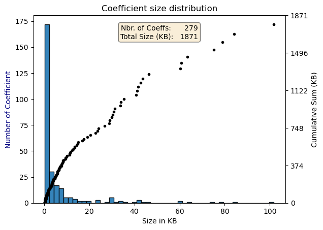



<h3 style="margin-top:5mm; margin-left: -10mm; margin-right: -10mm;">
	<b style="margin-top:15mm; font-size: 32pt; text-transform: none;">
	   Analytic Structure and Reconstruction in QCD: Two-Loop $\boldsymbol{pp \to Vjj}$ and One-Loop $\boldsymbol{q\bar{q}\rightarrow t\bar{t}H}$
	</b>
</h3>

Giuseppe De Laurentis
 

 University of Edinburgh 

 
Vjj: <a href="https://arxiv.org/abs/2503.10595">arXiv:2503.10595</a> 
 (GDL, H. Ita, B. Page, V. Sotnikov) 

ttH: <a href="https://arxiv.org/abs/2504.19909">arXiv:2504.19909</a> 
 (J. Campbell, GDL, K. Ellis) 

LoopFest XXIII

 Edmonton, CA 

  
   
Find these slides at  <a href="/slides/sm@lhc_may2025/#/">gdelaurentis.github.io/slides/loopfest_may2025</a> 

---

<section>



# Introduction

---

<b style="font-variant: small-caps; font-size: 32pt; margin-top: 2mm; margin-bottom: 0mm;">Phenomenological Motivation</b>

     $\circ\,$ $pp\rightarrow Vjj$ (or similarly $e^+e^-\rightarrow V \rightarrow 4j$) is important for several EW precision measurements

<!-- Static background image (fades via fragment) -->

     <!-- Fragment 1: full-opacity image -->
     

          
     

     <!-- Fragment 2: faded image and content -->
     

          
     

     <!-- Main text container (shown at same time as faded background) -->
     

          

          $\rightarrow\,$ Theoretical uncertainties are already larger than experimental ones,
          
          <a style="font-size: large; text-align: right; float: right; margin-top: -6mm;" href="https://inspirehep.net/literature/2808096">
          ATLAS Collab. '24
          </a>
          

          

          $\rightarrow\,$ NNLO is essential for agreement with experiment,
          <a style="font-size: large; text-align: right; float: right; margin-top: 5mm;" href="https://arxiv.org/abs/2404.08598">
          Mazzitelli, 

 Sotnikov, 

 Wiesemann '24
          </a>
          
          

          Other studies at NNLO only for $q\bar q'\rightarrow Wb\bar b, \; \text{e.g. no} \; gg\rightarrow Wq\bar q'$ despite available amps
          

          <a style="font-size: large; text-align: right; float: right; margin-top: -1mm; margin-bottom: -3mm;" href="https://arxiv.org/abs/2212.04954">
          $\,$Buonocore, Devoto, Kallweit, Mazzitelli, Rottoli, Savoini '22;
          </a>
          <a style="font-size: large; text-align: right; float: right; margin-top: -1mm; margin-bottom: -3mm;" href="https://arxiv.org/abs/2205.01687">
          Hartanto, Poncelet, Popescu, Zoia '22;$\,$
          </a>
          

     

     $\circ\,$ $pp\rightarrow ttH$ of interest primarily for direct access to top Yukawa $y_t$ (but also CP, EFTs, 2HDM, etc.)  
     $\phantom{\circ}\,$ current N$^2$LO pheno. relies on approx. amplitudes
     <a style="font-size: large; text-align: right; float: right; margin-top: 0mm; margin-bottom: -3mm;" href="https://arxiv.org/abs/2210.07846">
     Catani, Devoto, Grazzini, Kallweit, Mazzitelli, Savoini '22;$\,$
     </a>
     <a style="font-size: large; text-align: right; float: right; margin-top: -3mm; margin-bottom: -3mm;" href="https://arxiv.org/abs/2411.15340">
     Devoto, Grazzini, Kallweit, Mazzitelli, Savoini '24;$\,$
     </a>

---

<b style="font-variant: small-caps; font-size: 32pt"> Theoretical Motivation </b>

     $\circ\,$ Status for Drell-Yan plus jets (Vjj)

     

          $\;\star\,$ Limited knowledge at higher loops/points;  
          $\;\star\,$ All amplitudes in the lower triangle contribute    
          $\;\phantom{\star}\,$ at a given perturbatifve order;   
          $\;\star\,$ Pheno can be hindered by complexity of results,   
          $\;\phantom{\star}\,$ especially if IR cancellations are needed;   
          $\;\star\,$ E.g. the two-loop amps of [5] were >1GB of files.   
          $\circ\,$ Goal: reduce complexity of [5] by manifesting the analytic structure to facilitate future computations
     

     

          <table style="border-collapse: collapse; text-align: center; margin-top: 1mm; font-size: 14pt;">
               <tr>
                    <td style="border: 1px solid black; padding: 5px; text-align: center;">3</td>
                    <td style="border: 1px solid black; padding: 5px; background-color: #FFD700; text-align: center;">
                    2023 <a href="https://arxiv.org/abs/example8">[6]</a>
                    </td>
                    <td style="border: 1px solid black; padding: 5px; background-color: #FF7F7F; text-align: center;">
                    ?
                    </td>
                    <td style="border: 1px solid black; padding: 5px; background-color: #FF7F7F; text-align: center;">
                    ?
                    </td>
               </tr>
               <tr>
                    <td style="border: 1px solid black; padding: 5px; text-align: center;">2</td>
                    <td style="border: 1px solid black; padding: 5px; background-color: #90EE90; text-align: center;">
                    2007 <a href="https://arxiv.org/abs/example7">[4]</a>
                    </td>
                    <td style="border: 1px solid black; padding: 5px; background-color: #FFD700; text-align: center;">
                    2021 <a href="https://arxiv.org/abs/2110.07541">[5]</a>
                    </td>
                    <td style="border: 1px solid black; padding: 5px; background-color: #FF7F7F; text-align: center;">
                    ?
                    </td>
               </tr>
               <tr>
                    <td style="border: 1px solid black; padding: 5px; text-align: center;">1</td>
                    <td style="border: 1px solid black; padding: 5px; background-color: #90EE90; text-align: center;">
                    1981 <a href="https://arxiv.org/abs/example6">[1]</a>
                    </td>
                    <td style="border: 1px solid black; padding: 5px; background-color: #90EE90; text-align: center;">
                    1997 <a href="https://arxiv.org/abs/example10">[2]</a>
                    </td>
                    <td style="border: 1px solid black; padding: 5px; background-color:rgb(250, 255, 0); text-align: center;">
                    2008 <a href="https://arxiv.org/abs/example11">[3]</a>
                    </td>
               </tr>
               <tr>
                    <th style="border: 1px solid black; padding: 5px; text-align: center;">Loops ↑ Jets →</th>
                    <th style="border: 1px solid black; padding: 5px; text-align: center;">$1$</th>
                    <th style="border: 1px solid black; padding: 5px; text-align: center;">$2$</th>
                    <th style="border: 1px solid black; padding: 5px; text-align: center;">$\geq3$</th>
               </tr>
          </table>
          

               Analytic
                Numeric
               Analytic (LCA)
               Unknown
          

          

               

                    <a href="https://www.sciencedirect.com/science/article/abs/pii/0550321381901656?via%3Dihub">[1] Ellis, Ross, Terrano; </a>
                    <a href="https://arxiv.org/abs/hep-ph/9708239">[2] Bern, Dixon, Kosower;</a>
                    <a href="https://arxiv.org/abs/0803.4180">[3] BlackHat; </a><a href="https://arxiv.org/abs/1907.13071">OpenLoops; </a>
                    <a href="https://arxiv.org/abs/0711;.4711">[4] Gehrmann-De Ridder, Gehrmann, Glover, Heinrich; </a>
                    <a href="https://arxiv.org/abs/2110.07541">[5] Abreu, Febres Cordero, Ita, Klinkert, Page, Sotnikov </a> 
                    <a href="https://arxiv.org/abs/2503.10595" style="color:rgb(255, 149, 0);">+ This talk; </a>
                    <a href="https://arxiv.org/abs/2307.15405">[6] Gehrmann, Jakubčík, Mella, Syrrakos, Tancredi</a>
               

          

     

     $\circ\,$ Status for $pp\rightarrow t\bar tH$

     $\;\star\,$ one-loop: $q\bar q\rightarrow t\bar tH$ previously not known analytically;  
     $\kern15mm$ $gg\rightarrow t\bar t H$ known to $\mathcal{O}(\epsilon^2)$ in terms of form factors  
     <a style="font-size: large; text-align: right; float: right; margin-top: -5mm; margin-bottom: -3mm;" href="https://arxiv.org/abs/2312.10015">
     Buccioni, Kreer, Liu, Tancredi '23
     </a>
     $\;\star\,$ two-loop: $q\bar q\rightarrow t\bar tH$ with quark-loop ($n_f$ part), known numerically (<a href="https://secdec.readthedocs.io/en/stable/" style="font-variant: small-caps;">pySecDec</a>)  
     <a style="font-size: large; text-align: right; float: right; margin-top: -1mm; margin-bottom: -4mm;" href="https://arxiv.org/abs/2402.03301">
     Agarwal, Heinrich, Jones, Kerner, Klein, Lang, Magerya, Olsson '24
     </a>
     $\kern15mm$ $pp\rightarrow t\bar tH$ master integrals in LCA
     <a style="font-size: large; text-align: right; float: right; margin-top: -4mm; margin-bottom: -3mm;" href="https://arxiv.org/abs/2312.08131">
     Febres Cordero, Figueiredo, Kraus, Page, Reina '23
     </a>
     $\circ\,$ Goal: show how to reconstruct amplitudes in a manifestly spin- and little-group covariant form

</section>

---

<section>



<h1 style="margin-top: -2mm;"> Numerical Computation </h1>

---

<b style="font-variant: small-caps; font-size: xxx-large"> Partial Amplitudes & Finite Remainders </b>
 

     $\circ$ Amplitude (integrands) can be written as (for a suitable choice of master integrals)

 

     $$
     \displaystyle A(\lambda, \tilde\lambda, \ell) =
\sum_{\substack{\Gamma,\\ i \in M_\Gamma \cup S_\Gamma}} \, c_{\,\Gamma,i}(\lambda, \tilde\lambda, \epsilon) \,		\frac{m_{\Gamma,i}(\lambda\tilde\lambda, \ell)}{\textstyle \prod_{j} \rho_{\,\Gamma,j}(\lambda\tilde\lambda, \ell)} \;\; \xrightarrow[]{\int d^D\ell} \;\; \sum_{\substack{\Gamma,\\ i \in M_\Gamma}} \frac{ \sum_{k=0}^{\text{finite}} \, {\color{red}c^{(k)}_{\,\Gamma, i}}(\lambda, \tilde\lambda) \, \epsilon^k}{\prod_j (\epsilon - a_{ij})} \, {\color{orange}I_{\Gamma, i}}(\lambda\tilde\lambda, \epsilon)
$$  

     $\circ$  $\Gamma$: topologies $\quad\circ$ $M_\Gamma$: master integrands $\quad\circ$ $S_\Gamma$: surface terms 

     $\circ$ <u>All physical information</u> is contained in the <i>finite remainders</i>, at two loops

<a style="font-size: large; text-align: right; float: right; margin-top: -3mm; margin-bottom: -3mm;" href=https://inspirehep.net/literature/920274>
Weinzierl ('11)
</a>

$$ 
\underbrace{\mathcal{R}^{(2)}}_{\text{finite remainder}} = \mathcal{A}^{(2)}_R \underbrace{- \quad I^{(1)}\mathcal{A}^{(1)}_R \quad - \quad I^{(2)}\mathcal{A}^{(0)}_R}_{\text{divergent + convention-dependent finite part}} + \mathcal{O}(\epsilon)
$$

<a style="font-size: 13pt; float:right; text-align:right; margin-top:-18mm;" href=https://www.sciencedirect.com/science/article/abs/pii/S0370269398003323?via%3Dihub>
Catani ('98)
</a>
<a style="font-size: 13pt; float:right; margin-top:-13mm;" href=https://journals.aps.org/prl/abstract/10.1103/PhysRevLett.102.162001>
Becher, Neubert ('09)
</a>
<a style="font-size: 13pt; float:right; text-align:right; margin-top:-8mm;" href=https://arxiv.org/abs/0901.1091>
Gardi, Magnea ('09)
</a>

     $\phantom{\circ}$ $\mathcal{A}^{(1)}_R$ to order $\epsilon^2$ is still needed to build $\mathcal{R}^{(2)}$, but there is no real physical reason to reconstruct it.

     $\circ$ Finite remainder as a weighted sum of <i>pentagon functions</i> <a style="font-size: large; display: inline-block; text-align: right; float: right; margin-top: 0mm; margin-left: 4mm; " href=https://arxiv.org/abs/2009.07803> Chicherin, Sotnikov ('20) </a> <a style="font-size: large; display: inline-block; text-align: right; float: right; margin-top: -3mm; margin-left: 4mm; " href=https://arxiv.org/abs/2110.10111> Chicherin, Sotnikov, Zoia ('21) </a>

$$ 
\textstyle \mathcal{R}(\lambda, \tilde\lambda) = \sum_i \color{red}{r_{i}(\lambda,\tilde\lambda)} \, \color{orange}{h_i(\lambda\tilde\lambda)}
$$

     $\circ$  Goal: reconstruct $\color{red}{r_{i}(\lambda,\tilde\lambda)}$ from numerical samples in a field $\mathbb{F}$

<a style="font-size: large; text-align: right; float: right; margin-top: -10mm; margin-bottom: -10mm; margin-right: 24mm;" href=https://arxiv.org/abs/1406.4513>
$\mathbb{F}_p$: von Manteuffel, Schabinger ('14); 
</a> <a style="font-size: large; text-align: right; float: right; margin-top: -10mm; margin-bottom: 0mm;" href=https://arxiv.org/abs/1608.01902>
$\phantom{\mathbb{F}_p}$ Peraro ('16)
</a> 
<a style="font-size: large; text-align: right; float: right; margin-top: -17mm; margin-bottom: -10mm; margin-right: 43mm;" href=https://arxiv.org/abs/1406.4513>
$\mathbb{C}$: GDL, Maitre ('19);
</a> <a style="font-size: large; text-align: right; float: right; margin-top: -16.7mm; margin-bottom: -10mm;" href=https://arxiv.org/abs/1406.4513>
$\mathbb{Q}_p$: GDL, Page ('22)
</a>

---

<b style="font-variant: small-caps; font-size: 34pt; magin-bottom: -5mm;"> Setting up the Calculation </b>  

$\circ$ Original computation  <a href="https://arxiv.org/abs/hep-ph/9708239" style="font-size: 18pt">[1]</a> was performed with <code style="font-size: 17pt">Caravel</code>

     

	     $$
	     \require{color}
	     \displaystyle \sum_{\text{states}} \, \prod_{\text{trees}} A^{\text{tree}}(\lambda, \tilde\lambda, \ell)\big|_{\text{cut}_{\Gamma}} = \sum_{\substack{\Gamma' \ge \Gamma, \\ i \in M_\Gamma' \cup S_\Gamma'}} \kern-2mm {\color{black}{c_{\,\Gamma',i}(\lambda, \tilde\lambda)}} \, \frac{m_{\Gamma',i}(\lambda\tilde\lambda, \ell)}{\displaystyle \prod_{j\in P_{\Gamma'} / P_{\Gamma}} \rho_{j}(\lambda\tilde\lambda, \ell)}\Bigg|_{\text{cut}_\Gamma}
	     $$
	

     

	     

	     	  <code> C++ code </code>
	     
 
	     
	      
	     <a style="font-size: large; text-align: center; float: center; margin-top: -10mm; margin-bottom: 5mm;"
	     	href=https://arxiv.org/abs/2009.11957>
		
 Abreu, Dormans, 

		
 Febres Cordero, Ita  

		
 Kraus, Page, Pascual, 

		
 Ruf, Sotnikov ('20) 

	     </a>
	

     

	     $\star$ Numerical Berends-Giele recursion for LHS, solve for coeffs. in RHS. 
	     $\star$ IBP reduction = decomposition on RHS, $\; m_{\Gamma,i} \in M_\Gamma \cup S_\Gamma$
	

     $\circ$ This computation started from the ancillaries files of <a href="https://arxiv.org/abs/hep-ph/9708239" style="font-size: 14pt">[1] Abreu, Febres Cordero, Ita, Klinkert, Page, Sotnikov</a>
     

	     1. Wrote a Python script to split the 1.4 GB ancillaries into >10k files  
	     2. Compile into 18.2 GB of C++ binaries (for reference <code style="font-size: 17pt">Caravel</code> compiles into approx. 5 GB)  
          3. Obtain $\mathbb{F}_p$ evaluations of the form factors (each takes approx. 1 sec per point) 
          4. Recombine triplets of form factors into helicity amplitudes
	

$\rightarrow$ Assemble 5 helicity amplitudes into 3 categories: $\mathcal{R}_{\bar qQ\bar QqV}^{\text{NMHV}} ,\, \mathcal{R}_{\bar qggqV}^{\text{MHV}} ,\, \mathcal{R}_{\bar qggqV}^{\text{NMHV}}$

</section>

---

<section >



    

# Analytic & Geometric Structure

   

algebro-geometric formulation for physicists in:  
[GDL, Page (JHEP 12 (2022) 140)](https://arxiv.org/abs/2203.04269)

see also Sturmfeld et al. "Spinor-Helicity Varieties":  
[arXiv:2406.17331](https://arxiv.org/abs/2406.17331)

---

<b style="font-variant: small-caps; font-size: 32pt; margin-bottom: 0mm;"> Guiding Principles </b>

     $\circ$ Amplitude should be gauge and Lorentz invariant, and spin and little-group covariant

     ${\color{red} ✗}$ gauge dependence, e.g. through reference vectors  

     ${\color{red} ✗}$ tensor decompositions $\epsilon_\mu T^\mu$, polarizations are needed for simplifications

     ${\color{greeN} ✓}$ $\epsilon_\mu \rightarrow \epsilon_{\alpha\dot\alpha}$, $P^\mu \rightarrow  \lambda_\alpha \tilde\lambda_{\dot\alpha}$; all $\alpha, \dot\alpha$ indices contracted; all $\lambda, \tilde\lambda$ random (subject to mom cons)

     $\circ$ The singularity structure should be manifest in $\mathbb{C}$ (exprs will then be better behaved in $\mathbb{R}$ too)

     ${\color{red} ✗}$ Rational reparametrisations of the kinematics change the denominator structure

     ${\color{red} ✗}$ Forcing unphysical splits misses cancellations (e.g. even nor odd separation)

     ${\color{greeN} ✓}$ Chiral cancellations are required to obtain the true Least Common Denominator

     ${\color{greeN} ✓}$ Work off the real slice: $P^\mu \in \mathbb{C}^4$, $\lambda_\alpha \neq \tilde\lambda_{\dot\alpha}^\dagger$. In practice, $P^{\mu=y}\in i\mathbb{Q}\Rightarrow \lambda_{\alpha} \in \mathbb{F}_p \text{ or } \mathbb{Q}_p$

     $\circ$ Focus only on final physical expressions

     ${\color{red} ✗}$ Unphysical intermediate steps may be unnecessarily complicated

     ${\color{red} ✗}$ Analytic manipulations at this complexity are unfeasible, even on "physical" results

     ${\color{greeN} ✓}$ Bypass all intermediate steps with numerical evaluations (cancellations happen numerically)

---

<b style="font-variant: small-caps; font-size: 32pt; margin-bottom: 2mm;"> Trade-offs and Challenges </b>

     $\circ$ We must work with <u>variables subject to constrains</u>; the language is that of algebraic geometry.

     $\phantom{\circ}$ The covariant rings are

$$ 
\displaystyle \kern10mm R_{Vjj} = \mathbb{F}\big[|1⟩_{\alpha}, [1|_{\dot\alpha}, |2⟩_{\alpha}, [2|_{\dot\alpha}, |3⟩_{\alpha}, [3|_{\dot\alpha},  |4⟩_{\alpha}, [4|_{\dot\alpha}, [5|_{\dot\alpha}, |6⟩_{\alpha} \big] \Big/ \big\langle {\textstyle \sum_{i=1}^4} [5|i]\langle i |6\rangle \big\rangle
$$

     $\phantom{\circ}$ where we took the the $V$ current to be $[5|\gamma^\mu|6\rangle$ and removed $5_{\alpha\dot\alpha}$ by mom. cons.; and

$$ 
\displaystyle \kern10mm R_{ttH} = \frac{\mathbb{F}\big[|1⟩_{\alpha}, [1|_{\dot\alpha}, |2⟩_{\alpha}, [2|_{\dot\alpha}, |\boldsymbol{3}^I⟩_{\alpha}, [\boldsymbol{3}^I|_{\dot\alpha}, |\boldsymbol{4}_J⟩_{\alpha}, [\boldsymbol{4}_J|_{\dot\alpha}, \boldsymbol{5}_{\alpha\dot\alpha} \big]}{\big\langle \sum_{i=1}^5 |i\rangle[i|, \langle \boldsymbol{3}|\boldsymbol{3}⟩ +[\boldsymbol{3}|\boldsymbol{3}], \langle \boldsymbol{3}|\boldsymbol{3}⟩-\langle \boldsymbol{4}|\boldsymbol{4}⟩, \langle \boldsymbol{4}|\boldsymbol{4}⟩ +[\boldsymbol{4}|\boldsymbol{4}]\big\rangle}
$$

     $\phantom{\circ}$ where $\langle \boldsymbol{3}^I|\boldsymbol{3}^J⟩=m\epsilon^{JI} \text{ and } [\boldsymbol{3}^I|\boldsymbol{3}^J⟩=\bar{m}\epsilon^{IJ}$; we are setting $m=\bar{m}$ and the tops on-shell.  
     $\phantom{\circ}$ <u>Note</u>: we need only reconstruct a single choice, say $I=J=1$, the other follow by covariance.

     $\circ$ Helicity amplitudes are Lorentz invariant; minimal ansätze are build in the invariant sub-rings

$$ 
\displaystyle \mathcal{R}_{Vjj} = \frac{\mathbb{F}\big[ \langle ij\rangle : \, 1\leq i< j\leq 6, i,j \neq 5, \; [ij] : 1\leq i< j\leq 5 \big]}{\big\langle {\textstyle \sum_{i=1}^4} [5|i]\langle i |6\rangle, 34 \text{ Schouten identities} \big\rangle}
$$

$$ 
\displaystyle \mathcal{R}_{ttH} = \mathbb{F}\big[ \underbrace{\langle 12\rangle, \langle \boldsymbol{3}1\rangle ... ⟨2|\boldsymbol{3}|2] ... ⟨2|\boldsymbol{3}|\boldsymbol{4}|2⟩}_{37\; \text{invariants}}
 \big]\Big/ \big\langle \underbrace{⟨2|\boldsymbol{3}|2]⟨2|\boldsymbol{4}1]-⟨2|\boldsymbol{3}|1]⟨2|\boldsymbol{4}|2]-[1|2]⟨2|\boldsymbol{3}|\boldsymbol{4}|2⟩, ...}_{\text{more than} \; 90 \; \text{generators}} \big\rangle
$$

---

     <b style="font-variant: small-caps; font-size: xxx-large"> Least Common Denominator </b>
     

     (i.e. geometry at codimension one)
     

     

          <!---
          

               $\circ$ Polynomials belong to the the covariant quotient ring of spinors,
          

          

               $$\displaystyle \kern10mm R_n = \mathbb{F}\big[|1⟩, [1|, \dots, |n⟩, [n|\big] \big/ \big\langle \sum_i |i⟩[i| \big\rangle$$
          

          --->
	     

                $\circ\,$ The rational functions $r_i$ belong to the field of fractions of $R_X$,
          

          

               $$
               \displaystyle r_i(|i\rangle,[i|) = \frac{\mathcal{N}(|i\rangle,[i|)}{\prod_j \mathcal{D}_j^{q_{ij}}(|i\rangle,[i|)} % \, , \quad r_i(|i\rangle,[i|) \in \text{Frac}(R_n)
               $$
          

          

                $\phantom{\circ}\,$ we obtain  $q_{ij}$ from a univariate slice  $\vec\lambda(t)$, which we can build  
                $\phantom{\circ}\,$ in any q-ring with Syngular: <code style="font-size: 14pt">Ring.univariate_slice</code>.
          

          

               $\circ\,$ The $\mathcal{D}_j$ are (mostly) related to the letters of the symbol alphabet
          

          <a style="font-size: 13pt; text-align: right; float: right; margin-top: -3mm; margin-bottom: 0mm;" href=https://arxiv.org/abs/1812.04586>
          Abreu, Dormans, Febres Cordero, Ita, Page ('18)
          </a>
           
          

               $
               \displaystyle \mathcal{D}_{Vjj} \subset \kern-3mm \bigcup_{\sigma \; \in \; \text{Aut}(R_6)} \sigma \circ \big\{ \langle 12 \rangle, \langle 1|2+3|1], \langle 1|2+3|4], s_{123}, \\[-2mm] \kern30mm \Delta_{12|34|56}, ⟨3|2|5+6|4|3]-⟨2|1|5+6|4|2] \big\}
               $
          

          

               $
               \displaystyle \mathcal{D}_{ttH} = \big\{ \langle 12 \rangle, [12], s_{123}, \dots, (s_{123}-m^2), \langle 1|\boldsymbol{3}|1], \dots, \\[2mm] \kern10mm \langle 1|\boldsymbol{3}|\boldsymbol{4}| 2 \rangle, \dots, \langle 1|\boldsymbol{3}|1+2|\boldsymbol{4}| 2], \dots, \Delta_{12|34|5}, \dots \Delta_{12|3|4|5} \big\}
               $
          

	

     

          
          

               Space has dimension $4n-4$,
          

          

               $\mathcal{D}_j = 0$ have dimension $4n-5$,
          

          

               $\vec\lambda(t)$'s have dimension 1.
          

     

    Poles & Zeros $\;\Leftrightarrow\;$ Irreducible Varieties $\;\Leftrightarrow\;$ Prime Ideals  
    <i style="font-size: 14pt; border-top: -8mm; border-bottom: -2mm;"> Physics $\kern18mm$ Geometry $\kern18mm$ Algebra </i>

---

<b style="font-variant: small-caps; font-size: xxx-large"> Basis Change from Laurent Coefficients </b>

     $\circ\,$ Change basis from a subset of the pentagon coefficients $r_{i \in \mathcal{B}}$ to $\mathbb{Q}$-linear combinations $\tilde r$,

 

     $$
     R = r_j h_j = r_{i\in \mathcal{B}} M_{ij} h_j = \tilde{r}_{i} \, O_{ii'}M_{i'j} \, h_j \, , \qquad O_{ii'}, M_{i'j}\in \mathbb{Q}
     $$

     [<a href="https://arxiv.org/abs/hep-ph/9708239" style="font-size: 14pt">6</a>] Abreu, Febres Cordero, Ita, Klinkert, Page, Sotnikov '21

     $\circ\,$ By Gaussian elimination, partition the space:

  

     $$
     \text{span}(r_{i \in \mathcal{B}}) = \underbrace{\text{column}(\text{Res}(r_{i \in \mathcal{B}}, \mathcal{D}_k^m))}_{\text{functions with the singularity}} \;\;\; \oplus \, \underbrace{\text{null}(\text{Res}(r_{i \in \mathcal{B}}, \mathcal{D}_k^m))}_{\text{functions without the singularity}}
     $$

     

	     

               $\circ\,$ Search for linear combinations that remove as many singularities as possible
          

           
          

               $$
               \kern12mm \displaystyle O_{i'i} = \bigcap_{k, m} \, \text{nulls}(\text{Res}(r_{i \in \mathcal{B}}, \mathcal{D}_k^m))
               $$
          

	

     

          
     

</section>

---

<section>



      

# Analytic Reconstruction

       

---

     <b style="font-variant: small-caps; font-size: 32pt"> Reconstruction from Conjectured Properties </b>
     

     (for planar five-point one-mass amplitudes - all properties checked a posteriori)
     

     $\circ\,$ Denominator pairs $\{\mathcal{D}_i, \mathcal{D}_j\}$ can be <i>cleanly separated</i>:

     $$
     \frac{\mathcal{N}}{\mathcal{D}_i^{q_i}\mathcal{D}_j^{q_j}\mathcal{D}_{\text{rest}}} \rightarrow \frac{\mathcal{N}_i}{\mathcal{D}_i^{q_i}\mathcal{D}_{\text{rest}}} + \frac{\mathcal{N}_j}{\mathcal{D}_j^{q_j}\mathcal{D}_{\text{rest}}}
     $$

     $\phantom{\circ}\,$ Examples of $\{\mathcal{D}_i, \mathcal{D}_j\}$ are:

     $\qquad\star\,$ Any pairs of $s_{ijk}$ or $\Delta_{ij|kl|mn}$ or $\langle i|j|p_V|k|i]-\langle j|l|p_V|k|j]$  
     $\qquad\star\,$ Any conjugate pair $\{\langle i|j+k|l], \langle l|j+k|i]\}$ or cyclic $\{\langle i|j\rangle, [i|j]\}$  
     $\qquad\star\,$ Pairs of the form $\{\Delta_{ij|kl|mn}, \langle c|a+b|d] \text{ or } \langle ab \rangle \text{ or } [ab] \}$ unless $\{ab\}$ are $\{ij\}$ or $\{kl\}$ or $\{mn\}$

     $\circ\,$ Other denominator pairs $\{\mathcal{D}_i, \mathcal{D}_j\}$ can be <i>separated to order $\kappa$</i> 

     $$
     \frac{\mathcal{N}}{\mathcal{D}_i^{q_i}\mathcal{D}_j^{q_j}\mathcal{D}_{\text{rest}}} \rightarrow \sum_{\kappa - q_j\leq m \leq q_i}\frac{\mathcal{N}_i}{\mathcal{D}_i^{m}\mathcal{D}_j^{\kappa - m}\mathcal{D}_{\text{rest}}}
     $$

     $\qquad\star\,$ E.g. $\Delta_{ij|kl|mn}^4, \langle i|k+l|j]^5$ are separable to order 5.

     ${\color{greeN} ✓}$ Reconstruction only required 50k $\mathbb{F}_p$ samples $\;{\color{greeN} ✓}$Already simpler than original ones ($\sim$20MB)  
     $\;{\color{red} ✗}$ Results are unstable and sub-optimal, e.g. numbers like this appeared

127187555379407704220939486282289348327703498501718808908391691454242601886997968263623652083189652150273

---

     <b style="font-variant: small-caps; font-size: 32pt"> Iterated Pole Subtraction </b>
     

     (i.e. geometry at codimension greater than one)
     

<a style="font-size: large; text-align: right; float: right; margin-top: -18mm; margin-bottom: -10mm;" href=https://arxiv.org/abs/1904.04067>
   GDL, Maître ('19)
</a>
<a style="font-size: large; text-align: right; float: right; margin-top: -13mm; margin-bottom: -10mm;" href=https://arxiv.org/abs/2203.04269>
   GDL, Page ('22)
</a>
<a style="font-size: large; text-align: right; float: right; margin-top: -8mm; margin-bottom: -10mm;" href=https://arxiv.org/abs/2312.03672>
   Chawdhry ('23)
</a>

     $\circ$ Multivariate partial fraction decompositions follow from varieties where pairs of denominator factors vanish

$$ 
\frac{\mathcal{N}}{\mathcal{D}_1\mathcal{D}_2} \stackrel{?}{=}
 \frac{\mathcal{N}_2}{\mathcal{D}_1} + \frac{\mathcal{N}_1}{\mathcal{D}_2} \; \Longleftrightarrow \; \mathcal{N} \stackrel{?}{\in} \big\langle \mathcal{D}_1, \mathcal{D}_2 \big\rangle \, \text{ i.e. } \; \mathcal{N} \stackrel{?}{=} \mathcal{N}_1 \mathcal{D}_1 + \mathcal{N}_2 \mathcal{D}_2
$$

    

        
        

          $\langle xy^2 + y^3 - z^2 \rangle$
        

    

    

        $\cap$
    

    

        
        

          $\langle x^3 + y^3 - z^2 \rangle$
        

    

    

        $=$
    

    

        
        

          $\begin{gather}\langle 2y^3-z^2, x-y \rangle \cap \langle y^3-z^2, x \rangle \cap \langle z^2, x+y \rangle\end{gather}$ 
        

    

$\circ\,$ Retain control by iteratively fitting residues on varieties (using $p$-adic numbers $\mathbb{Q}_p$, get $\mathbb{F}_p$ vals for nums)

$$ 
\begin{alignedat}{2}
& r^{(139 \text{ of } 139)}_{\bar{u}^+g^+g^-d^-(V\rightarrow \ell^+ \ell^-)} = & \qquad\qquad & {\small \text{Variety (scheme?) to isolate term(s)}} \\[2mm]
& +\frac{7/4{\color{blue}(s_{24}-s_{13})}⟨6|1+4|5]s_{123}{\color{green}(s_{124}-s_{134})}}{⟨1|2+3|4]⟨2|1+4|3]^2 Δ_{14|23|56}} + ... & \qquad\qquad & \Big\langle ⟨2|1+4|3]^2, Δ_{14|23|56} \Big\rangle \\[1mm]
% & -\frac{49/64⟨3|1+4|2]⟨6|1+4|5]s_{123}(s_{123}-s_{234})(s_{124}-s_{134})}{⟨1|2+3|4]⟨2|1+4|3]Δ^2_{14|23|56}} + \dots & \qquad\qquad & \Big\langle Δ_{14|23|56} \Big\rangle
\end{alignedat}
$$

$\circ\,$ Partial fraction decomposition and numerator insertions from e.g.:

     $$
     \sqrt{\big\langle ⟨2|1+4|3], Δ_{14|23|56} \big\rangle} = \big\langle {\color{green}(s_{124}-s_{134})}, ⟨2|1+4|3] \big\rangle \, , \\[1mm] 
     \big\langle ⟨1|2+3|4], ⟨2|1+4|3] \big\rangle = \big\langle ⟨1|2+3|4], ⟨2|1+4|3], {\color{blue}(s_{13}-s_{24})}\big\rangle \cap \big\langle ⟨12⟩, [34] \big\rangle
     $$

---

     <b style="font-variant: small-caps; font-size: 32pt"> Core Tools - Fully Open Source </b>

     For fleshed out examples see e.g. <a href=https://inspirehep.net/literature/2661970> GDL (ACAT '22)</a> or <a href="https://arxiv.org/abs/2504.19909">Appendix B of 2504.19909</a>

     Install from github (<code style="font-size:14pt;">git clone</code>) or PyPI (<code style="font-size:14pt;">pip install</code>); use of Jupyter is recommended.

     $\circ$ <a href="https://github.com/GDeLaurentis/pyadic/" style="font-size: 20pt; font-variant: small-caps;">pyadic</a> 
     $\quad\rightarrow$ Finite fields $\mathbb{F}_p$ and $p$-adic number types $\mathbb{Q}_p$, including field extensions  
     $\quad\rightarrow$ rational number reconstruction (Wang's EEA, LGRR, MQRR)  
     $\quad\rightarrow$ univariate and multivariante Newthon & univariate Thiele interpolation algorithms in $\mathbb{F}_p$

     $\circ$ <a href="https://github.com/GDeLaurentis/syngular/" style="font-size: 20pt; font-variant: small-caps;">syngular</a> (in the backhand Singular is used for many operations) 
     $\quad\rightarrow$ object-oriented algebraic geometry (Field, Ring, Quotient Ring, Ideal)  
     $\quad\rightarrow$ ring-agnostic monomials and polynomials (with support for unicode characters, e.g. spinor brackets) 
     $\quad\rightarrow$ multivariate solver (Ideal.point_on_variety), under- and over-constrained systems OK  
     $\quad\rightarrow$ a semi-numerical prime and primary ideal test (assumes equi-dimensionality of ideal)

     $\circ$ <a href="https://github.com/GDeLaurentis/lips/" style="font-size: 20pt; font-variant: small-caps;">lips</a> (Lorentz invariant phase space) 
     $\quad\rightarrow$ phase space points over any field ($Q, Qi, R, C, Qp, Fp$), including internal and external masses  
     $\quad\rightarrow$ evaluate any Mandelstam or spinor expression (custom ast/regex parser)  
     $\quad\rightarrow$ generation of any special kinematic configuration (wrapper around Ideal.point_on_variety)

</section>

---

<section>



# Conclusion

---

<b style="font-variant: small-caps; font-size: 36pt; margin-bottom: -6mm;"> Spinor-Helicity Amplitudes Results </b>
 

     $\circ$ The $pp\rightarrow Vjj$ coefficient functions are now 1.9 MB (from 1.4 GB), fast and stable.  
     $\phantom{\circ}$ Matrices $M_{ij}$ account for another 2 MB overall. Transcendental basis at <a href="https://gitlab.com/pentagon-functions/PentagonFunctions-cpp">PentagonFunctions++</a>.

    

        
    

    

        
    

     $\circ$ The complexity split is: quarks NMHV: 100 KB, gluons MHV: 200 KB, gluons NMHV: 1.6 MB.

     $\circ$ The largest numbers are: quarks NMHV and gluons MHV: 3-digit, gluons NMHV: 12 digits.

     $\circ$ Pheno ready results for the hard functions are available at <a href="https://gitlab.com/five-point-amplitudes/FivePointAmplitudes-cpp">FivePointAmplitudes</a>.

     $\circ$ Amplitudes at <a href="https://github.com/GDeLaurentis/antares-results">antares-results</a>, with <a href="https://gdelaurentis.github.io/antares-results/index.html">human readable expr.</a>, and <a href="https://github.com/GDeLaurentis/antares-results/actions/">CI tests</a> for full amplitude in real kinematics

---

<b style="font-variant: small-caps; font-size: 34pt; margin-bottom: -6mm;"> A Numerical CAS for Computations in Q-Rings </b>
 

     $\circ$ Most operations do not require defining the variables, only being able to evaluate them.

     $\circ$ Only need to define the quotient ring to build the Ansatz (and even then not having anlytic identities for the redundancies is not a big problem)

     $\circ$ <a href="https://github.com/GDeLaurentis/antares/" style="font-size: 20pt; font-variant: small-caps;">antares</a> (automated numerical to analytical reconstruction software), <a href="https://github.com/GDeLaurentis/antares-results/" style="font-size: 20pt; font-variant: small-caps;">antares-results</a>, <a href="https://gdelaurentis.github.io/antares-results/">documentation</a>

    

        
    

</section>

---

<section>



<b style="font-variant: small-caps; font-size: xxx-large;"> Thank you   for your attention! </b>
 
 
<!---
<b style="font-variant: small-caps; font-size: xx-large;"> Questions? </b>
--->

    These slides are powered by: 
    
        <a href="https://en.wikipedia.org/wiki/Markdown">markdown</a>, 
        <a href="https://en.wikipedia.org/wiki/HTML">html</a>, 
        <a href="https://revealjs.com/">revealjs</a>, 
        <a href="https://gohugo.io/">hugo</a>, 
        <a href="https://www.mathjax.org/">mathjax</a>, 
        <a href="https://github.com/">github</a>
    

<!---
 

     For open source packages: 
     <code>
          $   $ pip install [lips](https://github.com/GDeLaurentis/lips) [pyadic](https://github.com/GDeLaurentis/pyadic)
     </code>

--->

</section>

---

<section>

# Backup Slides

---

<b style="font-variant: small-caps; font-size: xxx-large"> The Numerator Ansatz </b>

$\circ\,$ The numerator Ansatz takes the form

<a style="font-size: large; text-align: right; float: right; margin-top: -6mm; margin-bottom: 4mm;" href=https://arxiv.org/abs/1904.04067>
   GDL, Maître ('19)
</a>

$\displaystyle \text{Num. poly}(\lambda, \tilde\lambda) = \sum_{\vec \alpha, \vec \beta} c_{(\vec\alpha,\vec\beta)} \prod_{j=1}^n\prod_{i=1}^{j-1} \langle ij\rangle^{\alpha_{ij}} [ij]^{\beta_{ij}}$

     $\phantom{\circ}$ subject to constraints on $\vec\alpha,\vec\beta$ due to: 1) mass dimension; 2) little group; 3) linear independence.

 

$\circ\,$ Construct the Ansatz via the algorithm from Section 2.2 of <a href=https://arxiv.org/abs/2203.04269>GDL, Page ('22)</a>

Linear independence = irreducibility by the Gröbner basis of a specific ideal.

$\circ\,$ Efficient implementation using open-source software only

	

	       
	     Gröbner bases $\rightarrow$ constrain $\vec\alpha,\vec\beta$  
	     <a style="font-size: large; text-align: center; float: center; margin-top: -10mm; margin-bottom: 5mm;"
	     href=https://www.singular.uni-kl.de/index.php.html>
		Decker, Greuel, Pfister, Schönemann
	     </a>	    
	

	

	       
	     Integer programming $\rightarrow$ enumerate sols. $\vec\alpha,\vec\beta$  
	     <a style="font-size: large; text-align: center; float: center; margin-top: -10mm; margin-bottom: 5mm;"
	     href=https://www.singular.uni-kl.de/index.php.html>
		Perron and Furnon (Google optimization team)
	     </a>
	

    

$\circ\,$ Linear systems solved w/ CUDA over $\mathbb{F}_{2^{31}-1}$ ($t_{\text{solving}} \ll t_{\text{sampling}}$) w/ <a href=https://github.com/GDeLaurentis/linac-dev> linac </a>  (coming soon-ish) 

</section>

<!-- REVEAL.JS CUSTOMIZATION -->

<!-- Include MathJax library -->

<!-- Include Reveal.js and the Math plugin -->

<!-- Initialize Reveal.js with the MathJax plugin -->

