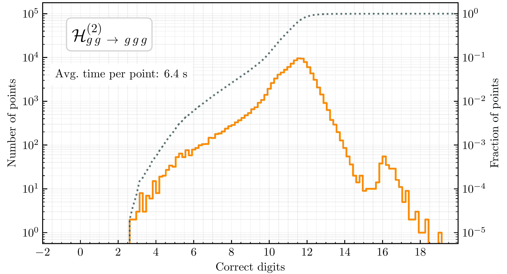
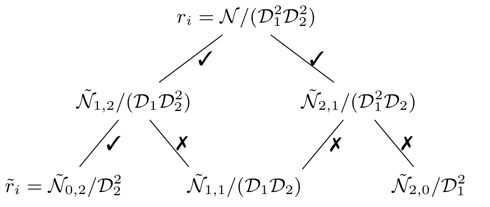
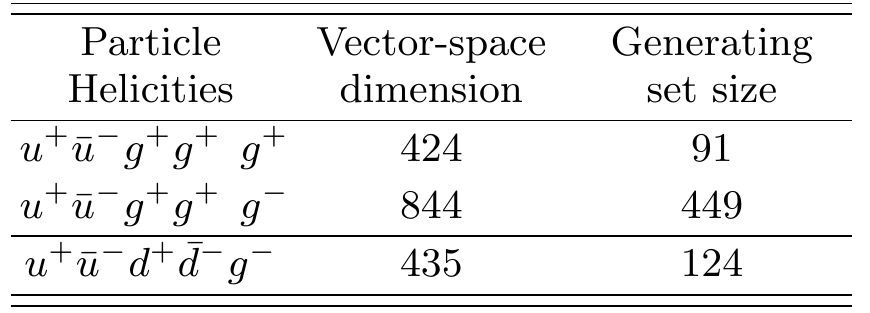



<h3 style="margin-top:5mm; margin-left: -10mm; margin-right: -10mm;">
	<b style="margin-top:15mm; font-size: 28pt;">
	   Non-Planar Two-Loop Amplitudes  
	   for Five-Parton Scattering
	</b>
</h3>

Giuseppe De Laurentis
 

 University of Edinburgh 

 
<a href="https://arxiv.org/abs/2311.10086">arXiv:2311.10086</a> 
 (GDL, H. Ita, M. Klinkert, V. Sotnikov) 

<A href="https://arxiv.org/abs/2311.18752">arXiv:2311.18752</a> 
 (GDL, H. Ita, V. Sotnikov) 

<!--- Amplitudes Meeting --->
Loops & Legs 2024
 

  
  
Find these slides at  <a href="/slides/fivepartons_dec2023/#/">gdelaurentis.github.io/slides/loopslegs_apr2024</a> 

---

<section>



# Introduction

---

<b style="font-variant: small-caps; font-size: 32pt; margin-bottom: -5mm;"> Overview </b>

    

        
    

    

        
    

     $\circ\,$ LHC physics program possible also thanks to advancements on many fronts of the theory

 

  

       Subtraction    Pikelner, Pedron, Guadagni, Magnea, van Hameren, Vicini, $\dots$  
       Renomalization / $\gamma^5$-schemes    Gracey, Heinrich, Weißwange, Kühler, Stöckinger$\dots$  
       Feynman Integrals    Chaubey, Behring, Nega, Jones, Page, Broadhurst, $\dots$ 
  

  

       Three / Four / Five Loops     Bluemlein, Yang, Moch, Schönwald, Maier, $\dots$   
       $\sigma$'s at N$^{(2-3)}$LO    Sotnikov, Neumann, Chen, Mella, Savoini, $\dots$   
       Automation    Lange, Shtabovenko, Zoller$\dots$ 
  

  

       Higgses ($2 \rightarrow 2$ w/ masses)    Zhang, Davies, Kerner, $\dots$   
       Top-quark(s), internal or external   Vitti, Coro, Wang, Magerya, $\dots$   
       Resummation    Novikov, Andersen, Li, $\dots$ 
  

    

    And much more! Also, lines between various subfields often very blurry!

    This talk: fixed order, 2 loops and 5 legs.

---

<b style="font-variant: small-caps; font-size: 32pt"> Precision Physics Requires NNLO Corrections </b>

     $\circ\,$ K-factors at NNLO can still be large, especially if new channels open up beyond tree, e.g. $\sigma^{\text{NNLO}}_{pp\rightarrow \gamma\gamma\gamma}$

  

       
       <a style="font-size: large; text-align: center; float: center; margin-top: -10mm; margin-bottom: 0mm;" href=https://arxiv.org/abs/1911.00479>
       	  Chawdhry, Czakon, Mitov, Poncelet ('19)
       </a>
  

  

       
       <a style="font-size: large; text-align: center; float: center; margin-top: -10mm; margin-bottom: 0mm;" href=https://arxiv.org/abs/2010.04681>
       	  Kallweit, Sotnikov, Wiesemann ('20)
       </a>
  

     $\circ\,$ High-multiplicity two-loop amplitudes required because:

  

  

       $\qquad\star$ At high energy, some radiation is more likely than no radiation (resummation disrupts naive $\alpha_s$ counting)
  

  

       $\qquad\star$ As real-virtual(-virtual) contributions to emerging N$^3$LO computations (or N$^2$LO if loop-induced)
  

  

       $\qquad\star$ Some interesting kinematic regions are only accessible with extra radiation (e.g. $p_T$ distributions)
  

---

<b style="font-variant: small-caps; font-size: 32pt; margin-bottom: 25mm;"> Status of Two-Loop Five-Point Amplitudes </b>

<table>
    <thead>
        <tr>
            <th>Process</th>
            <th>Analytical Amplitudes</th>
            <th>Numerical Codes</th>
            <th>Cross Sections</th>
        </tr>
    </thead>
    <tbody>
        <tr class="double-line">
        </tr>
        <tr>
            <td>$pp \rightarrow \gamma\gamma\gamma$</td>
            <td>[3$\kern-2.2mm\phantom{x}^\star$, 4$\kern-2.2mm\phantom{x}^\star$, <b>5</b>]</td>
            <td>[3$\kern-2.2mm\phantom{x}^\star$, <b>5</b>]</td>
            <td>[1$\kern-2.2mm\phantom{x}^\star$, 2$\kern-2.2mm\phantom{x}^\star$]</td>
        </tr>
        <tr>
            <td>$pp \rightarrow \gamma\gamma j$</td>
            <td>[6$\kern-2.2mm\phantom{x}^\dagger$, 7$\kern-2.2mm\phantom{x}^\dagger$, <b>9</b>]</td>
            <td>[6$\kern-2.2mm\phantom{x}^\dagger$]</td>
            <td>[8$\kern-2.2mm\phantom{x}^\dagger$]</td>
        </tr>
        <tr>
            <td>$pp \rightarrow \gamma jj$</td>
            <td>[<b>10</b>]</td>
            <td></td>
            <td>[<b>10</b>]</td>
        </tr>
        <tr>
            <td>$pp \rightarrow jjj$</td>
            <td>[11$^\dagger$, <b>12</b>, <b>13</b>, <b>14</b>]</td>
            <td>[11$^\dagger$,<b>14</b>]</td>
            <td>[15$\kern-2.2mm\phantom{x}^\dagger$]</td>
        </tr>
        <tr class="double-line">
        </tr>
        <tr>
            <td>$pp \rightarrow Wb\bar b$</td>
            <td>[16$\kern-2.2mm\phantom{x}^\dagger$, 17$\kern-2.2mm\phantom{x}^\dagger$]</td>
            <td></td>
            <td>[18$\kern-2.2mm\phantom{x}^\dagger$]</td>
        </tr>
        <tr>
            <td>$pp \rightarrow Hb\bar b$</td>
            <td>[19$^{\dagger\ast}$]</td>
            <td></td>
            <td></td>
        </tr>
        <tr>
            <td>$pp \rightarrow Wj\gamma$</td>
            <td>[20$^\star$]</td>
            <td></td>
            <td></td>
        </tr>
        <tr>
            <td>$pp \rightarrow Wjj$</td>
            <td>[16$\kern-2.2mm\phantom{x}^\dagger$]</td>
            <td></td>
            <td></td>
        </tr>
        <tr class="double-line">
        </tr>
        <tr>
            <td>$pp \rightarrow ttH$</td>
            <td></td>
            <td></td>
            <td>[21]</td>
        </tr>
        <tr>
        </tr>
    </tbody>
</table>

Legend: <b>bold</b> = full color; $\star$ = planar $\neq$ leading color; $\dagger$ = planar = leading color; $\ast$ = ($y_b \neq 0$, $m_b = 0$)

 

    

        
<a href="https://inspirehep.net/literature/1762583" style="font-size: 13pt;">[1] Chawdhry, Czakon, Mitov, Poncelet '19</a>

        
<a href="https://inspirehep.net/literature/1827330" style="font-size: 13pt;">[3] Abreu, Page, Pascual, Sotnikov '20</a>

        
<a href="https://inspirehep.net/literature/2663067" style="font-size: 13pt;">[5] Abreu, GDL, Ita, Klinkert, Page, Sotnikov '23</a>

        
<a href="https://inspirehep.net/literature/1850624" style="font-size: 13pt;">[7] Chawdhry, Czakon, Mitov, Poncelet '21</a>

        
<a href="https://inspirehep.net/literature/1862813" style="font-size: 13pt;">[9] Agarwal, Buccioni, von Manteuffel, Tancredi '21</a>

        
<a href="https://inspirehep.net/literature/1849070" style="font-size: 13pt;">[11] Abreu, Febres Cordero, Ita, Page, Sotnikov</a>

        
<a href="https://inspirehep.net/literature/2723256" style="font-size: 13pt;">[13] GDL, Ita, Klinkert, Sotnikov '23</a>

        
<a href="https://inspirehep.net/literature/1868437" style="font-size: 13pt;">[15] Czakon, Mitov, Poncelet '21'</a>
 <!--- pp->jj - xsection LC --->
        
<a href="https://inspirehep.net/literature/1844767" style="font-size: 13pt;">[17] Badger, Hartanto, Zoia '21</a>
 <!--- pp->Wbb--->
        
<a href="https://inspirehep.net/literature/1896584" style="font-size: 13pt;">[19] Badger, Hartanto, Kryś, Zoia '21</a>
 <!--- pp->Hbb--->
        
<a href="https://inspirehep.net/literature/2165654" style="font-size: 13pt;">[21] Catani, Devoto, Grazzini, Kallweit, Mazzitelli, Savoini '22</a>
 <!--- pp->Hbb--->
    

    

        
<a href="https://inspirehep.net/literature/1822188" style="font-size: 13pt;">[2] Kallweit, Sotnikov, Wiesemann '20</a>

        
<a href="https://inspirehep.net/literature/1838380" style="font-size: 13pt;">[4] Chawdhry, Czakon, Mitov, Poncelet '20</a>

        
<a href="https://inspirehep.net/literature/1844579" style="font-size: 13pt;">[6] Agarwal, Buccioni, von Manteuffel, Tancredi '21</a>

        
<a href="https://inspirehep.net/literature/1863379" style="font-size: 13pt;">[8] Chawdhry, Czakon, Mitov, Poncelet '21</a>

        
<a href="https://inspirehep.net/literature/2651109" style="font-size: 13pt;">[10] Badger, Czakon, Hartanto, Moodie, Peraro, Poncelet, Zoia '23</a>

        
<a href="https://inspirehep.net/literature/2723232" style="font-size: 13pt;">[12] Agarwal, Buccioni, Devoto, Gambuti, von Manteuffel, Tancredi '23</a>

        
<a href="https://inspirehep.net/literature/2728739" style="font-size: 13pt;">[14] GDL, Ita, Sotnikov '23</a>

        
<a href="https://inspirehep.net/literature/1944964" style="font-size: 13pt;">[16] Abreu, Febres Cordero, Ita, Klinkert, Page, Sotnikov '21</a>
 <!--- pp->Wjj--->
        
<a href="https://inspirehep.net/literature/2077368" style="font-size: 13pt;">[18] Hartanto, Poncelet, Popescu, Zoia '22</a>
 <!--- pp->Wbb-xsection--->
        
<a href="https://inspirehep.net/literature/2008918" style="font-size: 13pt;">[20] Badger, Hartanto, Kryś, Zoia '22</a>
 <!--- pp->Wjy--->  
    
     

---

    

        

          <b style="font-variant: small-caps; font-size: xxx-large"> Full $N_C $ motivation</b>
        

        

        3 is not that big! And certainly not close to $\infty$
        

        
        

        Slc contributions to $pp\rightarrow jjj$ should be similar to blue curve.
        

        

        Expect $\mathcal{O}(10\%)$ effect on duble-virtual hard function,   this is scheme dependant.
        

        

        Effect on $\sigma^{\text{NNLO}}$ depends on size of $\mathcal{H}^{(2)}$.
        

    

    

        

          <b style="font-variant: small-caps; font-size: xxx-large"> Pheno. Goal</b>
        

        

        Stable and fast evaluations for cross sections
        

        
        

        <code> C++ </code> Code available at
        

        <a href="https://gitlab.com/five-point-amplitudes/FivePointAmplitudes-cpp" style="font-size: 14pt;">gitlab.com/five-point-amplitudes/FivePointAmplitudes-cpp</a>
        

        Analytics available at
        

        <a href="https://zenodo.org/records/10142295" style="font-size: 14pt;">zenodo.org/records/10142295</a> &
        <a href="https://zenodo.org/records/10231547" style="font-size: 14pt;">zenodo.org/records/10231547</a>
        

        with <code style="font-size: 14pt;">Mathematica</code>, <code style="font-size: 14pt;">Python</code> and <code style="font-size: 14pt;">C++</code> scripts.
        

    

</section>

---

<section>



<h1 style="margin-top: -2mm;"> Numerical Computation </h1>

---

<b style="font-variant: small-caps; font-size: xxx-large"> Color Algebra in the Trace Basis </b>

     

          \[
          \require{color}
          \require{amsmath}
          \hspace{-5mm}
          \begin{align}
               \mathcal{A}_{\vec{a}}(1_g,2_g,3_g,4_g,5_g) & = \sum_{\sigma \in \mathcal{S}_5/\mathcal{Z}_5} \sigma\Big(\text{tr}(T^{a_1}T^{a_2}T^{a_3}T^{a_4}T^{a_5}) \; A_{1}(1,2,3,4,5)\Big) \; + \\[2mm]
               & \quad \sum_{\sigma\in \frac{\mathcal{S}_5}{\mathcal{Z}_2 \times \mathcal{Z}_3}} \sigma\Big(\text{tr}(T^{a_1}T^{a_2}) \text{tr}(T^{a_3}T^{a_4}T^{a_5}) \; A_{2}(1,2,3,4,5)\Big) + , \\[8mm]
               \mathcal{A}_{\vec{a}}(1_u,2_{\bar u},3_g,4_g,5_g) & =
               \sum_{\sigma \in \mathcal{S}_3(3,4,5)} \sigma\Big(
               (T^{a_3}T^{a_4}T^{a_5})^{\,\bar i_2}_{i_1} \; 
               A_{3}(1,2,3,4,5)\Big) \; + \\[2mm]
               & \quad \sum_{\sigma \in \frac{\mathcal{S}_3(3,4,5)}{\mathcal{Z}_2(3,4)}} 
               \sigma\Big(\text{tr}(T^{a_3}T^{a_4}) (T^{a_5})^{\,\bar i_2}_{i_1} 
               \; A_{4}(1,2,3,4,5)\Big) \; + \\[2mm]
               & \quad \sum_{\sigma \in \frac{\mathcal{S}_3(3,4,5)}{\mathcal{Z}_{3}(3,4,5)}} 
               \sigma\Big(\text{tr}(T^{a_3}T^{a_4}T^{a_5}) \delta^{\bar i_2}_{i_1}
               A_{5}(1,2,3,4,5)\Big) \; , \\[8mm]
               \mathcal{A}_{\vec{a}}(1_u,2_{\bar u},3_d,4_{\bar d},5_g) &= 
               \sum_{\sigma \in \mathcal{Z}_2(\{1,2\},\{3,4\})} \sigma\Big(
               \delta^{\bar i_4}_{i_1} (T^{a_5})^{\,\bar i_2}_{i_3} 
               \; A_{6}(1,2,3,4,5)\Big) \; + \\[2mm]
               & \quad \sum_{\sigma \in \mathcal{Z}_2(\{1,2\},\{3,4\})} \kern-2mm \sigma\Big(
               \delta^{\bar i_2}_{i_1} (T^{a_5})^{\,\bar i_4}_{i_3} 
               \; A_{7}(1,2,3,4,5)\Big)\,,\kern-1mm
          \end{align}
          \]
     

     
      
     
      
     

              

Each $A_{i}$ has an expansion in powers of $\alpha_s$. We consider the $\alpha_s^2$ corrections.

---

     <b style="font-variant: small-caps; font-size: xxx-large; margin-bottom:0mm;"> Relations among Partials </b>

 

$\circ$ $N_c^{n_c}$ & $N_f^{n_f}$ expansion, notation $A^{(L),(n_c, n_f)}_{\text{partial}}$,  red  = new, $0\rightarrow q\bar q Q\bar Q g$ example

 

     \[
     \begin{gather}
          A_6^{(2)} = N_c^2 A_6^{(2),(2,0)} + {\color{red} A_6^{(2),(0,0)}} + \frac{1}{N_c^2} {\color{red} A_6^{(2),(-2,0)}}
               +  N_f N_c A_6^{(2),(1,1)} + \frac{N_f}{N_c} {\color{red} A_6^{(2),(-1,1)}} + N_f^2  A_6^{(2),(0,2)} \, , \\
          A_7^{(2)} = N_c {\color{red} A_7^{(2),(1,0)}}+\frac{1}{N_c}{\color{red} A_7^{(2),(-1,0)}}+\frac{1}{N_c^3}{\color{red} A_7^{(2),(-3,0)}}
               + N_f{\color{red} A_7^{(2),(0,1)}} + \frac{N_f}{N_c^2} {\color{red} A_7^{(2),(-2,1)}} + \frac{N_f^2}{N_c}{\color{red} A_7^{(2),(-1,2)}} \, .
     \end{gather}
     \]

 

$\circ$ New identities among partials (plus two more for the $n_f = 1$ partials) 

     \[\\[2mm]
     \Big\{ \big[ 16 \, A^{(2),(2,0)}_6\, (1,2,3,4,5) 
          + 4 \, A^{(2),(0,0)}_6\, (1,2,3,4,5) + 
          A^{(2),(-2,0)}_6(1,2,3,4,5) \big]
          - \big[\dots \big]_{3 \leftrightarrow 4} \Big\}
          - \Big\{ \dots \Big\}_{1 \leftrightarrow 2} = 0 \, .
     \]

     \[
     \begin{gather}
          \big[  32 \, A^{(2),(2,0)}_6\, (1,2,3,4,5) + 8 \, A^{(2),(0,0)}_6\, (1,2,3,4,5) + 2 A^{(2),(-2,0)}_6(1,2,3,4,5) \\
               + 16 \, A^{(2),(1,0)}_7\, (1,2,3,4,5) \, + 4 A^{(2),(-1,0)}_7( 1,2,3,4,5) + A^{(2),(-3,0)}_7 (1,2,3,4,5) \big]
               - \big[ \dots \big]_{3 \leftrightarrow 4}=  0 \, .
     \end{gather}
     \]

These redundancies do not affect the complexity of the calculation (see discussion on vector spaces).

---

<b style="font-variant: small-caps; font-size: xxx-large"> Partial Amplitudes & Finite Remainders </b>
 

     $\circ$ Amplitude (integrands) can be written as (for a suitable choice of master integrals)

 

     $$
     \displaystyle A(\lambda, \tilde\lambda, \ell) =
\sum_{\substack{\Gamma,\\ i \in M_\Gamma \cup S_\Gamma}} \, c_{\,\Gamma,i}(\lambda, \tilde\lambda, \epsilon) \,		\frac{m_{\Gamma,i}(\lambda\tilde\lambda, \ell)}{\textstyle \prod_{j} \rho_{\,\Gamma,j}(\lambda\tilde\lambda, \ell)} \;\; \xrightarrow[]{\int d^D\ell} \;\; \sum_{\substack{\Gamma,\\ i \in M_\Gamma}} \frac{ \sum_{k=0}^{\text{finite}} \, {\color{red}c^{(k)}_{\,\Gamma, i}}(\lambda, \tilde\lambda) \, \epsilon^k}{\prod_j (\epsilon - a_{ij})} \, {\color{orange}I_{\Gamma, i}}(\lambda\tilde\lambda, \epsilon)
$$  

     $\circ$  $\Gamma$: topologies $\quad\circ$ $M_\Gamma$: master integrands $\quad\circ$ $S_\Gamma$: surface terms 

     $\circ$ <u>All physical information</u> is contained in the <i>finite remainders</i>, at two loops

<a style="font-size: large; text-align: right; float: right; margin-top: -3mm; margin-bottom: -3mm;" href=https://inspirehep.net/literature/920274>
Weinzierl ('11)
</a>

$$ 
\underbrace{\mathcal{R}^{(2)}}_{\text{finite remainder}} = \mathcal{A}^{(2)}_R \underbrace{- \quad I^{(1)}\mathcal{A}^{(1)}_R \quad - \quad I^{(2)}\mathcal{A}^{(0)}_R}_{\text{divergent + convention-dependent finite part}} + \mathcal{O}(\epsilon)
$$

     $\phantom{\circ}$ $\mathcal{A}^{(1)}_R$ to order $\epsilon^2$ is still needed to build $\mathcal{R}^{(2)}$, but there is no real reason to reconstruct it.

     $\circ$ Finite remainder as a weighted sum of <i>pentagon functions</i> <a style="font-size: large; display: inline-block; text-align: right; float: right; margin-top: 2mm; margin-left: 4mm; " href=https://arxiv.org/abs/2009.07803> Chicherin, Sotnikov ('20);&nbsp; </a>

$$ 
\textstyle \mathcal{R}(\lambda, \tilde\lambda) = \sum_i \color{orange}{r_{i}(\lambda,\tilde\lambda)} \, \color{red}{h_i(\lambda\tilde\lambda)}
$$

     $\circ$  Goal: reconstruct $\color{orange}{r_{i}(\lambda,\tilde\lambda)}$ from $\mathbb{F}_p$ samples

<a style="font-size: large; text-align: right; float: right; margin-top: -10mm; margin-bottom: -10mm;" href=https://arxiv.org/abs/1406.4513>
von Manteuffel, Schabinger ('14)
</a> 
<a style="font-size: large; text-align: right; float: right; margin-top: -18mm; margin-bottom: 0mm;" href=https://arxiv.org/abs/1608.01902>
Peraro ('16)
</a>

---

<b style="font-variant: small-caps; font-size: xxx-large; magin-bottom:-2mm;"> Numerical Generalized Unitarity @ 2 Loops </b>
<a style="font-size: large; text-align: center; float: center; margin-right: 0mm; margin-top: -2mm; margin-bottom: 0mm;" href=https://arxiv.org/abs/1510.05626>
     Ita ('15)
</a>
<a style="font-size: large; text-align: center; float: center; margin-left:2mm; margin-right: 0mm; margin-top: -2mm; margin-bottom: 0mm;" href=https://arxiv.org/abs/1712.03946>
     Abreu, Febres Cordero, Ita, Page, Zeng ('17)
</a>

$\circ$ The integrand Ansatz is matched to products of trees on cuts

     

	     $$
	     \require{color}
	     \displaystyle \sum_{\text{states}} \, \prod_{\text{trees}} A^{\text{tree}}(\lambda, \tilde\lambda, \ell)\big|_{\text{cut}_{\Gamma}} = \sum_{\substack{\Gamma' \ge \Gamma, \\ i \in M_\Gamma' \cup S_\Gamma'}} \kern-2mm c_{\,\Gamma',i}(\lambda, \tilde\lambda) \, \frac{m_{\Gamma',i}(\lambda\tilde\lambda, \ell)}{\displaystyle \prod_{j\in P_{\Gamma'} / P_{\Gamma}} \rho_{j}(\lambda\tilde\lambda, \ell)}\Bigg|_{\text{cut}_\Gamma}
	     $$
	

     

	     

	     	  <code> C++ code </code>
	     
 
	     
	      
	     <a style="font-size: large; text-align: center; float: center; margin-top: -10mm; margin-bottom: 5mm;"
	     	href=https://arxiv.org/abs/2009.11957>
		
 Abreu, Dormans, 

		
 Febres Cordero, Ita  

		
 Kraus, Page, Pascual, 

		
 Ruf, Sotnikov ('20) 

	     </a>
	

     

	     $\star$ Numerical Berends-Giele recursion for LHS, solve for coeffs. in RHS.
	

     

	     $\star$ IBP reduction = decomposition on RHS, $\; m_{\Gamma,i} \in M_\Gamma \cup S_\Gamma $
	

$\circ$ The SLC cut-hierarchy is significantly larger than the LC one, e.g.

</section>

---

<section >



    

# Analytic and Geometric Structure

    

based on:  
[GDL, Page (JHEP 12 (2022) 140)](https://arxiv.org/abs/2203.04269)

---

<b style="font-variant: small-caps; font-size: 33pt;"> Fieds of Fractions of Polynomial Quotient Rings  </b>

     

	     

               $\circ$ Starting from polynomials, we have
          

          

               $\phantom{\circ}$ the covariant quotient ring of spinors
          

            
          

               $$\displaystyle \kern10mm R_n = \mathbb{F}\big[|1⟩, [1|, \dots, |n⟩, [n|\big] \big/ \big\langle \sum_i |i⟩[i| \big\rangle$$
          

          

               $\circ$ Lorentz invariants live in a sub-ring of $R_n$
          

           
          

               $$\displaystyle \kern4mm R_n \supset \mathcal{R}_n = \mathbb{F}\big[⟨1|2⟩, \dots, [n-1|n]\big] \big/ (\mathcal{J}_n + \mathcal{K}_n + \bar{\mathcal{K}}_n)$$
          

          

               $\phantom{\circ}$ where $\mathcal{J}_n$: momentum cons., $\;\stackrel{\tiny{(}\normalsize{-}\tiny{)}}{\mathcal{K}}_n$: shouten identities 
          

	

     

          
          

               Plot from LC $pp\rightarrow \gamma\gamma\gamma$ remainder in Born kinematics.
          

          

               The slopes <i>flatten out</i> in soft/collinear configurations.
          

     

 <!--- border: 2px solid black;  --->
    $r_i(\lambda, \tilde\lambda)$ at $n$-point belong to the field of fractions of $\mathcal{R}_{n>3}$

 

     $\circ$ This allows to manifes:

     $\kern8mm$ 1) that the singularities are $\approx \sqrt{s_{ij}}\kern10mm$ 2) the behaviour with $P^\mu \in \mathbb{C}$, i.e. away from $\langle ij \rangle = [ij]^{\ast}$

---

     <b style="font-variant: small-caps; font-size: xxx-large"> Least Common Denominator </b>
     

     (i.e. what happens at codimension one)
     

     

	     

                $\circ\,$ The rational coefficients take the form
          

            
          

               $$
               \displaystyle r_i(|i\rangle,[i|) = \frac{\mathcal{N}(|i\rangle,[i|)}{\prod_j D_j^{q_{ij}}(|i\rangle,[i|)}
               $$
          

          

               $\circ\,$ The $\mathcal{D}_j$ are related to the letters of the symbol alphabet
          

           
          <a style="font-size: large; text-align: right; float: right; margin-top: 0mm; margin-bottom: 0mm;" href=https://arxiv.org/abs/1812.04586>
          Abreu, Dormans, Febres Cordero, Ita, Page ('18)
          </a>
           
          

               $$
               \displaystyle \{\mathcal{D}_{\{1,\dots,35\}}\} = \bigcup_{\sigma \; \in \; \text{Aut}(R_5)} \sigma \circ \big\{ \langle 12 \rangle, \langle 1|2+3|1] \big\}
               $$
          

          

               $\kern0mm\color{green}\text{Identical to 1-loop!}$
          

	

     

          
          

               The codimension one variety 
          

          

               $\langle x^3 + y^3 - z^2 \rangle$ in $\mathbb{R}[x,y,z]$
          

     

     $\phantom{\circ}$ Non-trivial statement (not proven!): all irreducible polynomials generate prime ideals, @ 5-pt.

    Poles & Zeros $\;\Leftrightarrow\;$ Irreducible Varieties $\;\Leftrightarrow\;$ Prime Ideals  
    <i style="font-size: 12pt; border-top: -8mm; border-bottom: -2mm;"> Physics $\kern38mm$ Geometry $\kern38mm$ Algebra </i>

---

     <b style="font-variant: small-caps; font-size: 32pt"> Partial Fraction Decompositions </b>
     

     (i.e. what happens at codimension greater than one)
     

    

        
        

          $\langle xy^2 + y^3 - z^2 \rangle$
        

    

    

        $\cap$
    

    

        
        

          $\langle x^3 + y^3 - z^2 \rangle$
        

    

    

        $=$
    

    

        
        

          $\begin{gather}\langle 2y^3-z^2, x-y \rangle \cap \langle y^3-z^2, x \rangle \\ \cap \langle z^2, x+y \rangle\end{gather}$ 
        

    

     $\circ$ When is a partial fraction decomposition possible? (an example)

 

     $$\frac{\mathcal{N}}{(\prod_j \mathcal{D}_j^{q_j})\times\langle 4|1+3|4]\langle 5|1+4|5]} \stackrel{?}{=} \frac{\mathcal{N}_1}{(\prod_j \mathcal{D}_j^{q_j})\times\langle 4|1+3|4]} + \frac{\mathcal{N}_2}{(\prod_j \mathcal{D}_j^{q_j})\times\langle 5|1+4|5]}$$

     $\circ$ Compute primary decompositions

 

     $$
     J = \big\langle \langle 4|1+3|4], \langle 5|1+4|5] \big\rangle \qquad
     K = \big\langle \langle14\rangle,\langle15\rangle,\langle45\rangle,[23] \big\rangle \quad
     L = \big\langle \langle ij\rangle \; \forall \; i,j\in\{1,\dots 5\} \big\rangle \\[2mm]
     M = \big\langle \langle 4|1+3|4], \langle 5|1+4|5], |1+4|5\rangle\langle14\rangle + |5|4\rangle\langle15\rangle, \langle\rangle \leftrightarrow [] \big\rangle
     $$

     $$
     J = K \cap \bar K \cap L \cap \bar L \cap M \quad \text{or} \quad V(J) = V(K) \cup V(\bar K) \cup V(L) \cup V(\bar L) \cap V(M)
     $$

     If $\mathcal{N}$ vanishes on all branches than the equality holds by Hilbert's Nullstellensatz.

     For a fleshed out example with open-source code see <a href=https://inspirehep.net/literature/2661970> GDL (ACAT '22) </a>

</section>

---

<section>



      

# Analytic Reconstruction

    

also based on:  
GDL, Ita, Page, Sotnikov (to appear)

---

<b style="font-variant: small-caps; font-size: xxx-large"> Vector Spaces of Rational Functions </b>

     $\circ\,$ Sort the $r_i$ by mass dimension of $\mathcal{N}$ ($\approx$ Ansatz size), pick simplest subset forming a basis $r_{i \in \mathcal{B}}$

 

     $$
     R = r_j h_j = r_{i\in \mathcal{B}} M_{ij} h_j \, , \qquad M_{ij} \in \mathbb{Q}
     $$

     $\circ\,$ Change basis: 

 

     $$
     \kern-20mm \tilde{r}_i = O_{ii'}r_{i'\in\mathcal{B}} \; \longrightarrow \; R = \tilde{r}_{i} \, O_{ii'}^{-1}M_{i'j} \, h_j = \tilde{r}_{i}  \tilde{M}_{ij} h_j
     $$

     $\circ\,$ Key insight to build a good $O_{ii'}:$

 

     $$
     \text{dim(span}(\lim_{\mathcal{D_j} \rightarrow  0 }r_{i})) \leq \text{dim(span}(r_{i}))
     $$

     $\phantom{\circ}\,$ i.e., the pole residues are correlated, build linear combinations that <i> ''remove the overlap'' </i>

---

<b style="font-variant: small-caps; font-size: xxx-large; margin-bottom: -2mm;"> De-correlating the Residues </b>

     $\circ\,$ Build Laurent expansions around $t_{\mathcal{D}_k}$

See also: 
<a style="font-size: 11pt; " href=https://arxiv.org/abs/1608.01902>
Tiele interpolation - Peraro ('16); 
</a>
<a style="font-size: 11pt; " href=https://inspirehep.net/literature/1944964>
spinor slice - Abreu, Febres Cordero, Ita, Klinkert, Page, Sotnikov ('21); 
</a>
<a style="font-size: 11pt; " href=https://inspirehep.net/literature/2654774>
p(z)-adic expansion - Fontana, Peraro ('23)$\phantom{; }$
</a>

 

     $$
     r_{i \in \mathcal{B}} = \sum_{m = 1}^{q_k = \text{max}_i(q_{ik})} \frac{e^k_{im}}{(t-t_{\mathcal{D}_k})^m} + \mathcal{O}((t-t_{\mathcal{D}_k})^0)
     $$

     $\phantom{\circ}\,$ strictly formal over $\mathbb{F}_p$, but convergent over $\mathbb{Q}_p$ for $(t-t_{\mathcal{D}_k}) \propto p$

     $\circ\,$ By Gaussian elimination, partition the space:

   

     $$
     \text{span}(r_{i \in \mathcal{B}}) = \underbrace{\text{column}(\text{Res}(r_{i \in \mathcal{B}}, \mathcal{D}_k^m))}_{\text{functions with the singularity}} \;\;\; \oplus \, \underbrace{\text{null}(\text{Res}(r_{i \in \mathcal{B}}, \mathcal{D}_k^m))}_{\text{functions without the singularity}}
     $$

<!---

    $\text{null}(\text{Res}(r_{i \in \mathcal{B}}, \mathcal{D}_k^m))$: functions that do <u>not</u> have a $D_k^m$ singularity

--->

     

	     

               $\circ\,$ Search for linear combinations that remove as many singularities as possible
          

           
          

               $$
               \kern25mm \displaystyle O_{i'i} = \bigcap_{k, m} \, \text{nulls}(\text{Res}(r_{i \in \mathcal{B}}, \mathcal{D}_k^m))
               $$
          

	

     

          
     

---

<b style="font-variant: small-caps; font-size: xxx-large"> Spinor-Helicity Results </b>
 

     $\circ$ The gluon MHV rational functions fit in 3 pages of the appendix

     $$ \tilde{r}^{\text{MHV}}_{\text{first 5 of 115}} = \left\{ \frac{⟨45⟩^2}{⟨12⟩⟨13⟩⟨23⟩}, \frac{⟨45⟩^3}{⟨12⟩^2⟨34⟩⟨35⟩}, \frac{⟨45⟩^3}{⟨12⟩⟨15⟩⟨23⟩⟨34⟩}, \frac{[14][12][35]}{⟨23⟩[45]^3}, \frac{⟨45⟩^2⟨24⟩}{⟨12⟩^2⟨23⟩⟨34⟩}, \dots \right\} \text{+ symmetries}$$

     $\circ$ All rational functions fitted in a single finite field. The matrices still required a few values of $p$.

     $\circ$ The size of the results is dominated by the rational matrices (explicitly given for all crossings).

     $\circ$ The simplification of the basis change is <u>independent</u> of that from PFDs.

     $\circ$ Can now study propertities of the amplitude  
     $\phantom{\circ}$ e.g. no function has a $\text{tr}_5$ singularity, nor a pair of $\langle i | j + k | i]$ in the same denominator.

---

<b style="font-variant: small-caps; font-size: xxx-large"> Quarks from Gluons </b>
 

     $\circ$ Checking whether a rational function belongs to a given vector space

     $$
     r_{\text{guess}} \stackrel{?}{\in} \text{span}_{FF(R_5), \mathbb{Q}}(r_{i})
     $$

     $\phantom{\circ}$ is much simpler problem than performing a rational reconstruction!  
     $\phantom{\circ}$ It only requires as many evaluations as the dimension of the vector space.

     $\circ$ The vector space has uniform mass dimension and phase weights, which depend on helicities

     $$
     |i⟩ \rightarrow t^{1/2}|i⟩, \; |i] \rightarrow t^{1/2}|i] \quad \forall \; i \quad \text{and} \quad
     |i⟩ \rightarrow t|i⟩, \; |i] \rightarrow \frac{1}{t}|i]
     $$

     $\circ$ Rescale gluon amplitudes in a way reminiscent of supersymmetry Ward identities

     $$
     \tilde{r}^{-}_{73}(q^+,q^-,g^+,g^+,g^-) = \frac{[14]⟨25⟩⟨45⟩}{⟨24⟩[24]⟨34⟩^2} = \frac{⟨14⟩}{⟨24⟩} \underbrace{\frac{[14]⟨25⟩⟨45⟩}{⟨14⟩[24]⟨34⟩^2}}_{r^{--}_{18}(g^+,g^-,g^+,g^+,g^-)}
     $$

     $\circ$ We obtain most (50% of 2q3g and 90% of 4q1g) quarks functions this way.

</section>

---

<section>



# Outlook

---

<b style="font-variant: small-caps; font-size: 32pt; margin-bottom: 10mm;">
   Complexity of 2-loop 5-point 1-mass Amplitudes
</b>

$\circ\,$ The number of letters in the spinor alphabet goes from 35 to more then 220:

     $$
     \displaystyle \kern5mm \{W_j\} = \bigcup_{\sigma \; \in \; \text{Aut}(R_6)} \sigma \circ \big\{ \langle 12 \rangle, \langle 1|2+3|1], \langle 1|2+3|4], s_{123}, \Delta_{12|34|56}, ⟨3|2|5+6|4|3]-⟨2|1|5+6|4|2] \big\}
     $$

   

$\phantom{\circ}\,$ from the point of view of the coefficients, this is closer to a massless 6-pt. computation than a 5-pt. one.

 

     

          $\circ$ The  Ansatz size grows quickly with   multiplicity (m) and mass dimension (d):   
          $\displaystyle \kern40mm \small \left(\mkern -9mu \begin{pmatrix}\, m(m-3)/2 \, \\ \, d/2 \, \end{pmatrix} \mkern -9mu \right)$   
          is a lower bound.  
          <a style="font-size: large; display: inline-block; text-align: right; float: right; margin-left: 0mm; margin-top: -5mm; margin-bottom: 0mm;" href=https://arxiv.org/abs/2010.14525>
               GDL, Maître ('20)
          </a>
     

     

          
     

       

$\circ\,$ We can still achieve compact results, e.g. for the new 2-loop pole, $⟨k|j|p\mkern-7.5mu/_V|l|k]-⟨j|i|p\mkern-7.5mu/_V|l|j]$
$$r^{(5 \text{ of } 54)}_{\bar{u}^+g^+g^+d^-(V\rightarrow \ell^+ \ell^-)} = \frac{[12][23]⟨24⟩⟨46⟩^2⟨1|2+3|4]⟨2|1+3|4]}{⟨12⟩⟨23⟩⟨56⟩(⟨3|2|5+6|4|3]-⟨2|1|5+6|4|2])^2}$$

---

<b style="font-variant: small-caps; font-size: 28pt; margin-bottom: 10mm;">
   Iterated Reconstruction by Sequentially Removing Poles
</b>

$\circ\,$ In general results are much more complicated, but we can retain control surface-by-surface

<a style="font-size: large; display: inline-block; text-align: right; float: right; margin-left: 0mm; margin-top: 0mm; margin-bottom: 0mm;" href=https://arxiv.org/abs/fix>
     Campbell, GDL, Ellis, ('22)
</a>

     and $\;$

<a style="font-size: large; display: inline-block; text-align: right; float: right; margin-left: 0mm; margin-top: 0mm; margin-bottom: 0mm;" href=https://arxiv.org/abs/2203.04269>
     GDL, Page ('22) $\;$
</a>

     see also: $\;$

<a style="font-size: large; display: inline-block; text-align: right; float: right; margin-left: 0mm; margin-top: 0mm; margin-bottom: 0mm;" href=https://arxiv.org/abs/1904.04067>
     GDL, Maître ('19) $\;$ 
</a>

 

$$ 
\begin{alignedat}{2}
& r^{(139 \text{ of } 139)}_{\bar{u}^+g^+g^-d^-(V\rightarrow \ell^+ \ell^-)} = & \qquad\qquad & \text{Variety (scheme?) to isolate term(s)} \\[2mm]
& \frac{-7/8⟨16⟩⟨1|2+3|5]⟨3|1+4|2](s_{13}-s_{24} )(s_{123}-s_{234})}{⟨14⟩⟨1|2+3|4]^2⟨2|1+4|3]Δ_{14|23|56}} & \qquad\qquad & \Big\langle ⟨1|2+3|4]^2, Δ_{14|23|56} \Big\rangle \\[1mm]
& +\frac{7/4(s_{24}-s_{13})⟨6|1+4|5]s_{123}(s_{124}-s_{134})}{⟨1|2+3|4]⟨2|1+4|3]^2 Δ_{14|23|56}} & \qquad\qquad & \Big\langle ⟨2|1+4|3]^2, Δ_{14|23|56} \Big\rangle \\[1mm]
& -\frac{49/64⟨3|1+4|2]⟨6|1+4|5]s_{123}(s_{123}-s_{234})(s_{124}-s_{134})}{⟨1|2+3|4]⟨2|1+4|3]Δ^2_{14|23|56}} & \qquad\qquad & \Big\langle Δ_{14|23|56} \Big\rangle \\[1mm]
& +\frac{1/4[12]^3⟨14⟩[45]⟨46⟩}{[13][23]⟨1|2+3|1]⟨4|5+6|4]^2} & \qquad\qquad & \Big\langle ⟨1|2+3|1], ⟨4|5+6|4]^2 \Big\rangle \\[1mm]
& -\frac{1/4[12]2⟨13⟩⟨24⟩[45]⟨46⟩}{⟨12⟩[13]⟨2|1+3|2]⟨4|5+6|4]^2}-\frac{3/4⟨34⟩2[45]⟨46⟩⟨3|1+2|4]}{⟨14⟩⟨23⟩⟨2|1+3|4]⟨4|5+6|4]^2} & \qquad\qquad & \Big\langle ⟨4|5+6|4] \Big\rangle \\[1mm]
& + \dots \text{more than 30 other fractions} \dots &&
\end{alignedat}
$$

<!--- 
& +\frac{7/2⟨13⟩^3[15]⟨16⟩[23]}{⟨12⟩⟨14⟩⟨1|2+3|1]⟨1|2+3|4]^2}+\frac{7/2⟨13⟩^2⟨16⟩[25]}{⟨12⟩⟨14⟩⟨1|2+3|4]^2} & \qquad\qquad & \Big\langle ⟨1|2+3|4] \Big\rangle \\[1mm]
& -\frac{7⟨24⟩[25][35]s_{123}}{⟨12⟩[23][56]⟨2|1+4|3]^2} & \qquad\qquad & \Big\langle ⟨2|1+4|3] \Big\rangle \\[1mm]
--->

$\circ\,$ Preliminary results (originally around 1.3GB of source code, compiled in almost 20GB of C++ binaries):

$pp\rightarrow Vq\bar q : \; 120\text{KB} \; r_i, \; 500\text{KB} \; M_{ij} \qquad pp\rightarrow Vgg \text{(MHV)}: \; 170\text{KB} \; r_i, \; 33\text{KB} \; M_{ij}; $  
$pp\rightarrow Vgg \text{(NMHV)}: \; 13\text{MB} \; r_i, \; 1\text{MB} \; M_{ij}.$

</section>

---

<section>

<!---
<b style="font-variant: small-caps; font-size: xxx-large; margin-bottom: 10mm;">
   Conclusions
</b>

     $\circ\,$ Full-color 5-point massless amplitudes are well within reach, 

     $\circ\,$ Subleading color corrections can be fairly sizable

     $\circ\,$ The reconstruction can be peformed in spinor-helicity variables, which yield compact results

     $\circ\,$ Understanding the partial fraction structure of amplitudes is essential to tame their complexity

---
--->



<b style="font-variant: small-caps; font-size: xxx-large;"> Thank you   for your attention! </b>
 
 
<!---
<b style="font-variant: small-caps; font-size: xx-large;"> Questions? </b>
--->

    These slides are powered by: 
    
        <a href="https://en.wikipedia.org/wiki/Markdown">markdown</a>, 
        <a href="https://en.wikipedia.org/wiki/HTML">html</a>, 
        <a href="https://revealjs.com/">revealjs</a>, 
        <a href="https://gohugo.io/">hugo</a>, 
        <a href="https://www.mathjax.org/">mathjax</a>, 
        <a href="https://github.com/">github</a>
    

<!---
 

     For open source packages: 
     <code>
          $   $ pip install [lips](https://github.com/GDeLaurentis/lips) [pyadic](https://github.com/GDeLaurentis/pyadic)
     </code>

--->

</section>

---

<section>

# Backup Slides

---

<b style="font-variant: small-caps; font-size: xxx-large; margin-bottom: -5mm;"> Constraints from Poles </b>
 
<b style="font-variant: small-caps; font-size: x-large; margin-top: -16mm;"> Bootstrapping trees (?) </b>

     $\circ$ The degree of divergence / vanishing on various surfaces imposes strong constraints, e.g.

     $ A^{\text{tree}}_{q^+g^+g^+\bar q^-g^-g^-} = \frac{\mathcal{N(\text{m.d.} = 6\,,\; \text{p.w.} = [-1, 0, 0, 1, 0, 0])}}{\langle 12\rangle\langle 23\rangle\langle 34\rangle [45][56][61]s_{345}}$

     $\circ$ Pretend this is un unknown integral coefficient, $\mathcal{N}$ has 143 free parameters.

     $\circ$ List the various prime ideal, such as

   

     $ \big\langle \langle 12\rangle, \langle 23\rangle, \langle 13\rangle \big\rangle, \; \big\langle |1\rangle \big\rangle, \; \big\langle \langle 12\rangle, |1+2|3]\big\rangle, \dots$

     $\phantom{\circ}$ and impose that $\mathcal{N}$ vanishes to the correct order. We determine it up to an overall constant.

<a style="font-size: large; text-align: right; float: right; margin-top: -2mm; margin-bottom: 0mm;" href=https://arxiv.org/abs/2207.10125>
     GDL, Page ('22)
</a>

     $\circ$ Likewise, the ansatz for $A^{\text{tree}}_{g^+g^+g^+ g^-g^-g^-}$ shrinks $1326 \rightarrow 1$, etc..

   

     <i> Effectively, we can <b> compute </b> trees, just from their <u>poles orders</u>.   Note: compared to BCFW there is <u>no</u> information about <u>residues</u>. </i>

---

<b style="font-variant: small-caps; font-size: xxx-large"> Partial Fraction Decompositions </b>

     $\circ$ For integral coefficients, we can't rely on the Ansatz to shrinks to an overall constant.

     $\circ$ Partial fraction decompositions (PFDs) are a popular method to tame algebraic complexity.

     $\circ$ In my opinion, a PFD algorithm needs

   

     $1.$ to say if two poles $W_a$ and $W_b$ are separable into different fractions;  
     $2.$ ideally, to answer $(1.)$ without having access to an analytic expression. 

     $\circ$ Hilbert's nullstellensatz: if $\mathcal{N}$ vanishes on all branches of $\langle W_a, W_b \rangle$, then the PFD is possible$\kern-3mm\phantom{x}^\dagger$.

     $\circ$ Generalizing to powers $>\kern-1mm 1$ can be done via symbolic powers and the Zariski-Nagata Theorem.

<a style="font-size: large; text-align: right; float: right; margin-top: 1mm; margin-bottom: 0mm;" href=https://arxiv.org/abs/.>
   GDL, Page ('22)
</a>

     $\circ$ Similarly, generalizing to non-radical ideals requires ring extensions.

<a style="font-size: large; text-align: right; float: right; margin-top: 0mm; margin-bottom: 0mm; margin-right: 33mm;" href=https://arxiv.org/abs/.>
   Campbell, GDL, Ellis ('22)
</a>

     <b> Issue: </b>evaluations on singular surfaces are expensive, but are not always needed!

     <b> Opportunity: </b>we get more than partial fraction decompositions.

      

     $\kern-4mm\phantom{x}^\dagger$ $\langle W_a, W_b\rangle$ needs to be radical.

---

<b style="font-variant: small-caps; font-size: xxx-large"> Beyond Partial Fractions </b>

     $\circ$ $\color{red}\text{Case 0}$: the ideal does $\color{green}\text{not involve denominator factors}$.

     E.g. a 6-point function $c_i$ has a pole at $⟨1|2+3|4]$ but not at $⟨4|2+3|1]$,

     yet it is regular on the irreducible surface $V(\big\langle ⟨1|2+3|4], ⟨4|2+3|1] \big\rangle)$. Then

  

     $\displaystyle c_i \sim \frac{⟨4|2+3|1]}{⟨1|2+3|4]} + \mathcal{O}(⟨1|2+3|4]^0) \; \text{ instead of } \; c_i \sim \frac{1}{⟨1|2+3|4]}  + \mathcal{O}(⟨1|2+3|4]^0)$

     $\circ$ $\color{red}\text{Case 1}$: the $\color{green}\text{degree of vanishing is non-uniform}$ across branches, for example:

 

     $\displaystyle \frac{s_{14}-s_{23}}{⟨1|3+4|2]⟨3|1+2|4]}$

     has a double pole on the first branch, and a simple pole on the second branch of

 

     $\big\langle⟨1|3+4|2], ⟨3|1+2|4]\big\rangle_{R_6} = \big\langle ⟨13⟩, [24] \big\rangle_{R_6} \cap \big\langle ⟨1|3+4|2], ⟨3|1+2|4], (s_{14}-s_{23})\big\rangle_{R_6}$

     $\circ$ $\color{red}\text{Case 2}$: ideal is $\color{green}\text{non-radical}$ (example on last slide)

  

     $\displaystyle \small \kern0mm \sqrt{\big\langle {\color{black}⟨3|1+4|2]}, {\color{black}Δ_{23|14|56}} \big\rangle_{R_6}} = \big\langle {\color{black}⟨3|1+4|2]}, {\color{black}s_{124}-s_{134}} \big\rangle_{R_6} $

---

<b style="font-variant: small-caps; font-size: xxx-large"> The Numerator Ansatz </b>

$\circ\,$ The numerator Ansatz takes the form

<a style="font-size: large; text-align: right; float: right; margin-top: -6mm; margin-bottom: 4mm;" href=https://arxiv.org/abs/1904.04067>
   GDL, Maître ('19)
</a>

$\displaystyle \text{Num. poly}(\lambda, \tilde\lambda) = \sum_{\vec \alpha, \vec \beta} c_{(\vec\alpha,\vec\beta)} \prod_{j=1}^n\prod_{i=1}^{j-1} \langle ij\rangle^{\alpha_{ij}} [ij]^{\beta_{ij}}$

     $\phantom{\circ}$ subject to constraints on $\vec\alpha,\vec\beta$ due to: 1) mass dimension; 2) little group; 3) linear independence.

 

$\circ\,$ Construct the Ansatz via the algorithm from Section 2.2 of <a href=https://arxiv.org/abs/2203.04269>GDL, Page ('22)</a>

Linear independence = irreducibility by the Gröbner basis of a specific ideal.

$\circ\,$ Efficient implementation using open-source software only

	

	       
	     Gröbner bases $\rightarrow$ constrain $\vec\alpha,\vec\beta$  
	     <a style="font-size: large; text-align: center; float: center; margin-top: -10mm; margin-bottom: 5mm;"
	     href=https://www.singular.uni-kl.de/index.php.html>
		Decker, Greuel, Pfister, Schönemann
	     </a>	    
	

	

	       
	     Integer programming $\rightarrow$ enumerate sols. $\vec\alpha,\vec\beta$  
	     <a style="font-size: large; text-align: center; float: center; margin-top: -10mm; margin-bottom: 5mm;"
	     href=https://www.singular.uni-kl.de/index.php.html>
		Perron and Furnon (Google optimization team)
	     </a>
	

    

$\circ\,$ Linear systems solved w/ CUDA over $\mathbb{F}_{2^{31}-1}$ ($t_{\text{solving}} \ll t_{\text{sampling}}$) w/ <a href=https://github.com/GDeLaurentis/linac-dev> linac </a>  (coming soon-ish) 

</section>

<!-- REVEAL.JS CUSTOMIZATION -->

<!-- Include MathJax library -->

<!-- Include Reveal.js and the Math plugin -->

<!-- Initialize Reveal.js with the MathJax plugin -->

