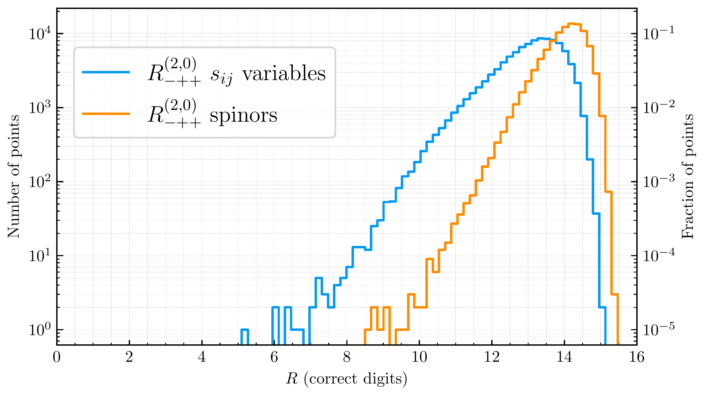
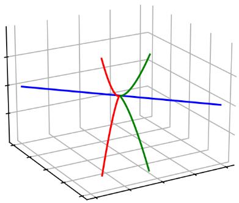



<h3 style="margin-top:5mm; margin-left: -10mm; margin-right: -10mm;">
	<b style="margin-top:15mm; font-size: 28pt;">
	   Non-Planar Two-Loop Amplitudes  
	   for Five-Parton Scattering
	</b>
</h3>

Giuseppe De Laurentis
 

 University of Edinburgh 

 
<a href="https://arxiv.org/abs/2311.10086">arXiv:2311.10086</a> 
 (GDL, H. Ita, M. Klinkert, V. Sotnikov) 

<A href="https://arxiv.org/abs/2311.18752">arXiv:2311.18752</a> 
 (GDL, H. Ita, V. Sotnikov) 

<!--- Amplitudes Meeting --->
Loops & Legs 2024
 

  
  
Find these slides at  <a href="/slides/fivepartons_dec2023/#/">gdelaurentis.github.io/slides/loopslegs_apr2024</a> 

---

<section>



# Introduction:
# (2) Loops & (5) Legs

---



<b style="font-variant: small-caps; font-size: 32pt; margin-bottom: 25mm;"> Status: Two-Loop Five-Point Massless Amplitudes </b>

<table>
    <thead>
        <tr>
            <th style="font-size: 24px;">Process</th>
            <th style="font-size: 24px;">Analytical Amplitudes</th>
            <th style="font-size: 24px;">Numerical Codes</th>
            <th style="font-size: 24px;">Cross Sections</th>
        </tr>
    </thead>
    <tbody>
        <tr>
            <td style="font-size: 20px;">$pp \rightarrow \gamma\gamma\gamma$</td>
            <td style="font-size: 20px;">[3, 4, 5]</td>
            <td style="font-size: 20px;">[3, 5]</td>
            <td style="font-size: 20px;">[1, 2]</td>
        </tr>
        <tr>
            <td style="font-size: 20px;">$pp \rightarrow \gamma\gamma j$</td>
            <td style="font-size: 20px;">Row 1, Column 1</td>
            <td style="font-size: 20px;">Row 1, Column 2</td>
            <td style="font-size: 20px;">Row 1, Column 3</td>
        </tr>
        <tr>
            <td style="font-size: 20px;">$pp \rightarrow \gamma jj$</td>
            <td style="font-size: 20px;">Row 2, Column 1</td>
            <td style="font-size: 20px;">Row 2, Column 2</td>
            <td style="font-size: 20px;">Row 2, Column 3</td>
        </tr>
        <tr>
            <td style="font-size: 20px;">$pp \rightarrow jjj$</td>
            <td style="font-size: 20px;">Row 3, Column 1</td>
            <td style="font-size: 20px;">Row 3, Column 2</td>
            <td style="font-size: 20px;">Row 3, Column 3</td>
        </tr>
        <tr>
        </tr>
    </tbody>
</table>

    

        
<a href="https://inspirehep.net/literature/1762583" style="font-size: 16pt;">[1] Chawdhry, Czakon, Mitov, Poncelet '19</a>

        
<a href="https://inspirehep.net/literature/1827330" style="font-size: 16pt;">[3] Abreu, Page, Pascual, Sotnikov '20</a>

        
<a href="https://inspirehep.net/literature/2663067" style="font-size: 16pt;">[5] Abreu, GDL, Ita, Klinkert, Page, Sotnikov '23</a>

    

    

        
<a href="https://inspirehep.net/literature/1822188" style="font-size: 16pt;">[2] Kallweit, Sotnikov, Wiesemann '20</a>

        
<a href="https://inspirehep.net/literature/1838380" style="font-size: 16pt;">[4] Chawdhry, Czakon, Mitov, Poncelet '20</a>

    

This talk: $pp\rightarrow jjj$, i.e. $\{0\rightarrow ggggg$, $0\rightarrow q\bar qggg$, $0\rightarrow q\bar qQ\bar Q g\}$

---

     <b style="font-variant: small-caps; font-size: xxx-large; margin-bottom:0mm;"> Color Algebra </b>
     

     ($q\bar qQ\bar Q g$ example)
     

$\circ$ Color decomposition (trace basis)

 

     

          \[
          \require{color}
          \require{amsmath}
          \hspace{-5mm}
          \begin{align}
               \mathcal{A}_{\vec{a}}(1_u,2_{\bar u},3_d,4_{\bar d},5_g) &= 
               \sum_{\sigma \in \mathcal{Z}_2(\{1,2\},\{3,4\})} \sigma\Big(
               \delta^{\bar i_4}_{i_1} (T^{a_5})^{\,\bar i_2}_{i_3} 
               \; A_{d}(1,2,3,4,5)\Big) \; + \\[2mm]
               & \quad \sum_{\sigma \in \mathcal{Z}_2(\{1,2\},\{3,4\})} \kern-2mm \sigma\Big(
               \delta^{\bar i_2}_{i_1} (T^{a_5})^{\,\bar i_4}_{i_3} 
               \; A_{s}(1,2,3,4,5)\Big)\,,\kern-1mm
          \end{align}
          \]
     

     

  

$\circ$ $N_c^{n_c}$ & $N_f^{n_f}$ expansion, notation $A^{(L),(n_c, n_f)}_{\text{partial}}$,  red  = new

 

     \[
     \begin{gather}
          A_d^{(2)} = N_c^2 A_d^{(2),(2,0)} + {\color{red} A_d^{(2),(0,0)}} + \frac{1}{N_c^2} {\color{red} A_d^{(2),(-2,0)}}
               +  N_f N_c A_d^{(2),(1,1)} + \frac{N_f}{N_c} {\color{red} A_d^{(2),(-1,1)}} + N_f^2  A_d^{(2),(0,2)} \, , \\
          A_s^{(2)} = N_c {\color{red} A_s^{(2),(1,0)}}+\frac{1}{N_c}{\color{red} A_s^{(2),(-1,0)}}+\frac{1}{N_c^3}{\color{red} A_s^{(2),(-3,0)}}
               + N_f{\color{red} A_s^{(2),(0,1)}} + \frac{N_f}{N_c^2} {\color{red} A_s^{(2),(-2,1)}} + \frac{N_f^2}{N_c}{\color{red} A_s^{(2),(-1,2)}} \, .
     \end{gather}
     \]

$\circ$ New identities among partials (plus two more for the $n_f = 1$ partials) 

     \[\\[2mm]
     \Big\{ \big[ 16 \, A^{(2),(2,0)}_d\, (1,2,3,4,5) 
          + 4 \, A^{(2),(0,0)}_d\, (1,2,3,4,5) + 
          A^{(2),(-2,0)}_d(1,2,3,4,5) \big]
          - \big[\dots \big]_{3 \leftrightarrow 4} \Big\}
          - \Big\{ \dots \Big\}_{1 \leftrightarrow 2} = 0 \, .
     \]

     \[
     \begin{gather}
          \big[  32 \, A^{(2),(2,0)}_d\, (1,2,3,4,5) + 8 \, A^{(2),(0,0)}_d\, (1,2,3,4,5) + 2 A^{(2),(-2,0)}_d(1,2,3,4,5) \\
               + 16 \, A^{(2),(1,0)}_s\, (1,2,3,4,5) \, + 4 A^{(2),(-1,0)}_s(1,2,3,4,5) + A^{(2),(-3,0)}_s (1,2,3,4,5) \big]
               - \big[ \dots \big]_{3 \leftrightarrow 4}=  0 \, .
     \end{gather}
     \]

---

    

        

          <b style="font-variant: small-caps; font-size: xxx-large"> Motivation</b>
        

        

        3 is not that big! And certainly not close to $\infty$
        

        
        

        Slc contributions to $pp\rightarrow jjj$ should be similar to blue curve.
        

        

        Expect $\mathcal{O}(10\%)$ effect on duble-virtual hard function.
        

        

        Effect on $\sigma^{\text{NNLO}}$ depends on size of $\mathcal{H}^{(2)}$ in the chosen scheme!
        

    

    

        

          <b style="font-variant: small-caps; font-size: xxx-large"> Pheno. Goal</b>
        

        

        Stable and fast evaluations
        

        
        

        <code> C++ </code> Code available at
        

        <a href="https://gitlab.com/five-point-amplitudes/FivePointAmplitudes-cpp" style="font-size: 16pt;">gitlab.com/five-point-amplitudes/FivePointAmplitudes-cpp</a>
        

        Analytics available at
        

        <a href="https://zenodo.org/records/10142295" style="font-size: 16pt;">zenodo.org/records/10142295</a> &
        <a href="https://zenodo.org/records/10231547" style="font-size: 16pt;">zenodo.org/records/10231547</a>
    

</section>

---

<section>



<h1 style="margin-top: -2mm;"> Numerical Computation </h1>

---

<b style="font-variant: small-caps; font-size: xxx-large"> Partial Amplitudes </b>
 

     $\circ$ Amplitude (integrands) can be written as (drop the extra sub- and super-scripts)

 

     $$
     \displaystyle A(\lambda, \tilde\lambda, \ell) =
\sum_{\substack{\Gamma,\\ i \in M_\Gamma \cup S_\Gamma}} \, c_{\,\Gamma,i}(\lambda, \tilde\lambda, \epsilon) \,		\frac{m_{\Gamma,i}(\lambda\tilde\lambda, \ell)}{\textstyle \prod_{j} \rho_{\,\Gamma,j}(\lambda\tilde\lambda, \ell)} \;\; \xrightarrow[]{\int d^D\ell} \;\; \sum_{\substack{\Gamma,\\ i \in M_\Gamma}} {\color{red}c_{\,\Gamma, i}}(\lambda, \tilde\lambda, \epsilon) \, {\color{orange}I_{\Gamma, i}}(\lambda\tilde\lambda, \epsilon)
$$  

 

     $\circ$ For a suitable choice of integrands, we get:

 

     $$
     \displaystyle
     {\color{red}c_{\Gamma, i}}(\lambda, \tilde\lambda, \epsilon) = \frac{ \sum_{k=0}^{\text{finite}} \, {\color{red}c^{(k)}_{\,\Gamma, i}}(\lambda, \tilde\lambda) \, \epsilon^k}{\prod_j (\epsilon - a_{ij})} \;, \;\;\text{with} \quad a_{ij} \in \mathbb{Q} \, . 
     $$

 

     Some notation:

 

     $\circ$  $\Gamma$: topologies $\quad\circ$ $M_\Gamma$: master integrands $\quad\circ$ $S_\Gamma$: surface terms $\quad\circ$ $D = 4 - 2 \epsilon$

     $\circ$ Spinors: $\lambda_i = |i\rangle, \tilde\lambda_i =[i|$
     $\quad\circ$ External 4-momenta: $\lambda\tilde\lambda=p\kern-3mm/$
     $\quad\circ$ Loop $D$-momenta: $\ell $

---

<b style="font-variant: small-caps; font-size: xxx-large; magin-bottom:-2mm;"> Numerical Generalized Unitarity @ 2 Loops </b>
<a style="font-size: large; text-align: center; float: center; margin-right: 0mm; margin-top: -2mm; margin-bottom: 0mm;" href=https://arxiv.org/abs/1510.05626>
     Ita ('15)
</a>
<a style="font-size: large; text-align: center; float: center; margin-left:2mm; margin-right: 0mm; margin-top: -2mm; margin-bottom: 0mm;" href=https://arxiv.org/abs/1712.03946>
     Abreu, Febres Cordero, Ita, Page, Zeng ('17)
</a>

$\circ$ The integrand Ansatz is matched to products of trees on cuts

     

	     $$
	     \require{color}
	     \displaystyle \sum_{\text{states}} \, \prod_{\text{trees}} A^{\text{tree}}(\lambda, \tilde\lambda, \ell)\big|_{\text{cut}_{\Gamma}} = \sum_{\substack{\Gamma' \ge \Gamma, \\ i \in M_\Gamma' \cup S_\Gamma'}} \kern-2mm c_{\,\Gamma',i}(\lambda, \tilde\lambda) \, \frac{m_{\Gamma',i}(\lambda\tilde\lambda, \ell)}{\displaystyle \prod_{j\in P_{\Gamma'} / P_{\Gamma}} \rho_{j}(\lambda\tilde\lambda, \ell)}\Bigg|_{\text{cut}_\Gamma}
	     $$
	

     

	     

	     	  <code> C++ code </code>
	     
 
	     
	      
	     <a style="font-size: large; text-align: center; float: center; margin-top: -10mm; margin-bottom: 5mm;"
	     	href=https://arxiv.org/abs/2009.11957>
		
 Abreu, Dormans, 

		
 Febres Cordero, Ita  

		
 Kraus, Page, Pascual, 

		
 Ruf, Sotnikov ('20) 

	     </a>
	

     

	     $\star$ Numerical Berends-Giele recursion for LHS, solve for coeffs. in RHS.
	

     

	     $\star$ IBP reduction = decomposition on RHS, $\; m_{\Gamma,i} \in M_\Gamma \cup S_\Gamma $
	

$\circ$ The SLC cut-hierarchy is significantly larger than the LC one, e.g.

---

<b style="font-variant: small-caps; font-size: xxx-large"> Finite Remainders </b>

<!---

Decomposition in terms of <b> master integrals </b> 

<a style="font-size: large; text-align: right; float: right; margin-bottom: 5mm; margin-top: 10mm" href=https://arxiv.org/abs/0712.1851>Ellis, Zanderighi</a>
<a style="font-size: large; text-align: right; float: right; margin-bottom: 5mm; margin-top: 10mm" href=https://arxiv.org/abs/hep-ph/9212308>Bern, Dixon, Kosower;&nbsp</a>
<a style="font-size: large; text-align: right; float: right; margin-bottom: 5mm; margin-top: 10mm" href=https://www.sciencedirect.com/science/article/pii/0550321379906059?ref=pdf_download&fr=RR-2&rr=7c4afcac1f343b58>'t Hooft, Veltman;&nbsp</a>

$$A^{1-\text{loop},D=4}_{n} = \sum_i \color{orange}{d_i} \color{red}{I^i_{Box}} + \sum_i \color{orange}{c_i} \color{red}{I^i_{Triangle}} + \sum_i \color{orange}{b_i} \color{red}{I^i_{Bubble}} + \sum_i \color{orange}{a_i} \color{red}{I^i_{Tadpoles}} + \color{orange}{R}$$

       

--->

     $\circ$ Dim-reg is great, but it also introduces <b>a lot</b> of junk (see next slide).

     $\circ$ <u>All physical information</u> is contained in the <i>finite remainder</i>, at two loops

$$ 
\underbrace{\mathcal{R}^{(2)}}_{\text{finite remainder}} = \mathcal{A}^{(2)}_R \underbrace{- \quad I^{(1)}\mathcal{A}^{(1)}_R \quad - \quad I^{(2)}\mathcal{A}^{(0)}_R}_{\text{divergent + convention-dependent finite part}} + \mathcal{O}(\epsilon)
$$

     $\phantom{\circ}$ $\mathcal{A}^{(1)}_R$ to order $\epsilon^2$ is still needed to build $\mathcal{R}^{(2)}$, but there is no reason to reconstruct it

     Although by the time I learned this, I had already reconstructed $\mathcal{A}^{(1)}_{5g}$ to $\epsilon^2$ $\qquad$

 

     $\circ$ Finite remainder as a weighted sum of <i>pentagon functions</i> <a style="font-size: large; display: inline-block; text-align: right; float: right; margin-top: 2mm; margin-left: 4mm; " href=https://arxiv.org/abs/2009.07803> Chicherin, Sotnikov ('20);&nbsp; </a>

$$ 
\textstyle \mathcal{R}(\lambda, \tilde\lambda) = \sum_i \color{orange}{r_{i}(\lambda,\tilde\lambda)} \, \color{red}{h_i(\lambda\tilde\lambda)}
$$

    Goal: Reconstruct $\color{orange}{r_{i}(\lambda,\tilde\lambda)}$ from $\mathbb{F}_p$ samples

<a style="font-size: large; text-align: right; float: right; margin-top: 0mm; margin-bottom: -10mm;" href=https://arxiv.org/abs/1406.4513>
von Manteuffel, Schabinger ('14)
</a> 
<a style="font-size: large; text-align: right; float: right; margin-top: -10mm; margin-bottom: 0mm;" href=https://arxiv.org/abs/1608.01902>
Peraro ('16)
</a>

     $\circ$ More precisely, we would like a basis of the vector space $\text{span}(r_i(\lambda,\tilde\lambda))$  
     $\phantom{\circ}$ (given a basis, obtaining the full set is easy).

</section>

---

<section >



    

# Analytic and Geometric Structure

    

based on:  
[GDL, Page (JHEP 12 (2022) 140)](https://arxiv.org/abs/2203.04269)  
GDL, Ita, Page, Sotnikov (to appear)

---

<b style="font-variant: small-caps; font-size: 33pt;"> Fieds of Fractions of Polynomial Quotient Rings  </b>

     

	     

               $\circ$ Covariant q-ring of spinors
          

           
          

               $$\displaystyle \kern10mm R_n = \mathbb{F}\big[|1⟩, [1|, \dots, |n⟩, [n|\big] \big/ \big\langle \sum_i |i⟩[i| \big\rangle$$
          

          

               $\circ$ Lorentz invariants live in a sub-ring of $R_n$
          

           
          

               $$\displaystyle \kern0mm R_n \supset \mathcal{R}_n = \mathbb{F}\big[⟨1|2⟩, \dots, [n-1|n]\big] \big/ (\mathcal{J}_n + \mathcal{K}_n + \bar{\mathcal{K}}_n)$$
          

          

               where $\mathcal{J}_n$: momentum cons., $\;\stackrel{\tiny{(}\normalsize{-}\tiny{)}}{\mathcal{K}}_n$: shouten identities 
          

	

     

          
          

               Plot from LC $pp\rightarrow \gamma\gamma\gamma$ remainder in Born kinematics.
          

          

               The slopes <i>flatten out</i> in soft/collinear configurations.
          

     

    $r_i(\lambda, \tilde\lambda)$ at $n$-point belong to the Field of Fractions of $\mathcal{R}_{n>3}$

 

     $\circ$ This allows to manifes:

     $\kern8mm$ 1) that the singularities are $\approx \sqrt{s_{ij}}\kern10mm$ 2) the behaviour with $P^\mu \in \mathbb{C}$, i.e. away from $\langle ij \rangle = [ij]^{\ast}$

---

     <b style="font-variant: small-caps; font-size: xxx-large"> Least Common Denominator </b>
     

     (i.e. what happens at codimension one)
     

     

	     

                $\circ\,$ The rational coefficients take the form
          

           
          

               $$
               \displaystyle r_i(|i\rangle,[i|) = \frac{\mathcal{N}(|i\rangle,[i|)}{\prod_j D_j^{q_{ij}}(|i\rangle,[i|)}
               $$
          

          

               $\circ\,$ The $\mathcal{D}_j$ are related to the letters of the symbol alphabet
          

           
          <a style="font-size: large; text-align: right; float: right; margin-top: 0mm; margin-bottom: 0mm;" href=https://arxiv.org/abs/1812.04586>
          Abreu, Dormans, Febres Cordero, Ita, Page ('18)
          </a>
          

               $$
               \displaystyle \{\mathcal{D}_{\{1,\dots,35\}}\} = \bigcup_{\sigma \; \in \; \text{Aut}(R_5)} \sigma \circ \big\{ \langle 12 \rangle, \langle 1|2+3|1] \big\}
               $$
          

          

               $\qquad\color{green}\text{Identical to 1-loop!}$
          

	

     

          
          

               The codimension one variety 
          

          

               $\langle x^3 + y^3 - z^2 \rangle$ in $\mathbb{R}[x,y,z]$
          

     

     $\phantom{\circ}$ Non-trivial statement (not proven!): all irreducible polynomials generate prime ideals, @ 5-pt.

    Poles & Zeros $\;\Leftrightarrow\;$ Irreducible Varieties $\;\Leftrightarrow\;$ Prime Ideals  
    <i style="font-size: 12pt; border-top: -8mm; border-bottom: -2mm;"> Physics $\kern38mm$ Geometry $\kern38mm$ Algebra </i>

---

     <b style="font-variant: small-caps; font-size: xxx-large"> Partial Fraction Decompositions </b>
     

     (i.e. what happens at codimension greater than one)
     

    

        
    

    

        $\cap$
    

    

        
    

    

        $=$
    

    

        
    

</section>

---

<section>



# Analytic Reconstruction

---

<b style="font-variant: small-caps; font-size: xxx-large"> Vector Spaces of Rational Functions </b>

     $\circ\,$ Sort the $r_i$ by mass dimension of $\mathcal{N}$ ($\approx$ Ansatz size), pick simplest subset forming a basis $r_{i \in \mathcal{B}}$

 

     $$
     R = r_j h_j = r_{i\in \mathcal{B}} M_{ij} h_j \, , \qquad M_{ij} \in \mathbb{Q}
     $$

     $\circ\,$ Key insight: 

 

     $$
     \text{dim(span}_{FF(R_5), \mathbb{Q}}\left(\lim_{\mathcal{D_j} \rightarrow  0 }r_{i}\right)) \leq \text{dim(span}_{FF(R_5), \mathbb{Q}}(r_{i}))
     $$

     $\phantom{\circ}\,$ I.e., the pole residues are correlated, build linear combinations that <i> ''remove the overlap'' </i>

---

<b style="font-variant: small-caps; font-size: xxx-large"> Correlation of Residues </b>

     $\circ\,$ Build Laurent expansions around $t_{\mathcal{D}_k}$  Univariate Tiele Tiziano, Ben's Lecture Notes, p(z)-adic expansion

 

     $$
     r_{i \in \mathcal{B}} = \sum_{m = 1}^{q_k = \text{max}_i(q_{ik})} \frac{e^k_{im}}{(t-t_{\mathcal{D}_k})^m} + \mathcal{O}((t-t_{\mathcal{D}_k})^0)
     $$

     $\phantom{\circ}\,$ strictly formal over $\mathbb{F}_p$, but convergent over $\mathbb{Q}_p$ for $(t-t_{\mathcal{D}_k}) \propto p$

     $\circ\,$ Repeat for several (anti-)holomorphic slices, build vectors

  

     $$
     \vec{e}^k_{im} = (e^k_m)_{ij} = \{ e^k_{im}(\text{slice}_1), \dots, e^k_{im}(\text{slice}_n)  \}
     $$

     $\circ\,$ By Gaussian elimination on the matrix $(e^k_m)_{ij}$ we can partition the space:

 

     $$
     \text{span}_{\vec{\mathbb{Q}},\mathbb{Q}}(r_{i \in \mathcal{B}}) = \text{column}_{\vec{\mathbb{Q}},\mathbb{Q}}(\text{Res}(r_{i \in \mathcal{B}}, D_k^m)) \oplus \text{null}_{\vec{\mathbb{Q}},\mathbb{Q}}(\text{Res}(r_{i \in \mathcal{B}}, D_k^m))
     $$

    Interpretation of $\text{null}_{\vec{\mathbb{Q}},\mathbb{Q}}(\text{Res}(r_{i \in \mathcal{B}}, D_k^m)) \cdot r_{i \in \mathcal{B}}$: functions that do <u>not</u> have a $D_k^m$ singularity

---

<b style="font-variant: small-caps; font-size: xxx-large"> Breadth-First Search </b>

     $\circ\,$ If a function $\tilde{r}$ does not have poles $D_{k_1}^{m_1}$ and $D_{k_2}^{m_2}$, then

 

     $$
     \tilde{r} \in \text{span}_{FF(R_5),\mathbb{Q}}\Bigg[\Big(\text{null}_{\vec{\mathbb{Q}},\mathbb{Q}}(\text{Res}(r_{i \in \mathcal{B}}, D_{k_1}^{m_1})) \cap \text{null}_{\vec{\mathbb{Q}},\mathbb{Q}}(\text{Res}(r_{i \in \mathcal{B}}, D_{k_2}^{m_2}))\Big)_{i'i} \; \cdot \; r_{i\in \mathcal{B}}\Bigg]
     $$

     $\circ\,$ Build linear combination that remove as many singularities as possible, without dropping rank

 

     $$
     \displaystyle O_{i'i} = \cap_{k, m} \, \text{nulls}_{\vec{\mathbb{Q}},\mathbb{Q}} \qquad \text{(schematically)}
     $$

     $\circ\,$ This is done by searching a tree of possibilities of which pole gets dropped to which order.  
     $\phantom{\circ}\,$ Several optimizations required to search an otherwise proibitively large space, naively of size

  

     $$
     \prod_k (m_k + 1) \quad \text{with } \; k \;\text{ enumerating } \; D_k^{m_k}
     $$

---

<b style="font-variant: small-caps; font-size: xxx-large"> Least Least-Common-Denominator </b>
 

     $\circ$ In other words, we have reshuffled the $r_i$ by linear combinations of the others $r_{j\neq i}$

     $\displaystyle \tilde{r}_i = \sum_{j\neq i} O_{ij} r_j + r_i$

 

     $\circ\,$ The rational functions now take the form

 

     $$
     \displaystyle \tilde{r}_i(|i\rangle,[i|) = \frac{\tilde{\mathcal{N}}(|i\rangle,[i|)}{\prod_j D_j^{\tilde{q}_{ij}}(|i\rangle,[i|)}
     $$

     $\phantom{\circ}\,$ where we have minimized $\sum_j \tilde{q}_{ij}$, compared to the $r_i$.

 

     $\circ\,$ This is the closest thing that I am aware of to a Gram–Schmidt procedure for vector spaces over fields that are not number fields, but in this case fields of fractions over polynomial quotient rings.

     $\circ\,$ Can we think of this as defining an inner product on the space of rational functions?

   

     $$
     O_{ij} \sim \langle r_i | r_j \rangle \qquad \text{(very schematically)}
     $$

---

<b style="font-variant: small-caps; font-size: xxx-large"> Spinor-Helicity Results </b>
 

     $\circ$ For the first time with an MHV two-loop five-point amplitude the results for the rational coefficients are compact enough to be present within a paper

https://arxiv.org/pdf/2311.10086.pdf#page=14

     $\circ$ The simplification of the basis change is <u>independent</u> of that obtained from partial fraction decompositions, as the latter can still be performed after the former.

     $\circ$ Can now study propertities of the amplitude  
     $\phantom{\circ}$ e.g. no function has a $\text{tr}_5$ singularity, nor a pair of $\langle i | j + k | i]$ in the same denominator.

---

<b style="font-variant: small-caps; font-size: xxx-large"> Quarks from Gluons </b>
 

     $\circ$ Checking whether a rational function belongs to a given vector space

     $$
     r_{\text{guess}} \stackrel{?}{\in} \text{span}_{FF(R_5), \mathbb{Q}}(r_{i})
     $$

     $\phantom{\circ}$ is much simpler problem than performing a rational reconstruction!  
     $\phantom{\circ}$ It only requires as many evaluations as the dimension of the vector space.

     $\circ$ The vector space has uniform mass dimension and phase weights

     $$
     |i⟩ \rightarrow t^{1/2}|i⟩, \; |i] \rightarrow t^{1/2}|i] \quad \forall \; i \quad \text{and} \quad
     |i⟩ \rightarrow t|i⟩, \; |i] \rightarrow \frac{1}{t}|i]
     $$

     $\circ$ Generate guesses for quark functions by re-scaling gluon functions

     $$
     \tilde{r}^{-}_{73}(q^+,q^-,g^+,g^+,g^-) = \frac{[14]⟨25⟩⟨45⟩}{⟨24⟩[24]⟨34⟩^2} = \frac{⟨14⟩}{⟨24⟩} \underbrace{\frac{[14]⟨25⟩⟨45⟩}{⟨14⟩[24]⟨34⟩^2}}_{r^{--}_{18}(g^+,g^-,g^+,g^+,g^-)}
     $$

     $\circ$ We obtain most (50% of 2q3g and 90% of 4q1g) quarks functions this way.

</section>

---

<section>



# Outlook

---



<b style="font-variant: small-caps; font-size: 32pt; margin-bottom: 25mm;"> Status: Two-Loop Five-Point One-Mass Amplitudes </b>

<table>
    <thead>
        <tr>
            <th style="font-size: 24px;">Process</th>
            <th style="font-size: 24px;">Analytical Amplitudes</th>
            <th style="font-size: 24px;">Numerical Codes</th>
            <th style="font-size: 24px;">Cross Sections</th>
        </tr>
    </thead>
    <tbody>
        <tr>
            <td style="font-size: 20px;">$pp \rightarrow Wb\bar b$</td>
            <td style="font-size: 20px;">[3, 4, 5]</td>
            <td style="font-size: 20px;">[3, 5]</td>
            <td style="font-size: 20px;">[1, 2]</td>
        </tr>
        <tr>
            <td style="font-size: 20px;">$pp \rightarrow Hb\bar b$</td>
            <td style="font-size: 20px;">Row 1, Column 1</td>
            <td style="font-size: 20px;">Row 1, Column 2</td>
            <td style="font-size: 20px;">Row 1, Column 3</td>
        </tr>
        <tr>
            <td style="font-size: 20px;">$pp \rightarrow Wj\gamma$</td>
            <td style="font-size: 20px;">Row 2, Column 1</td>
            <td style="font-size: 20px;">Row 2, Column 2</td>
            <td style="font-size: 20px;">Row 2, Column 3</td>
        </tr>
        <tr>
            <td style="font-size: 20px;">$pp \rightarrow Wjj$</td>
            <td style="font-size: 20px;">Row 3, Column 1</td>
            <td style="font-size: 20px;">Row 3, Column 2</td>
            <td style="font-size: 20px;">Row 3, Column 3</td>
        </tr>
        <tr>
        </tr>
    </tbody>
</table>

  

    

        
<a href="https://inspirehep.net/literature/1762583" style="font-size: 16pt;">[1] ... '19</a>

    

    

        
<a href="https://inspirehep.net/literature/1822188" style="font-size: 16pt;">[2] ... '20</a>

    

---

<b style="font-variant: small-caps; font-size: xxx-large; margin-bottom: 5mm;">
  5-point 1-mass Amplitudes: e.g. Wjj
</b>

     $0.\,$ Start from analytics of <a style="font-size: large"; href="https://arxiv.org/abs/2110.07541">Abreu, Febres Cordero, Ita, Klinkert, Page, Sotnikov ('21) </a> - 1.2GB of <code>C++</code> source code.

     $1.\,$ Script to split up the expressions, and compile them ($\sim 20$GB binaries) for evaluation over $\mathbb{F}_p$;

$2.\,$ Recombine the 3 projections $p_V \parallel p_1, p_V \parallel p_2, p_V \parallel p_3$ and reintroduce the little group factors   
to build 6-point spinor-helicity amplitudes (subject to degree bounds on $|5\rangle,[5|,|6\rangle,[6|$);  

$3.\,$ Perform (rough) PFDs based on expected structures and fit the Ansatze.

 

Comparison of $p\bar p \rightarrow jjj$ (in full color) to $pp \rightarrow Wjj$ (at leading color):   

<table width=110% border="1" cellspacing="0" cellpadding="0" style="margin-left: -12mm; margin-bottom: 8mm; margin-top: 8mm; font-size: x-large;">
  <tr>
    <td><b>Kinematics</b></td>
    <td><b># Poles ($W$)</b></td>
    <td><b>LCD Ansatz</b></td>
    <td><b>Partial-Fraction Ansatz</b></td>
    <td><b>Rational Functions</b></td>
  </tr>
  <tr>
    <td style="text-align: center;">5-point massless</td>
    <td style="text-align: center;">35</td>
    <td style="text-align: center;">~200k</td>
    <td style="text-align: center;">~4k</td>
    <td style="text-align: center;">$\sim$200 KB</td>
  </tr>
  <tr>
    <td style="text-align: center;">5-point 1-mass</td>
    <td style="text-align: center;">>200</td>
    <td style="text-align: center;">>5M</td>
    <td style="text-align: center;">$\sim$40k</td>
    <td style="text-align: center; background-color: yellow;">$\sim$25 MB</td>
  </tr>
</table>

     $\displaystyle \kern-10mm \{W_j\} = \bigcup_{\sigma \; \in \; \text{Aut}(R_6)} \sigma \circ \big\{ \langle 12 \rangle, \langle 1|2+3|1], \langle 1|2+3|4], s_{123}, \Delta_{12|34|56}, ⟨3|2|5+6|4|3]-⟨2|1|5+6|4|2] \big\} $

---

<b style="font-variant: small-caps; font-size: xx-large; margin-bottom: 10mm;">
   Complexity of 2-loop 5-point 1-mass Amplitudes
</b>

     

          $\circ$ The  Ansatz size grows quickly with   multiplicity (m) and mass dimension (d):   
          $\displaystyle \small \left(\mkern -9mu \begin{pmatrix}\, m(m-3)/2 \, \\ \, d/2 \, \end{pmatrix} \mkern -9mu \right)$   
          is a lower bound. <a style="font-size: large; display: inline-block; text-align: right; float: right; margin-left: -28mm; margin-top: 1mm; margin-bottom: 5mm;" href=https://arxiv.org/abs/2010.14525>
               GDL, Maître ('20)
          </a>
     

     

          
     

$\circ\,$ Compact residues for the new 2-loop (spurious?) pole, $⟨k|j|p\mkern-7.5mu/_V|l|k]-⟨j|i|p\mkern-7.5mu/_V|l|j]$, e.g.:
$$r^{(5 \text{ of } 54)}_{\bar{u}^+g^+g^+d^-(V\rightarrow \ell^+ \ell^-)} = \frac{[12][23]⟨24⟩⟨46⟩^2⟨1|2+3|4]⟨2|1+3|4]}{⟨12⟩⟨23⟩⟨56⟩(⟨3|2|5+6|4|3]-⟨2|1|5+6|4|2])^2}$$

$\circ\,$ The three mass Grams, $\Delta_{12|34|p_V}, \Delta_{14|23|p_V}$, behave analogously to one-loop amplitudes, e.g.:

$$ r^{(73 \text{ of } 120)}_{\bar{u}^+g^-g^+d^-(V\rightarrow \ell^+ \ell^-)} = \frac{105}{128}\frac{⟨2|1+4|3]⟨4|2+3|1]⟨6|1+4|5]s_{14}s_{23}s_{56}{\color{green}(s_{124}-s_{134})}(s_{123}-s_{234})(s_{25}+s_{26}+s_{35}+s_{36})}{{\color{orange}⟨3|1+4|2]}{\color{red}Δ_{23|14|56}^4}} + \\
\Bigg[-6\frac{[12]^2⟨13⟩[25]⟨34⟩⟨36⟩⟨56⟩[56]{\color{green}(s_{124}-s_{134})}}{{\color{orange}⟨3|1+4|2]^5}}\Bigg] + \Bigg[ \; \Bigg]_{1234\rightarrow \overline{4321}}+ \mathcal{O}\left(\frac{1}{⟨3|1+4|2]^{4}Δ_{23|14|56}^{3}}\right)$$

</section>

---

<section>

<!---
<b style="font-variant: small-caps; font-size: xxx-large; margin-bottom: 10mm;">
   Conclusions
</b>

     $\circ\,$ Full-color 5-point massless amplitudes are well within reach, 

     $\circ\,$ Subleading color corrections can be fairly sizable

     $\circ\,$ The reconstruction can be peformed in spinor-helicity variables, which yield compact results

     $\circ\,$ Understanding the partial fraction structure of amplitudes is essential to tame their complexity

---
--->



<b style="font-variant: small-caps; font-size: xxx-large;"> Thank you   for your attention! </b>
 
 
<!---
<b style="font-variant: small-caps; font-size: xx-large;"> Questions? </b>
--->

    These slides are powered by: 
    
        <a href="https://en.wikipedia.org/wiki/Markdown">markdown</a>, 
        <a href="https://en.wikipedia.org/wiki/HTML">html</a>, 
        <a href="https://revealjs.com/">revealjs</a>, 
        <a href="https://gohugo.io/">hugo</a>, 
        <a href="https://www.mathjax.org/">mathjax</a>, 
        <a href="https://github.com/">github</a>
    

<!---
 

     For open source packages: 
     <code>
          $   $ pip install [lips](https://github.com/GDeLaurentis/lips) [pyadic](https://github.com/GDeLaurentis/pyadic)
     </code>

--->

</section>

---

<section>

# Backup Slides

---

<b style="font-variant: small-caps; font-size: xxx-large; margin-bottom: -5mm;"> Constraints from Poles </b>
 
<b style="font-variant: small-caps; font-size: x-large; margin-top: -16mm;"> Bootstrapping trees (?) </b>

     $\circ$ The degree of divergence / vanishing on various surfaces imposes strong constraints, e.g.

     $ A^{\text{tree}}_{q^+g^+g^+\bar q^-g^-g^-} = \frac{\mathcal{N(\text{m.d.} = 6\,,\; \text{p.w.} = [-1, 0, 0, 1, 0, 0])}}{\langle 12\rangle\langle 23\rangle\langle 34\rangle [45][56][61]s_{345}}$

     $\circ$ Pretend this is un unknown integral coefficient, $\mathcal{N}$ has 143 free parameters.

     $\circ$ List the various prime ideal, such as

   

     $ \big\langle \langle 12\rangle, \langle 23\rangle, \langle 13\rangle \big\rangle, \; \big\langle |1\rangle \big\rangle, \; \big\langle \langle 12\rangle, |1+2|3]\big\rangle, \dots$

     $\phantom{\circ}$ and impose that $\mathcal{N}$ vanishes to the correct order. We determine it up to an overall constant.

<a style="font-size: large; text-align: right; float: right; margin-top: -2mm; margin-bottom: 0mm;" href=https://arxiv.org/abs/2207.10125>
     GDL, Page ('22)
</a>

     $\circ$ Likewise, the ansatz for $A^{\text{tree}}_{g^+g^+g^+ g^-g^-g^-}$ shrinks $1326 \rightarrow 1$, etc..

   

     <i> Effectively, we can <b> compute </b> trees, just from their <u>poles orders</u>.   Note: compared to BCFW there is <u>no</u> information about <u>residues</u>. </i>

---

<b style="font-variant: small-caps; font-size: xxx-large"> Partial Fraction Decompositions </b>

     $\circ$ For integral coefficients, we can't rely on the Ansatz to shrinks to an overall constant.

     $\circ$ Partial fraction decompositions (PFDs) are a popular method to tame algebraic complexity.

     $\circ$ In my opinion, a PFD algorithm needs

   

     $1.$ to say if two poles $W_a$ and $W_b$ are separable into different fractions;  
     $2.$ ideally, to answer $(1.)$ without having access to an analytic expression. 

     $\circ$ Hilbert's nullstellensatz: if $\mathcal{N}$ vanishes on all branches of $\langle W_a, W_b \rangle$, then the PFD is possible$\kern-3mm\phantom{x}^\dagger$.

     $\circ$ Generalizing to powers $>\kern-1mm 1$ can be done via symbolic powers and the Zariski-Nagata Theorem.

<a style="font-size: large; text-align: right; float: right; margin-top: 1mm; margin-bottom: 0mm;" href=https://arxiv.org/abs/.>
   GDL, Page ('22)
</a>

     $\circ$ Similarly, generalizing to non-radical ideals requires ring extensions.

<a style="font-size: large; text-align: right; float: right; margin-top: 0mm; margin-bottom: 0mm; margin-right: 33mm;" href=https://arxiv.org/abs/.>
   Campbell, GDL, Ellis ('22)
</a>

     <b> Issue: </b>evaluations on singular surfaces are expensive, but are not always needed!

     <b> Opportunity: </b>we get more than partial fraction decompositions.

      

     $\kern-4mm\phantom{x}^\dagger$ $\langle W_a, W_b\rangle$ needs to be radical.

---

<b style="font-variant: small-caps; font-size: xxx-large"> Beyond Partial Fractions </b>

     $\circ$ $\color{red}\text{Case 0}$: the ideal does $\color{green}\text{not involve denominator factors}$.

     E.g. a 6-point function $c_i$ has a pole at $⟨1|2+3|4]$ but not at $⟨4|2+3|1]$,

     yet it is regular on the irreducible surface $V(\big\langle ⟨1|2+3|4], ⟨4|2+3|1] \big\rangle)$. Then

  

     $\displaystyle c_i \sim \frac{⟨4|2+3|1]}{⟨1|2+3|4]} + \mathcal{O}(⟨1|2+3|4]^0) \; \text{ instead of } \; c_i \sim \frac{1}{⟨1|2+3|4]}  + \mathcal{O}(⟨1|2+3|4]^0)$

     $\circ$ $\color{red}\text{Case 1}$: the $\color{green}\text{degree of vanishing is non-uniform}$ across branches, for example:

 

     $\displaystyle \frac{s_{14}-s_{23}}{⟨1|3+4|2]⟨3|1+2|4]}$

     has a double pole on the first branch, and a simple pole on the second branch of

 

     $\big\langle⟨1|3+4|2], ⟨3|1+2|4]\big\rangle_{R_6} = \big\langle ⟨13⟩, [24] \big\rangle_{R_6} \cap \big\langle ⟨1|3+4|2], ⟨3|1+2|4], (s_{14}-s_{23})\big\rangle_{R_6}$

     $\circ$ $\color{red}\text{Case 2}$: ideal is $\color{green}\text{non-radical}$ (example on last slide)

  

     $\displaystyle \small \kern0mm \sqrt{\big\langle {\color{black}⟨3|1+4|2]}, {\color{black}Δ_{23|14|56}} \big\rangle_{R_6}} = \big\langle {\color{black}⟨3|1+4|2]}, {\color{black}s_{124}-s_{134}} \big\rangle_{R_6} $

---

<b style="font-variant: small-caps; font-size: xxx-large"> The Numerator Ansatz </b>

$\circ\,$ The numerator Ansatz takes the form

<a style="font-size: large; text-align: right; float: right; margin-top: -6mm; margin-bottom: 4mm;" href=https://arxiv.org/abs/1904.04067>
   GDL, Maître ('19)
</a>

$\displaystyle \text{Num. poly}(\lambda, \tilde\lambda) = \sum_{\vec \alpha, \vec \beta} c_{(\vec\alpha,\vec\beta)} \prod_{j=1}^n\prod_{i=1}^{j-1} \langle ij\rangle^{\alpha_{ij}} [ij]^{\beta_{ij}}$

     $\phantom{\circ}$ subject to constraints on $\vec\alpha,\vec\beta$ due to: 1) mass dimension; 2) little group; 3) linear independence.

 

$\circ\,$ Construct the Ansatz via the algorithm from Section 2.2 of <a href=https://arxiv.org/abs/2203.04269>GDL, Page ('22)</a>

Linear independence = irreducibility by the Gröbner basis of a specific ideal.

$\circ\,$ Efficient implementation using open-source software only

	

	       
	     Gröbner bases $\rightarrow$ constrain $\vec\alpha,\vec\beta$  
	     <a style="font-size: large; text-align: center; float: center; margin-top: -10mm; margin-bottom: 5mm;"
	     href=https://www.singular.uni-kl.de/index.php.html>
		Decker, Greuel, Pfister, Schönemann
	     </a>	    
	

	

	       
	     Integer programming $\rightarrow$ enumerate sols. $\vec\alpha,\vec\beta$  
	     <a style="font-size: large; text-align: center; float: center; margin-top: -10mm; margin-bottom: 5mm;"
	     href=https://www.singular.uni-kl.de/index.php.html>
		Perron and Furnon (Google optimization team)
	     </a>
	

    

$\circ\,$ Linear systems solved w/ CUDA over $\mathbb{F}_{2^{31}-1}$ ($t_{\text{solving}} \ll t_{\text{sampling}}$) w/ <a href=https://github.com/GDeLaurentis/linac-dev> linac </a>  (coming soon-ish) 

</section>

<!-- REVEAL.JS CUSTOMIZATION -->

<!-- Include MathJax library -->

<!-- Include Reveal.js and the Math plugin -->

<!-- Initialize Reveal.js with the MathJax plugin -->

