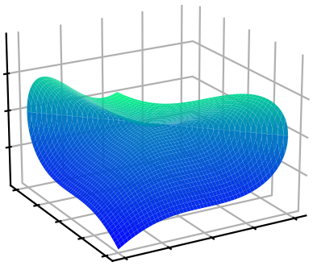
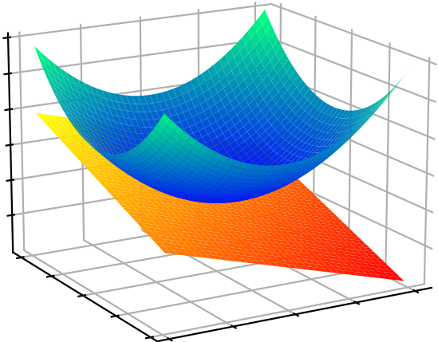
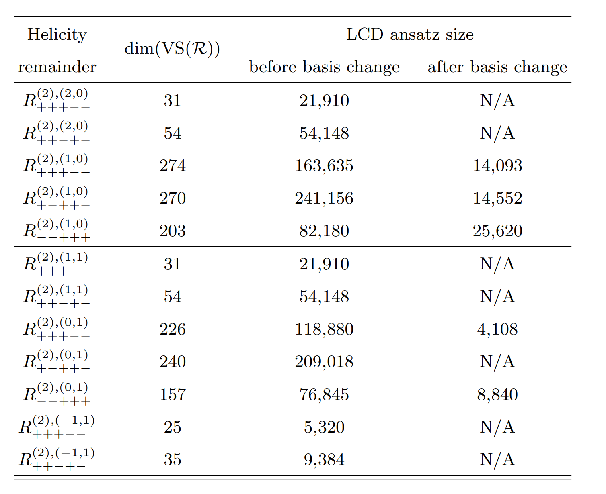
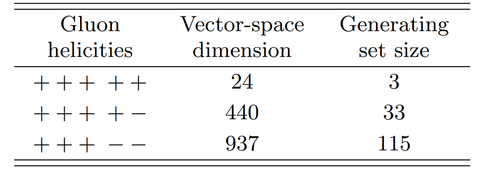



<h3 style="margin-top:5mm; margin-left: -10mm; margin-right: -10mm;">
	<b style="margin-top:15mm; font-size: 32pt;">
	   Rational Functions   
	   of Scattering Amplitudes   
        with Masses
	</b>
</h3>

Giuseppe De Laurentis
 

 University of Edinburgh 

 
 
 

<!--- 
<a href="https://arxiv.org/abs/2311.10086">arXiv:2311.10086</a> 
 (GDL, H. Ita, M. Klinkert, V. Sotnikov) 

<a href="https://arxiv.org/abs/2311.18752">arXiv:2311.18752</a> 
 (GDL, H. Ita, V. Sotnikov) 

--->

<!--- Amplitudes Meeting --->
QCD Meets EW
 

  
  
Find these slides at  <a href="/slides/qcd_meets_ew_feb2024/#/">gdelaurentis.github.io/slides/qcd_meets_ew_feb2024</a> 

---

<section>



# Introduction

---

<b style="font-variant: small-caps; font-size: xxx-large; margin-bottom: 20mm;"> Color Ordered Amplitudes </b>

$$
\require{color}
\require{amsmath}
\hat{σ}_{n}=\frac{1}{2\hat{s}}\int d\Pi_{n-2}\;(2π)^4δ^4\big(\sum_{i=1}^n p_i\big)\;|\overline{\mathcal{A}(p_i,h_i,a_i,μ_F, μ_R)}|^2
$$

---

<b style="font-variant: small-caps; font-size: xxx-large; margin-bottom: 10mm;">
   Complexity Swell of Amplitudes Coefficients
</b>

     

          $\circ$ The  Ansatz size grows quickly with   multiplicity (m) and mass dimension (d):   
          $\displaystyle \small \left(\mkern -9mu \begin{pmatrix}\, m(m-3)/2 \, \\ \, d/2 \, \end{pmatrix} \mkern -9mu \right)$   
          is a lower bound. <!--- <a style="font-size: large; display: inline-block; text-align: right; float: right; margin-left: -28mm; margin-top: 1mm; margin-bottom: 5mm;" href=https://arxiv.org/abs/2010.14525>
               GDL, Maître ('20)
          </a> --->
     

     

          
     

$\circ\,$ The three mass Grams, $\Delta_{12|34|p_V}, \Delta_{14|23|p_V}$, behave analogously to one-loop amplitudes, e.g.:

$$ 
r^{(73 \text{ of } 120)}_{\bar{u}^+g^-g^+d^-(V\rightarrow \ell^+ \ell^-)} = \frac{105}{128}\frac{⟨2|1+4|3]⟨4|2+3|1]⟨6|1+4|5]s_{14}s_{23}s_{56}(s_{124}-s_{134})(s_{123}-s_{234})(s_{25}+s_{26}+s_{35}+s_{36})}{\color{orange}{⟨3|1+4|2]}\color{red}{Δ_{23|14|56}^4}} + \\
\Bigg[6\frac{[12]^2⟨13⟩[25]⟨34⟩⟨36⟩s_{56}(s_{124}-s_{134})}{\color{orange}{⟨3|1+4|2]^5}}\Bigg] + \Bigg[ \; \Bigg]_{1234\rightarrow \overline{4321}}+ \mathcal{O}\left(\frac{1}{⟨3|1+4|2]^{4}Δ_{23|14|56}^{3}}\right)
$$

$\circ\,$ The first fraction has Ansatz(mass dimension: 16, phase weights: [-1, 1, -1, 1, -1, 1]): 

$$ 
16488 \text{ (six-point massless) } \rightarrow 4200 \text{ (five-point one-mass) } \rightarrow 2429 \; (Δ_{23|14|56}-\text{residue})
$$

</section>

---

<section>



    

# Multivariate Rational Functions

    

based on:  
[GDL, Page (JHEP 12 (2022) 140)](https://arxiv.org/abs/2203.04269)  
GDL, Ita, Page, Sotnikov (to appear)

---

<b style="font-variant: small-caps; font-size: xxx-large;"> Polynomial Quotient Rings  </b>

     $\circ$ Let us start from the polynomial ring of spinor components

 

     $$\displaystyle \kern-50mm S_n = \mathbb{F}\left[|1⟩, [1|, \dots, |n⟩, [n|\right]$$

 

     $\phantom{\circ}$ the field $\mathbb{F}$ can be any of $\mathbb{Q},\mathbb{R},\mathbb{C},\mathbb{F}_p,\mathbb{Q}_p,\dots$

 

     $\circ$ Define the momentum-conservation ideal as

     $$
     \displaystyle J_{\Lambda_n} = \Big\langle \sum_i |i⟩[i| \Big\rangle_{S_n}
     $$

     
      
     

     	  Artist's Impression of $V(J_{\Lambda_n})$   I can't draw in $4n$ dims!
     

 

     $\phantom{\circ}$ physically, two polynomials $p$ and $q$ are equivalent if $p-q\in J_{\Lambda_n}$

 

     $\circ$ This defines the needed polynomial <b>quotient</b> ring$\kern-4mm\phantom{x}^{\star}$: $\;R_n = S_n / J_{\Lambda_n} $

    $r_i(\lambda, \tilde\lambda)$ at $n$-point belong to the Field of Fractions$\kern-4mm\phantom{x}^{\dagger}$ of $R_n$

     $\kern-4mm\phantom{x}^\star R_4$ is "weird" (not a UFD), but it proves that polynomial rings are insufficient;
     $\;\kern-4mm\phantom{x}^\dagger$ The field of fractions of $R_3$ does not exist.

---

<b style="font-variant: small-caps; font-size: xxx-large"> Prime Ideals \& Irreducible Varieties  </b>

     $\circ$ Let us consider a very simple example (at 4-point)

 

     $\displaystyle \kern-50mm iA_{g^-g^-g^+g^+}^{\text{tree}} = \frac{\langle 12 \rangle^3}{\langle 23 \rangle \langle 34 \rangle \langle 41 \rangle} = \frac{[34]^3}{[12][23][41]} $

 

     $\phantom{\circ}$ is, say, $\langle 23 \rangle$ a pole of this amplitude?

     
      
     

     	  Artist's Impression of $V(\big\langle \langle 23 \rangle\big\rangle_{R_4})$  
	  as the union of two irreducibles
     

 

     $\circ$ The question is ill posed!

     $\phantom{\circ} \langle 23 \rangle$ does not identify an irreducible variety in $R_4$.

     $\phantom{\circ}$ Compute $\color{green}\text{primary decompositions}$, such as

     $\displaystyle \big\langle \langle 23\rangle \big\rangle_{R_4} = {\color{orange} \big\langle \langle 23\rangle, [14] \big\rangle_{R_4}} \cap {\color{blue} \big\langle \langle 12\rangle, \langle 13 \rangle, \langle 14\rangle, \langle 23\rangle, \langle 24 \rangle, \langle 34 \rangle \big\rangle_{R_4}} $

 

     $\phantom{\circ}$ On the <b style="color: orange"> first branch </b> there is a simple pole, on the <b style="color: blue"> latter branch </b> the amplitude is regular.

    Poles & Zeros $\;\Leftrightarrow\;$ Irreducible Varieties $\;\Leftrightarrow\;$ Prime Ideals  
    <i style="font-size: 12pt; border-top: -8mm; border-bottom: -2mm;"> Physics $\kern38mm$ Geometry $\kern38mm$ Algebra </i>

---

<b style="font-variant: small-caps; font-size: xxx-large"> Five-Point Kinematics </b>

     $\circ\,$ The rational coefficients take the form

 

     $$
     \displaystyle r_i(|i\rangle,[i|) = \frac{\text{Num. poly}(|i\rangle,[i|)}{\text{Denom. poly}(|i\rangle,[i|)} = \frac{\mathcal{N}(|i\rangle,[i|)}{\prod_j D_j^{q_{ij}}(|i\rangle,[i|)}
     $$

     $\circ\,$ The denominator factors $\mathcal{D}_j$ are conjectured to be restricted to the letters of the symbol alphabet

<a style="font-size: large; text-align: right; float: right; margin-top: 0mm; margin-bottom: 0mm;" href=https://arxiv.org/abs/1812.04586>
   Abreu, Dormans, Febres Cordero, Ita, Page ('18)
</a>
 

     $$
     \displaystyle \{\mathcal{D}_{\{1,\dots,35\}}\} = \bigcup_{\sigma \; \in \; \text{Aut}(R_5)} \sigma \circ \big\{ \langle 12 \rangle, \langle 1|2+3|1] \big\} \, , \qquad \text{Aut}(R_5) = \mathcal{P} \times \mathcal{S}_5
     $$

     $\qquad\color{green}\text{Identical to 1-loop!}$

     $\phantom{\circ}$ Non-trivial statement (not proven!): all irreducible polynomials generate prime ideals, @ 5-pt.

 

     $\circ\,$ Advantage of spinor variables:

 

     $1.$ little group covariant LCD (no spurious poles); $\;\;2.$ avoiding parity even/odd split.  
     $\Rightarrow\;$ fewer and simpler functions to reconstruct compared to Mandelstams or Twistors.

     Next we obtain the denomiantor exponents $q_{ij}$.

---

<b style="font-variant: small-caps; font-size: xxx-large"> Higher-Point Kinematics & Ext. Masses</b>

---

<b style="font-variant: small-caps; font-size: xxx-large"> Least Common Denominator </b>

     $\circ\,$ The exponents $q_{ij}$ are given by

 

     $$
     \displaystyle \lim_{\mathcal{D}_j \rightarrow 0} r_i = (\mathcal{O}(1) \text{ const.}) \times \mathcal{D}_j^{-q_{ij}}
     $$

     $\circ\,$ Issue: this can be done for $\mathbb{R}$, $\mathbb{C}$, $\mathbb{Q}_p$ but <u>not</u> $\mathbb{F}_p$ .

     $\circ\,$ Solution: univariate Thiele rational interpolation on a line going through $V(\langle \mathcal{D}_j \rangle)$

 

     $$
     \displaystyle |i\rangle \rightarrow |i\rangle (t) = |i\rangle + t c_i |\eta\rangle ,  \qquad |i] \rightarrow |i] \, , \qquad
     \text{s.t.} \quad \sum_i c_i |i] = 0
     $$

     $\circ\,$ After interpolation on the (anti-)holomorphic slice, the rational functions read

 

     $$
     \displaystyle r_i(t) = \frac{\text{Poly. }(t)}{\prod_j (t-t_{\mathcal{D}_j})^{q_{ij}}}
     $$

     where $t_{\mathcal{D}_j}$ is simply the solution to $D_j(t) = 0$. We read off the $q_{ij}$.

---

<b style="font-variant: small-caps; font-size: xxx-large"> Complexity of the Reconstruction </b>

     $\circ\,$ Sort the $r_i$ by mass dimension of $\mathcal{N}$ ($\approx$ Ansatz size), pick simplest subset forming a basis $r_{i \in \mathcal{B}}$

</section>

---

<section>



<h1 style="margin-top: -8mm;"> Vector Spaces   of Rational Functions </h1>

---

<b style="font-variant: small-caps; font-size: xxx-large"> Picking a Basis </b>

     $\circ\,$ We currently have:

 

     $$
     R = r_{i\in \mathcal{B}} M_{ij} h_j \, , \qquad M_{ij} \in \mathbb{Q}
     $$

     $\phantom{\circ}\,$ with $r_{i\in \mathcal{B}} \subset r_i$, i.e. $M_{ij}$ is in reduced row echelon form, up to a permutation of columns.

     $\circ\,$ Basic idea: change basis from a subset of pentagon function coefficients, to linear combinations

  

     $$
     \tilde{r}_{i'} = O_{i'i} \, r_{i \in \mathcal{B}} \quad \text{s.t.} \quad \text{rank}(O_{i'i}) = \text{dim(span}_{FF(R_5), \mathbb{Q}}(r_{i}))
     $$

     $\circ\,$ Key insight: 

 

     $$
     \text{dim(span}_{FF(R_5), \mathbb{Q}}\left(\lim_{\mathcal{D_j} \rightarrow  0 }r_{i}\right)) \leq \text{dim(span}_{FF(R_5), \mathbb{Q}}(r_{i}))
     $$

     $\phantom{\circ}\,$ I.e., the pole residues are correlated, build linear combinations that <i> ''remove the overlap'' </i>

---

<b style="font-variant: small-caps; font-size: xxx-large"> Correlation of Residues </b>

     $\circ\,$ Build Laurent expansions around $t_{\mathcal{D}_k}$  (use same kind of slice <a href="slides/fivepartons_dec2023/#/3/4">as before</a>)

 

     $$
     r_{i \in \mathcal{B}} = \sum_{m = 1}^{q_k = \text{max}_i(q_{ik})} \frac{e^k_{im}}{(t-t_{\mathcal{D}_k})^m} + \mathcal{O}((t-t_{\mathcal{D}_k})^0)
     $$

     $\phantom{\circ}\,$ strictly formal over $\mathbb{F}_p$, but convergent over $\mathbb{Q}_p$ for $(t-t_{\mathcal{D}_k}) \propto p$

     $\circ\,$ Repeat for several (anti-)holomorphic slices, build vectors

  

     $$
     \vec{e}^k_{im} = (e^k_m)_{ij} = \{ e^k_{im}(\text{slice}_1), \dots, e^k_{im}(\text{slice}_n)  \}
     $$

     $\circ\,$ By Gaussian elimination on the matrix $(e^k_m)_{ij}$ we can partition the space:

 

     $$
     \text{span}_{\vec{\mathbb{Q}},\mathbb{Q}}(r_{i \in \mathcal{B}}) = \text{column}_{\vec{\mathbb{Q}},\mathbb{Q}}(\text{Res}(r_{i \in \mathcal{B}}, D_k^m)) \oplus \text{null}_{\vec{\mathbb{Q}},\mathbb{Q}}(\text{Res}(r_{i \in \mathcal{B}}, D_k^m))
     $$

    Interpretation of $\text{null}_{\vec{\mathbb{Q}},\mathbb{Q}}(\text{Res}(r_{i \in \mathcal{B}}, D_k^m)) \cdot r_{i \in \mathcal{B}}$: functions that do <u>not</u> have a $D_k^m$ singularity

---

<b style="font-variant: small-caps; font-size: xxx-large"> Breadth-First Search </b>

     $\circ\,$ If a function $\tilde{r}$ does not have poles $D_{k_1}^{m_1}$ and $D_{k_2}^{m_2}$, then

 

     $$
     \tilde{r} \in \text{span}_{FF(R_5),\mathbb{Q}}\Bigg[\Big(\text{null}_{\vec{\mathbb{Q}},\mathbb{Q}}(\text{Res}(r_{i \in \mathcal{B}}, D_{k_1}^{m_1})) \cap \text{null}_{\vec{\mathbb{Q}},\mathbb{Q}}(\text{Res}(r_{i \in \mathcal{B}}, D_{k_2}^{m_2}))\Big)_{i'i} \; \cdot \; r_{i\in \mathcal{B}}\Bigg]
     $$

     $\circ\,$ Build linear combination that remove as many singularities as possible, without dropping rank

 

     $$
     \displaystyle O_{i'i} = \cap_{k, m} \, \text{nulls}_{\vec{\mathbb{Q}},\mathbb{Q}} \qquad \text{(schematically)}
     $$

     $\circ\,$ This is done by searching a tree of possibilities of which pole gets dropped to which order.  
     $\phantom{\circ}\,$ Several optimizations required to search an otherwise proibitively large space, naively of size

  

     $$
     \prod_k (m_k + 1) \quad \text{with } \; k \;\text{ enumerating } \; D_k^{m_k}
     $$

---

<b style="font-variant: small-caps; font-size: xxx-large"> Least Least-Common-Denominator </b>
 

     $\circ$ In other words, we have reshuffled the $r_i$ by linear combinations of the others $r_{j\neq i}$

     $\displaystyle \tilde{r}_i = \sum_{j\neq i} O_{ij} r_j + r_i$

 

     $\circ\,$ The rational functions now take the form

 

     $$
     \displaystyle \tilde{r}_i(|i\rangle,[i|) = \frac{\tilde{\mathcal{N}}(|i\rangle,[i|)}{\prod_j D_j^{\tilde{q}_{ij}}(|i\rangle,[i|)}
     $$

     $\phantom{\circ}\,$ where we have minimized $\sum_j \tilde{q}_{ij}$, compared to the $r_i$.

 

     $\circ\,$ This is the closest thing that I am aware of to a Gram–Schmidt procedure for vector spaces over fields that are not number fields, but in this case fields of fractions over polynomial quotient rings.

     $\circ\,$ Can we think of this as defining an inner product on the space of rational functions?

   

     $$
     O_{ij} \sim \langle r_i | r_j \rangle \qquad \text{(very schematically)}
     $$

</section>

---

<section>



# Analytic Reconstruction

---

<b style="font-variant: small-caps; font-size: xxx-large"> The Numerator Ansatz </b>

$\circ\,$ The numerator Ansatz takes the form

<a style="font-size: large; text-align: right; float: right; margin-top: -6mm; margin-bottom: 4mm;" href=https://arxiv.org/abs/1904.04067>
   GDL, Maître ('19)
</a>

$\displaystyle \text{Num. poly}(\lambda, \tilde\lambda) = \sum_{\vec \alpha, \vec \beta} c_{(\vec\alpha,\vec\beta)} \prod_{j=1}^n\prod_{i=1}^{j-1} \langle ij\rangle^{\alpha_{ij}} [ij]^{\beta_{ij}}$

     $\phantom{\circ}$ subject to constraints on $\vec\alpha,\vec\beta$ due to: 1) mass dimension; 2) little group; 3) linear independence.

 

$\circ\,$ Construct the Ansatz via the algorithm from Section 2.2 of <a href=https://arxiv.org/abs/2203.04269>GDL, Page ('22)</a>

Linear independence = irreducibility by the Gröbner basis of a specific ideal.

<!---

$
\begin{align}
	\textstyle \sum_{j=1}^n\sum_{i=1}^{j-1} (\alpha_{ij} + \beta_{ij}) & = d \quad \text{: mass dimension} \\[2mm]
	\textstyle \sum_{j=1}^n\sum_{i=1}^{j-1} \alpha_{ij}\underbrace{\{\langle ij \rangle\}_k}_{\delta_{ik}+\delta_{jk}} + \beta_{ij}\underbrace{\{[ij]\}_k}_{-\delta_{ik}-\delta_{jk}} & = \phi_k \quad \text{: k}^{th}\text{ little group weight}
\end{align}
$

--->

$\circ\,$ Efficient implementation using open-source software only

     <!---
	

	     
 <code> Lips </code> 

	     
 Spinor ideal 

	     <a style="font-size: large; text-align: center; float: center; margin-top: 0mm; margin-bottom: 5mm;"
	     href=https://arxiv.org/abs/2305.14075>
		GDL ('23)
	     </a>	    
	

    --->
	

	       
	     Gröbner bases $\rightarrow$ constrain $\vec\alpha,\vec\beta$  
	     <a style="font-size: large; text-align: center; float: center; margin-top: -10mm; margin-bottom: 5mm;"
	     href=https://www.singular.uni-kl.de/index.php.html>
		Decker, Greuel, Pfister, Schönemann
	     </a>	    
	

	

	       
	     Integer programming $\rightarrow$ enumerate sols. $\vec\alpha,\vec\beta$  
	     <a style="font-size: large; text-align: center; float: center; margin-top: -10mm; margin-bottom: 5mm;"
	     href=https://www.singular.uni-kl.de/index.php.html>
		Perron and Furnon (Google optimization team)
	     </a>
	

    

$\circ\,$ Linear systems solved w/ CUDA over $\mathbb{F}_{2^{31}-1}$ ($t_{\text{solving}} \ll t_{\text{sampling}}$) w/ <a href=https://github.com/GDeLaurentis/linac-dev> linac </a>  (coming soon-ish) 

---

<b style="font-variant: small-caps; font-size: xxx-large"> Five-Parton Results in Full Color </b>
 

     $\circ$ For the first time with an MHV two-loop five-point amplitude the results for the rational coefficients are compact enough to be present within a paper

https://arxiv.org/pdf/2311.10086.pdf#page=14

     $\circ$ The simplification of the basis change is <u>independent</u> of that obtained from partial fraction decompositions, as the latter can still be performed after the former.

     $\circ$ Can now study propertities of the amplitude  
     $\phantom{\circ}$ e.g. no function has a $\text{tr}_5$ singularity, nor a pair of $\langle i | j + k | i]$ in the same denominator.

---

<b style="font-variant: small-caps; font-size: xxx-large"> Quarks from Gluons </b>
 

     $\circ$ Checking whether a rational function belongs to a given vector space

     $$
     r_{\text{guess}} \stackrel{?}{\in} \text{span}_{FF(R_5), \mathbb{Q}}(r_{i})
     $$

     $\phantom{\circ}$ is much simpler problem than performing a rational reconstruction!  
     $\phantom{\circ}$ It only requires as many evaluations as the dimension of the vector space.

     $\circ$ The vector space has uniform mass dimension and phase weights

     $$
     |i⟩ \rightarrow t^{1/2}|i⟩, \; |i] \rightarrow t^{1/2}|i] \quad \forall \; i \quad \text{and} \quad
     |i⟩ \rightarrow t|i⟩, \; |i] \rightarrow \frac{1}{t}|i]
     $$

     $\circ$ Generate guesses for quark functions by re-scaling gluon functions

     $$
     \tilde{r}^{-}_{73}(q^+,q^-,g^+,g^+,g^-) = \frac{[14]⟨25⟩⟨45⟩}{⟨24⟩[24]⟨34⟩^2} = \frac{⟨14⟩}{⟨24⟩} \underbrace{\frac{[14]⟨25⟩⟨45⟩}{⟨14⟩[24]⟨34⟩^2}}_{r^{--}_{18}(g^+,g^-,g^+,g^+,g^-)}
     $$

     $\circ$ We obtain most (50% of 2q3g and 90% of 4q1g) quarks functions this way.

</section>

---

<section>



# Outlook

---

<b style="font-variant: small-caps; font-size: xxx-large; margin-bottom: 5mm;">
  5-point 1-mass Amplitudes: e.g. Wjj
</b>

     $0.\,$ Start from analytics of <a style="font-size: large"; href="https://arxiv.org/abs/2110.07541">Abreu, Febres Cordero, Ita, Klinkert, Page, Sotnikov ('21) </a> - 1.2GB of <code>C++</code> source code.

     $1.\,$ Script to split up the expressions, and compile them ($\sim 20$GB binaries) for evaluation over $\mathbb{F}_p$;

$2.\,$ Recombine the 3 projections $p_V \parallel p_1, p_V \parallel p_2, p_V \parallel p_3$ and reintroduce the little group factors   
to build 6-point spinor-helicity amplitudes (subject to degree bounds on $|5\rangle,[5|,|6\rangle,[6|$);  

$3.\,$ Perform (rough) PFDs based on expected structures and fit the Ansatze.

 

Comparison of $p\bar p \rightarrow jjj$ (in full color) to $pp \rightarrow Wjj$ (at leading color):   

<table width=110% border="1" cellspacing="0" cellpadding="0" style="margin-left: -12mm; margin-bottom: 8mm; margin-top: 8mm; font-size: x-large;">
  <tr>
    <td><b>Kinematics</b></td>
    <td><b># Poles ($W$)</b></td>
    <td><b>LCD Ansatz</b></td>
    <td><b>Partial-Fraction Ansatz</b></td>
    <td><b>Rational Functions</b></td>
  </tr>
  <tr>
    <td style="text-align: center;">5-point massless</td>
    <td style="text-align: center;">35</td>
    <td style="text-align: center;">~200k</td>
    <td style="text-align: center;">~4k</td>
    <td style="text-align: center;">$\sim$200 KB</td>
  </tr>
  <tr>
    <td style="text-align: center;">5-point 1-mass</td>
    <td style="text-align: center;">>200</td>
    <td style="text-align: center;">>5M</td>
    <td style="text-align: center;">$\sim$40k</td>
    <td style="text-align: center; background-color: yellow;">$\sim$25 MB</td>
  </tr>
</table>

     $\displaystyle \kern-10mm \{W_j\} = \bigcup_{\sigma \; \in \; \text{Aut}(R_6)} \sigma \circ \big\{ \langle 12 \rangle, \langle 1|2+3|1], \langle 1|2+3|4], s_{123}, \Delta_{12|34|56}, ⟨3|2|5+6|4|3]-⟨2|1|5+6|4|2] \big\} $

</section>

---

<section>

<!---
<b style="font-variant: small-caps; font-size: xxx-large; margin-bottom: 10mm;">
   Conclusions
</b>

     $\circ\,$ Full-color 5-point massless amplitudes are well within reach, 

     $\circ\,$ Subleading color corrections can be fairly sizable

     $\circ\,$ The reconstruction can be peformed in spinor-helicity variables, which yield compact results

     $\circ\,$ Understanding the partial fraction structure of amplitudes is essential to tame their complexity

---
--->

<b style="font-variant: small-caps; font-size: xxx-large;"> Thank you   for your attention! </b>
 
 
<!---
<b style="font-variant: small-caps; font-size: xx-large;"> Questions? </b>
--->

    These slides are powered by: 
    
        <a href="https://en.wikipedia.org/wiki/Markdown">markdown</a>, 
        <a href="https://en.wikipedia.org/wiki/HTML">html</a>, 
        <a href="https://revealjs.com/">revealjs</a>, 
        <a href="https://gohugo.io/">hugo</a>, 
        <a href="https://www.mathjax.org/">mathjax</a>, 
        <a href="https://github.com/">github</a>
    

<!---
 

     For open source packages: 
     <code>
          $   $ pip install [lips](https://github.com/GDeLaurentis/lips) [pyadic](https://github.com/GDeLaurentis/pyadic)
     </code>

--->

</section>

---

<section>

# Backup Slides

---

<b style="font-variant: small-caps; font-size: xxx-large; margin-bottom: -5mm;"> Constraints from Poles </b>
 
<b style="font-variant: small-caps; font-size: x-large; margin-top: -16mm;"> Bootstrapping trees (?) </b>

     $\circ$ The degree of divergence / vanishing on various surfaces imposes strong constraints, e.g.

     $ A^{\text{tree}}_{q^+g^+g^+\bar q^-g^-g^-} = \frac{\mathcal{N(\text{m.d.} = 6\,,\; \text{p.w.} = [-1, 0, 0, 1, 0, 0])}}{\langle 12\rangle\langle 23\rangle\langle 34\rangle [45][56][61]s_{345}}$

     $\circ$ Pretend this is un unknown integral coefficient, $\mathcal{N}$ has 143 free parameters.

     $\circ$ List the various prime ideal, such as

   

     $ \big\langle \langle 12\rangle, \langle 23\rangle, \langle 13\rangle \big\rangle, \; \big\langle |1\rangle \big\rangle, \; \big\langle \langle 12\rangle, |1+2|3]\big\rangle, \dots$

     $\phantom{\circ}$ and impose that $\mathcal{N}$ vanishes to the correct order. We determine it up to an overall constant.

<a style="font-size: large; text-align: right; float: right; margin-top: -2mm; margin-bottom: 0mm;" href=https://arxiv.org/abs/2207.10125>
     GDL, Page ('22)
</a>

     $\circ$ Likewise, the ansatz for $A^{\text{tree}}_{g^+g^+g^+ g^-g^-g^-}$ shrinks $1326 \rightarrow 1$, etc..

   

     <i> Effectively, we can <b> compute </b> trees, just from their <u>poles orders</u>.   Note: compared to BCFW there is <u>no</u> information about <u>residues</u>. </i>

---

<b style="font-variant: small-caps; font-size: xxx-large"> Partial Fraction Decompositions </b>

     $\circ$ For true integral coefficients, we can't rely on the Ansatz to shrinks to an overall constant.

     $\circ$ Partial fraction decompositions (PFDs) are a popular method to tame algebraic complexity.

     $\circ$ In my opinion, a PFD algorithm needs

   

     $1.$ to say if two poles $W_a$ and $W_b$ are separable into different fractions;  
     $2.$ ideally, to answer $(1.)$ without having access to an analytic expression. 

     $\circ$ Hilbert's nullstellensatz: if $\mathcal{N}$ vanishes on all branches of $\langle W_a, W_b \rangle$, then the PFD is possible$\kern-3mm\phantom{x}^\dagger$.

     $\circ$ Generalizing to powers $>\kern-1mm 1$ can be done via symbolic powers and the Zariski-Nagata Theorem.

<a style="font-size: large; text-align: right; float: right; margin-top: 1mm; margin-bottom: 0mm;" href=https://arxiv.org/abs/.>
   GDL, Page ('22)
</a>

     $\circ$ Similarly, generalizing to non-radical ideals requires ring extensions.

<a style="font-size: large; text-align: right; float: right; margin-top: 0mm; margin-bottom: 0mm; margin-right: 33mm;" href=https://arxiv.org/abs/.>
   Campbell, GDL, Ellis ('22)
</a>

     <b> Issue: </b>evaluations on singular surfaces are expensive, but are not always needed!

     <b> Opportunity: </b>we get more than partial fraction decompositions.

      

     $\kern-4mm\phantom{x}^\dagger$ $\langle W_a, W_b\rangle$ needs to be radical.

---

<b style="font-variant: small-caps; font-size: xxx-large"> Beyond Partial Fractions </b>

     $\circ$ $\color{red}\text{Case 0}$: the ideal does $\color{green}\text{not involve denominator factors}$.

     E.g. a 6-point function $c_i$ has a pole at $⟨1|2+3|4]$ but not at $⟨4|2+3|1]$,

     yet it is regular on the irreducible surface $V(\big\langle ⟨1|2+3|4], ⟨4|2+3|1] \big\rangle)$. Then

  

     $\displaystyle c_i \sim \frac{⟨4|2+3|1]}{⟨1|2+3|4]} + \mathcal{O}(⟨1|2+3|4]^0) \; \text{ instead of } \; c_i \sim \frac{1}{⟨1|2+3|4]}  + \mathcal{O}(⟨1|2+3|4]^0)$

     $\circ$ $\color{red}\text{Case 1}$: the $\color{green}\text{degree of vanishing is non-uniform}$ across branches, for example:

 

     $\displaystyle \frac{s_{14}-s_{23}}{⟨1|3+4|2]⟨3|1+2|4]}$

     has a double pole on the first branch, and a simple pole on the second branch of

 

     $\big\langle⟨1|3+4|2], ⟨3|1+2|4]\big\rangle_{R_6} = \big\langle ⟨13⟩, [24] \big\rangle_{R_6} \cap \big\langle ⟨1|3+4|2], ⟨3|1+2|4], (s_{14}-s_{23})\big\rangle_{R_6}$

     $\circ$ $\color{red}\text{Case 2}$: ideal is $\color{green}\text{non-radical}$ (example on last slide)

  

     $\displaystyle \small \kern0mm \sqrt{\big\langle {\color{black}⟨3|1+4|2]}, {\color{black}Δ_{23|14|56}} \big\rangle_{R_6}} = \big\langle {\color{black}⟨3|1+4|2]}, {\color{black}s_{124}-s_{134}} \big\rangle_{R_6} $

</section>

<!-- REVEAL.JS CUSTOMIZATION -->

<!-- Include MathJax library -->

<!-- Include Reveal.js and the Math plugin -->

<!-- Initialize Reveal.js with the MathJax plugin -->

