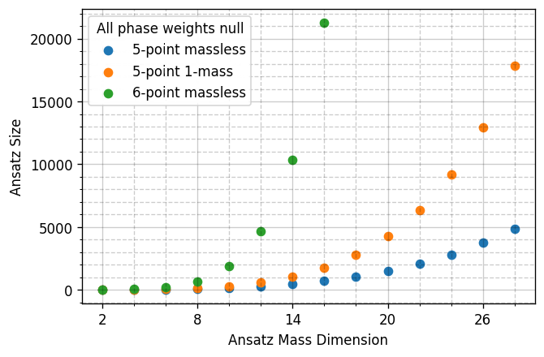
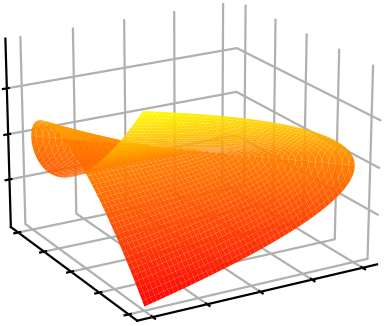



<h3 style="margin-top:5mm; margin-left: -10mm; margin-right: -10mm;">
	<b style="margin-top:15mm; font-size: 32pt;">
	   Rational Functions   
	   in MultiLeg QCD Amplitudes   
        with Masses
	</b>
</h3>

Giuseppe De Laurentis
 

 University of Edinburgh 

 
 

<!--- 
<a href="https://arxiv.org/abs/2311.10086">arXiv:2311.10086</a> 
 (GDL, H. Ita, M. Klinkert, V. Sotnikov) 

<a href="https://arxiv.org/abs/2311.18752">arXiv:2311.18752</a> 
 (GDL, H. Ita, V. Sotnikov) 

--->

<!--- Amplitudes Meeting --->
QCD Meets EW

 CERN 

 

  
  
Find these slides at  <a href="/slides/qcd_meets_ew_feb2024/#/">gdelaurentis.github.io/slides/qcd_meets_ew_feb2024</a> 

---

<section>



# Introduction

---

<b style="font-variant: small-caps; font-size: xxx-large; margin-bottom: 20mm;"> Color Ordered Amplitude Coefficients </b>

$\circ\,$ To obtain cross sections we have to compute amplitudes

$$
\require{color}
\require{amsmath}
\hat{σ}_{n}=\frac{1}{2\hat{s}}\int d\Pi_{n-2}\;(2π)^4δ^4\big(\sum_{i=1}^n p_i\big)\;|\overline{\mathcal{A}(p_i,h_i,a_i,μ_F, μ_R)}|^2
$$

$\circ\,$ The gauge group dependence is fairly well understood, through color decompositions

$$
\mathcal{A}(p_i,h_i,a_i,μ_F, μ_R) = \sum_{\sigma} \mathcal{C}(\sigma \circ a_i) \times A(\sigma \circ \{p_i, h_i\}, \mu_F, \mu_R)
$$

$\circ\,$ So we can deal with either color-ordered amplitudes

$$
\mathcal{A}(\lambda^\alpha, \tilde \lambda^{\,\dot\alpha}) = \sum_{\substack{\Gamma,\\ i \in M_\Gamma}} \frac{ \sum_{k=0}^{\text{finite}} \, {\color{red}c^{(k)}_{\,\Gamma, i}}(\lambda^\alpha, \tilde \lambda^{\,\dot\alpha}) \, \epsilon^k}{\prod_j (\epsilon - a_{ij})} \, I_{\Gamma,i}\left( (\lambda\tilde\lambda)^{\alpha\dot\alpha}, \epsilon\right)  \;, \;\;\text{with} \quad a_{ij} \in \mathbb{Q}
$$

$\phantom{\circ}\,$ or finite remainders (arguably better since they retain all the physical info)

   <a href=https://arxiv.org/abs/hep-ph/9802439> Catani ('98), </a> <a href=https://arxiv.org/abs/0901.0722> Becher, Neubert ('09), </a> <a href=https://arxiv.org/abs/0901.1091> Gardi, Magnea ('09) </a>

 

$$ 
\mathcal{R}^{(\ell-loop)} = \mathcal{A}^{(\ell)}_R - \sum_{i=1}^{\ell} I^{(\ell-i)} \mathcal{A}^{(i-1)} + \mathcal{O}(\epsilon) = \sum_i {\color{red}{r_{i}(\lambda,\tilde\lambda)}} \, h_i(\lambda\tilde\lambda)
$$

---

<b style="font-variant: small-caps; font-size: xxx-large; margin-bottom: -10mm;"> Number of Indep. Functions w/o Subtraction </b>

---

<b style="font-variant: small-caps; font-size: xxx-large"> Numerical Generalized Unitarity </b>
 
<a style="font-size: large; text-align: center; float: center; margin-right: 0mm; margin-top: 0mm; margin-bottom: 0mm;" href=https://arxiv.org/abs/1510.05626>
     Ita ('15)
</a>
<a style="font-size: large; text-align: center; float: center; margin-left:2mm; margin-right: 0mm; margin-top: 0mm; margin-bottom: 0mm;" href=https://arxiv.org/abs/1712.03946>
     Abreu, Febres Cordero, Ita, Page, Zeng ('17)
</a>

$\circ$ We have an Ansatz for the loop integrand

 

$$
\require{color}
\displaystyle A(\lambda, \tilde\lambda, \ell) = \sum_{\Gamma} \, \sum_{i \in M_\Gamma \cup S_\Gamma} \, c_{\,\Gamma,i}(\lambda, \tilde\lambda) \, \frac{m_{\Gamma,i}(\lambda\tilde\lambda, \ell)}{\textstyle \prod_{j} \rho_{\,\Gamma,j}(\lambda\tilde\lambda, \ell)}
$$

$\circ$ Generalized unitarity relates cuts of loop amplitudes to products of trees

     

	     $$
	     \require{color}
	     \displaystyle \sum_{\text{states}} \, \prod_{\text{trees}} A^{\text{tree}}(\lambda, \tilde\lambda, \ell)\big|_{\text{cut}_{\Gamma}} = \sum_{\substack{\Gamma' \ge \Gamma, \\ i \in M_\Gamma' \cup S_\Gamma'}} \kern-2mm c_{\,\Gamma',i}(\lambda, \tilde\lambda) \, \frac{m_{\Gamma',i}(\lambda\tilde\lambda, \ell)}{\displaystyle \prod_{j\in P_{\Gamma'} / P_{\Gamma}} \rho_{j}(\lambda\tilde\lambda, \ell)}\Bigg|_{\text{cut}_\Gamma}
	     $$
	

     

	     

	     	  <code> C++ code </code>
	     
 
	     
	      
	     <a style="font-size: large; text-align: center; float: center; margin-top: -10mm; margin-bottom: 5mm;"
	     	href=https://arxiv.org/abs/2009.11957>
		
 Abreu, Dormans, 

		
 Febres Cordero, Ita  

		
 Kraus, Page, Pascual, 

		
 Ruf, Sotnikov ('20) 

	     </a>
	

     

	     Numerical Berends-Giele recursion for LHS, solve for coeffs. in RHS.
	

---

<b style="font-variant: small-caps; font-size: xxx-large"> Six-Gluon Box Example in D=4 </b>
 

     

          
     

     

          
     

     

     

---

<b style="font-variant: small-caps; font-size: xxx-large"> Integration By Parts Reduction </b>

     $\circ$ Master / surface decomposition for non-planar topologies

$$
\require{color}
\begin{align}
\kern-25mm \text{IBP-generating vectors: } & \quad \displaystyle \int d^D \ell \frac{\partial }{\partial \ell^\mu_a} \frac{v^\mu_a(\ell)}{\rho_1 \dots \rho_N} = 0 \quad (\text{in dim. reg.}) \\[2mm]
\kern-25mm \text{No propagator doubling: } & \quad \displaystyle \sum_{a, \mu} v^\mu_a(\ell) \frac{\partial \rho_i}{\partial \ell^\mu_a} - f_i(\ell)\rho_i = 0
\end{align}
$$

     $(v^\mu_a, f_i)$ form a <i>syzygy module</i>, solved for in <i>embedding space</i> using <code>Singular</code> + linear algebra.

     $\circ$ Semi-numerical surface terms: $\quad m_{i\in S_\Gamma}(\ell \leftarrow \text{analytical}, s_{ij} \leftarrow \text{numerical})$

     $\kern20mm\star$ dependance on external kinematics ($s_{ij}$) obtained from sparse linear systems.

 

     $\circ$ Little group information retained throughout the computation

     $\kern20mm\star$ genuine $c_{\Gamma,i}(\lambda, \tilde\lambda)$ instead of $c_{\Gamma,i}(\lambda\tilde\lambda)$ + conventions for the polarization states.

---

<b style="font-variant: small-caps; font-size: xxx-large; margin-bottom: 10mm;">
   Complexity Swell of Amplitudes Coefficients
</b>

     

          

               $\circ\,$ The rational coefficients take the form
          

           
          

          $$
          \displaystyle r(|i\rangle,[i|) = \frac{\mathcal{N}(|i\rangle,[i|)}{\prod_j \mathcal{D}_j^{q_{ij}}(|i\rangle,[i|)}
          $$
          

          

               $\phantom{\circ}\,$ with $\mathcal{N}$ and $\mathcal{D}$ polynomials of spinor brackets.
          

     

     

          
     

$\circ\,$ For example, consider this 2-loop $Vjj$ coefficient 
($s_{56}=p^2_V$ is a zero, $⟨3|1+4|2]^{5}Δ_{23|14|p_V}^{4}$ are poles): 

<a style="font-size: 10pt; text-align: right; float: right; margin-top: 0mm; margin-bottom: 4mm;">
   GDL, Ita, Page, Sotnikov (W.I.P.)
</a>
<a style="font-size: 10pt; text-align: right; float: right; margin-top: 0mm; margin-bottom: 4mm;" href=https://arxiv.org/abs/2110.07541>
   Abreu, Febres Cordero, Ita, Klinkert, Page, Sotnikov ('21),$\quad$
</a>

$$ 
r^{(73 \text{ of } 120)}_{\bar{u}^+g^-g^+d^-(V\rightarrow \ell^+ \ell^-)} = \frac{105}{128}\frac{⟨2|1+4|3]⟨4|2+3|1]⟨6|1+4|5]s_{14}s_{23}s_{56}(s_{124}-s_{134})(s_{123}-s_{234})(s_{25}+s_{26}+s_{35}+s_{36})}{\color{orange}{⟨3|1+4|2]}\color{red}{Δ_{23|14|56}^4}} + \\
\Bigg[6\frac{[12]^2⟨13⟩[25]⟨34⟩⟨36⟩s_{56}(s_{124}-s_{134})}{\color{orange}{⟨3|1+4|2]^5}}\Bigg] + \Bigg[ \; \Bigg]_{1234\rightarrow \overline{4321}}+ \mathcal{O}\left(\frac{1}{⟨3|1+4|2]^{4}Δ_{23|14|56}^{3}}\right)
$$

$\circ\,$ The first fraction has Ansatz(mass dimension: 16, phase weights: [-1, 1, -1, 1, -1, 1]) of size: 

$$ 
16488 {\small\text{ (six-point massless) }} \rightarrow 4200 {\small \text{ (five-point one-mass) }} \rightarrow 2429 {\small \; (Δ_{23|14|56}-\text{residue})} \rightarrow 1 \; \small{(??)}
$$

---

<b style="font-variant: small-caps; font-size: xxx-large; margin-bottom: 10mm;">
   Plan for this talk
</b>

$1.\,$ Rational Functions w/ Constraints: Algebra and Geometry

$2.\,$ External and Internal Masses

$3.\,$ Vector Spaces over Fields of Fractions

$4.\,$ Analytic Reconstruction

</section>

---

<section>



    

# Multivariate Rational Functions

    

mostly based on:  
[GDL, Page (JHEP 12 (2022) 140)](https://arxiv.org/abs/2203.04269) 

---

<b style="font-variant: small-caps; font-size: 35pt;"> Polynomials ''Modulo Equivalence Relations''  </b>

     $\circ$ The most obvious equivalence relation we need to deal with is momentum conservation

 

$$
q, r: \text{ polynomials }, \qquad q \sim r \quad \text{if} \quad q - r \propto \sum_i p_i = \sum_i |i⟩[i| = 0
$$

     $\circ$ Then we have Schouten identities, e.g.

 

$$
\langle j|k\rangle \langle l|i\rangle + \langle k|i\rangle \langle l|j\rangle + \langle i|j \rangle \langle l|k\rangle = 0
$$

     $\circ$ Note that this happens whenever we have (enough) vectors in the game!

 

$$
\text{tr}_5(2345)p^µ_1 - \text{tr}_5(1345)p^µ_2 + \text{tr}_5(1245) p^µ_3 - \text{tr}_5(1235)p^µ_4 + \text{tr}_5(1234)p^µ_5 = 0
$$

     $\circ$ One more distinct example later ... with masses!

---

<b style="font-variant: small-caps; font-size: xxx-large;"> Polynomial Quotient Rings  </b>

     $\circ$ Without equivalences, we would have a polynomial ring

 

     $$\displaystyle \kern-50mm S_n = \mathbb{F}\left[|1⟩, [1|, \dots, |n⟩, [n|\right]$$

 

     $\phantom{\circ}$ the field $\mathbb{F}$ can be any of $\mathbb{Q},\mathbb{R},\mathbb{C},\mathbb{F}_p,\mathbb{Q}_p,\dots$

 

     $\circ$ Equivalence relations define ideals, e.g.

     $$
     \displaystyle J_{\Lambda_n} = \Big\langle \sum_i |i⟩[i| \Big\rangle_{S_n}
     $$

     
      
     

     	  Artist's Impression of $V(J_{\Lambda_n})$   I can't draw in $4n$ dims!
     

 

     $\phantom{\circ}$ Wwo polynomials $q$ and $r$ are equivalent if $q-r\in J_{\Lambda_n}$

 

     $\circ$ What we need is a polynomial <b>quotient</b> ring$\kern-4mm\phantom{x}^{\star}$: $\;R_n = S_n / J_{\Lambda_n} $

    $r_i(\lambda, \tilde\lambda)$ at $n$-point belong to the Field of Fractions$\kern-4mm\phantom{x}^{\dagger}$ of $R_n$

     $\kern-4mm\phantom{x}^\star R_4$ is "weird" (not a UFD), but it proves that polynomial rings are insufficient;
     $\;\kern-4mm\phantom{x}^\dagger$ The field of fractions of $R_3$ does not exist.

---

<b style="font-variant: small-caps; font-size: xxx-large"> Singularities of Amplitudes  </b>

     $\circ$ Let us consider a very simple example (at 4-point)

 

     $\displaystyle \kern-50mm iA_{g^-g^-g^+g^+}^{\text{tree}} = \frac{\langle 12 \rangle^3}{\langle 23 \rangle \langle 34 \rangle \langle 41 \rangle} = \frac{[34]^3}{[12][23][41]} $

 

     $\phantom{\circ}$ is, say, $\langle 23 \rangle$ a pole of this amplitude?

     
      
     

     	  Artist's Impression of $V(\big\langle \langle 23 \rangle\big\rangle_{R_4})$  
	  as the union of two irreducibles
     

 

     $\circ$ The question is ill posed! Let's consider it geometrically.

     $\phantom{\circ} \langle 23 \rangle$ does not identify an irreducible variety in $R_4$.

     $\phantom{\circ}$ Algebraically, we can compute <i> primary decompositions </i>, e.g.

     $\displaystyle \big\langle \langle 23\rangle \big\rangle_{R_4} = {\color{orange} \big\langle \langle 23\rangle, [14] \big\rangle_{R_4}} \cap {\color{blue} \big\langle \langle 12\rangle, \langle 13 \rangle, \langle 14\rangle, \langle 23\rangle, \langle 24 \rangle, \langle 34 \rangle \big\rangle_{R_4}} $

 

     $\phantom{\circ}$ On the <b style="color: orange"> first branch </b> there is a simple pole, on the <b style="color: blue"> latter branch </b> the amplitude is regular.

    Poles & Zeros $\;\Leftrightarrow\;$ Irreducible Varieties $\;\Leftrightarrow\;$ Prime Ideals  
    <i style="font-size: 12pt; border-top: -8mm; border-bottom: -2mm;"> Physics $\kern38mm$ Geometry $\kern38mm$ Algebra </i>

---

<b style="font-variant: small-caps; font-size: xxx-large; margin-top:-10mm;"> Spinor Alphabets </b>

     $1.$ little group covariant LCD (less spurious poles); $\;\;2.$ avoiding parity even/odd split.  
     $\Rightarrow\;$ fewer and simpler functions to reconstruct compared to Mandelstams or Twistors.

     $\circ\,$ The denominator factors $\mathcal{D}_j$ are conjectured to be restricted to the letters of the symbol alphabet

  

<a style="font-size: large; text-align: right; float: right; margin-top: 0mm; margin-bottom: 0mm;" href=https://arxiv.org/abs/1812.04586>
   Abreu, Dormans, Febres Cordero, Ita, Page ('18)
</a>

 

     $$
     \displaystyle \{\mathcal{D}_{\{1,\dots,35\}}\} = \bigcup_{\sigma \; \in \; \text{Aut}(R_5)} \sigma \circ \big\{ \langle 12 \rangle, \langle 1|2+3|1] \big\} \, , \qquad \text{Aut}(R_5) = \mathcal{P} \times \mathcal{S}_5
     $$

     $\small\qquad\color{green}\text{Identical to 1-loop!}$

     $\circ\,$ Beyond 5-point things get tough

 

     $\displaystyle \kern-10mm \{\mathcal{D}_j\} = \bigcup_{\sigma \; \in \; \text{Aut}(R_6)} \sigma \circ \big\{ \langle 12 \rangle, \langle 1|2+3|1], \langle 1|2+3|4], s_{123}, \Delta_{12|34|56}, ⟨3|2|5+6|4|3]-⟨2|1|5+6|4|2] \big\} $

     $\small\qquad\color{red}\text{New @ 2-loop planar!}\qquad$

     $$
     \displaystyle \kern-10mm \{\mathcal{D}_j\} = \bigcup_{\sigma \; \in \; \text{Aut}(R_7)} \sigma \circ \big\{ \langle 12 \rangle, \langle 1|2+3|1], \langle 1|2+3|4], s_{123}, \Delta_{123|45|67},
     $$

     $$
     \kern130mm\langle1|2+3|4+5|1\rangle, \langle1|3+4|5+6|2\rangle , \dots(?)\big\}
     $$

     $\phantom{\circ}$ Non-trivial statement (not proven!): all irreducible polynomials generate prime ideals in $R_{m>4}$.

---

<b style="font-variant: small-caps; font-size: xxx-large"> Least Common Denominator </b>

$\circ\,$ Can't draw pictures in high (complex) dimensions, so let's consider the simplified case $\mathbb{R}[x, y, z]$.

$\circ\,$ Say we have a potential denominator factor $\mathcal{D} = xy^2 + y^3 - z^2$

	

	       
	     ${\color{orange}\mathcal{D} = (xy^2 + y^3 - z^2)}$
	

	

	     A function $f_i(x,y,z)$ may or may not have $\mathcal{D}$ as a pole, depending on what happens on $V(\langle\mathcal{D}\rangle)$
	

	

	     $\displaystyle \lim_{\mathcal{D}_j \rightarrow \epsilon} f_i(x,y,z) \sim \frac{1}{\epsilon^{q_{ij}}} $
	

	

	     $q_{ij}$ is the order of the pole ($\mathbb{Z}^+$) or zero ($\mathbb{Z}^-$).
	

        

    The LCD tells us about what happens on surfaces with one less dimension than the full space.

---

<b style="font-variant: small-caps; font-size: xxx-large"> Codimension-One Slices </b>

     $\circ\,$ What we have reliably available at 2-loop are $\mathbb{F}_p$ evaluations.

   <a href=https://arxiv.org/abs/1406.4513> von Manteuffel, Schabinger ('14), </a> 
   <a href=https://arxiv.org/abs/1608.01902> Peraro ('16) </a>

     $\phantom{\circ}\,$ ($\mathbb{Q}_p$ is doable, but potentially very slow / unstable - dependening on the point.)

 

     $\circ\,$ Issue: the limit can be taken in $\mathbb{R}$, $\mathbb{C}$, $\mathbb{Q}_p$ but ${\color{red}\text{not}}$ in $\mathbb{F}_p$ .

     $\circ\,$ Solution: univariate Thiele rational interpolation on a line going through each $V(\langle \mathcal{D}_j \rangle)$

 

     $$
     \displaystyle |i\rangle \rightarrow |i\rangle (t) = |i\rangle + t c_i |\eta\rangle ,  \qquad |i] \rightarrow |i] \, , \qquad
     \text{s.t.} \quad \sum_i c_i |i] = 0
     $$

   <a href=https://indico.desy.de/event/28075/> Page ('21), </a> 
   <a href=https://arxiv.org/abs/2305.17056> Abreu, GDL, Ita, Klinkert, Page, Sotnikov ('23) </a>

     $\circ\,$ After interpolation on the (anti-)holomorphic slice, the rational functions read

 

     $$
     \displaystyle r_i(t) = \frac{\mathcal{N}(t)}{\prod_j (t-t_{\mathcal{D}_j})^{q_{ij}}}
     $$

     $\phantom{\circ}\,$ where $t_{\mathcal{D}_j}$ is simply the solution to $\mathcal{D}_j(t) = 0$. We read off the $q_{ij}$.

     $\circ\,$ Issue: in $\color{red}\text{LCD}$ form the Ansatz has $\color{red}\text{too many free parameters}$, e.g. $\bar{u}^+g^+g^+d^-(V\rightarrow \ell^+ \ell^-)$

 

     size(Ansatz(54, [0, 0, 2, 2, -1, 1])) = $1\,209\,546$

    

---

<b style="font-variant: small-caps; font-size: xxx-large"> Multivariate Partial Fractions </b>

$\circ\,$ To distinguish $\displaystyle \frac{\mathcal{N}_{12}}{W_1W_2}$ from $\displaystyle \frac{\mathcal{N}_1}{W_1} + \frac{\mathcal{N}_2}{W_2}$, look at $W_1 \sim W_2 \rightarrow \epsilon \ll 1$. Geometrically:

	

	       
	     ${\color{orange}V(W_1) = V(\langle xy^2 + y^3 - z^2 \rangle)}$
	

	

	       
	     ${\color{blue}V(W_2) = V(\langle x^3 + y^3 - z^2\rangle )}$
	

	

	       
	     $V(W_1) \cap V(W_2)$
	

$\circ\,$ <i> Primary decompositions </i> of sets of polynomials (<i> ideals </i>), anogous to integers:

	

	     $60 = 5 \times 3 \times 2^2$
	

	

	     $\langle{\color{orange}xy^2 + y^3 - z^2}, {\color{blue}x^3 + y^3 - z^2}\rangle = \\
	     {\color{magenta}\langle z^2,x+y\rangle} \cup {\color{green}\langle y^3-z^2,x\rangle} \cup {\color{red}\langle2y^3-z^2,x-y\rangle}$
	

  

$\circ\,$ Whether a partial fraction decomposition is possible depends on the behavior on the 3 lines.

---

<b style="font-variant: small-caps; font-size: xxx-large"> Beyond Partial Fractions </b>

     $\circ$ $\color{red}\text{Case 0}$: the ideal does $\color{green}\text{not involve denominator factors}$.

     E.g. a 6-point function $c_i$ has a pole at $⟨1|2+3|4]$ but not at $⟨4|2+3|1]$,

     yet it is regular on the irreducible surface $V(\big\langle ⟨1|2+3|4], ⟨4|2+3|1] \big\rangle)$. Then

  

     $\displaystyle c_i \sim \frac{⟨4|2+3|1]}{⟨1|2+3|4]} + \mathcal{O}(⟨1|2+3|4]^0) \; \text{ instead of } \; c_i \sim \frac{1}{⟨1|2+3|4]}  + \mathcal{O}(⟨1|2+3|4]^0)$

     $\circ$ $\color{red}\text{Case 1}$: the $\color{green}\text{degree of vanishing is non-uniform}$ across branches, for example:

 

     $\displaystyle \frac{s_{14}-s_{23}}{⟨1|3+4|2]⟨3|1+2|4]}$

     has a double pole on the first branch, and a simple pole on the second branch of

 

     $\big\langle⟨1|3+4|2], ⟨3|1+2|4]\big\rangle_{R_6} = \big\langle ⟨13⟩, [24] \big\rangle_{R_6} \cap \big\langle ⟨1|3+4|2], ⟨3|1+2|4], (s_{14}-s_{23})\big\rangle_{R_6}$

     $\circ$ $\color{red}\text{Case 2}$: ideal is $\color{green}\text{non-radical}$

   <a href=https://arxiv.org/abs/2203.17170> Campbell, GDL, Ellis ('22) </a>

 

     $\displaystyle \small \kern0mm \sqrt{\big\langle {\color{black}⟨3|1+4|2]}, {\color{black}Δ_{23|14|56}} \big\rangle_{R_6}} = \big\langle {\color{black}⟨3|1+4|2]}, {\color{black}s_{124}-s_{134}} \big\rangle_{R_6} $

</section>

---

<section>



<h1 style="margin-top: -8mm;"> Functions with masses </h1>

---

<b style="font-variant: small-caps; font-size: xxx-large"> External Masses </b>

$\circ\,$ Rescale propagators to make them look massless, e.g.

$$
\mathcal{A}(pp \rightarrow Vjj) = \frac{p_V^2}{p_V^2-m_V^2}\mathcal{A}(pp \rightarrow Vjj)\Big|_{m_V=0} 
$$

$\circ\,$ Say $p_V^2 = \langle56\rangle[65]$, we observe $\mathcal{N}_i \in \Big\langle \langle56\rangle , [56] \Big\rangle$ for all 2-loop coeffs. in $pp\rightarrow Vjj$.

   <a>  GDL, Ita, Page, Sotnikov (work in progress) </a>

$\circ\,$ In general, the singularities of amplitudes w/ massess look like those in the decay kinematics

$$
\text{e.g.:} \qquad \{1,2,3,\boldsymbol{4},\boldsymbol{5}\} \sim \{1,2,3,(\boldsymbol{4}\rightarrow4+5),(\boldsymbol{5}\rightarrow6+7)\} + \text{constraints (e.g. deg. bound.)}
$$

<b style="font-variant: small-caps; font-size: xx-large"> Modifying the Quotient Ring  </b>    

$\circ\,$ $pp\rightarrow hhj$ with exact $m_{top}$ dependence at LO/1-loop, subject to $p_{h_1}^2 = p_{h_2}^2$.  
$\phantom{\circ}\,$ We work in the modified version of the $R_7$ q-ring, namely:

   <a>  Campbell, GDL, Ellis (work in progress) </a>

$$
\tilde{R}_7 = \mathbb{Q}_p\Big[ |1\rangle, [1|, \dots, |7\rangle, [7| \Big] \big/ \Big\langle \sum_{i=1}^7 |i\rangle[i|, s_{45} - s_{67} \Big\rangle
$$

---

<b style="font-variant: small-caps; font-size: xxx-large"> Internal Masses - The Easy Case </b>

$\circ\,$ If the only dependence is in the numerator, then a Taylor expansion is generally enough (like $\epsilon$).  
$\phantom{\circ}\,$ For instance, taking results from $0 \rightarrow q\bar q (V\rightarrow \ell\bar\ell )(V'\rightarrow \ell'\bar\ell') g$ w/ massive q-loop

   <a href=https://arxiv.org/abs/2203.17170> Campbell, GDL, Ellis ('22) </a>

 

$$
\begin{eqnarray} \label{basicexpansion}
d_{\{i\times j\times k\}}&=\;(v_L^2+v_R^2)\, &\big[m^0 d_{\{i\times j\times k\}}^{(0)}+m^2 d_{\{i\times j\times k\}}^{(2)}+m^4 d_{\{i\times j\times k\}}^{(4)}\big] \nonumber \\
 &\;+\;v_L v_R &\big[ m^2 \tilde{d}_{\{i\times j\times k\}}^{(2)}+m^4 \tilde{d}_{\{i\times j\times k\}}^{(4)} \big] \, .
\end{eqnarray}
$$

$\circ\,$ Where e.g. $d_{\{12\times34\times56\}}^{(4)}$ is: (using $\Gamma_{34|56} = |3+4|5+6|$, and tilde for anti-symm.)

$$
d_{\{12\times34\times56\}}^{(4)}=\frac{[2|\tilde\Gamma_{34|12|56}|1\rangle}
{s_{12}s_{34}s_{56}\langle7|\Gamma_{34|56}|7\rangle}
\left(\frac{[4|\tilde\Gamma_{34|12|56}|3\rangle[6|\tilde\Gamma_{34|12|56}|5\rangle}
{\langle7|\Gamma_{34|56}|7\rangle[7|\Gamma_{34|56}|7]}
-\langle3|5\rangle[4|6]
\right)
$$

$\circ\,$ Which follows from the following primary decomposition

$$
\big\langle ⟨7|\Gamma_{34|56}|7⟩, [7|\Gamma_{34|56}|7] \big\rangle = \big\langle ⟨7|\Gamma_{34}|7], ⟨7|\Gamma_{56}|7], ⟨7|\Gamma_{34|56}|7⟩, [7|\Gamma_{34|56}|7] \big\rangle  \nonumber \\
\kern50mm \quad \cap  \; \big\langle  ⟨7|\Gamma_{34|56}|7⟩, [7|\Gamma_{34|56}|7], \tilde\Gamma_{12|34|56} \big\rangle \, .
$$

---

<b style="font-variant: small-caps; font-size: xxx-large"> Internal Masses - The Hard Case </b>

$\circ\,$ The poles have mixed mass-kinematics dependence, e.g.

$$
(-s_{12}⟨1|\boldsymbol{5}|\boldsymbol{4}|3⟩[32]⟨23⟩[3|\boldsymbol{4}|\boldsymbol{5}|1]+m_t^2([1|2|3|\boldsymbol{4}|1⟩-⟨1|2|3|\boldsymbol{4}|1])^2) \\
(-s_{13}⟨1|\boldsymbol{4}|2]⟨2|\boldsymbol{4}|1]⟨2|\boldsymbol{5}|3]⟨3|\boldsymbol{5}|2]+m_t^2([1|2|3|\boldsymbol{4}|1⟩-⟨1|2|3|\boldsymbol{4}|1])^2)
$$

$\phantom{\circ}\,$ For instance, this happens at one loop with $D=4$ cuts and pentagon diagrams.

$\circ\,$ The "proper" approach would probably be to add $m_t$ to the q-ring and compute decompositions.  
$\phantom{\circ}\,$ This is highly non-trivial; also hard to avoid spurious singularities, e.g. $\text{tr}_5$ or spurious $\langle ij\rangle$.

$\circ\,$ An approach is to use <i>effective pentagon</i> coeffs., schematically

$$
\text{Box} = (\text{Reduction coeff.})\times(\text{Effective pentagon}) + (\text{Effective Box})
$$

$\phantom{\circ}\,$ where only the Effective pentagon has the $m$-dependent pole.

$\circ\,$ (Discussion) When does this happen at 2-loop? Do you need 9 propagators?

</section>

---

<section>



<h1 style="margin-top: 55mm; "> Vector Spaces   of Rational Functions </h1>

     GDL, Ita, Page, Sotnikov - to appear; $\quad$
     GDL, Ita, Klinkert, Sotnikov <a href="https://arxiv.org/abs/2311.10086">arXiv:2311.10086</a>

---

<b style="font-variant: small-caps; font-size: xxx-large"> Complexity of the Reconstruction </b>

     $\circ\,$ Sort the $r_i$ by mass dimension of $\mathcal{N}$ ($\approx$ Ansatz size), pick simplest subset forming a basis $r_{i \in \mathcal{B}}$

---

<b style="font-variant: small-caps; font-size: xxx-large"> Picking a Basis </b>

     $\circ\,$ We start from something of the form:

 

     $$
     R = r_{i\in \mathcal{B}} M_{ij} h_j \, , \qquad M_{ij} \in \mathbb{Q}
     $$

     $\phantom{\circ}\,$ with $r_{i\in \mathcal{B}} \subset r_i$, i.e. $M_{ij}$ is in reduced row echelon form, up to a permutation of columns.

     $\circ\,$ Basic idea: change basis from a subset of pentagon function coefficients, to linear combinations

  

     $$
     \tilde{r}_{i'} = O_{i'i} \, r_{i \in \mathcal{B}} \quad \text{s.t.} \quad \text{rank}(O_{i'i}) = \text{dim(span}_{FF(R_5), \mathbb{Q}}(r_{i}))
     $$

     $\circ\,$ Key insight: 

 

     $$
     \text{dim(span}_{FF(R_5), \mathbb{Q}}\left(\lim_{\mathcal{D_j} \rightarrow  0 }r_{i}\right)) \leq \text{dim(span}_{FF(R_5), \mathbb{Q}}(r_{i}))
     $$

     $\phantom{\circ}\,$ I.e., the pole residues are correlated, build linear combinations that <i> ''remove the overlap'' </i>

---

<b style="font-variant: small-caps; font-size: xxx-large"> Correlation of Residues </b>

     $\circ\,$ Build Laurent expansions around $t_{\mathcal{D}_k}$  (use same kind of slice <a href="slides/fivepartons_dec2023/#/3/4">as before</a>)

 

     $$
     r_{i \in \mathcal{B}} = \sum_{m = 1}^{q_k = \text{max}_i(q_{ik})} \frac{e^k_{im}}{(t-t_{\mathcal{D}_k})^m} + \mathcal{O}((t-t_{\mathcal{D}_k})^0)
     $$

     $\phantom{\circ}\,$ strictly formal over $\mathbb{F}_p$, but convergent over $\mathbb{Q}_p$ for $(t-t_{\mathcal{D}_k}) \propto p$

     $\circ\,$ Repeat for several (anti-)holomorphic slices, build vectors

  

     $$
     \vec{e}^k_{im} = (e^k_m)_{ij} = \{ e^k_{im}(\text{slice}_1), \dots, e^k_{im}(\text{slice}_n)  \}
     $$

     $\circ\,$ By Gaussian elimination on the matrix $(e^k_m)_{ij}$ we can partition the space:

 

     $$
     \text{span}_{\vec{\mathbb{Q}},\mathbb{Q}}(r_{i \in \mathcal{B}}) = \text{column}_{\vec{\mathbb{Q}},\mathbb{Q}}(\text{Res}(r_{i \in \mathcal{B}}, \mathcal{D}_k^m)) \oplus \text{null}_{\vec{\mathbb{Q}},\mathbb{Q}}(\text{Res}(r_{i \in \mathcal{B}}, \mathcal{D}_k^m))
     $$

    Interpretation of $\text{null}_{\vec{\mathbb{Q}},\mathbb{Q}}(\text{Res}(r_{i \in \mathcal{B}}, D_k^m)) \cdot r_{i \in \mathcal{B}}$: functions that do <u>not</u> have a $D_k^m$ singularity

---

<b style="font-variant: small-caps; font-size: xxx-large"> Breadth-First Search </b>

     $\circ\,$ If a function $\tilde{r}$ does not have poles $D_{k_1}^{m_1}$ and $D_{k_2}^{m_2}$, then

 

     $$
     \tilde{r} \in \text{span}_{FF(R_5),\mathbb{Q}}\Bigg[\Big(\text{null}_{\vec{\mathbb{Q}},\mathbb{Q}}(\text{Res}(r_{i \in \mathcal{B}}, D_{k_1}^{m_1})) \cap \text{null}_{\vec{\mathbb{Q}},\mathbb{Q}}(\text{Res}(r_{i \in \mathcal{B}}, D_{k_2}^{m_2}))\Big)_{i'i} \; \cdot \; r_{i\in \mathcal{B}}\Bigg]
     $$

     $\circ\,$ Build linear combination that remove as many singularities as possible, without dropping rank

 

     $$
     \displaystyle O_{i'i} = \cap_{k, m} \, \text{nulls}_{\vec{\mathbb{Q}},\mathbb{Q}} \qquad \text{(schematically)}
     $$

     $\circ\,$ This is done by searching a tree of possibilities of which pole gets dropped to which order.  
     $\phantom{\circ}\,$ Several optimizations required to search an otherwise proibitively large space, naively of size

  

     $$
     \prod_k (m_k + 1) \quad \text{with } \; k \;\text{ enumerating } \; D_k^{m_k}
     $$

---

<b style="font-variant: small-caps; font-size: xxx-large"> Least Least-Common-Denominator </b>
 

     $\circ$ In other words, we have reshuffled the $r_i$ by linear combinations of the others $r_{j\neq i}$

     $\displaystyle \tilde{r}_i = \sum_{j\neq i} O_{ij} r_j + r_i$

 

     $\circ\,$ The rational functions now take the form

 

     $$
     \displaystyle \tilde{r}_i(|i\rangle,[i|) = \frac{\tilde{\mathcal{N}}(|i\rangle,[i|)}{\prod_j D_j^{\tilde{q}_{ij}}(|i\rangle,[i|)}
     $$

     $\phantom{\circ}\,$ where we have minimized $\sum_j \tilde{q}_{ij}$, compared to the $r_i$.

 

     $\circ\,$ This is the closest thing that I am aware of to a Gram–Schmidt procedure for vector spaces over fields that are not number fields, but in this case fields of fractions over polynomial quotient rings.

     $\circ\,$ Can we think of this as defining an inner product on the space of rational functions?

   

     $$
     O_{ij} \sim \langle r_i | r_j \rangle \qquad \text{(very schematically)}
     $$

     (Discussion) Is there a connection to intersection theory?

</section>

---

<section>



# Analytic Reconstruction

---

<b style="font-variant: small-caps; font-size: xxx-large"> The Numerator Ansatz </b>

$\circ\,$ The numerator Ansatz takes the form

<a style="font-size: large; text-align: right; float: right; margin-top: -6mm; margin-bottom: 4mm;" href=https://arxiv.org/abs/1904.04067>
   GDL, Maître ('19)
</a>

$\displaystyle \text{Num. poly}(\lambda, \tilde\lambda) = \sum_{\vec \alpha, \vec \beta} c_{(\vec\alpha,\vec\beta)} \prod_{j=1}^n\prod_{i=1}^{j-1} \langle ij\rangle^{\alpha_{ij}} [ij]^{\beta_{ij}}$

     $\phantom{\circ}$ subject to constraints on $\vec\alpha,\vec\beta$ due to: 1) mass dimension; 2) little group; 3) linear independence.

 

$\circ\,$ Construct the Ansatz via the algorithm from Section 2.2 of <a href=https://arxiv.org/abs/2203.04269>GDL, Page ('22)</a>

Linear independence = irreducibility by the Gröbner basis of a specific ideal.

<!---

$
\begin{align}
	\textstyle \sum_{j=1}^n\sum_{i=1}^{j-1} (\alpha_{ij} + \beta_{ij}) & = d \quad \text{: mass dimension} \\[2mm]
	\textstyle \sum_{j=1}^n\sum_{i=1}^{j-1} \alpha_{ij}\underbrace{\{\langle ij \rangle\}_k}_{\delta_{ik}+\delta_{jk}} + \beta_{ij}\underbrace{\{[ij]\}_k}_{-\delta_{ik}-\delta_{jk}} & = \phi_k \quad \text{: k}^{th}\text{ little group weight}
\end{align}
$

--->

$\circ\,$ Efficient implementation using open-source software only

     <!---
	

	     
 <code> Lips </code> 

	     
 Spinor ideal 

	     <a style="font-size: large; text-align: center; float: center; margin-top: 0mm; margin-bottom: 5mm;"
	     href=https://arxiv.org/abs/2305.14075>
		GDL ('23)
	     </a>	    
	

    --->
	

	       
	     Gröbner bases $\rightarrow$ constrain $\vec\alpha,\vec\beta$  
	     <a style="font-size: large; text-align: center; float: center; margin-top: -10mm; margin-bottom: 5mm;"
	     href=https://www.singular.uni-kl.de/index.php.html>
		Decker, Greuel, Pfister, Schönemann
	     </a>	    
	

	

	       
	     Integer programming $\rightarrow$ enumerate sols. $\vec\alpha,\vec\beta$  
	     <a style="font-size: large; text-align: center; float: center; margin-top: -10mm; margin-bottom: 5mm;"
	     href=https://www.singular.uni-kl.de/index.php.html>
		Perron and Furnon (Google optimization team)
	     </a>
	

    

$\circ\,$ Linear systems solved w/ CUDA over $\mathbb{F}_{2^{31}-1}$ ($t_{\text{solving}} \ll t_{\text{sampling}}$) w/ <a href=https://github.com/GDeLaurentis/linac-dev> linac </a>  (coming soon-ish) 

---

<b style="font-variant: small-caps; font-size: xxx-large"> Some Public Computational Tools </b>

---

<b style="font-variant: small-caps; font-size: xxx-large"> Five-Parton Results in Full Color </b>
 

   <a href=https://arxiv.org/abs/2311.10086> GDL, Ita, Klinkert, Sotnikov ('23), </a>
   <a href=https://arxiv.org/abs/2311.18752> GDL, Ita, Sotnikov ('23); </a>
   see also
   <a href=https://arxiv.org/abs/2311.09870> Agarwal, Buccioni, Devoto, Gambuti, von Manteuffel, Tancredi ('23) </a>

$\circ\,$ The basis of the vector space is now quite easy! ($r_{115}^{--}$ is the most complicated function)

     

     

---

<b style="font-variant: small-caps; font-size: xxx-large"> Outlook: More Legs and/or Masses </b>
 

$\circ\,$ New mathematical tools help tackle the increasing complexity of amplitudes in the precision era.

$\circ\,$ Preliminary results for $pp\rightarrow Wjj$ are around $25 MB$ (down from $1.2GB$    ),  
$\phantom{\circ}\,$ with the quark-channel basis functions down to $125 KB$, of which 25 of 92 functions are:

</section>

---

<section>



# Summary

---

<b style="font-variant: small-caps; font-size: xxx-large"> Summary </b>
 

     We talked about:

     $1.\,$ Rational Functions in the Field of Fractions of Polynomial Quotient Rings:  
     $\qquad\circ\,$ How to enforce constraints on polynomials;  
     $\qquad\circ\,$ The relation between physics $\leftrightarrow$ algebra $\leftrightarrow$ geomtry;  
     $\qquad\circ\,$ The role of the Least Common Denominator, and how to obtain it  
     $\qquad\circ\,$ Partial fraction decompositions from higher-codimension information

     $2.\,$ Different cases where masses appear:  
     $\qquad\circ\,$ External masses  
     $\qquad\circ\,$ Internal masses (simple Laurent expansion)  
     $\qquad\circ\,$ Internal masses (mass- and kinematic-dependent poles)

     $3.\,$ Vector Spaces over Fields of Fractions  
     $\qquad\circ\,$ Correlation between residues, a.k.a. basis change;  
     $\qquad\circ\,$ Its consequences on what functions need to be obtained.

     $4.\,$ Analytic Reconstructions from an Ansatz

</section>

---

<section>

<!---
<b style="font-variant: small-caps; font-size: xxx-large; margin-bottom: 10mm;">
   Conclusions
</b>

     $\circ\,$ Full-color 5-point massless amplitudes are well within reach, 

     $\circ\,$ Subleading color corrections can be fairly sizable

     $\circ\,$ The reconstruction can be peformed in spinor-helicity variables, which yield compact results

     $\circ\,$ Understanding the partial fraction structure of amplitudes is essential to tame their complexity

---
--->

<b style="font-variant: small-caps; font-size: xxx-large;"> Thank you! </b>
 
 
 
<!---
<b style="font-variant: small-caps; font-size: xx-large;"> Questions? </b>
--->

    These slides are powered by: 
    
        <a href="https://en.wikipedia.org/wiki/Markdown">markdown</a>, 
        <a href="https://en.wikipedia.org/wiki/HTML">html</a>, 
        <a href="https://revealjs.com/">revealjs</a>, 
        <a href="https://gohugo.io/">hugo</a>, 
        <a href="https://www.mathjax.org/">mathjax</a>, 
        <a href="https://github.com/">github</a>
    

<!---
 

     For open source packages: 
     <code>
          $   $ pip install [lips](https://github.com/GDeLaurentis/lips) [pyadic](https://github.com/GDeLaurentis/pyadic)
     </code>

--->

</section>

<!---
---

<section>

# Backup Slides

---

<b style="font-variant: small-caps; font-size: xxx-large; margin-bottom: -5mm;"> Constraints from Poles </b>
 
<b style="font-variant: small-caps; font-size: x-large; margin-top: -16mm;"> Bootstrapping trees (?) </b>

     $\circ$ The degree of divergence / vanishing on various surfaces imposes strong constraints, e.g.

     $ A^{\text{tree}}_{q^+g^+g^+\bar q^-g^-g^-} = \frac{\mathcal{N(\text{m.d.} = 6\,,\; \text{p.w.} = [-1, 0, 0, 1, 0, 0])}}{\langle 12\rangle\langle 23\rangle\langle 34\rangle [45][56][61]s_{345}}$

     $\circ$ Pretend this is un unknown integral coefficient, $\mathcal{N}$ has 143 free parameters.

     $\circ$ List the various prime ideal, such as

   

     $ \big\langle \langle 12\rangle, \langle 23\rangle, \langle 13\rangle \big\rangle, \; \big\langle |1\rangle \big\rangle, \; \big\langle \langle 12\rangle, |1+2|3]\big\rangle, \dots$

     $\phantom{\circ}$ and impose that $\mathcal{N}$ vanishes to the correct order. We determine it up to an overall constant.

<a style="font-size: large; text-align: right; float: right; margin-top: -2mm; margin-bottom: 0mm;" href=https://arxiv.org/abs/2207.10125>
     GDL, Page ('22)
</a>

     $\circ$ Likewise, the ansatz for $A^{\text{tree}}_{g^+g^+g^+ g^-g^-g^-}$ shrinks $1326 \rightarrow 1$, etc..

   

     <i> Effectively, we can <b> compute </b> trees, just from their <u>poles orders</u>.   Note: compared to BCFW there is <u>no</u> information about <u>residues</u>. </i>

---

<b style="font-variant: small-caps; font-size: xxx-large"> Partial Fraction Decompositions </b>

     $\circ$ For true integral coefficients, we can't rely on the Ansatz to shrinks to an overall constant.

     $\circ$ Partial fraction decompositions (PFDs) are a popular method to tame algebraic complexity.

     $\circ$ In my opinion, a PFD algorithm needs

   

     $1.$ to say if two poles $W_a$ and $W_b$ are separable into different fractions;  
     $2.$ ideally, to answer $(1.)$ without having access to an analytic expression. 

     $\circ$ Hilbert's nullstellensatz: if $\mathcal{N}$ vanishes on all branches of $\langle W_a, W_b \rangle$, then the PFD is possible$\kern-3mm\phantom{x}^\dagger$.

     $\circ$ Generalizing to powers $>\kern-1mm 1$ can be done via symbolic powers and the Zariski-Nagata Theorem.

<a style="font-size: large; text-align: right; float: right; margin-top: 1mm; margin-bottom: 0mm;" href=https://arxiv.org/abs/.>
   GDL, Page ('22)
</a>

     $\circ$ Similarly, generalizing to non-radical ideals requires ring extensions.

<a style="font-size: large; text-align: right; float: right; margin-top: 0mm; margin-bottom: 0mm; margin-right: 33mm;" href=https://arxiv.org/abs/.>
   Campbell, GDL, Ellis ('22)
</a>

     <b> Issue: </b>evaluations on singular surfaces are expensive, but are not always needed!

     <b> Opportunity: </b>we get more than partial fraction decompositions.

      

     $\kern-4mm\phantom{x}^\dagger$ $\langle W_a, W_b\rangle$ needs to be radical.

</section>

--->

<!-- REVEAL.JS CUSTOMIZATION -->

<!-- Include MathJax library -->

<!-- Include Reveal.js and the Math plugin -->

<!-- Initialize Reveal.js with the MathJax plugin -->

