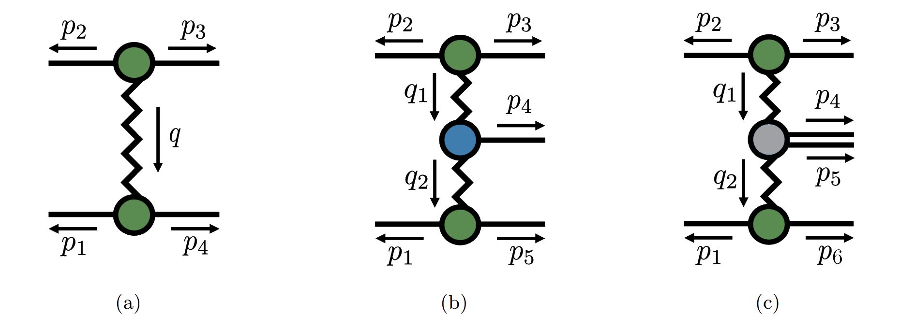
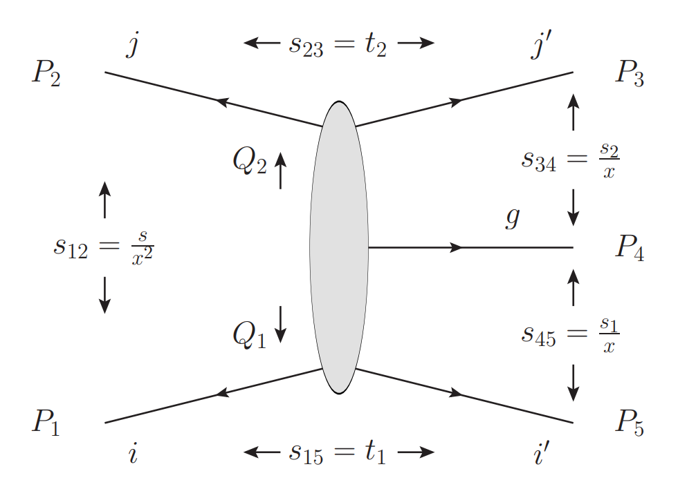



<h3 style="margin-top:5mm; margin-left: -10mm; margin-right: -10mm;">
	<b style="margin-top:15mm; font-size: 31pt; text-transform: none;">
          Towards the complete NNLO BFKL Kernel
	</b>
</h3>

Giuseppe De Laurentis
 

 University of Edinburgh 

 

 One Central Emission at Two Loops 

<a href="https://arxiv.org/pdf/2412.20578">arXiv:2412.20578</a> <a href="https://link.springer.com/article/10.1007/JHEP04(2025)161">(10.1007/JHEP04(2025)161)</a>

 with S. Abreu, G. Falcioni, E. Gardi, C. Milloy, L. Vernazza 

 

 Two Central Emissions at One Loop 

 To Appear 

 with E. Byrne, V. Del Duca, E. Gardi, J. Smillie 

REF Conference

 Milan, IT 

  
   
Find these slides at  <a href="/slides/REFOct2025/#/">gdelaurentis.github.io/slides/REFOct2025</a> 

---

<section>



# Introduction

---

<b style="font-variant: small-caps; font-size: 32pt"> Large Logarithms from Big Rapidity Gaps  </b>

     $\circ\,$ In the <b>forward limit</b> $s \gg t$ (large CoM energy vs. momentum transfer), e.g. $2\to 2$ scattering,

     $\phantom{\circ}\,$ final state emissions develop <b> large rapidity gaps</b>. The cross section grows as

$$
\sigma \approx \mathcal{O}\big(\alpha_s^n \log^n(s/|t|)\big )
$$

     $\phantom{\circ}\,$ which is unphysically large (e.g. it violates the Froissart bound).

     $\circ\,$ The BFKL kernel captures the <b>exponentiation</b> of these <b>large logarithms</b>, 
     $\phantom{\circ}\,$ allowing us to <b>resum</b> their contribution to the cross section.

<a href="https://www.sciencedirect.com/science/article/abs/pii/0370269375905249"> Fadin, Kuraev, Lipatov `75</a>;$\;$<a href="https://inspirehep.net/literature/137229"> Balitsky, Lipatov `78</a>

     $\circ\,$ In this kinematic limit, known as <b>Multi-Regge Kinematics</b> (MRK), an effective particle is  
     $\phantom{\circ}\,$ exchanged in the t-channel, a Reggeon, from which more rapidity-gapped radiation can be emitted.

---

<b style="font-variant: small-caps; font-size: 32pt; margin-bottom: 0mm;"> Amplitude Factorization in MRK and NMRK </b>

     $\circ\;$ In the (N)MRK we can picture the amplitude as follows

 
 Images adapted from <a href="https://arxiv.org/abs/2312.15051"> Byrne `23</a>

     $\phantom{\circ}\;$ where: the ziggly line is the <b>Regge trajectory</b> $\mathcal{R}$, the green blobs are <b>impact factors</b> $\mathcal{C}$, the blue  
     $\phantom{\circ}\;$ blob is a one-emission <b>central vertex</b> $\mathcal{V}_g$, and the gray blob is a two-emission central vertex $\mathcal{V}_{gg}$.

     $\circ\;$ The amplitude factorise as follows (very schematically)

$$
\mathcal{A}_4 \approx \mathcal{C}  \, \mathcal{R} \, \mathcal{C} \, , \qquad
\mathcal{A}_5 \approx \mathcal{C}  \, \mathcal{R} \, \mathcal{V}_g \, \mathcal{R} \, \mathcal{C} \, , \qquad
\mathcal{A}_6 \approx \mathcal{C}  \, \mathcal{R} \, \mathcal{V}_{gg} \, \mathcal{R} \, \mathcal{C}
$$

     $\phantom{\circ}\;$ where each component admits an expansion in powers of $\alpha_s$, thus e.g. $\mathcal{A}_4^{(1)}$ gives us $\mathcal{C}^{(1)}$ and $\mathcal{R}^{(1)}$

</section>

---

<section>



<h1 style="margin-top: -2mm;"> Kernel Components </h1>

---

<b style="font-variant: small-caps; font-size: 32pt"> Leading Order Kernel Components </b>

Leading-Log (LL) Resummation: $\mathcal{O}\big(\alpha_s^n \log^n(s/|t|)\big )$

     $\circ\,$ The two components of the leading order (LO) BFKL kernel,  
     $\phantom{\circ}\,$ required for resummation of leading logarithms (LL), are

Images from<a href="https://arxiv.org/abs/2204.12459"> Byrne, Del Duca, Dixon, Gardi, Smillie </a>

     $\phantom{\circ}\,$ (a) is a correction to the Regge trajectory $\mathcal{R}^{(1)}$ 
     $\phantom{\circ}\,$ (b) is the leading order central emission vertex (CEV) $\mathcal{V}_g^{(0)}$ in MRK

---

<b style="font-variant: small-caps; font-size: 32pt"> NLO Kernel </b>

Next-To-Leading-Log (NLL) Resummation: $\mathcal{O}\big(\alpha_s^n \log^{n-1}(s/|t|)\big )$

     $\phantom{\circ}\,$ (a) two-loop correction to the Regge trajectory, $\mathcal{R}^{(2)}$

     $\phantom{\circ}\,$ (b) one-loop correction to the one-emission CEV $\mathcal{V}_g^{(1)}$ in MRK

     $\phantom{\circ}\,$ (c) leading two-emission CEV $\mathcal{V}_{gg}^{(0)}$, this requires an next-to-MRK (NMRK) tree computation:  
     $\phantom{\circ}\,\kern4mm$ the two central gluons are <u>not</u> rapidity gapped

---

<b style="font-variant: small-caps; font-size: 32pt"> NNLO Kernel </b>

NNLL Resummation: $\mathcal{O}\big(\alpha_s^n \log^{n-2}(s/|t|)\big )$

     $\phantom{\circ}\,$ (a) Three loop $2\to 2$ MRK, from three Reggeons to three-loop correction to the trajectory, $\mathcal{R}^{(3)}$

 <a href="https://arxiv.org/abs/2112.11098" > Falcioni, Gardi, Maher, Milloy, Vernazza `21</a>;$\;$<a href="https://arxiv.org/abs/2112.11097" > Caola, Chakraborty, Gambuti, von Manteuffel, Tancredi `21</a>

     $\phantom{\circ}\,$ (b) Two-loop correction to the central emission vertex $\mathcal{V}_g^{(2)}$ for one gluon

 <a href="https://arxiv.org/abs/2412.20578"> Abreu, GDL, Falcioni, Gardi, Milloy, Vernazza `24</a>;$\;$<a href="https://arxiv.org/abs/2411.14050"> Buccioni, Caola, Devoto, Gambuti `24</a>

     $\phantom{\circ}\,\kern9mm$ by expanding in the MRK limit the recently available two-loop five-parton amplitudes

 <a href="https://arxiv.org/abs/2311.10086"> GDL, Ita, Klinkert, Sotnikov `23</a>;$\;$<a href="https://arxiv.org/abs/2311.18752"> GDL, Ita, Sotnikov `23</a>;$\;$<a href="https://arxiv.org/abs/2311.09870"> Agarwal, Buccioni, Devoto, Gambuti, von Manteuffel, Tancredi `23</a>

     $\phantom{\circ}\,$ (d) The last missing component is the next-to-maximally-helicity-violiating (NMHV) one-loop  
     $\phantom{\circ}\,\kern9mm$ two-gluon CEV $\mathcal{V}_{g^{+}g^{-}}^{(0)}$,
     this requires expanding in NMRK the one-loop six-gluon amplitude

 Byrne, GDL, Del Duca, Gardi, Smillie - in progress; <a href="https://arxiv.org/abs/1904.04067" >GDL, Maitre `19</a>

     $\phantom{\circ}\,$ (e) The leading CEV for three emissions $\mathcal{V}_{ggg}^{(0)}$ from an NNMRK limit at tree level

 <a href="https://arxiv.org/abs/2506.10644"> Byrne, Del Duca, Gardi, Mo, Smillie `25</a>

</section>

---

<section>



# NMRK Numerical Expansion

---

<b style="font-variant: small-caps; font-size: 34pt; magin-bottom: -10mm;"> Minimal Variables for (N)MRK </b>  

$\circ$ The problem is most easily formulated in terms of lightcone momenta

$$
\begin{array}{rllll}
p \; = & (p^+, & p^-, & p_\perp , & \bar p_\perp ) \\
  = & (E + p_z, & E - p_z, & p_x + i p_y, & p_x - i p_y)
\end{array}
$$

$\circ$ We can picture the MRK limit as follows

     <!-- Left column: image -->
     

     
     

     <!-- Right column: table -->
     

     $$
     p_{i}^{\;j} = \left(
     \begin{array}{cccc}
     0 & \text{mc} & 0 & 0 \\
     \text{mc} & 0 & 0 & 0 \\
     p_4^{+} X_{34} & \text{mc} & \text{mc} & \text{mc} \\
     p_4^{+}  & \text{mc} & \frac{-q_1}{z − 1} & \frac{-\bar q_1}{\bar z − 1} \\
     p_4^{+} / X_{45} & \text{mc} & \frac{q_1 z}{z − 1} & \frac{\bar q_1\bar z }{\bar z − 1} 
     \end{array}\right) \\[3mm]
     \text{mc = fixed by momentum conservation}
     $$
     

$\circ\,$ The MRK limit is a two-variable problem $z, \bar z$;  
$\phantom{\circ}\,$ $q_1, \bar q_1, p_4^+$ drop out by normalizing by the tree and $X_{34} \sim X_{45} \sim 1/x \gg 1$

$\circ$ The NMRK limit is a five-variable problem $z, \bar z, w, \bar w, X=X_{(45)}$, other variables that drop out

---

<b style="font-variant: small-caps; font-size: 32pt; margin-bottom: 2mm;"> Challenge from Spurious Cancellations </b>

     $\circ\,$ Amplitudes take the form:

$$
\textstyle \mathcal{A}^{(\ell)}_n = \sum_i c_i \, I_i
$$

     $\phantom{\circ}\,$ with $c_i$ rational functions, $I_i$ transcendental master integrals

     $\circ\,$ For $\mathcal{A}^{(2)}_5$ in the MRK limit we have:

$$
c_i \approx \frac{c_{i,-1}}{x} + c_{i,0} + \mathcal{O}(x)\; ,  \quad I_i \approx \frac{I_{i,-1}}{x} + x I_{i,0} + \mathcal{O}(x)
$$

     $\circ\,$ For $\mathcal{A}^{(1)}_6$ in the NMRK limit we have (for the NMHV amplitude):

$$
\require{\cancel}
c_i \approx \frac{\cancelto{0}{c_{i,-8}}}{x^{-8}} + \dots +  \frac{\cancelto{0}{c_{i,-1}}}{x} + c_{i,0} + \mathcal{O}(x)\; ,  \quad I_i \approx I_{i,0}+ \mathcal{O}(x)
$$

     $\phantom{\circ}\,$ Problem: 8 orders of spurious cancellations in the (N)MRK parameter as $x\rightarrow 0$

---

<b style="font-variant: small-caps; font-size: 32pt; margin-bottom: 2mm;"> Challenge from Spurious Cancellations (2) </b>

     $\circ\,$ The $\mathcal{A}^{(2)}_5$ coefficients are simple

<pre><code class="language-python" style="font-size: 11pt">> from antares_results.jjj.ggggg.mhv import lTerms; lTerms
</code></pre>
<pre><code class="language-python" style="margin-top:-5mm; font-size: 10pt; margin-top:-6mm">< [Terms("""+(1⟨4|5⟩²)/(⟨1|2⟩⟨1|3⟩⟨2|3⟩)"""), Terms("""+(1⟨4|5⟩³)/(⟨1|2⟩²⟨3|4⟩⟨3|5⟩)"""), ...]
</code></pre>

<pre><code class="language-python" style="font-size: 11pt; margin-top:-3mm">> len(str(lTerms[0])), max(map(len, map(str, lTerms)))
</code></pre>
<pre><code class="language-python" style="margin-top:-5mm; font-size: 10pt; margin-top:-6mm">< 28, 630
</code></pre>

     $\circ\,$ The $\mathcal{A}^{(1)}_6$ NMHV coefficients are much more complex

<pre><code class="language-python" style="font-size: 11pt">> from antares_results.jjjj.gggggg.pmpmpm import coeffs; coeffs['box(1)']
</code></pre>
<pre><code class="language-python" style="margin-top:-5mm; font-size: 10pt; margin-top:-6mm">< Terms("""+(-1/2j⟨1|2⟩⁴[1|2][2|3]⟨3|1+2|5]⁴)/(⟨1|3⟩⁴[4|5][5|6]⟨1|2+3|4]⟨3|1+2|6]s_123)""")
</code></pre>
<pre><code class="language-python" style="font-size: 11pt; margin-top:-3mm">> len(str(coeffs['box(1)'])), max(map(len, map(str, coeffs.values())))
</code></pre>
<pre><code class="language-python" style="margin-top:-5mm; font-size: 10pt; margin-top:-6mm">< 76, 346853
</code></pre>

     $\phantom{\circ}\,$ Some coefficients (three mass triangles, bubbles, rational part) are very complicated!

     ${\color{red} ✗}$ Analytic expansion is a no go. Run out of memory and time after 3 or 4 orders!  
     ${\color{red} ✗}$ Numerical expansion with floating-point numbers is also too complicated.  
     $\phantom{{\color{red} ✗}}$ Say we input $x\approx 10^{-10}$ to have 10 digits to work with, we would lose (at least) 80 digits!

---

<b style="font-variant: small-caps; font-size: 32pt; margin-bottom: 0mm;"> $p\kern0.2mm$-adic numbers </b>

     $\circ$ You may be familiar with finite field (integers modulo a prime)

 <a href="https://arxiv.org/abs/1406.4513"> Heller, von Manteuffel `14</a>;$\;$<a href="https://arxiv.org/abs/1608.01902"> Peraro `16</a>

$$ 
\displaystyle a \in \mathbb{F}_p : a \in \{0, \dots, p -1\} \; \text{ with } \; \{+, -, \times, \div\}
$$

     $\phantom{\circ}$ Limits (and calculus) are not well defined in $\mathbb{F}_p$. We can make things zero, but not small:

$$ 
\displaystyle |a|_0 = 0 \; \text{if} \; a = 0 \; \text{else} \; 1 \quad \text{a.k.a. the trivial absolute value.}
$$

     $\circ$ There exists just one more absolute value on the rationals, the $p$-adic absolute value.

<a style="font-size: large; text-align: right; float: right; margin-top: -4mm; margin-bottom: -10mm;" href=https://en.wikipedia.org/wiki/Ostrowski%27s_theorem>
   Ostrowski's theorem 1916
</a>

     $\circ$ Let's start from $p$-adic integers, instead of working modulo $p$, expand in powers of $p$

$$ 
\displaystyle a \in \mathbb{Z}_p : a_0 p^0 + a_1 p^1 + a_2 p^2 + \dots + \mathcal{O}(p^n)
$$

     $\phantom{\circ}$ In some sense we are correcting the finite field result with more (subleading) information.

     $\circ$ $p$-adic numbers $\mathbb{Q}_p$ allow for negative powers of $p$, (would be division by zero in $\mathbb{F}_p$!)

$$ 
\displaystyle a \in \mathbb{Q}_p : a_{-\nu} p^{-\nu} + \dots + a_0 + a_1 p^1 + \dots + \mathcal{O}(p^n)
$$

<a style="font-size: large; text-align: right; float: right; margin-top: -4mm; margin-bottom: -10mm;" href=https://arxiv.org/abs/2203.04269>
   GDL, Page `22
</a>

     $\circ$ The $p$-adic absolute value is defined as $|a|_p = p^\nu$.

     $\phantom{\circ}$ Think of $p$ as a small quantity, $\epsilon$, even if it is a large prime (by the real absolute value, $|\,|_\infty$).

---

<b style="font-variant: small-caps; font-size: 32pt; margin-bottom: 2mm;"> The $p\kern0.2mm$-adic (N)MRK Limit </b>

     $\circ$ The space of $p$-adic numbers is an <b>ultrametric</b> space, the triangle inequality is strengthened to:

$$ 
\displaystyle d(x,z)\leq \max \left\{d(x,y),d(y,z)\right\} 
$$

     $\phantom{\circ}$ This leads to better stability properties: adding two numbers can never result is a larger number!

     $\circ$ A general kinematic evaluation at a $(2^{31}-1)$-adic phase space point

<pre><code class="language-python" style="font-size: 11pt">> from lips import Particles; from syngular import Field
> oPs = Particles(6, field=Field("padic", 2 ** 31 - 1, 9), seed=0)  # create psp
> (1j * coeffs['bubble(1)'])(oPs)  # evaluate the coefficient(s)
</code></pre>
<pre><code class="language-python" style="margin-top:-5mm; font-size: 10pt">< 490010355 + 1085079429*2147483647 + 1676653899*2147483647^2 + 726358851*2147483647^3 + 1074867770*2147483647^4 + 133781189*2147483647^5 + 892424664*2147483647^6 + 1457115085*2147483647^7 + 2127645140*2147483647^8 + O(2147483647^9)
</code></pre>

     $\circ$ Manipulate phase space: set the (N)MRK parameter controlling the rapidity gap to be $x\approx p$

$$ 
\displaystyle 0 \leq \text{leading NMRK behavior} \leq p-1 + \mathcal{O}(2147483647^1)
$$

     ${\color{greeN} ✓}$ We still lose 1 digit per spurious pole (8 in total), but the result is now <u>exact</u>.

</section>

---

<section>



# NMRK Analytic Reconstruction

---

<b style="font-variant: small-caps; font-size: 32pt; margin-bottom: 2mm;"> Variables Ring \& Least Common Denomiantors </b>

     $\circ\;$ We have a ring in 5 independent variables over a field $\mathbb{F}(=\mathbb{Q}_p)$

$$ 
\displaystyle \kern10mm R_{NRMK} = \mathbb{F}\big[ z, \bar z, w, \bar w, X(=X_{45}) \big]
$$

     $\phantom{\circ}\;$ we need to recover rational functions in these five variables from numerical samples in $\mathbb{F}$.

     $\circ\;$ The complexity is not driven just by the number of variables, but also by the sigularities

$$ 
\displaystyle \mathcal{D}_{\Delta_{3m}} = -4(-1+w)w(-1+\bar w)\bar w X^2 (-1+z) z (-1+\bar z) \bar z+ \\ (X z (\bar w+\bar z-\bar w \bar z+X\bar z)+w(\bar w-X (-1+z) \bar z+\bar w X(1-\bar z+z(-1+2\bar z))))^2
$$

     $\phantom{\circ}\;$ alone has degreee 10. It appears up to cubic pole, making denominators exceed degree 30.

     $\circ\;$ By comparison the most complicated singularity for $\mathcal{A}^{(2)}_5$ was $(z - \bar{z})$

     $\circ\;$ Obtain least common denominators from a unviariate slice (think BCFW shift)

$$ 
\displaystyle z \rightarrow z + c_z t, \; \bar z \rightarrow \bar z + c_{\bar z} t, \; w \rightarrow w + c_{\bar w} t, \; \bar w \rightarrow \bar w + c_{\bar w} t, \; X \rightarrow X + c_X t
$$

     $\circ\;$ In Least Common Denominator form the numberators are too complex,  
     $\phantom{\circ}\;$ we would need hundred of thousands to millions of evaluations to determine them.

---

     <b style="font-variant: small-caps; font-size: 32pt"> Multivariate Partial Fractions </b>

<a style="font-size: large; text-align: right; float: right; margin-top: -18mm; margin-bottom: -10mm;" href=https://arxiv.org/abs/1904.04067>
   GDL, Maître ('19)
</a>
<a style="font-size: large; text-align: right; float: right; margin-top: -13mm; margin-bottom: -10mm;" href=https://arxiv.org/abs/2203.04269>
   GDL, Page ('22)
</a>

     $\circ$ We want to determine whether a partial fraction decomposition is possible

$$ 
\frac{\mathcal{N}}{\mathcal{D}_1\mathcal{D}_2} \stackrel{?}{=}
 \frac{\mathcal{N}_2}{\mathcal{D}_1} + \frac{\mathcal{N}_1}{\mathcal{D}_2} 
$$

     $\phantom{\circ}$ without knowing $\mathcal{N}$ analytically. The complexity should not depend on $\mathcal{N}$ (besided numerical evaluations).  
     $\phantom{\circ}$ The complexity will depend on the irreducible polynomials $\mathcal{D}_1, \mathcal{D}_2$.

     $\circ$ Multivariate partial fraction decompositions follow from varieties where pairs of denominator factors vanish

$$ 
\frac{\mathcal{N}}{\mathcal{D}_1\mathcal{D}_2} \stackrel{?}{=}
 \frac{\mathcal{N}_2}{\mathcal{D}_1} + \frac{\mathcal{N}_1}{\mathcal{D}_2} \; \Longleftrightarrow \; \mathcal{N} \stackrel{?}{\in} \big\langle \mathcal{D}_1, \mathcal{D}_2 \big\rangle \, \text{ i.e. } \; \mathcal{N} \stackrel{?}{=} \mathcal{N}_1 \mathcal{D}_1 + \mathcal{N}_2 \mathcal{D}_2
$$

    

        
        <!--
        

          $\langle xy^2 + y^3 - z^2 \rangle$
        

        -->
    

    

        $\cap$
    

    

        
        <!--
        

          $\langle x^3 + y^3 - z^2 \rangle$
        

        -->
    

    

        $=$
    

    

        
        <!--
        

          $\begin{gather}\langle 2y^3-z^2, x-y \rangle \cap \langle y^3-z^2, x \rangle \cap \langle z^2, x+y \rangle\end{gather}$ 
        

        -->
    

$$ 
\langle {\color{orange}xy^2 + y^3 - z^2} \rangle + \langle {\color{blue}x^3 + y^3 - z^2} \rangle = \langle xy^2 + y^3 - z^2, x^3 + y^3 - z^2 \rangle = \langle {\color{red}2y^3-z^2, x-y} \rangle \cap \langle {\color{green}y^3-z^2, x} \rangle \cap \langle {\color{blue}z^2, x+y} \rangle
$$

     $\phantom{\circ}$ This is a primary decomposition, it is the equivalent for polynomials of say: $12 = 2^2 \times 3$   
     $\phantom{\circ}$ If $\mathcal{N}$ vanishes on all branches, than the partial fraction decomposition exists.

---

     <b style="font-variant: small-caps; font-size: 32pt"> Iterated Pole Subtraction </b>

<a style="font-size: large; text-align: right; float: right; margin-top: -18mm; margin-bottom: -10mm;" href=https://arxiv.org/abs/1904.04067>
   GDL, Maître ('19)
</a>
<a style="font-size: large; text-align: right; float: right; margin-top: -13mm; margin-bottom: -10mm;" href=https://arxiv.org/abs/2203.04269>
   GDL, Page ('22)
</a>
<a style="font-size: large; text-align: right; float: right; margin-top: -8mm; margin-bottom: -10mm;" href=https://arxiv.org/abs/2312.03672>
   Chawdhry ('23)
</a>
<a style="font-size: large; text-align: right; float: right; margin-top: -3mm; margin-bottom: -10mm;" href=https://arxiv.org/abs/2506.08452>
   Xia, Yang ('25)
</a>

     $\circ\;$ After we determine valid partial fraction decompositions, determine a numerator at a time, e.g.

$$ 
c_i = \frac{\mathcal{N}_2}{\mathcal{D}_1} + \frac{\mathcal{N}_1}{\mathcal{D}_2} 
$$

     $\phantom{\circ}\;$ Isolate $\mathcal{N}_2$ by taking points in the limit $\mathcal{D}_1 \rightarrow 0$.

     $\circ\;$ To do this, we need to nest $p$-adic limits:  
     $\phantom{\circ}\;\quad\star$ set $x \propto p^5$, get 5 digits for the leading NMRK behaviour  
     $\phantom{\circ}\;\quad\star$ set $\mathcal{D}_1 \propto p$, as long as its pole degree is less than 5, get a value for the residue.

     $\circ\;$ Example of explicit construction with <a href=https://github.com/GDeLaurentis/syngular>syngular</a> (on GitHub), a Python extension to <a href=https://www.singular.uni-kl.de/>Singular</a>

<pre><code class="language-python" style="font-size: 11pt">> from syngular import Field, Ring, Ideal, RingPoint
> ring = Ring('0', ('z', 'zb', 'w', 'wb', 'X'), 'dp')
> I = Ideal(ring, ['(-4*(-1+w)*w*(-1+wb)*wb*X**2*(-1+z)*z*(-1+zb)*zb+(X*z*(wb+zb-wb*zb+X*zb)+w*(wb-X*(-1+z)*zb+wb*X*(1-zb+z*(-1+2*zb))))**2)', ])
> I.squash() # just expand the polynomial in this case
> point = RingPoint(ring, field=Field("padic", 2 ** 31 - 1, 9))  # a dictionary {'z': number, ...}
> point.singular_variety(I, valuations=(1, ), seed=0)  # push the point on the surface
> point(I.generators[0])
< 26429729*2147483647 + ... + O(2147483647^9)
</code></pre>

</section>

---

<section>



#   Summary   &   Outlook

---

     <b style="font-variant: small-caps; font-size: 32pt"> Towards the NMHV 2-Emission CEV </b>

     $\circ\;$ Status: 
     

     $\quad\star\;$ all amplitude coefficients have been reconstructed in the NMRK limit.
     

     $\circ\;$ Checks:
     

     $\quad\star\;$ The MRK limit ($X_{45}\rightarrow \text{large}$) reproduces known results;  
     $\quad\star\;$ We obtain the same result from $g^+g^-g^+g^-g^+g^-$ and $g^+g^+g^-g^+g^-g^-$ (distinct in general kinematics);  
     $\quad\star\;$ Reproduce known $\mathcal{N}=4$ and $\mathcal{N}=1$ SUSY results.
     

     $\circ\;$ To do: 
     

     $\quad\star\;$ Split result into contributions to trajectory, impact factors (known) and identify the (new) vertex.
     

     $\circ\;$ Outlook: 
     

     $\quad\star\;$ The proposed method provides a scalable solution to more complex processes,  
     $\phantom{\quad\star\;}$ this calculation was performed entirely on a laptop.
     

</section>

---

<section>



<b style="font-variant: small-caps; font-size: xxx-large;"> Thank you   for your attention! </b>
 
 
<!---
<b style="font-variant: small-caps; font-size: xx-large;"> Questions? </b>
--->

    These slides are powered by: 
    
        <a href="https://en.wikipedia.org/wiki/Markdown">markdown</a>, 
        <a href="https://en.wikipedia.org/wiki/HTML">html</a>, 
        <a href="https://revealjs.com/">revealjs</a>, 
        <a href="https://gohugo.io/">hugo</a>, 
        <a href="https://www.mathjax.org/">mathjax</a>, 
        <a href="https://github.com/">github</a>
    

<!---
 

     For open source packages: 
     <code>
          $   $ pip install [lips](https://github.com/GDeLaurentis/lips) [pyadic](https://github.com/GDeLaurentis/pyadic)
     </code>

--->

</section>

<!-- REVEAL.JS CUSTOMIZATION -->

<!-- Include MathJax library -->

<!-- Include Reveal.js and the Math plugin -->

<!-- Initialize Reveal.js with the MathJax plugin -->

