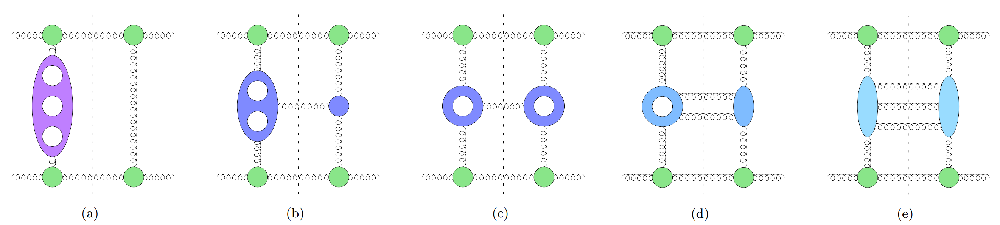



<h3 style="margin-top:5mm; margin-left: -10mm; margin-right: -10mm;">
	<b style="margin-top:15mm; font-size: 31pt; text-transform: none;">
          Towards the complete NNLO BFKL Kernel
	</b>
</h3>

Giuseppe De Laurentis
 

 University of Edinburgh 

 

 One Emission at Two Loops 

<a href="https://arxiv.org/pdf/2412.20578">arXiv:2412.20578</a> <a href="https://link.springer.com/article/10.1007/JHEP04(2025)161">(10.1007/JHEP04(2025)161)</a>

 with S. Abreu, G. Falcioni, E. Gardi, C. Milloy, L. Vernazza 

 

 Two Emissions at One Loop 

 To Appear 

 with E. Byrne, V. Del Duca, E. Gardi, J. Smillie 

REF Conference

 Milan, IT 

  
   
Find these slides at  <a href="/slides/REFOct2025/#/">gdelaurentis.github.io/slides/REFOct2025</a> 

---

<section>



# Introduction

---

<b style="font-variant: small-caps; font-size: 32pt"> Large Logarithms from Big Rapidity Gaps  </b>

     $\circ\,$ In $2\to 2$ scattering, in the <b>forward limit</b> $s \gg t$ (large CoM energy vs. momentum transfer)

     $\phantom{\circ}\,$ final state emissions develop <b> large rapidity gaps </b>. The cross section grows as

$$
\sigma \approx \mathcal{O}\big(\alpha_s^n \log^n(s/|t|)\big )
$$

     $\phantom{\circ}\,$ which is unphysically large (e.g. it violates the Froissart bound).

     $\circ\,$ The BFKL kernel captures the <b>exponentiation</b> of these <b>large logarithms</b>, 
     $\phantom{\circ}\,$ allowing us to <b>resum</b> their contribution to the cross section.

     $\circ\,$ In this kinematic limit, known as <b>Multi-Regge Kinematics</b> (MRK), an effective particle is  
     $\phantom{\circ}\,$ exchanged in the t-channel, a Reggeon, from which more rapidity-gapped radiation is emitted.

---

<b style="font-variant: small-caps; font-size: 32pt; margin-bottom: 0mm;"> Expanding Amplitudes in MRK and NMRK </b>

     $\circ$ In the (N)MRK limit the amplitude factorizes as follows

---

<b style="font-variant: small-caps; font-size: 34pt; magin-bottom: -10mm;"> Minimal Variables for Multi-Regge Kinematics </b>  

$\circ$ The MRK limit is a two-variable problem

$\circ$ The NMRK limit is a five-variable problem

</section>

---

<section>



<h1 style="margin-top: -2mm;"> Kernel Components </h1>

---

<b style="font-variant: small-caps; font-size: 32pt"> Leading Order Kernel Components </b>

Leading-Log (LL) Resummation: $\mathcal{O}\big(\alpha_s^n \log^n(s/|t|)\big )$

     $\circ\,$ The two components of the leading order (LO) BFKL kernel,  
     $\phantom{\circ}\,$ required for resummation of leading logarithms (LL), are

 <a href="https://arxiv.org/abs/2204.12459"> Byrne, Del Duca, Dixon, Gardi, Smillie </a>

     $\phantom{\circ}\,$ (a) is a correction to the Regge trajectory  
     $\phantom{\circ}\,$ (b) is the leading order central emission vertex (CEV)

---

<b style="font-variant: small-caps; font-size: 32pt"> NLO Kernel </b>

Next-To-Leading-Log (NLL) Resummation: $\mathcal{O}\big(\alpha_s^n \log^{n-1}(s/|t|)\big )$

     $\phantom{\circ}\,$ (a) two-loop correction to the Regge trajectory

     $\phantom{\circ}\,$ (b) one-loop correction to the one-emission CEV

     $\phantom{\circ}\,$ (c) leading two-emission CEV, this requires an next-to-MRK (NMRK) tree computation:  
     $\phantom{\circ}\,\kern4mm$ the two central gluons are <u>not</u> rapidity gapped

---

<b style="font-variant: small-caps; font-size: 32pt"> NNLO Kernel </b>

NNLL Resummation: $\mathcal{O}\big(\alpha_s^n \log^{n-2}(s/|t|)\big )$

     $\phantom{\circ}\,$ (b) the two-loop correction to the central emission vertex for one gluon was computed last year

 <a href="https://arxiv.org/abs/2204.12459" > Abreu, GDL, Falcioni, Gardi, Milloy, Vernazza</a>;$\;$<a href="https://arxiv.org/abs/2204.12459"> Buccioni, Caola, Devoto, Gambuti</a>

     $\phantom{\circ}\,$ (d) The last missing component is the next-to-maximally-helicity-violiating (NMHV) one-loop two-gluon CEV

</section>

---

<section >



# NMRK Expansion

---

<b style="font-variant: small-caps; font-size: 32pt; margin-bottom: 2mm;"> Challenge from Spurious Cancellations </b>

     $\circ$ 

$$ 
\displaystyle f(x,y), g(x, y), h(x, y) \in \mathbb{Q}[x, y] \, .
$$

---

<b style="font-variant: small-caps; font-size: 32pt; margin-bottom: 0mm;"> $p\kern0.2mm$-adic numbers </b>

     $\circ$ Analytic computation is unfeasible (run out of both RAM and time),  
     $\phantom{\circ}$ while floating point calculations are very unstable due to 7-8 orders of spurious cancellations.

     $\circ$ You may be familiar with finite field (integers modulo a prime)

$$ 
\displaystyle a \in \mathbb{F}_p : a \in \{0, \dots, p -1\} \; \text{ with } \; \{+, -, \times, \div\}
$$

     $\phantom{\circ}$ Limits (and calculus) is not well defined in $\mathbb{F}_p$. We can make things zero, but not small.

$$ 
\displaystyle |a|_0 = 1 if a = 0 else 1
$$

     $\circ$ There exists just one more absolute value on the rationals, the $p$-adic absolute value.

     $\circ$ Let's start from $p$-adic integers, instead of working modulo p, expand in powers of p

$$ 
\displaystyle a \in \mathbb{Z}_p : a_0 p^0 + a_1 p^1 + a_2 p^2 + \dots + \mathcal{O}(p^n)
$$

     $\phantom{\circ}$ Think of $p$ as a small quantity, $\epsilon$, even if it is a large (by the real absolute value) prime in practice.

     $\circ$ $p$-adic numbers allow for negative powers of $p$, 

$$ 
\displaystyle a \in \mathbb{Q}_p : a_{-\nu} p^{-\nu} + \dots + a_0 + a_1 p^1 + \dots + \mathcal{O}(p^n)
$$

<a style="font-size: large; text-align: right; float: right; margin-top: -4mm; margin-bottom: -10mm;" href=https://arxiv.org/abs/2203.04269>
   GDL, Page ('22)
</a>

---

<b style="font-variant: small-caps; font-size: 32pt; margin-bottom: 2mm;"> The $p\kern0.2mm$-adic (N)MRK Limit </b>

     $\circ$ Set the (N)MRK parameter controlling the rapidity gap to be large negative power of $p$

---

<b style="font-variant: small-caps; font-size: 32pt; margin-bottom: 2mm;"> Analytic Reconstruction </b>

     $\circ$ For $pp \rightarrow HHH$ we use the massive spinor-helicity (or spin-spinor) formalism,  
     $\phantom{\circ}$ albeit in a very simplified form since scalars have no states.

<a href="https://arxiv.org/abs/1809.09644" style="font-size: 14pt; margin-bottom: -6mm; margin-top: -5mm; float: right; font-align: right;"> Shadmi, Weiss </a> <a href="https://arxiv.org/abs/1802.06730" style="font-size: 14pt; margin-bottom: -6mm; margin-top: -5mm;  margin-right: 31mm; float: right; font-align: right;"> Ochirov; </a>
<a href="https://arxiv.org/abs/1709.04891" style="font-size: 14pt; margin-bottom: -10mm; margin-top: -11mm; margin-right: 0mm; float: right; font-align: right;"> Arkani-Hamed, Huang, Huang;</a>

$$ 
\displaystyle \kern10mm R_{NRMK} = \mathbb{F}\big[ z, \bar z, w, \bar w, X(=X_{45}) \big]
$$

---

     <b style="font-variant: small-caps; font-size: 32pt"> Multivariate Partial Fractions </b>

<a style="font-size: large; text-align: right; float: right; margin-top: -18mm; margin-bottom: -10mm;" href=https://arxiv.org/abs/1904.04067>
   GDL, Maître ('19)
</a>
<a style="font-size: large; text-align: right; float: right; margin-top: -13mm; margin-bottom: -10mm;" href=https://arxiv.org/abs/2203.04269>
   GDL, Page ('22)
</a>

     $\circ$ We want a mathematically rigorous answer to the question

$$ 
\frac{\mathcal{N}}{\mathcal{D}_1\mathcal{D}_2} \stackrel{?}{=}
 \frac{\mathcal{N}_2}{\mathcal{D}_1} + \frac{\mathcal{N}_1}{\mathcal{D}_2} 
$$

     $\phantom{\circ}$ without knowing $\mathcal{N}$ analytically. The complexity should not depend on $\mathcal{N}$ (besided numerical evaluations).  
     $\phantom{\circ}$ The complexity will depend on the irreducible polynomials $\mathcal{D}_1, \mathcal{D}_2$.

     $\circ$ Multivariate partial fraction decompositions follow from varieties where pairs of denominator factors vanish

$$ 
\frac{\mathcal{N}}{\mathcal{D}_1\mathcal{D}_2} \stackrel{?}{=}
 \frac{\mathcal{N}_2}{\mathcal{D}_1} + \frac{\mathcal{N}_1}{\mathcal{D}_2} \; \Longleftrightarrow \; \mathcal{N} \stackrel{?}{\in} \big\langle \mathcal{D}_1, \mathcal{D}_2 \big\rangle \, \text{ i.e. } \; \mathcal{N} \stackrel{?}{=} \mathcal{N}_1 \mathcal{D}_1 + \mathcal{N}_2 \mathcal{D}_2
$$

    

        
        <!--
        

          $\langle xy^2 + y^3 - z^2 \rangle$
        

        -->
    

    

        $\cap$
    

    

        
        <!--
        

          $\langle x^3 + y^3 - z^2 \rangle$
        

        -->
    

    

        $=$
    

    

        
        <!--
        

          $\begin{gather}\langle 2y^3-z^2, x-y \rangle \cap \langle y^3-z^2, x \rangle \cap \langle z^2, x+y \rangle\end{gather}$ 
        

        -->
    

$$ 
\langle {\color{orange}xy^2 + y^3 - z^2} \rangle + \langle {\color{blue}x^3 + y^3 - z^2} \rangle = \langle xy^2 + y^3 - z^2, x^3 + y^3 - z^2 \rangle = \langle {\color{red}2y^3-z^2, x-y} \rangle \cap \langle {\color{green}y^3-z^2, x} \rangle \cap \langle {\color{blue}z^2, x+y} \rangle
$$

     $\phantom{\circ}$ This is a primary decomposition, it is the equivalent for polynomials of say: $12 = 2^2 \times 3$   
     $\phantom{\circ}$ If $\mathcal{N}$ vanishes on all branches, than the partial fraction decomposition exists.

---

     <b style="font-variant: small-caps; font-size: 32pt"> Iterated Pole Subtraction </b>
     

     (i.e. geometry at codimension greater than one)
     

<a style="font-size: large; text-align: right; float: right; margin-top: -21mm; margin-bottom: -10mm;" href=https://arxiv.org/abs/1904.04067>
   GDL, Maître ('19)
</a>
<a style="font-size: large; text-align: right; float: right; margin-top: -16mm; margin-bottom: -10mm;" href=https://arxiv.org/abs/2203.04269>
   GDL, Page ('22)
</a>
<a style="font-size: large; text-align: right; float: right; margin-top: -11mm; margin-bottom: -10mm;" href=https://arxiv.org/abs/2312.03672>
   Chawdhry ('23)
</a>
<a style="font-size: large; text-align: right; float: right; margin-top: -6mm; margin-bottom: -10mm;" href=https://arxiv.org/abs/2506.08452>
   Xia, Yang ('25)
</a>

     $\circ$ Let's go back to our example

</section>

---

<section>



#   Conclusions   &   Outlook

---

     <b style="font-variant: small-caps; font-size: 32pt"> Towards the NMHV 2-Emission CEV </b>

     $\circ$ Tests: MRK, same functions from ++-+-- and +-+-+-, match part of the result to N=4 and N=1 SUSY

</section>

---

<section>



<b style="font-variant: small-caps; font-size: xxx-large;"> Thank you   for your attention! </b>
 
 
<!---
<b style="font-variant: small-caps; font-size: xx-large;"> Questions? </b>
--->

    These slides are powered by: 
    
        <a href="https://en.wikipedia.org/wiki/Markdown">markdown</a>, 
        <a href="https://en.wikipedia.org/wiki/HTML">html</a>, 
        <a href="https://revealjs.com/">revealjs</a>, 
        <a href="https://gohugo.io/">hugo</a>, 
        <a href="https://www.mathjax.org/">mathjax</a>, 
        <a href="https://github.com/">github</a>
    

<!---
 

     For open source packages: 
     <code>
          $   $ pip install [lips](https://github.com/GDeLaurentis/lips) [pyadic](https://github.com/GDeLaurentis/pyadic)
     </code>

--->

</section>

<!-- REVEAL.JS CUSTOMIZATION -->

<!-- Include MathJax library -->

<!-- Include Reveal.js and the Math plugin -->

<!-- Initialize Reveal.js with the MathJax plugin -->

