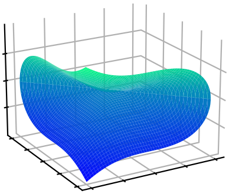



<h3 style="margin-top:5mm; margin-left: -10mm; margin-right: -10mm;">
	<b style="margin-top:15mm; font-size: 28pt; text-transform: none;">
	   Compact Two-Loop QCD Corrections  
	   for $Vjj$ Production in $pp$ Collisions
	</b>
</h3>

Giuseppe De Laurentis
 

 University of Edinburgh 

 
<a href="https://arxiv.org/abs/2503.10595">arXiv:2503.10595</a> 
 (GDL, H. Ita, B. Page, V. Sotnikov) 

SM@LHC 2025

 Durham 

  
   
Find these slides at  <a href="/slides/sm@lhc_apr2025/#/">gdelaurentis.github.io/slides/sm@lhc_apr2025</a> 

---

<section>



# Introduction

---

<b style="font-variant: small-caps; font-size: 32pt; margin-bottom: 0mm;"> $V+n\text{-jet}$ Cross Sections at the LHC </b>

     $\circ\,$ Observations at the LHC are beautifully predicted by the Standard Model

$$
\require{color}
\require{amsmath}
σ_{2 \rightarrow n - 2} = \sum_{a,b} \int dx_a dx_b f_{a/h_1}(x_a, \mu_F) \, f_{b/h_2}(x_b, \mu_F) \;\hat{\sigma}_{ab\rightarrow n-2}(x_a, x_b, \mu_F, \mu_R) \, , \\
\hat{σ}_{n}=\frac{1}{2\hat{s}}\int d\Pi_{n-2}\;(2π)^4δ^4\big(\sum_{i=1}^n p_i\big)\;|\overline{\mathcal{A}(p_i,h_i,a_i,μ_F, μ_R)}|^2 \, .
$$

    $\phantom{\circ}\,$ at least to the extent with which we can compute  $\mathcal{A} = \mathcal{A}^{(0)} + \alpha_{(s)}\mathcal{A}^{(1)} + \alpha^2_{(s)}\mathcal{A}^{(2)} + \dots$

     

         
     

     

          <table style="border-collapse: collapse; text-align: center; margin-top: 4mm; font-size: 14pt;">
               <tr>
                    <td style="border: 1px solid black; padding: 5px; text-align: center;">3</td>
                    <td style="border: 1px solid black; padding: 5px; background-color: #FFD700; text-align: center;">
                    2023 <a href="https://arxiv.org/abs/example8">[6]</a>
                    </td>
                    <td style="border: 1px solid black; padding: 5px; background-color: #FF7F7F; text-align: center;">
                    ?
                    </td>
                    <td style="border: 1px solid black; padding: 5px; background-color: #FF7F7F; text-align: center;">
                    ?
                    </td>
               </tr>
               <tr>
                    <td style="border: 1px solid black; padding: 5px; text-align: center;">2</td>
                    <td style="border: 1px solid black; padding: 5px; background-color: #90EE90; text-align: center;">
                    2007 <a href="https://arxiv.org/abs/example7">[4]</a>
                    </td>
                    <td style="border: 1px solid black; padding: 5px; background-color: #FFD700; text-align: center;">
                    2021 <a href="https://arxiv.org/abs/2110.07541">[5]</a>
                    </td>
                    <td style="border: 1px solid black; padding: 5px; background-color: #FF7F7F; text-align: center;">
                    ?
                    </td>
               </tr>
               <tr>
                    <td style="border: 1px solid black; padding: 5px; text-align: center;">1</td>
                    <td style="border: 1px solid black; padding: 5px; background-color: #90EE90; text-align: center;">
                    1981 <a href="https://arxiv.org/abs/example6">[1]</a>
                    </td>
                    <td style="border: 1px solid black; padding: 5px; background-color: #90EE90; text-align: center;">
                    1997 <a href="https://arxiv.org/abs/example10">[2]</a>
                    </td>
                    <td style="border: 1px solid black; padding: 5px; background-color:rgb(250, 255, 0); text-align: center;">
                    2008 <a href="https://arxiv.org/abs/example11">[3]</a>
                    </td>
               </tr>
               <tr>
                    <th style="border: 1px solid black; padding: 5px; text-align: center;">Loops ↑ Jets →</th>
                    <th style="border: 1px solid black; padding: 5px; text-align: center;">$1$</th>
                    <th style="border: 1px solid black; padding: 5px; text-align: center;">$2$</th>
                    <th style="border: 1px solid black; padding: 5px; text-align: center;">$\geq3$</th>
               </tr>
          </table>
          

               Analytic
                Numeric
               Analytic (LCA)
               Unknown
          

          

               

                    <a href="https://www.sciencedirect.com/science/article/abs/pii/0550321381901656?via%3Dihub">[1] Ellis, Ross, Terrano; </a>
                    <a href="https://arxiv.org/abs/hep-ph/9708239">[2] Bern, Dixon, Kosower;</a>
                    <a href="https://arxiv.org/abs/0803.4180">[3] BlackHat; </a><a href="https://arxiv.org/abs/1907.13071">OpenLoops; </a>
                    <a href="https://arxiv.org/abs/0711;.4711">[4] Gehrmann-De Ridder, Gehrmann, Glover, Heinrich; </a>
                    <a href="https://arxiv.org/abs/2110.07541">[5] Abreu, Febres Cordero, Ita, Klinkert, Page, Sotnikov </a> 
                    <a href="https://arxiv.org/abs/2503.10595" style="color:rgb(255, 149, 0);">+ This talk; </a>
                    <a href="https://arxiv.org/abs/2307.15405">[6] Gehrmann, Jakubčík, Mella, Syrrakos, Tancredi</a>
               

          

     

---

<b style="font-variant: small-caps; font-size: 32pt"> Precision Physics Requires Compact Amplitudes </b>

     $\circ\,$ Theoretical uncertainties already larger than experimental ones, especially at higher points

     
          $\sigma^{\text{tot.}}_{pp \, \rightarrow \, Z \, + \, n\,j}:$
     

<a style="font-size: large; text-align: right; float: right; margin-top: -8mm; margin-bottom: -4mm;" href=https://inspirehep.net/literature/2808096>
ATLAS Collab. '24
</a>

     $\circ\,$ NNLO is essential for agreement with experiment, e.g.

<a style="font-size: large; text-align: right; float: right; margin-top: -4mm; margin-bottom: -4mm;" href=https://arxiv.org/abs/2404.08598>
Mazzitelli, Sotnikov, Wiesemann '24
</a>

     
          $\frac{d\sigma_{pp \, \rightarrow \, Z \, + \, \geq 1 \, b \text{ jet}}}{d |\eta|^{b-\text{jet}_1}}:$
     

     $\circ\,$ Besides this, only two other cross-section studies at NNLO, only for the process $q\bar q'\rightarrow Wb\bar b$

<a style="font-size: large; text-align: right; float: right; margin-top: -3mm; margin-bottom: -3mm;" href=https://arxiv.org/abs/2212.04954>
$\,$Buonocore, Devoto, Kallweit, Mazzitelli, Rottoli, Savoini '22;
</a>
<a style="font-size: large; text-align: right; float: right; margin-top: -3mm; margin-bottom: -3mm;" href=https://arxiv.org/abs/2205.01687>
Hartanto, Poncelet, Popescu, Zoia '22;$\,$
</a>

     $\circ\,$ Phenomenology can be hindered by complexity of results. It's hard to do Monte Carlo integration   $\phantom{\circ}\,$ and verify IR cancellations when you have to evaluate >1GB of files in higher precision.

</section>

---

<section>



<h1 style="margin-top: -2mm;"> Numerical Computation </h1>

---

<b style="font-variant: small-caps; font-size: xxx-large"> Partial Amplitudes & Finite Remainders </b>
 

     $\circ$ Amplitude (integrands) can be written as (for a suitable choice of master integrals)

 

     $$
     \displaystyle A(\lambda, \tilde\lambda, \ell) =
\sum_{\substack{\Gamma,\\ i \in M_\Gamma \cup S_\Gamma}} \, c_{\,\Gamma,i}(\lambda, \tilde\lambda, \epsilon) \,		\frac{m_{\Gamma,i}(\lambda\tilde\lambda, \ell)}{\textstyle \prod_{j} \rho_{\,\Gamma,j}(\lambda\tilde\lambda, \ell)} \;\; \xrightarrow[]{\int d^D\ell} \;\; \sum_{\substack{\Gamma,\\ i \in M_\Gamma}} \frac{ \sum_{k=0}^{\text{finite}} \, {\color{red}c^{(k)}_{\,\Gamma, i}}(\lambda, \tilde\lambda) \, \epsilon^k}{\prod_j (\epsilon - a_{ij})} \, {\color{orange}I_{\Gamma, i}}(\lambda\tilde\lambda, \epsilon)
$$  

     $\circ$  $\Gamma$: topologies $\quad\circ$ $M_\Gamma$: master integrands $\quad\circ$ $S_\Gamma$: surface terms 

     $\circ$ <u>All physical information</u> is contained in the <i>finite remainders</i>, at two loops

<a style="font-size: large; text-align: right; float: right; margin-top: -3mm; margin-bottom: -3mm;" href=https://inspirehep.net/literature/920274>
Weinzierl ('11)
</a>

$$ 
\underbrace{\mathcal{R}^{(2)}}_{\text{finite remainder}} = \mathcal{A}^{(2)}_R \underbrace{- \quad I^{(1)}\mathcal{A}^{(1)}_R \quad - \quad I^{(2)}\mathcal{A}^{(0)}_R}_{\text{divergent + convention-dependent finite part}} + \mathcal{O}(\epsilon)
$$

<a style="font-size: 13pt; float:right; text-align:right; margin-top:-14mm;" href=https://www.sciencedirect.com/science/article/abs/pii/S0370269398003323?via%3Dihub>
Catani ('98)
</a>
<a style="font-size: 13pt; float:right; margin-top:-9mm;" href=https://journals.aps.org/prl/abstract/10.1103/PhysRevLett.102.162001>
Becher, Neubert ('09)
</a>
<a style="font-size: 13pt; float:right; text-align:right; margin-top:-4mm;" href=https://arxiv.org/abs/0901.1091>
Gardi, Magnea ('09)
</a>

     $\phantom{\circ}$ $\mathcal{A}^{(1)}_R$ to order $\epsilon^2$ is still needed to build $\mathcal{R}^{(2)}$, but there is no real reason to reconstruct it.

     $\circ$ Finite remainder as a weighted sum of <i>pentagon functions</i> <a style="font-size: large; display: inline-block; text-align: right; float: right; margin-top: 0mm; margin-left: 4mm; " href=https://arxiv.org/abs/2009.07803> Chicherin, Sotnikov ('20) </a> <a style="font-size: large; display: inline-block; text-align: right; float: right; margin-top: -3mm; margin-left: 4mm; " href=https://arxiv.org/abs/2110.10111> Chicherin, Sotnikov, Zoia ('21) </a>

$$ 
\textstyle \mathcal{R}(\lambda, \tilde\lambda) = \sum_i \color{red}{r_{i}(\lambda,\tilde\lambda)} \, \color{orange}{h_i(\lambda\tilde\lambda)}
$$

     $\circ$  Goal: reconstruct $\color{red}{r_{i}(\lambda,\tilde\lambda)}$ from numerical samples in a field $\mathbb{F}$

<a style="font-size: large; text-align: right; float: right; margin-top: -10mm; margin-bottom: -10mm; margin-right: 24mm;" href=https://arxiv.org/abs/1406.4513>
$\mathbb{F}_p$: von Manteuffel, Schabinger ('14); 
</a> <a style="font-size: large; text-align: right; float: right; margin-top: -10mm; margin-bottom: 0mm;" href=https://arxiv.org/abs/1608.01902>
$\phantom{\mathbb{F}_p}$ Peraro ('16)
</a> 
<a style="font-size: large; text-align: right; float: right; margin-top: -17mm; margin-bottom: -10mm; margin-right: 43mm;" href=https://arxiv.org/abs/1406.4513>
$\mathbb{C}$: GDL, Maitre ('19);
</a> <a style="font-size: large; text-align: right; float: right; margin-top: -16.7mm; margin-bottom: -10mm;" href=https://arxiv.org/abs/1406.4513>
$\mathbb{Q}_p$: GDL, Page ('22)
</a>

---

<b style="font-variant: small-caps; font-size: 34pt; magin-bottom: -5mm;"> Setting up the Calculation </b>  

$\circ$ Original computation  <a href="https://arxiv.org/abs/hep-ph/9708239" style="font-size: 18pt">[1]</a> was performed with <code style="font-size: 17pt">Caravel</code>

     

	     $$
	     \require{color}
	     \displaystyle \sum_{\text{states}} \, \prod_{\text{trees}} A^{\text{tree}}(\lambda, \tilde\lambda, \ell)\big|_{\text{cut}_{\Gamma}} = \sum_{\substack{\Gamma' \ge \Gamma, \\ i \in M_\Gamma' \cup S_\Gamma'}} \kern-2mm {\color{black}{c_{\,\Gamma',i}(\lambda, \tilde\lambda)}} \, \frac{m_{\Gamma',i}(\lambda\tilde\lambda, \ell)}{\displaystyle \prod_{j\in P_{\Gamma'} / P_{\Gamma}} \rho_{j}(\lambda\tilde\lambda, \ell)}\Bigg|_{\text{cut}_\Gamma}
	     $$
	

     

	     

	     	  <code> C++ code </code>
	     
 
	     
	      
	     <a style="font-size: large; text-align: center; float: center; margin-top: -10mm; margin-bottom: 5mm;"
	     	href=https://arxiv.org/abs/2009.11957>
		
 Abreu, Dormans, 

		
 Febres Cordero, Ita  

		
 Kraus, Page, Pascual, 

		
 Ruf, Sotnikov ('20) 

	     </a>
	

     

	     $\star$ Numerical Berends-Giele recursion for LHS, solve for coeffs. in RHS.
	

     

	     $\star$ IBP reduction = decomposition on RHS, $\; m_{\Gamma,i} \in M_\Gamma \cup S_\Gamma$
	

     $\circ$ This computation started from the ancillaries files of <a href="https://arxiv.org/abs/hep-ph/9708239" style="font-size: 18pt">[1] </a>
     

	     1. Wrote a Python script to split the 1.4 GB ancillaries into >10k files  
	     2. Compile into 18.2 GB of C++ binaries (for reference <code style="font-size: 17pt">Caravel</code> compiles into approx. 5 GB)  
          3. Obtain $\mathbb{F}_p$ evaluations of the form factors (each takes approx. 1 sec per point) 
          4. Recombine triplets of form factors into helicity amplitudes
	

<a href="https://arxiv.org/abs/2110.07541" style="font-size: 18pt">[1] Abreu, Febres Cordero, Ita, Klinkert, Page, Sotnikov '21</a>

---

<b style="font-variant: small-caps; font-size: 32pt; margin-bottom: 2mm;"> Guiding Principles </b>

     $\circ$ Amplitude should be gauge and Lorentz invariant, and little group covariant

     ${\color{red} ✗}$ gauge dependence; reference vector dependence; tensors decomposition $\epsilon_\mu T^\mu$

     ${\color{greeN} ✓}$ $P^\mu\sigma_{\mu\alpha\dot\alpha} = \lambda_\alpha \tilde\lambda_{\dot\alpha}$; all $\alpha, \dot\alpha$ indices contracted

     $\circ$ The singularity structure should be manifest in $\mathbb{C}$

     ${\color{red} ✗}$ Rational reparametrisations of the kinematics change the denominator structure

     ${\color{red} ✗}$ If a function is neither even nor odd, forcing the split misses cancellations

     ${\color{greeN} ✓}$ Chiral cancellations yield true Least Common Denominator

     ${\color{greeN} ✓}$ Work off the real slice: $P^\mu \in \mathbb{C}^4$, $\lambda_\alpha \neq \tilde\lambda_{\dot\alpha}^\dagger$

     $\circ$ Focus only on final physical expressions

     ${\color{red} ✗}$ Unphysical intermediate steps may be unnecessarily complicated

     ${\color{greeN} ✓}$ Bypass all intermediate steps with numerical evaluations

</section>

---

<section >



    

# Analytic & Geometric Structure

    

based on:  
[GDL, Page (JHEP 12 (2022) 140)](https://arxiv.org/abs/2203.04269)

---

     <b style="font-variant: small-caps; font-size: xxx-large"> Least Common Denominator </b>
     

     (i.e. geometry at codimension one)
     

     

          

               $\circ$ Polynomials belong to the the covariant quotient ring of spinors,
          

          

               $$\displaystyle \kern10mm R_n = \mathbb{F}\big[|1⟩, [1|, \dots, |n⟩, [n|\big] \big/ \big\langle \sum_i |i⟩[i| \big\rangle$$
          

	     

                $\circ\,$ The rational function $r_i$ belong to the field of fractions of $R_n$,
          

          

               $$
               \displaystyle r_i(|i\rangle,[i|) = \frac{\mathcal{N}(|i\rangle,[i|)}{\prod_j \mathcal{D}_j^{q_{ij}}(|i\rangle,[i|)}
               $$
          

          

                $\phantom{\circ}\,$ we obtain  $q_{ij}$ from a univariate slice  $\vec\lambda(t)$.
          

          

               $\circ\,$ The $\mathcal{D}_j$ are related to the letters of the symbol alphabet
          

          <a style="font-size: 13pt; text-align: center; float: left; margin-left:40mm; margin-top: 0mm; margin-bottom: 0mm;" href=https://arxiv.org/abs/1812.04586>
          Abreu, Dormans, Febres Cordero, Ita, Page ('18)
          </a>
	

     

          
          

               Space has dimension $4n-4$,
          

          

               $\mathcal{D}_j = 0$ have dimension $4n-5$,
          

          

               $\vec\lambda(t)$'s have dimension 1.
          

     

     $
     \displaystyle \kern5mm \{D_j\} \subset \kern-3mm \bigcup_{\sigma \; \in \; \text{Aut}(R_6)} \sigma \circ \big\{ \langle 12 \rangle, \langle 1|2+3|1], \langle 1|2+3|4], s_{123}, \Delta_{12|34|56}, ⟨3|2|5+6|4|3]-⟨2|1|5+6|4|2] \big\}
     $

     $\kern0mm\color{green}\text{New letter!}$

    Poles & Zeros $\;\Leftrightarrow\;$ Irreducible Varieties $\;\Leftrightarrow\;$ Prime Ideals  
    <i style="font-size: 14pt; border-top: -8mm; border-bottom: -2mm;"> Physics $\kern18mm$ Geometry $\kern18mm$ Algebra </i>

---

<b style="font-variant: small-caps; font-size: xxx-large"> Basis Change from Pole Residues </b>

     $\circ\,$ Change basis from a subset of the pentagon coefficients $r_{i \in \mathcal{B}}$ to $\mathbb{Q}$-linear combinations $\tilde r$,

 

     $$
     R = r_j h_j = r_{i\in \mathcal{B}} M_{ij} h_j = \tilde{r}_{i} \, O_{ii'}M_{i'j} \, h_j \, , \qquad O_{ii'}, M_{i'j}\in \mathbb{Q}
     $$

     [<a href="https://arxiv.org/abs/hep-ph/9708239" style="font-size: 14pt">6</a>] Abreu, Febres Cordero, Ita, Klinkert, Page, Sotnikov '21

     $\circ\,$ By Gaussian elimination, partition the space:

  

     $$
     \text{span}(r_{i \in \mathcal{B}}) = \underbrace{\text{column}(\text{Res}(r_{i \in \mathcal{B}}, \mathcal{D}_k^m))}_{\text{functions with the singularity}} \;\;\; \oplus \, \underbrace{\text{null}(\text{Res}(r_{i \in \mathcal{B}}, \mathcal{D}_k^m))}_{\text{functions without the singularity}}
     $$

     

	     

               $\circ\,$ Search for linear combinations that remove as many singularities as possible
          

           
          

               $$
               \kern12mm \displaystyle O_{i'i} = \bigcap_{k, m} \, \text{nulls}(\text{Res}(r_{i \in \mathcal{B}}, \mathcal{D}_k^m))
               $$
          

	

     

          
     

</section>

---

<section>



      

# Analytic Reconstruction

       

---

     <b style="font-variant: small-caps; font-size: 32pt"> Reconstruction from Conjectured Properties </b>
     

     (for planar five-point one-mass amplitudes - all properties checked a posteriori)
     

     $\circ\,$ Denominator pairs $\{\mathcal{D}_i, \mathcal{D}_j\}$ can be <i>cleanly separated</i>:

     $$
     \frac{\mathcal{N}}{\mathcal{D}_i^{q_i}\mathcal{D}_j^{q_j}\mathcal{D}_{\text{rest}}} \rightarrow \frac{\mathcal{N}_i}{\mathcal{D}_i^{q_i}\mathcal{D}_{\text{rest}}} + \frac{\mathcal{N}_j}{\mathcal{D}_j^{q_j}\mathcal{D}_{\text{rest}}}
     $$

     $\phantom{\circ}\,$ Examples of $\{\mathcal{D}_i, \mathcal{D}_j\}$ are:

     $\qquad\star\,$ Any pairs of $s_{ijk}$ or $\Delta_{ij|kl|mn}$ or $\langle i|j|p_V|k|i]-\langle j|l|p_V|k|j]$  
     $\qquad\star\,$ Any conjugate pair $\{\langle i|j+k|l], \langle l|j+k|i]\}$ or cyclic $\{\langle i|j\rangle, [i|j]\}$  
     $\qquad\star\,$ Pairs of the form $\{\Delta_{ij|kl|mn}, \langle a|b+c|d]\}$ and $\{\Delta_{ij|kl|mn}, \langle ab \rangle\}$ and $\{\Delta_{ij|kl|mn}, [ab]\}$  
     $\qquad\phantom{\star}\,$ unless $\{bc\}$ are $\{ij\}$ or $\{kl\}$ or $\{mn\}$

     $\circ\,$ Denominator pairs $\{\mathcal{D}_i, \mathcal{D}_j\}$ can be <i>separated to order $\kappa$</i>:

     ${\color{greeN} ✓}$ Reconstruction only requires $\mathbb{F}_p$ samples $\;{\color{greeN} ✓}$Already simpler than original ones ($\sim$20MB)  
     $\;{\color{red} ✗}$ Results are unstable and sub-optimal, e.g. numbers of this size appeared

127187555379407704220939486282289348327703498501718808908391691454242601886997968263623652083189652150273

---

     <b style="font-variant: small-caps; font-size: 32pt"> Iterated Pole Subtraction </b>
     

     (i.e. geometry at codimension greater than one)
     

     $\circ$ Multivariate Partial Fraction Decompositions

    

        
        

          $\langle xy^2 + y^3 - z^2 \rangle$
        

    

    

        $\cap$
    

    

        
        

          $\langle x^3 + y^3 - z^2 \rangle$
        

    

    

        $=$
    

    

        
        

          $\begin{gather}\langle 2y^3-z^2, x-y \rangle \cap \langle y^3-z^2, x \rangle \\ \cap \langle z^2, x+y \rangle\end{gather}$ 
        

    

$\circ\,$ Retain control iterating surface by surface

$$ 
\begin{alignedat}{2}
& r^{(139 \text{ of } 139)}_{\bar{u}^+g^+g^-d^-(V\rightarrow \ell^+ \ell^-)} = & \qquad\qquad & {\small \text{Variety (scheme?) to isolate term(s)}} \\[2mm]
& +\frac{7/4(s_{24}-s_{13})⟨6|1+4|5]s_{123}(s_{124}-s_{134})}{⟨1|2+3|4]⟨2|1+4|3]^2 Δ_{14|23|56}} & \qquad\qquad & \Big\langle ⟨2|1+4|3]^2, Δ_{14|23|56} \Big\rangle \\[1mm]
& -\frac{49/64⟨3|1+4|2]⟨6|1+4|5]s_{123}(s_{123}-s_{234})(s_{124}-s_{134})}{⟨1|2+3|4]⟨2|1+4|3]Δ^2_{14|23|56}} + \dots & \qquad\qquad & \Big\langle Δ_{14|23|56} \Big\rangle
\end{alignedat}
$$

$\circ\,$ Partial fraction decomposition and numerator insertions from e.g.:

     $$
     \sqrt{\big\langle ⟨2|1+4|3], Δ_{14|23|56} \big\rangle} = \big\langle s_{124}-s_{134}, ⟨2|1+4|3] \big\rangle \, , \\[1mm] 
     \big\langle ⟨1|2+3|4], ⟨2|1+4|3] \big\rangle = \big\langle ⟨1|2+3|4], ⟨2|1+4|3], (s_{13}-s_{24})\big\rangle \cap \big\langle ⟨12⟩, [34] \big\rangle
     $$

     For a fleshed out example with open-source code see <a href=https://inspirehep.net/literature/2661970> GDL (ACAT '22) </a>

</section>

---

<section>



# Outlook

---

<b style="font-variant: small-caps; font-size: 36pt; margin-bottom: -6mm;"> Spinor-Helicity Results </b>
 

     $\circ$ The $pp\rightarrow Wjj$ functions are now 1.9 MB (from 1.4 GB),

    

        
    

    $\kern4mm$
    

        
    

1.6MB 200KB 100KB

     $\phantom{\circ}$ Since <code style="font-size: 14pt;">PentagonsFunction++</code> can take permutations of the 1-mass basis we only need one $M_{ij}$ per partial   $\phantom{\circ}$ (another 2 MB overall). We now have fast and stable floating-point evaluations in double precision!

     $\circ$ quarks nmhv and gluons mhv largest number has 3-digit, gluons nmhv 12 digits

</section>

---

<section>



<b style="font-variant: small-caps; font-size: xxx-large;"> Thank you   for your attention! </b>
 
 
<!---
<b style="font-variant: small-caps; font-size: xx-large;"> Questions? </b>
--->

    These slides are powered by: 
    
        <a href="https://en.wikipedia.org/wiki/Markdown">markdown</a>, 
        <a href="https://en.wikipedia.org/wiki/HTML">html</a>, 
        <a href="https://revealjs.com/">revealjs</a>, 
        <a href="https://gohugo.io/">hugo</a>, 
        <a href="https://www.mathjax.org/">mathjax</a>, 
        <a href="https://github.com/">github</a>
    

<!---
 

     For open source packages: 
     <code>
          $   $ pip install [lips](https://github.com/GDeLaurentis/lips) [pyadic](https://github.com/GDeLaurentis/pyadic)
     </code>

--->

</section>

---

<section>

# Backup Slides

---

<b style="font-variant: small-caps; font-size: xxx-large"> The Numerator Ansatz </b>

$\circ\,$ The numerator Ansatz takes the form

<a style="font-size: large; text-align: right; float: right; margin-top: -6mm; margin-bottom: 4mm;" href=https://arxiv.org/abs/1904.04067>
   GDL, Maître ('19)
</a>

$\displaystyle \text{Num. poly}(\lambda, \tilde\lambda) = \sum_{\vec \alpha, \vec \beta} c_{(\vec\alpha,\vec\beta)} \prod_{j=1}^n\prod_{i=1}^{j-1} \langle ij\rangle^{\alpha_{ij}} [ij]^{\beta_{ij}}$

     $\phantom{\circ}$ subject to constraints on $\vec\alpha,\vec\beta$ due to: 1) mass dimension; 2) little group; 3) linear independence.

 

$\circ\,$ Construct the Ansatz via the algorithm from Section 2.2 of <a href=https://arxiv.org/abs/2203.04269>GDL, Page ('22)</a>

Linear independence = irreducibility by the Gröbner basis of a specific ideal.

$\circ\,$ Efficient implementation using open-source software only

	

	       
	     Gröbner bases $\rightarrow$ constrain $\vec\alpha,\vec\beta$  
	     <a style="font-size: large; text-align: center; float: center; margin-top: -10mm; margin-bottom: 5mm;"
	     href=https://www.singular.uni-kl.de/index.php.html>
		Decker, Greuel, Pfister, Schönemann
	     </a>	    
	

	

	       
	     Integer programming $\rightarrow$ enumerate sols. $\vec\alpha,\vec\beta$  
	     <a style="font-size: large; text-align: center; float: center; margin-top: -10mm; margin-bottom: 5mm;"
	     href=https://www.singular.uni-kl.de/index.php.html>
		Perron and Furnon (Google optimization team)
	     </a>
	

    

$\circ\,$ Linear systems solved w/ CUDA over $\mathbb{F}_{2^{31}-1}$ ($t_{\text{solving}} \ll t_{\text{sampling}}$) w/ <a href=https://github.com/GDeLaurentis/linac-dev> linac </a>  (coming soon-ish) 

</section>

<!-- REVEAL.JS CUSTOMIZATION -->

<!-- Include MathJax library -->

<!-- Include Reveal.js and the Math plugin -->

<!-- Initialize Reveal.js with the MathJax plugin -->

