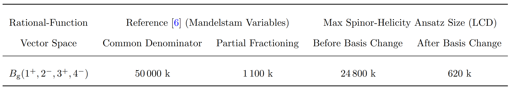



<h3 style="margin-top:5mm; margin-left: -10mm; margin-right: -10mm;">
	<b style="margin-top:15mm; font-size: 28pt; text-transform: none;">
	   Compact Two-Loop QCD Corrections  
	   for $Vjj$ Production in $pp$ Collisions
	</b>
</h3>

Giuseppe De Laurentis
 

 University of Edinburgh 

 
<a href="https://arxiv.org/abs/2503.10595">arXiv:2503.10595</a> 
 (GDL, H. Ita, B. Page, V. Sotnikov) 

SM@LHC 2025

 Durham 

  
   
Find these slides at  <a href="/slides/sm@lhc_apr2025/#/">gdelaurentis.github.io/slides/sm@lhc_apr2025</a> 

---

<section>



# Introduction

---

<b style="font-variant: small-caps; font-size: 32pt; margin-bottom: 0mm;"> Cross Sections at the Large Hadron Collider </b>

    

        
    

    

        
    

     $\circ\,$ Observations at the LHC are beautifully predicted by the Standard Model through,

$$
\require{color}
\require{amsmath}
σ_{2 \rightarrow n - 2} = \sum_{a,b} \int dx_a dx_b f_{a/h_1}(x_a, \mu_F) \, f_{b/h_2}(x_b, \mu_F) \;\hat{\sigma}_{ab\rightarrow n-2}(x_a, x_b, \mu_F, \mu_R) \, , \\
\hat{σ}_{n}=\frac{1}{2\hat{s}}\int d\Pi_{n-2}\;(2π)^4δ^4\big(\sum_{i=1}^n p_i\big)\;|\overline{\mathcal{A}(p_i,h_i,a_i,μ_F, μ_R)}|^2 \, .
$$

    $\phantom{\circ}\,$ At least to the extent with which we can compute  $\mathcal{A} = \mathcal{A}^{(0)} + \alpha_{(s)}\mathcal{A}^{(1)} + \alpha^2_{(s)}\mathcal{A}^{(2)} + \dots$

---

<b style="font-variant: small-caps; font-size: 32pt"> Precision Physics Requires NNLO Corrections </b>

     $\circ\,$ Theoretical uncertainties already larger than experimental ones, especially at higher points

     
          $\sigma^{\text{exp.}}_{pp \, \rightarrow \, Z \, + \, n\,j}:$
     

     $\phantom{\circ}\,$ 13 TeV data for W+jets appears to not be avaiable yet.

     $\circ\,$ NNLO is essential for agreement with experiment, e.g.

     
          $\sigma^{\text{exp.}}_{pp \, \rightarrow \, Z \, + \, n\,j}:$
     

     $\circ\,$ Phenomenology can be hindered by complexity of results

     $\circ\,$ High-multiplicity two-loop amplitudes required also because:

  

       $\qquad\star$ As real-virtual-virtual contributions to emerging N$^{3}$LO computations;
  

  

       $\qquad\star$ Many interesting kinematic regions are only accessible with extra radiation (e.g. $p_T$ distributions).
  

---

<b style="font-variant: small-caps; font-size: 32pt; margin-bottom: 2mm;"> Guiding Principles </b>

     $\circ$ Amplitude should be gauge and Lorentz invariant, and little group covariant

     ${\color{red} ✗}$ $\xi$-gauge dependence; reference vectors; open Lorentz indices (tensors)

     ${\color{greeN} ✓}$ $P^\mu\sigma_{\mu\alpha\dot\alpha} = \lambda_\alpha \tilde\lambda_{\dot\alpha}$; all $\alpha, \dot\alpha$ indices contracted

     $\circ$ The singularity structure should be manifest in $\mathbb{C}$

     ${\color{red} ✗}$ Rational reparametrisations of the kinematics change the denominator structure

     ${\color{red} ✗}$ If a function is neither even nor odd, forcing the split misses cancellations

     ${\color{greeN} ✓}$ Little-group dependend cancellations to obtain the true LCD

     ${\color{greeN} ✓}$ Work off the real slice: $P^\mu \in \mathbb{C}^4$, $\lambda_\alpha \neq \tilde\lambda_{\dot\alpha}^\dagger$

     $\circ$ Focus only on final physical expressions

     ${\color{red} ✗}$ Unphysical intermediate steps may be unnecessarily complicated

     ${\color{greeN} ✓}$ Bypass all intermediate steps with numerical evaluations

</section>

---

<section>



<h1 style="margin-top: -2mm;"> Numerical Computation </h1>

---

<b style="font-variant: small-caps; font-size: xxx-large"> Partial Amplitudes & Finite Remainders </b>
 

     $\circ$ Amplitude (integrands) can be written as (for a suitable choice of master integrals)

 

     $$
     \displaystyle A(\lambda, \tilde\lambda, \ell) =
\sum_{\substack{\Gamma,\\ i \in M_\Gamma \cup S_\Gamma}} \, c_{\,\Gamma,i}(\lambda, \tilde\lambda, \epsilon) \,		\frac{m_{\Gamma,i}(\lambda\tilde\lambda, \ell)}{\textstyle \prod_{j} \rho_{\,\Gamma,j}(\lambda\tilde\lambda, \ell)} \;\; \xrightarrow[]{\int d^D\ell} \;\; \sum_{\substack{\Gamma,\\ i \in M_\Gamma}} \frac{ \sum_{k=0}^{\text{finite}} \, {\color{red}c^{(k)}_{\,\Gamma, i}}(\lambda, \tilde\lambda) \, \epsilon^k}{\prod_j (\epsilon - a_{ij})} \, {\color{orange}I_{\Gamma, i}}(\lambda\tilde\lambda, \epsilon)
$$  

     $\circ$  $\Gamma$: topologies $\quad\circ$ $M_\Gamma$: master integrands $\quad\circ$ $S_\Gamma$: surface terms 

     $\circ$ <u>All physical information</u> is contained in the <i>finite remainders</i>, at two loops

<a style="font-size: large; text-align: right; float: right; margin-top: -3mm; margin-bottom: -3mm;" href=https://inspirehep.net/literature/920274>
Weinzierl ('11)
</a>

$$ 
\underbrace{\mathcal{R}^{(2)}}_{\text{finite remainder}} = \mathcal{A}^{(2)}_R \underbrace{- \quad I^{(1)}\mathcal{A}^{(1)}_R \quad - \quad I^{(2)}\mathcal{A}^{(0)}_R}_{\text{divergent + convention-dependent finite part}} + \mathcal{O}(\epsilon)
$$

<a style="font-size: 13pt; float:right; text-align:right; margin-top:-14mm;" href=https://www.sciencedirect.com/science/article/abs/pii/S0370269398003323?via%3Dihub>
Catani ('98)
</a>
<a style="font-size: 13pt; float:right; margin-top:-9mm;" href=https://journals.aps.org/prl/abstract/10.1103/PhysRevLett.102.162001>
Becher, Neubert ('09)
</a>
<a style="font-size: 13pt; float:right; text-align:right; margin-top:-4mm;" href=https://arxiv.org/abs/0901.1091>
Gardi, Magnea ('09)
</a>

     $\phantom{\circ}$ $\mathcal{A}^{(1)}_R$ to order $\epsilon^2$ is still needed to build $\mathcal{R}^{(2)}$, but there is no real reason to reconstruct it.

     $\circ$ Finite remainder as a weighted sum of <i>pentagon functions</i> <a style="font-size: large; display: inline-block; text-align: right; float: right; margin-top: 0mm; margin-left: 4mm; " href=https://arxiv.org/abs/2009.07803> Chicherin, Sotnikov ('20) </a> <a style="font-size: large; display: inline-block; text-align: right; float: right; margin-top: -3mm; margin-left: 4mm; " href=https://arxiv.org/abs/2110.10111> Chicherin, Sotnikov, Zoia ('21) </a>

$$ 
\textstyle \mathcal{R}(\lambda, \tilde\lambda) = \sum_i \color{red}{r_{i}(\lambda,\tilde\lambda)} \, \color{orange}{h_i(\lambda\tilde\lambda)}
$$

     $\circ$  Goal: reconstruct $\color{red}{r_{i}(\lambda,\tilde\lambda)}$ from numerical samples in a field $\mathbb{F}$

<a style="font-size: large; text-align: right; float: right; margin-top: -10mm; margin-bottom: -10mm; margin-right: 24mm;" href=https://arxiv.org/abs/1406.4513>
$\mathbb{F}_p$: von Manteuffel, Schabinger ('14); 
</a> <a style="font-size: large; text-align: right; float: right; margin-top: -10mm; margin-bottom: 0mm;" href=https://arxiv.org/abs/1608.01902>
$\phantom{\mathbb{F}_p}$ Peraro ('16)
</a> 
<a style="font-size: large; text-align: right; float: right; margin-top: -17mm; margin-bottom: -10mm; margin-right: 43mm;" href=https://arxiv.org/abs/1406.4513>
$\mathbb{C}$: GDL, Maitre ('19);
</a> <a style="font-size: large; text-align: right; float: right; margin-top: -16.7mm; margin-bottom: -10mm;" href=https://arxiv.org/abs/1406.4513>
$\mathbb{Q}_p$: GDL, Page ('22)
</a>

---

<b style="font-variant: small-caps; font-size: 34pt; magin-bottom: -5mm;"> Numerical Computation </b>  

$\circ$ Original computation performed with Caravel

     

	     $$
	     \require{color}
	     \displaystyle \sum_{\text{states}} \, \prod_{\text{trees}} A^{\text{tree}}(\lambda, \tilde\lambda, \ell)\big|_{\text{cut}_{\Gamma}} = \sum_{\substack{\Gamma' \ge \Gamma, \\ i \in M_\Gamma' \cup S_\Gamma'}} \kern-2mm {\color{red}{c_{\,\Gamma',i}(\lambda, \tilde\lambda)}} \, \frac{m_{\Gamma',i}(\lambda\tilde\lambda, \ell)}{\displaystyle \prod_{j\in P_{\Gamma'} / P_{\Gamma}} \rho_{j}(\lambda\tilde\lambda, \ell)}\Bigg|_{\text{cut}_\Gamma}
	     $$
	

     

	     

	     	  <code> C++ code </code>
	     
 
	     
	      
	     <a style="font-size: large; text-align: center; float: center; margin-top: -10mm; margin-bottom: 5mm;"
	     	href=https://arxiv.org/abs/2009.11957>
		
 Abreu, Dormans, 

		
 Febres Cordero, Ita  

		
 Kraus, Page, Pascual, 

		
 Ruf, Sotnikov ('20) 

	     </a>
	

     

	     $\star$ Numerical Berends-Giele recursion for LHS,  solve for coeffs. in RHS. 
	

     

	     $\star$ IBP reduction = decomposition on RHS, $\; m_{\Gamma,i} \in M_\Gamma \cup S_\Gamma $
	

$\circ$ This computation used the ancillaries of ...

</section>

---

<section >



    

# Analytic & Geometric Structure

    

based on:  
[GDL, Page (JHEP 12 (2022) 140)](https://arxiv.org/abs/2203.04269)

---

     <b style="font-variant: small-caps; font-size: xxx-large"> Least Common Denominator </b>
     

     (i.e. geometry at codimension one)
     

     $\circ$ Polynomials belong to the the covariant quotient ring of spinors,

 

     $$\displaystyle \kern10mm R_n = \mathbb{F}\big[|1⟩, [1|, \dots, |n⟩, [n|\big] \big/ \big\langle \sum_i |i⟩[i| \big\rangle$$

     

	     

                $\circ\,$ The rational function $r_i$ belong to the field of fractions of $R_n$,
          

            
          

               $$
               \displaystyle r_i(|i\rangle,[i|) = \frac{\mathcal{N}(|i\rangle,[i|)}{\prod_j \mathcal{D}_j^{q_{ij}}(|i\rangle,[i|)}
               $$
          

          

               $\circ\,$ The $\mathcal{D}_j$ are related to the letters of the symbol alphabet
          

           
          <a style="font-size: 13pt; text-align: right; float: right; margin-top: 0mm; margin-bottom: 0mm;" href=https://arxiv.org/abs/1812.04586>
          Abreu, Dormans, Febres Cordero, Ita, Page ('18)
          </a>
           
          

               $$
               \displaystyle \{\mathcal{D}_{\{1,\dots,35\}}\} = \bigcup_{\sigma \; \in \; \text{Aut}(R_5)} \sigma \circ \big\{ \langle 12 \rangle, \langle 1|2+3|1] \big\}
               $$
          

          

               $\kern0mm\color{green}\text{Identical to 1-loop!}$
          

	

     

          
          

               The codimension one variety 
          

          

               $\langle x^3 + y^3 - z^2 \rangle$ in $\mathbb{R}[x,y,z]$
          

     

     $$
     \displaystyle \kern5mm \{D_j\} \subset \kern-3mm \bigcup_{\sigma \; \in \; \text{Aut}(R_6)} \sigma \circ \big\{ \langle 12 \rangle, \langle 1|2+3|1], \langle 1|2+3|4], s_{123}, \Delta_{12|34|56}, ⟨3|2|5+6|4|3]-⟨2|1|5+6|4|2] \big\}
     $$

     $\kern0mm\color{green}\text{New letter! Can we get rid of it?}$

    Poles & Zeros $\;\Leftrightarrow\;$ Irreducible Varieties $\;\Leftrightarrow\;$ Prime Ideals  
    <i style="font-size: 14pt; border-top: -8mm; border-bottom: -2mm;"> Physics $\kern18mm$ Geometry $\kern18mm$ Algebra </i>

---

     <b style="font-variant: small-caps; font-size: 32pt"> Multivariate Partial Fraction Decompositions </b>
     

     (i.e. geometry at codimension greater than one)
     

    

        
        

          $\langle xy^2 + y^3 - z^2 \rangle$
        

    

    

        $\cap$
    

    

        
        

          $\langle x^3 + y^3 - z^2 \rangle$
        

    

    

        $=$
    

    

        
        

          $\begin{gather}\langle 2y^3-z^2, x-y \rangle \cap \langle y^3-z^2, x \rangle \\ \cap \langle z^2, x+y \rangle\end{gather}$ 
        

    

     $\circ$ When is a partial fraction decomposition possible? (an example)

 

     $$
     \frac{\mathcal{N}}{(\prod_j \mathcal{D}_j^{q_j})\times\langle 4|1+3|4]\langle 5|1+4|5]} \stackrel{?}{=} \frac{\mathcal{N}_1}{(\prod_j \mathcal{D}_j^{q_j})\times\langle 4|1+3|4]} + \frac{\mathcal{N}_2}{(\prod_j \mathcal{D}_j^{q_j})\times\langle 5|1+4|5]}
     $$

     $\circ$ Compute primary decompositions and check if $\mathcal{N}$ vanishes on all branches (Hilbert's Nullstellensatz)

 

     $$
     J = K \cap \bar K \cap L \cap \bar L \cap M \quad \text{or} \quad V(J) = V(K) \cup V(\bar K) \cup V(L) \cup V(\bar L) \cap V(M)
     $$

     $$
     J = \big\langle \langle 4|1+3|4], \langle 5|1+4|5] \big\rangle \qquad
     K = \big\langle \langle14\rangle,\langle15\rangle,\langle45\rangle,[23] \big\rangle \quad
     L = \big\langle \langle ij\rangle \; \forall \; i,j\in\{1,\dots 5\} \big\rangle \\[2mm]
     M = \big\langle \langle 4|1+3|4], \langle 5|1+4|5], |1+4|5\rangle\langle14\rangle + |5|4\rangle\langle15\rangle, \langle\rangle \leftrightarrow [] \big\rangle
     $$

     For a fleshed out example with open-source code see <a href=https://inspirehep.net/literature/2661970> GDL (ACAT '22) </a>

</section>

---

<section>



      

# Analytic Reconstruction

    

also based on:  
GDL, Ita, Page, Sotnikov (to appear)

---

<b style="font-variant: small-caps; font-size: xxx-large"> Basis Change based on Pole Residues </b>

     $\circ\,$ Change basis from a subset of the pentagon coefficients $r_{i \in \mathcal{B}}$ to $\mathbb{Q}$-linear combinations $\tilde r$,

 

     $$
     R = r_j h_j = r_{i\in \mathcal{B}} M_{ij} h_j = \tilde{r}_{i} \, O_{ii'}M_{i'j} \, h_j \, , \qquad O_{ii'}, M_{ij}\in \mathbb{Q}
     $$

     $\phantom{\circ}\,$ Notation: [mass dimension], {Little-group weights}

     $\circ\,$ By Gaussian elimination, partition the space:

  

     $$
     \text{span}(r_{i \in \mathcal{B}}) = \underbrace{\text{column}(\text{Res}(r_{i \in \mathcal{B}}, \mathcal{D}_k^m))}_{\text{functions with the singularity}} \;\;\; \oplus \, \underbrace{\text{null}(\text{Res}(r_{i \in \mathcal{B}}, \mathcal{D}_k^m))}_{\text{functions without the singularity}}
     $$

     

	     

               $\circ\,$ Search for linear combinations that remove as many singularities as possible
          

           
          

               $$
               \kern12mm \displaystyle O_{i'i} = \bigcap_{k, m} \, \text{nulls}(\text{Res}(r_{i \in \mathcal{B}}, \mathcal{D}_k^m))
               $$
          

	

     

          
     

---

<b style="font-variant: small-caps; font-size: 36pt; margin-bottom: -6mm;"> Spinor-Helicity Results </b>
 

     $\circ$ The 5-gluon MHV rational functions fit in 3 pages of the appendix,

     $$ \tilde{r}^{\text{MHV}}_{\text{first 5 of 115}} = \left\{ \frac{⟨45⟩^2}{⟨12⟩⟨13⟩⟨23⟩}, \frac{⟨45⟩^3}{⟨12⟩^2⟨34⟩⟨35⟩}, \frac{⟨45⟩^3}{⟨12⟩⟨15⟩⟨23⟩⟨34⟩}, \frac{[14][12][35]}{⟨23⟩[45]^3}, \frac{⟨45⟩^2⟨24⟩}{⟨12⟩^2⟨23⟩⟨34⟩}, \dots \right\} \text{+ symmetries}$$

     $\circ$ The $pp\rightarrow Wjj$ functions are now 1.9 MB (from 1.3 GB),

    

        
    

    $\kern4mm$
    

        
    

     $\phantom{\circ}$ Since <code style="font-size: 14pt;">PentagonsFunction++</code> can take permutations of the 1-mass basis we only need one $M_{ij}$ per partial   $\phantom{\circ}$ (another 2 MB overall). We now have fast and stable floating-point evaluations in double precision!

</section>

---

<section>



# Outlook

---

<b style="font-variant: small-caps; font-size: 30pt; margin-bottom: 4mm;">
   Taming the Complexity Growth
</b>

     

          $\circ$ For every leg or mass, the number of letters in the spinor alphabet grows, as well their mass dimension;    
          $\circ$ The LCD Ansatz size also grows quickly with   multiplicity (m) and mass dimension (d):   
          <a style="font-size: 12pt; display: inline-block; text-align: right; float: right; margin-left: 0mm; margin-top: -12mm; margin-bottom: 0mm;" href=https://arxiv.org/abs/2010.14525>
               GDL, Maître ('20)
          </a>  
          

               $$
               \displaystyle \kern2mm \text{Ansatz size} \geq \small \left(\mkern -9mu \begin{pmatrix}\, m(m-3)/2 \, \\ \, d/2 \, \end{pmatrix} \mkern -9mu \right)
               $$
          

     

     

          
     

        

$\circ\,$ We can retain control by iterating surface by surface

<a style="font-size: 12pt; display: inline-block; text-align: right; float: right; margin-left: 0mm; margin-top: -3mm; margin-bottom: 0mm;" href=https://arxiv.org/abs/fix>
     Campbell, GDL, Ellis, ('22)$\;$
</a>
<a style="font-size: 12pt; display: inline-block; text-align: right; float: right; margin-left: 0mm; margin-top: -3mm; margin-bottom: 0mm;" href=https://arxiv.org/abs/2203.04269>
     GDL, Page ('22);$\;$
</a>
<a style="font-size: 12pt; display: inline-block; text-align: right; float: right; margin-left: 0mm; margin-top: -3mm; margin-bottom: 0mm;" href=https://arxiv.org/abs/1904.04067>
     GDL, Maître ('19);$\;$
</a>

 

$$ 
\begin{alignedat}{2}
& r^{(139 \text{ of } 139)}_{\bar{u}^+g^+g^-d^-(V\rightarrow \ell^+ \ell^-)} = & \qquad\qquad & {\small \text{Variety (scheme?) to isolate term(s)}} \\[2mm]
& +\frac{7/4(s_{24}-s_{13})⟨6|1+4|5]s_{123}(s_{124}-s_{134})}{⟨1|2+3|4]⟨2|1+4|3]^2 Δ_{14|23|56}} & \qquad\qquad & \Big\langle ⟨2|1+4|3]^2, Δ_{14|23|56} \Big\rangle \\[1mm]
& -\frac{49/64⟨3|1+4|2]⟨6|1+4|5]s_{123}(s_{123}-s_{234})(s_{124}-s_{134})}{⟨1|2+3|4]⟨2|1+4|3]Δ^2_{14|23|56}} + \dots & \qquad\qquad & \Big\langle Δ_{14|23|56} \Big\rangle
\end{alignedat}
$$

<!--- 
 \\[1mm]
& + {\small \dots \text{more than 30 other fractions} \dots } &&
& +\frac{1/4[12]^3⟨14⟩[45]⟨46⟩}{[13][23]⟨1|2+3|1]⟨4|5+6|4]^2} & \qquad\qquad & \Big\langle ⟨1|2+3|1], ⟨4|5+6|4]^2 \Big\rangle \\[1mm]
& -\frac{1/4[12]2⟨13⟩⟨24⟩[45]⟨46⟩}{⟨12⟩[13]⟨2|1+3|2]⟨4|5+6|4]^2}-\frac{3/4⟨34⟩2[45]⟨46⟩⟨3|1+2|4]}{⟨14⟩⟨23⟩⟨2|1+3|4]⟨4|5+6|4]^2} & \qquad\qquad & \Big\langle ⟨4|5+6|4] \Big\rangle \\[1mm]
& \frac{-7/8⟨16⟩⟨1|2+3|5]⟨3|1+4|2](s_{13}-s_{24} )(s_{123}-s_{234})}{⟨14⟩⟨1|2+3|4]^2⟨2|1+4|3]Δ_{14|23|56}} & \qquad\qquad & \Big\langle ⟨1|2+3|4]^2, Δ_{14|23|56} \Big\rangle \\[1mm]
& +\frac{7/2⟨13⟩^3[15]⟨16⟩[23]}{⟨12⟩⟨14⟩⟨1|2+3|1]⟨1|2+3|4]^2}+\frac{7/2⟨13⟩^2⟨16⟩[25]}{⟨12⟩⟨14⟩⟨1|2+3|4]^2} & \qquad\qquad & \Big\langle ⟨1|2+3|4] \Big\rangle \\[1mm]
& -\frac{7⟨24⟩[25][35]s_{123}}{⟨12⟩[23][56]⟨2|1+4|3]^2} & \qquad\qquad & \Big\langle ⟨2|1+4|3] \Big\rangle \\[1mm]
--->

$\circ\,$ Partial fraction decomposition and numerator insertions from e.g.:

     $$
     \sqrt{\big\langle ⟨2|1+4|3], Δ_{14|23|56} \big\rangle} = \big\langle s_{124}-s_{134}, ⟨2|1+4|3] \big\rangle \, , \\[1mm] 
     \big\langle ⟨1|2+3|4], ⟨2|1+4|3] \big\rangle = \big\langle ⟨1|2+3|4], ⟨2|1+4|3], (s_{13}-s_{24})\big\rangle \cap \big\langle ⟨12⟩, [34] \big\rangle
     $$

</section>

---

<section>

<!---
<b style="font-variant: small-caps; font-size: xxx-large; margin-bottom: 10mm;">
   Conclusions
</b>

     $\circ\,$ Full-color 5-point massless amplitudes are well within reach, 

     $\circ\,$ Subleading color corrections can be fairly sizable

     $\circ\,$ The reconstruction can be peformed in spinor-helicity variables, which yield compact results

     $\circ\,$ Understanding the partial fraction structure of amplitudes is essential to tame their complexity

---
--->



<b style="font-variant: small-caps; font-size: xxx-large;"> Thank you   for your attention! </b>
 
 
<!---
<b style="font-variant: small-caps; font-size: xx-large;"> Questions? </b>
--->

    These slides are powered by: 
    
        <a href="https://en.wikipedia.org/wiki/Markdown">markdown</a>, 
        <a href="https://en.wikipedia.org/wiki/HTML">html</a>, 
        <a href="https://revealjs.com/">revealjs</a>, 
        <a href="https://gohugo.io/">hugo</a>, 
        <a href="https://www.mathjax.org/">mathjax</a>, 
        <a href="https://github.com/">github</a>
    

<!---
 

     For open source packages: 
     <code>
          $   $ pip install [lips](https://github.com/GDeLaurentis/lips) [pyadic](https://github.com/GDeLaurentis/pyadic)
     </code>

--->

</section>

---

<section>

# Backup Slides

---

    

        

          <b style="font-variant: small-caps; font-size: xxx-large"> Full $N_C $ motivation</b>
        

        

        3 is not that big! And certainly not close to $\infty$
        

        
        

        Slc contributions to $pp\rightarrow jjj$ should be similar to blue curve.
        

        

        Expect $\mathcal{O}(10\%)$ effect on duble-virtual hard function,   this is scheme dependant.
        

        

        Effect on $\sigma^{\text{NNLO}}$ depends on size of $\mathcal{H}^{(2)}$.
        

    

    

        

          <b style="font-variant: small-caps; font-size: xxx-large"> Pheno. Goal</b>
        

        

        Stable and fast evaluations for cross sections
        

        
        

        <code> C++ </code> Code available at
        

        <a href="https://gitlab.com/five-point-amplitudes/FivePointAmplitudes-cpp" style="font-size: 14pt;">gitlab.com/five-point-amplitudes/FivePointAmplitudes-cpp</a>
        

        Analytics available at
        

        <a href="https://zenodo.org/records/10142295" style="font-size: 14pt;">zenodo.org/records/10142295</a> &
        <a href="https://zenodo.org/records/10231547" style="font-size: 14pt;">zenodo.org/records/10231547</a>
        

        with <code style="font-size: 14pt;">Mathematica</code>, <code style="font-size: 14pt;">Python</code> and <code style="font-size: 14pt;">C++</code> scripts.
        

    

---

<b style="font-variant: small-caps; font-size: xxx-large; margin-bottom: -5mm;"> Constraints from Poles </b>
 
<b style="font-variant: small-caps; font-size: x-large; margin-top: -16mm;"> Bootstrapping trees (?) </b>

     $\circ$ The degree of divergence / vanishing on various surfaces imposes strong constraints, e.g.

     $ A^{\text{tree}}_{q^+g^+g^+\bar q^-g^-g^-} = \frac{\mathcal{N(\text{m.d.} = 6\,,\; \text{p.w.} = [-1, 0, 0, 1, 0, 0])}}{\langle 12\rangle\langle 23\rangle\langle 34\rangle [45][56][61]s_{345}}$

     $\circ$ Pretend this is un unknown integral coefficient, $\mathcal{N}$ has 143 free parameters.

     $\circ$ List the various prime ideal, such as

   

     $ \big\langle \langle 12\rangle, \langle 23\rangle, \langle 13\rangle \big\rangle, \; \big\langle |1\rangle \big\rangle, \; \big\langle \langle 12\rangle, |1+2|3]\big\rangle, \dots$

     $\phantom{\circ}$ and impose that $\mathcal{N}$ vanishes to the correct order. We determine it up to an overall constant.

<a style="font-size: large; text-align: right; float: right; margin-top: -2mm; margin-bottom: 0mm;" href=https://arxiv.org/abs/2207.10125>
     GDL, Page ('22)
</a>

     $\circ$ Likewise, the ansatz for $A^{\text{tree}}_{g^+g^+g^+ g^-g^-g^-}$ shrinks $1326 \rightarrow 1$, etc..

   

     <i> Effectively, we can <b> compute </b> trees, just from their <u>poles orders</u>.   Note: compared to BCFW there is <u>no</u> information about <u>residues</u>. </i>

---

<b style="font-variant: small-caps; font-size: xxx-large"> Partial Fraction Decompositions </b>

     $\circ$ For integral coefficients, we can't rely on the Ansatz to shrinks to an overall constant.

     $\circ$ Partial fraction decompositions (PFDs) are a popular method to tame algebraic complexity.

     $\circ$ In my opinion, a PFD algorithm needs

   

     $1.$ to say if two poles $W_a$ and $W_b$ are separable into different fractions;  
     $2.$ ideally, to answer $(1.)$ without having access to an analytic expression. 

     $\circ$ Hilbert's nullstellensatz: if $\mathcal{N}$ vanishes on all branches of $\langle W_a, W_b \rangle$, then the PFD is possible$\kern-3mm\phantom{x}^\dagger$.

     $\circ$ Generalizing to powers $>\kern-1mm 1$ can be done via symbolic powers and the Zariski-Nagata Theorem.

<a style="font-size: large; text-align: right; float: right; margin-top: 1mm; margin-bottom: 0mm;" href=https://arxiv.org/abs/.>
   GDL, Page ('22)
</a>

     $\circ$ Similarly, generalizing to non-radical ideals requires ring extensions.

<a style="font-size: large; text-align: right; float: right; margin-top: 0mm; margin-bottom: 0mm; margin-right: 33mm;" href=https://arxiv.org/abs/.>
   Campbell, GDL, Ellis ('22)
</a>

     <b> Issue: </b>evaluations on singular surfaces are expensive, but are not always needed!

     <b> Opportunity: </b>we get more than partial fraction decompositions.

      

     $\kern-4mm\phantom{x}^\dagger$ $\langle W_a, W_b\rangle$ needs to be radical.

---

<b style="font-variant: small-caps; font-size: xxx-large"> Beyond Partial Fractions </b>

     $\circ$ $\color{red}\text{Case 0}$: the ideal does $\color{green}\text{not involve denominator factors}$.

     E.g. a 6-point function $c_i$ has a pole at $⟨1|2+3|4]$ but not at $⟨4|2+3|1]$,

     yet it is regular on the irreducible surface $V(\big\langle ⟨1|2+3|4], ⟨4|2+3|1] \big\rangle)$. Then

  

     $\displaystyle c_i \sim \frac{⟨4|2+3|1]}{⟨1|2+3|4]} + \mathcal{O}(⟨1|2+3|4]^0) \; \text{ instead of } \; c_i \sim \frac{1}{⟨1|2+3|4]}  + \mathcal{O}(⟨1|2+3|4]^0)$

     $\circ$ $\color{red}\text{Case 1}$: the $\color{green}\text{degree of vanishing is non-uniform}$ across branches, for example:

 

     $\displaystyle \frac{s_{14}-s_{23}}{⟨1|3+4|2]⟨3|1+2|4]}$

     has a double pole on the first branch, and a simple pole on the second branch of

 

     $\big\langle⟨1|3+4|2], ⟨3|1+2|4]\big\rangle_{R_6} = \big\langle ⟨13⟩, [24] \big\rangle_{R_6} \cap \big\langle ⟨1|3+4|2], ⟨3|1+2|4], (s_{14}-s_{23})\big\rangle_{R_6}$

     $\circ$ $\color{red}\text{Case 2}$: ideal is $\color{green}\text{non-radical}$ (example on last slide)

  

     $\displaystyle \small \kern0mm \sqrt{\big\langle {\color{black}⟨3|1+4|2]}, {\color{black}Δ_{23|14|56}} \big\rangle_{R_6}} = \big\langle {\color{black}⟨3|1+4|2]}, {\color{black}s_{124}-s_{134}} \big\rangle_{R_6} $

---

<b style="font-variant: small-caps; font-size: xxx-large"> The Numerator Ansatz </b>

$\circ\,$ The numerator Ansatz takes the form

<a style="font-size: large; text-align: right; float: right; margin-top: -6mm; margin-bottom: 4mm;" href=https://arxiv.org/abs/1904.04067>
   GDL, Maître ('19)
</a>

$\displaystyle \text{Num. poly}(\lambda, \tilde\lambda) = \sum_{\vec \alpha, \vec \beta} c_{(\vec\alpha,\vec\beta)} \prod_{j=1}^n\prod_{i=1}^{j-1} \langle ij\rangle^{\alpha_{ij}} [ij]^{\beta_{ij}}$

     $\phantom{\circ}$ subject to constraints on $\vec\alpha,\vec\beta$ due to: 1) mass dimension; 2) little group; 3) linear independence.

 

$\circ\,$ Construct the Ansatz via the algorithm from Section 2.2 of <a href=https://arxiv.org/abs/2203.04269>GDL, Page ('22)</a>

Linear independence = irreducibility by the Gröbner basis of a specific ideal.

$\circ\,$ Efficient implementation using open-source software only

	

	       
	     Gröbner bases $\rightarrow$ constrain $\vec\alpha,\vec\beta$  
	     <a style="font-size: large; text-align: center; float: center; margin-top: -10mm; margin-bottom: 5mm;"
	     href=https://www.singular.uni-kl.de/index.php.html>
		Decker, Greuel, Pfister, Schönemann
	     </a>	    
	

	

	       
	     Integer programming $\rightarrow$ enumerate sols. $\vec\alpha,\vec\beta$  
	     <a style="font-size: large; text-align: center; float: center; margin-top: -10mm; margin-bottom: 5mm;"
	     href=https://www.singular.uni-kl.de/index.php.html>
		Perron and Furnon (Google optimization team)
	     </a>
	

    

$\circ\,$ Linear systems solved w/ CUDA over $\mathbb{F}_{2^{31}-1}$ ($t_{\text{solving}} \ll t_{\text{sampling}}$) w/ <a href=https://github.com/GDeLaurentis/linac-dev> linac </a>  (coming soon-ish) 

</section>

<!-- REVEAL.JS CUSTOMIZATION -->

<!-- Include MathJax library -->

<!-- Include Reveal.js and the Math plugin -->

<!-- Initialize Reveal.js with the MathJax plugin -->

